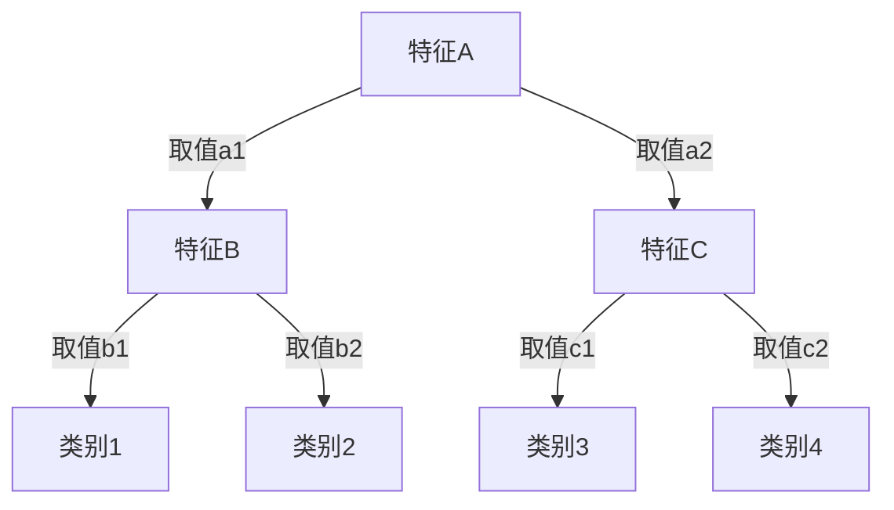

## 1.背景介绍

决策树是一种基本的分类和回归方法，它是一种在属性上进行划分数据的方法。树形结构使得决策树模型具有良好的可解释性，易于理解和实现。决策树的学习通常包括3个步骤：特征选择、决策树的生成和决策树的剪枝。

## 2.核心概念与联系

决策树由节点（node）和有向边（directed edge）组成。节点有两种类型：内部节点（internal node）和叶节点（leaf node）。内部节点表示一个特征或属性，叶节点表示一个类。用决策树分类，从根节点开始，对实例的某一特征进行测试，根据测试结果，将实例分配到其子节点；这时，每一个子节点对应着该特征的一个取值。如此递归地对实例进行测试并分配，直至达到叶节点。最后将实例分到叶节点的类中。



## 3.核心算法原理具体操作步骤

决策树的生成就是递归地构建二叉决策树的过程，主要由以下步骤组成：

1. 特征选择：在训练数据集中，对每一个特征进行评估，选择出最优特征。
2. 决策树生成：根据最优特征，按照该特征的不同取值，将对应的样本划分到不同的子数据集，为每个子数据集递归地生成决策树。
3. 剪枝：为了防止过拟合，需要对已生成的决策树进行剪枝，得到最优决策树。

## 4.数学模型和公式详细讲解举例说明

决策树的生成算法主要有ID3、C4.5和CART三种。其中，ID3和C4.5用信息增益和信息增益比来选择最优特征，CART用基尼指数来选择最优特征。

信息增益的计算公式为：

$$ Gain(D, a) = Ent(D) - \sum_{v=1}^{V} \frac{|D^v|}{|D|} Ent(D^v) $$

其中，$Ent(D)$为数据集$D$的信息熵，$D^v$为数据集$D$中第$v$类样本子集，$|D^v|$为$D^v$的样本个数，$|D|$为数据集$D$的样本个数。

## 5.项目实践：代码实例和详细解释说明

以下是使用Python的sklearn库实现决策树的一个简单示例：

```python
from sklearn.datasets import load_iris
from sklearn.model_selection import train_test_split
from sklearn.tree import DecisionTreeClassifier

# 加载数据
iris = load_iris()
X = iris.data
y = iris.target

# 划分训练集和测试集
X_train, X_test, y_train, y_test = train_test_split(X, y, test_size=0.2)

# 创建决策树分类器
clf = DecisionTreeClassifier()

# 训练模型
clf.fit(X_train, y_train)

# 测试模型
score = clf.score(X_test, y_test)
print('Accuracy:', score)
```

## 6.实际应用场景

决策树广泛应用于商业、医疗、金融等领域。例如，银行可以使用决策树模型预测客户是否会违约；电商可以使用决策树模型预测用户是否会购买某个产品。

## 7.工具和资源推荐

推荐使用Python的sklearn库来实现决策树，它提供了丰富的接口，易于使用，而且性能优越。

## 8.总结：未来发展趋势与挑战

随着大数据和人工智能的发展，决策树在许多领域的应用越来越广泛。然而，决策树也面临着许多挑战，例如如何处理高维度、大规模数据，如何防止过拟合，如何提高决策树的预测精度等。

## 9.附录：常见问题与解答

1. Q：决策树如何处理连续特征？
   A：连续特征可以通过离散化转换为离散特征，例如设定一个阈值，将特征值划分为两部分。

2. Q：决策树如何防止过拟合？
   A：过拟合主要通过剪枝来防止，包括预剪枝和后剪枝。

3. Q：决策树如何处理缺失值？
   A：对于特征的缺失值，可以使用该特征的平均值或众数来填充；对于样本的缺失值，可以忽略该样本或根据其他特征预测该样本的值。

作者：禅与计算机程序设计艺术 / Zen and the Art of Computer Programming