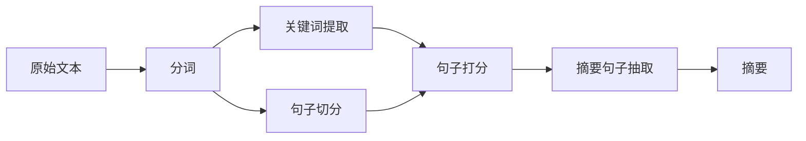

# 分词算法在自动文摘系统中的应用实践

## 1.背景介绍
### 1.1 自动文摘系统的重要性
在信息爆炸的时代,海量的文本数据给人们获取有价值信息带来了巨大挑战。自动文摘系统应运而生,它能够自动提取文本的关键信息,生成简洁、连贯的摘要,极大提高了人们获取和处理信息的效率。自动文摘在搜索引擎、新闻聚合、舆情分析等领域有广泛应用。

### 1.2 分词算法在自动文摘中的作用
中文自动文摘的一个关键步骤是对文本进行分词。与英文不同,中文句子没有明显的词界,需要通过分词算法将连续的字序列切分成有意义的词语。高质量的分词结果是后续关键词提取、句子抽取等文摘步骤的基础。因此,分词算法的选择和优化对自动文摘系统的性能有决定性影响。

### 1.3 本文的研究目标
本文旨在系统地探讨分词算法在中文自动文摘系统中的应用实践。重点研究不同分词算法的原理、特点、优缺点,并通过实验比较它们对文摘效果的影响。在此基础上,提出一种融合多种分词算法的文摘方法,取得了更好的摘要效果。本文的研究对于改进中文自动文摘技术具有重要意义。

## 2.核心概念与联系
### 2.1 自动文摘的分类
自动文摘主要分为两类:
- 抽取式文摘:通过提取原文中的关键词和句子形成摘要,保留了原文的表达。
- 生成式文摘:通过"理解"文本内容,用新的语言表达生成摘要,类似于人工写作。

目前抽取式文摘应用更广泛,技术更成熟。而生成式文摘还处于研究阶段。本文主要讨论抽取式文摘中的分词问题。

### 2.2 常见的中文分词算法
常用的中文分词算法主要有:
- 基于字符串匹配的分词:如正向最大匹配、逆向最大匹配、双向匹配等。
- 基于统计的分词:如N-最短路径、HMM、CRF等。
- 基于深度学习的分词:如BiLSTM-CRF、Bert-CRF等。

不同算法的原理和特点会在第3节详细介绍。

### 2.3 分词结果的评价指标
评价分词算法的常用指标有:
- 准确率P:正确识别出的词占全部切分词的比例。
- 召回率R:正确识别出的词占人工标注词的比例。 
- F1值:准确率和召回率的调和平均数,综合反映分词性能。

提高分词的准确率和召回率是优化分词算法的主要目标。

### 2.4 分词与文摘的关系
下图展示了分词在抽取式文摘流程中的位置:

可以看出,分词结果的好坏直接影响关键词提取和句子切分,进而影响文摘的质量。因此,选择合适的分词算法是自动文摘的关键环节。

## 3.核心算法原理具体操作步骤
本节重点介绍几种主要的分词算法原理和操作步骤。

### 3.1 基于字符串匹配的分词
这类方法通过将句子与词典中的词进行匹配来实现分词。常见的算法有:

#### 3.1.1 正向最大匹配(FMM)
- 步骤1:从句子开头开始,取指定最大长度(如7)的字符串,在词典中查找。
- 步骤2:如果匹配成功,则将该词切分出来;否则,长度减1,重新匹配。
- 步骤3:重复步骤1和2,直到句子结束。

例如,对于句子"今天天气真好啊",FMM分词结果为:"今天/天气/真好/啊"。

#### 3.1.2 逆向最大匹配(BMM)
逆向最大匹配与正向最大匹配类似,只不过是从句子末尾开始匹配。对于上例,BMM分词结果为:"今天/天气/真/好/啊"。

#### 3.1.3 双向最大匹配
为了结合FMM和BMM的优点,双向最大匹配的思路是:
- 步骤1:对句子同时执行FMM和BMM分词。
- 步骤2:比较两种分词结果,选择词数较少的那个。
- 步骤3:如果分词结果词数相同,则选择单字较少的那个。

双向最大匹配能够有效地消除FMM和BMM的一些错分情况。

### 3.2 基于统计的分词
统计分词通过统计词语在语料库中的频率、词的转移概率等信息,构建数学模型来实现分词。代表性的算法有:

#### 3.2.1 N-最短路径分词
- 步骤1:将句子转化为一个有向无环图(DAG),节点为字,边代表词。
- 步骤2:为每条边赋予权重,通常使用-log(词的频率)。
- 步骤3:在DAG中寻找从起点到终点的最短路径,路径上的词即为分词结果。

最短路径可以用Dijkstra算法求解。N-最短路径分词考虑了词频信息,效果优于最大匹配。

#### 3.2.2 HMM分词
HMM(隐马尔可夫模型)将分词看作一个序列标注问题。句子中的每个字对应一个隐藏状态(B/M/E/S),分别表示该字在词语中的位置(开头/中间/结尾/单字)。
- 步骤1:用带标注的语料库训练HMM模型,估计初始概率、发射概率和转移概率。
- 步骤2:对于新句子,用Viterbi算法求其状态序列,根据状态序列得到分词结果。

例如,"今天天气真好啊"的标注为"B/E/B/E/B/E/S",对应分词"今天/天气/真好/啊"。HMM能够考虑词语之间的转移关系,更符合语言规律。

#### 3.2.3 CRF分词
CRF(条件随机场)也把分词当成序列标注问题,但与HMM不同,CRF可以引入更多的特征(如词性、词长等),构建条件概率模型。
- 步骤1:选择特征模板,提取词语和句子的特征。
- 步骤2:用带标注的语料库训练CRF模型,估计特征的权重。 
- 步骤3:对新句子提取特征,用Viterbi算法预测其标注序列,得到分词结果。

CRF分词通过丰富的特征,可以更好地刻画词语的上下文信息,是目前主流的统计分词方法。

### 3.3 基于深度学习的分词
近年来,随着深度学习的发展,一些神经网络模型被用于分词任务,取得了很好的效果。常见的模型有:

#### 3.3.1 BiLSTM-CRF分词
BiLSTM是双向LSTM网络,可以同时捕捉文本的前向和后向信息。将BiLSTM和CRF结合,构成一个端到端的分词模型:
- 步骤1:将句子中的每个字映射为字向量,输入BiLSTM网络。
- 步骤2:BiLSTM提取字的上下文特征,再送入CRF层。
- 步骤3:CRF根据上下文特征预测每个字的标注,得到分词结果。

相比传统的CRF,BiLSTM-CRF能够自动学习特征,无需人工设计特征模板,效果更好。

#### 3.3.2 Bert-CRF分词
Bert是一个强大的预训练语言模型,可以生成词和句子的深层语义表示。将Bert和CRF结合,可以实现高质量的分词:
- 步骤1:用Bert对句子进行编码,得到每个字的上下文表示。
- 步骤2:将Bert的输出送入CRF层,预测每个字的标注。
- 步骤3:根据预测的标注序列得到分词结果。

Bert-CRF能够充分利用预训练的语言知识,在多个数据集上取得了SOTA的分词效果。

## 4.数学模型和公式详细讲解举例说明
本节以HMM分词为例,详细介绍其数学模型和公式。

### 4.1 HMM的三个基本问题
HMM由初始概率$\pi$、发射概率$B$和转移概率$A$三部分组成。用$Q=\{q_1,q_2,...,q_N\}$表示隐藏状态集合,$V=\{v_1,v_2,...,v_M\}$表示观测集合。对于分词,隐藏状态就是BMES,观测就是句子中的字。HMM要解决三个问题:

#### 4.1.1 概率计算问题
给定HMM $\lambda=(A,B,\pi)$和观测序列$O=(o_1,o_2,...,o_T)$,计算观测序列出现的概率$P(O|\lambda)$。
可以用前向算法求解:
$$
\alpha_t(i)=P(o_1,o_2,...,o_t,i_t=q_i|\lambda)
$$
$$
\alpha_1(i)=\pi_ib_i(o_1),i=1,2,...,N
$$
$$
\alpha_{t+1}(i)=[\sum_{j=1}^N\alpha_t(j)a_{ji}]b_i(o_{t+1}),i=1,2,...,N; t=1,2,...,T-1
$$
$$
P(O|\lambda)=\sum_{i=1}^N\alpha_T(i)
$$

#### 4.1.2 学习问题
给定观测序列$O=(o_1,o_2,...,o_T)$,估计模型参数$\lambda=(A,B,\pi)$,使得$P(O|\lambda)$最大。
可以用Baum-Welch算法(EM算法)求解:

- 计算前向概率$\alpha_t(i)$和后向概率$\beta_t(i)$:
$$
\beta_t(i)=P(o_{t+1},o_{t+2},...,o_T|i_t=q_i,\lambda)
$$
$$
\beta_T(i)=1,i=1,2,...,N
$$
$$
\beta_t(i)=\sum_{j=1}^Na_{ij}b_j(o_{t+1})\beta_{t+1}(j),i=1,2,...,N; t=T-1,T-2,...,1
$$

- 计算$\gamma_t(i)$和$\xi_t(i,j)$:
$$
\gamma_t(i)=\frac{\alpha_t(i)\beta_t(i)}{\sum_{j=1}^N\alpha_t(j)\beta_t(j)}
$$
$$
\xi_t(i,j)=\frac{\alpha_t(i)a_{ij}b_j(o_{t+1})\beta_{t+1}(j)}{\sum_{i=1}^N\sum_{j=1}^N\alpha_t(i)a_{ij}b_j(o_{t+1})\beta_{t+1}(j)}
$$

- 重估参数:
$$
\overline{\pi}_i=\gamma_1(i),i=1,2,...,N
$$
$$
\overline{a}_{ij}=\frac{\sum_{t=1}^{T-1}\xi_t(i,j)}{\sum_{t=1}^{T-1}\gamma_t(i)},i=1,2,...,N; j=1,2,...,N
$$
$$
\overline{b}_j(k)=\frac{\sum_{t=1,o_t=v_k}^T\gamma_t(j)}{\sum_{t=1}^T\gamma_t(j)},j=1,2,...,N; k=1,2,...,M
$$

重复以上步骤,直到参数收敛。

#### 4.1.3 预测问题
给定HMM $\lambda=(A,B,\pi)$和观测序列$O=(o_1,o_2,...,o_T)$,求最可能的隐藏状态序列$I=(i_1,i_2,...,i_T)$。
可以用Viterbi算法求解:

- 定义变量:
$$
\delta_t(i)=\max_{i_1,i_2,...,i_{t-1}}P(i_t=i,i_{t-1},...,i_1,o_t,...,o_1|\lambda),i=1,2,...,N
$$
$$
\psi_t(i)=\