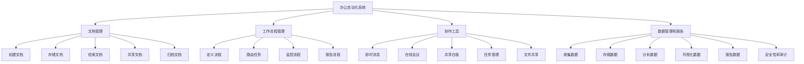

# 办公自动化系统详细设计与具体代码实现

## 1.背景介绍

在当今快节奏的商业环境中，办公自动化系统已经成为提高工作效率和降低运营成本的关键工具。随着企业规模的不断扩大和业务流程的日益复杂,有效的办公自动化系统可以帮助企业实现无缝协作、优化工作流程、提高数据安全性和可追溯性。本文将深入探讨办公自动化系统的设计和实现,为读者提供一个全面的指南。

### 1.1 办公自动化系统的重要性

办公自动化系统的主要目标是通过自动化流程来简化日常办公任务,从而提高工作效率并减少人工错误。它们可以涵盖多个方面,包括文档管理、工作流程管理、协作工具、数据管理和报告等。通过将这些功能集成到一个统一的平台中,办公自动化系统可以显著改善企业的运营效率。

### 1.2 办公自动化系统的挑战

尽管办公自动化系统带来了诸多好处,但在设计和实现过程中也面临着一些挑战。其中包括:

- 系统集成:将不同的应用程序和数据源无缝集成到一个统一的平台中,确保数据的一致性和可靠性。
- 用户体验:设计直观且易于使用的界面,以提高用户采用率和满意度。
- 数据安全:实施适当的安全措施,保护敏感数据免受未经授权的访问、修改或删除。
- 可扩展性:构建可扩展的系统架构,以适应不断增长的用户数量和业务需求。
- 定制化:满足不同企业的特定需求,提供高度定制化的解决方案。

## 2.核心概念与联系

在深入探讨办公自动化系统的设计和实现之前,让我们先了解一些核心概念及它们之间的关系。

### 2.1 文档管理

文档管理是办公自动化系统的核心组成部分之一。它涉及创建、存储、检索、共享和归档各种类型的文档,如文字处理文件、电子表格、演示文稿等。有效的文档管理系统可以提高文档的可访问性、版本控制和协作能力。

### 2.2 工作流程管理

工作流程管理系统用于自动化和优化业务流程。它定义了一系列有序的任务和活动,并根据预定义的规则和条件来协调和路由这些任务。工作流程管理可以确保任务按照正确的顺序执行,并提供可视化的流程监控和报告功能。

### 2.3 协作工具

协作工具是办公自动化系统中不可或缺的一部分,它们促进了团队成员之间的实时沟通和协作。常见的协作工具包括即时消息、在线会议、共享白板、任务管理和文件共享等。这些工具可以提高团队的生产力和决策效率。

### 2.4 数据管理和报告

数据管理和报告模块负责收集、存储、分析和可视化各种业务数据。它可以从多个数据源(如数据库、电子表格等)中提取数据,并生成自定义报告和仪表板,以支持决策过程。数据管理和报告还可以提供数据安全性和审计跟踪功能。

### 2.5 核心概念之间的关系

上述核心概念相互关联,构成了一个完整的办公自动化系统。文档管理提供了存储和共享文件的基础设施,而工作流程管理则确保了业务流程的高效运行。协作工具促进了团队成员之间的沟通和协作,而数据管理和报告模块则提供了业务智能和决策支持。这些概念的有机结合,使得办公自动化系统成为提高工作效率和优化业务运营的强大工具。

上图使用 Mermaid 流程图展示了办公自动化系统的核心概念及它们之间的关系。办公自动化系统由文档管理、工作流程管理、协作工具和数据管理与报告四个主要模块组成。每个模块都包含了多个子功能,它们相互配合,为用户提供了一体化的办公解决方案。

## 3.核心算法原理具体操作步骤

在设计和实现办公自动化系统时,需要考虑多种算法和技术。本节将重点介绍两个核心算法:工作流程引擎算法和文档版本控制算法。

### 3.1 工作流程引擎算法

工作流程引擎算法是工作流程管理系统的核心,它负责协调和执行各个任务,并根据预定义的规则和条件进行路由。以下是工作流程引擎算法的具体操作步骤:

1. **流程定义**: 首先,需要定义业务流程,包括任务、条件、分支等元素。这通常是通过图形化建模工具或基于XML的流程定义语言(如BPMN或XPDL)来实现的。

2. **流程部署**: 将定义好的流程部署到工作流程引擎中。引擎会解析流程定义,并将其存储在内存或数据库中。

3. **流程实例化**: 当有新的业务请求到来时,工作流程引擎会创建一个新的流程实例。每个实例都有一个唯一的ID,用于跟踪和管理该实例的执行状态。

4. **任务分派**: 工作流程引擎根据流程定义,将当前任务分派给相应的执行者(人员或系统)。

5. **任务执行**: 执行者完成分派的任务,并将结果反馈给工作流程引擎。

6. **条件评估**: 工作流程引擎根据任务执行结果和预定义的条件,决定下一步要执行的任务或分支。

7. **循环执行**: 重复执行步骤4-6,直到流程完成或发生异常。

8. **流程监控**: 工作流程引擎提供了监控和报告功能,允许管理员跟踪流程执行情况、识别瓶颈等。

9. **异常处理**: 如果在流程执行过程中发生异常(如超时、错误等),工作流程引擎会根据预定义的异常处理策略进行相应的操作。

工作流程引擎算法的核心在于根据流程定义协调任务执行,并根据条件进行路由决策。它确保了业务流程的高效运行,提高了工作效率和可追溯性。

### 3.2 文档版本控制算法

文档版本控制算法用于管理文档的修订历史,确保文档的一致性和可追溯性。以下是文档版本控制算法的具体操作步骤:

1. **文档存储**: 将文档存储在中央存储库中,如文件服务器或数据库。每个文档都有一个唯一的ID和初始版本号(通常为1.0)。

2. **检出文档**: 用户从存储库中检出文档进行编辑。这会创建一个工作副本,原始文档保持不变。

3. **编辑文档**: 用户在工作副本上进行编辑,如添加、修改或删除内容。

4. **提交更改**: 编辑完成后,用户将工作副本提交回存储库。版本控制系统会比较原始文档和工作副本之间的差异。

5. **创建新版本**: 如果发现差异,版本控制系统会创建一个新版本的文档,并递增版本号(例如,从1.0变为1.1)。新版本包含所有更改,同时保留了原始文档的历史记录。

6. **版本元数据**: 每个版本都包含元数据,如版本号、作者、修改时间、修改说明等。这些元数据有助于跟踪文档的修订历史。

7. **版本比较**: 用户可以比较任意两个版本之间的差异,以了解文档的变化情况。

8. **版本回滚**: 如果需要,用户可以将文档回滚到以前的版本。

9. **分支和合并**: 对于复杂的文档,版本控制系统还支持创建分支和合并分支的功能,以便并行开发和协作。

文档版本控制算法确保了文档的一致性和可追溯性,使团队成员能够安全地共享和协作编辑文档,同时保留了完整的修订历史记录。

## 4.数学模型和公式详细讲解举例说明

在办公自动化系统中,数学模型和公式扮演着重要的角色,特别是在数据分析和优化方面。本节将介绍两个常见的数学模型:线性规划模型和队列模型,并详细解释它们的原理和应用场景。

### 4.1 线性规划模型

线性规划模型是一种用于求解优化问题的数学模型。它旨在在给定的约束条件下,找到最优化的解决方案。线性规划模型可以应用于多个领域,如生产计划、资源分配、投资组合优化等。

线性规划模型的一般形式如下:

$$
\begin{aligned}
\text{maximize (or minimize)} \quad & z = c_1x_1 + c_2x_2 + \cdots + c_nx_n \\
\text{subject to} \quad & a_{11}x_1 + a_{12}x_2 + \cdots + a_{1n}x_n \leq b_1 \\
& a_{21}x_1 + a_{22}x_2 + \cdots + a_{2n}x_n \leq b_2 \\
& \vdots \\
& a_{m1}x_1 + a_{m2}x_2 + \cdots + a_{mn}x_n \leq b_m \\
& x_1, x_2, \ldots, x_n \geq 0
\end{aligned}
$$

其中:

- $z$ 是要最大化或最小化的目标函数
- $c_1, c_2, \ldots, c_n$ 是目标函数中的系数
- $x_1, x_2, \ldots, x_n$ 是决策变量
- $a_{ij}$ 是约束条件中的系数
- $b_1, b_2, \ldots, b_m$ 是约束条件的右侧常数

线性规划模型可以用于解决各种优化问题,例如:

- **生产计划优化**: 确定产品的最佳生产量,以最大化利润或最小化成本,同时满足原材料、劳动力和设备等约束条件。
- **投资组合优化**: 确定投资组合中各种资产的最佳权重,以最大化预期回报或最小化风险,同时满足资金、风险承受能力等约束条件。
- **运输优化**: 确定货物在不同地点之间的最佳运输路线和数量,以最小化运输成本,同时满足供应、需求和运输能力等约束条件。

线性规划模型可以通过简单型算法(如单纯形算法)或内点算法等数值优化技术来求解。在办公自动化系统中,线性规划模型可以应用于资源优化、成本优化和决策支持等场景。

### 4.2 队列模型

队列模型是一种用于分析和优化服务系统的数学模型。它描述了客户到达、等待和被服务的过程,旨在确保服务质量和效率。队列模型广泛应用于银行、呼叫中心、医院等服务场景。

队列模型的基本元素包括:

- 客户到达过程
- 服务过程
- 队列规则(如先来先服务、优先级等)
- 服务台数量
- 客户人数

通过建立数学模型,我们可以分析和优化以下关键指标:

- 平均等待时间
- 平均队列长度
- 服务利用率
- 客户流失率

其中,一个常见的队列模型是 M/M/1 模型,它假设客户到