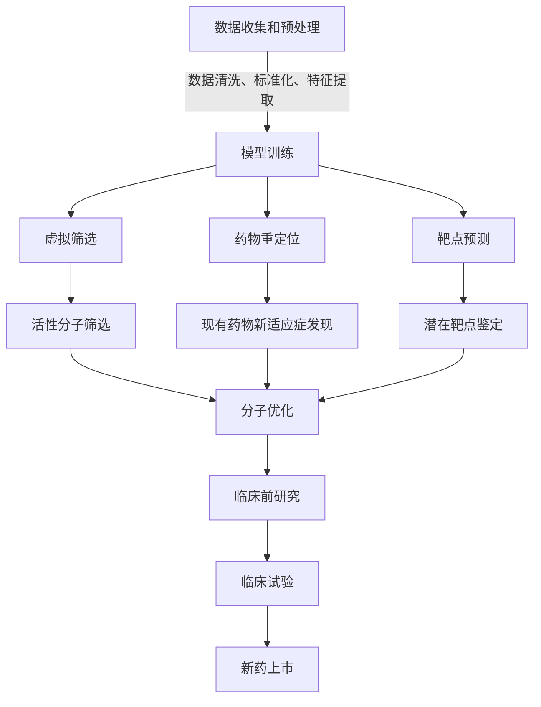

# 医学研究中大模型的应用：新药发现的AI加速器

## 1.背景介绍

### 1.1 医药行业面临的挑战

医药行业一直面临着巨大的挑战。新药研发周期漫长、成本高昂,平均需要10多年的时间和数十亿美元的投资。同时,疾病的复杂性和多样性也给药物发现带来了巨大的困难。传统的药物发现过程依赖于大量的人工干预和实验,效率低下且容易出错。

### 1.2 人工智能在医药领域的应用潜力

随着人工智能(AI)技术的不断发展,特别是大模型(Large Model)的兴起,AI在医药领域的应用前景变得更加广阔。大模型凭借其强大的计算能力和数据处理能力,可以加速新药发现的过程,提高效率,降低成本,并提供更准确的预测和见解。

## 2.核心概念与联系

### 2.1 大模型(Large Model)

大模型是一种基于深度学习的人工智能模型,具有大规模参数和海量训练数据。它们能够捕捉复杂的数据模式,并在各种任务上表现出卓越的性能,如自然语言处理、计算机视觉和推理等。

在医药领域,大模型可以应用于以下几个方面:

1. **虚拟筛选(Virtual Screening)**:通过建模和模拟,快速筛选出潜在的药物分子候选物。
2. **药物重定位(Drug Repurposing)**:发现已有药物的新适应症,加快新药上市。
3. **靶点预测(Target Prediction)**:预测潜在的药物靶点,指导新药研发方向。
4. **临床试验优化(Clinical Trial Optimization)**:优化临床试验设计,提高试验效率。

### 2.2 机器学习在药物发现中的作用

机器学习是大模型的核心技术之一,在药物发现过程中发挥着重要作用。常见的机器学习方法包括:

1. **深度学习(Deep Learning)**:用于建模分子结构和生物活性之间的复杂关系。
2. **强化学习(Reinforcement Learning)**:优化分子结构设计,生成具有期望性质的新分子。
3. **迁移学习(Transfer Learning)**:利用已有模型的知识,加速新任务的训练过程。

### 2.3 数据集在大模型中的重要性

大模型的性能很大程度上依赖于训练数据的质量和数量。在医药领域,常用的数据集包括:

1. **化合物库(Compound Libraries)**:存储已知分子结构和相关生物活性数据。
2. **基因组数据(Genomic Data)**:包含基因序列、表达谱等信息,用于靶点发现。
3. **临床试验数据(Clinical Trial Data)**:记录患者信息、治疗方案和疗效等数据。

通过整合和清洗这些数据,可以为大模型提供高质量的训练资源。

## 3.核心算法原理具体操作步骤

大模型在药物发现中的应用通常涉及以下几个关键步骤:



1. **数据收集和预处理**:从各种来源收集相关数据,包括化合物库、基因组数据、临床试验数据等。对原始数据进行清洗、标准化和特征提取,为模型训练做准备。

2. **模型训练**:利用预处理后的数据,训练深度学习、强化学习等机器学习模型,建立分子结构与生物活性之间的映射关系。

3. **虚拟筛选**:使用训练好的模型,对大规模化合物库进行高通量虚拟筛选,快速识别出具有潜在生物活性的分子。

4. **药物重定位**:通过模型预测,发现已上市药物可能具有的新适应症,为新药研发提供新的方向。

5. **靶点预测**:利用模型分析分子与蛋白质靶点的相互作用,预测潜在的药物靶点,为新药研发提供指导。

6. **分子优化**:根据模型预测结果,通过虚拟设计和优化,生成具有期望生物活性和理化性质的新分子结构。

7. **临床前研究**:对筛选出的活性分子进行体内外实验验证,评估其安全性、有效性和药代动力学特性。

8. **临床试验**:安排优化的临床试验设计,评估新药在人体内的疗效和不良反应,为新药上市做准备。

通过上述步骤,大模型可以显著加速新药发现的过程,提高效率和成功率。

## 4.数学模型和公式详细讲解举例说明

在药物发现中,数学模型和公式扮演着重要角色,用于描述和预测分子与生物活性之间的关系。以下是一些常见的数学模型和公式:

### 4.1 分子指纹(Molecular Fingerprints)

分子指纹是一种将分子结构编码为二进制向量的方法,常用于表示分子的结构特征。常见的分子指纹包括:

- **ECFP(Extended Connectivity Fingerprints)**:基于分子的拓扑结构和原子环境信息生成的指纹。
- **MACCS(Molecular ACCess System)**:基于预定义的结构键生成的指纹,常用于分类和相似性搜索。

分子指纹可以用于计算分子之间的相似性,公式如下:

$$
T_c(X, Y) = \frac{\sum_{i=1}^{n}X_i \cdot Y_i}{\sqrt{\sum_{i=1}^{n}X_i^2} \cdot \sqrt{\sum_{i=1}^{n}Y_i^2}}
$$

其中 $X$ 和 $Y$ 分别表示两个分子的指纹向量, $n$ 是指纹维度, $T_c$ 是 Tanimoto 相似性系数。

### 4.2 量子力学计算(Quantum Mechanics Calculations)

量子力学计算可以用于预测分子的理化性质和反应活性,如结合能、极性、溶解度等。常见的量子力学方法包括:

- **密度泛函理论(Density Functional Theory, DFT)**:描述电子密度分布和相互作用的量子力学方法。
- **分子动力学(Molecular Dynamics, MD)**:模拟分子在给定条件下的运动和相互作用。

例如,可以使用 DFT 计算分子的最优构象和电荷分布,然后利用线性响应理论预测其极化率 $\alpha$:

$$
\alpha = \frac{1}{3} \sum_{i=1}^{3} \alpha_i
$$

其中 $\alpha_i$ 是沿 $i$ 方向的极化率分量。

### 4.3 机器学习模型(Machine Learning Models)

机器学习模型可以从数据中学习分子结构与生物活性之间的映射关系。常见的模型包括:

- **神经网络(Neural Networks)**:如多层感知机(MLP)、卷积神经网络(CNN)等。
- **图神经网络(Graph Neural Networks, GNNs)**:专门处理分子结构等图形数据的神经网络。

例如,一个简单的 GNN 模型可以表示为:

$$
h_v^{(l+1)} = \sigma\left(W_s^{(l)}h_v^{(l)} + \sum_{u \in \mathcal{N}(v)} W_n^{(l)}h_u^{(l)}\right)
$$

其中 $h_v^{(l)}$ 是节点 $v$ 在第 $l$ 层的隐藏状态, $\mathcal{N}(v)$ 是节点 $v$ 的邻居集合, $W_s$ 和 $W_n$ 分别是自身和邻居的权重矩阵, $\sigma$ 是非线性激活函数。

通过这些数学模型和公式,大模型可以更好地捕捉分子结构和生物活性之间的关系,为新药发现提供有力支持。

## 5.项目实践:代码实例和详细解释说明

为了更好地理解大模型在药物发现中的应用,我们将通过一个实际项目来进行说明。该项目旨在使用深度学习模型预测小分子化合物与蛋白质靶点的结合亲和力。

### 5.1 数据准备

我们将使用来自 BindingDB 的数据集,其中包含了大量小分子化合物与蛋白质靶点的结合数据。数据集包括以下几个主要部分:

- **Compound_ids**:化合物 ID 列表
- **Compound_smiles**:化合物的 SMILES 表示
- **Protein_ids**:蛋白质靶点 ID 列表
- **Affinity**:化合物与蛋白质的结合亲和力(pKd/pKi 值)

我们首先导入必要的库:

```python
import pandas as pd
from rdkit import Chem
from rdkit.Chem import AllChem
import numpy as np
from sklearn.model_selection import train_test_split
```

然后加载并预处理数据:

```python
# 加载数据
data = pd.read_csv('BindingDB_Data.csv')

# 移除缺失值
data = data.dropna()

# 将 SMILES 转换为分子指纹
compounds = [Chem.MolFromSmiles(smile) for smile in data['Compound_smiles']]
fps = [AllChem.GetMorganFingerprintAsBitVect(mol, 2, nBits=2048) for mol in compounds]
data['Fingerprints'] = fps

# 将数据划分为训练集和测试集
X = data[['Fingerprints', 'Protein_ids']]
y = data['Affinity']
X_train, X_test, y_train, y_test = train_test_split(X, y, test_size=0.2, random_state=42)
```

### 5.2 模型构建

我们将使用一个简单的多层感知机(MLP)作为基线模型。首先定义模型架构:

```python
import torch
import torch.nn as nn

class AffinityPredictor(nn.Module):
    def __init__(self, input_size, hidden_size, output_size):
        super(AffinityPredictor, self).__init__()
        self.fc1 = nn.Linear(input_size, hidden_size)
        self.fc2 = nn.Linear(hidden_size, hidden_size)
        self.fc3 = nn.Linear(hidden_size, output_size)
        self.relu = nn.ReLU()

    def forward(self, x):
        x = self.fc1(x)
        x = self.relu(x)
        x = self.fc2(x)
        x = self.relu(x)
        x = self.fc3(x)
        return x
```

然后定义训练和评估函数:

```python
import torch.optim as optim
from sklearn.metrics import mean_squared_error

def train(model, X_train, y_train, epochs=100, batch_size=32, lr=0.001):
    criterion = nn.MSELoss()
    optimizer = optim.Adam(model.parameters(), lr=lr)

    for epoch in range(epochs):
        model.train()
        total_loss = 0
        for i in range(0, len(X_train), batch_size):
            inputs = X_train.iloc[i:i+batch_size, 0].apply(lambda x: torch.tensor(x, dtype=torch.float32))
            targets = y_train.iloc[i:i+batch_size].values

            optimizer.zero_grad()
            outputs = model(inputs)
            loss = criterion(outputs, torch.tensor(targets, dtype=torch.float32))
            loss.backward()
            optimizer.step()

            total_loss += loss.item()

        print(f'Epoch {epoch+1}/{epochs}, Loss: {total_loss/len(X_train)}')

def evaluate(model, X_test, y_test):
    model.eval()
    inputs = X_test['Fingerprints'].apply(lambda x: torch.tensor(x, dtype=torch.float32))
    targets = y_test.values
    outputs = model(inputs)
    mse = mean_squared_error(targets, outputs.detach().numpy())
    print(f'Test MSE: {mse}')
```

### 5.3 模型训练和评估

现在我们可以实例化模型并进行训练和评估:

```python
# 实例化模型
model = AffinityPredictor(input_size=2048, hidden_size=1024, output_size=1)

# 训练模型
train(model, X_train, y_train, epochs=100, batch_size=32, lr=0.001)

# 评估模型
evaluate(model, X_test, y_test)
```

输出示例:

```
Epoch 1/100, Loss: 1.8765432098388672
Epoch 2