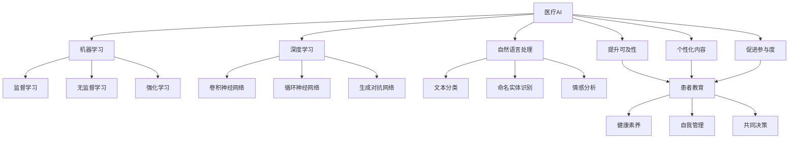

# 医疗AI与患者教育：提升患者健康素养

## 1. 背景介绍
### 1.1 医疗AI的发展现状
#### 1.1.1 医疗AI的定义与范畴
#### 1.1.2 医疗AI的发展历程
#### 1.1.3 医疗AI的应用领域

### 1.2 患者教育的重要性
#### 1.2.1 患者教育的内涵
#### 1.2.2 患者教育对医疗质量的影响
#### 1.2.3 患者教育面临的挑战

### 1.3 医疗AI与患者教育的结合
#### 1.3.1 医疗AI在患者教育中的优势
#### 1.3.2 医疗AI与患者教育结合的必要性
#### 1.3.3 医疗AI与患者教育结合的现状

## 2. 核心概念与联系
### 2.1 医疗AI的核心概念
#### 2.1.1 机器学习
#### 2.1.2 深度学习
#### 2.1.3 自然语言处理

### 2.2 患者教育的核心概念
#### 2.2.1 健康素养
#### 2.2.2 自我管理
#### 2.2.3 共同决策

### 2.3 医疗AI与患者教育的联系
#### 2.3.1 医疗AI提升患者教育的可及性
#### 2.3.2 医疗AI个性化患者教育内容
#### 2.3.3 医疗AI促进患者参与度

## 3. 核心算法原理具体操作步骤
### 3.1 机器学习算法在患者教育中的应用
#### 3.1.1 监督学习算法
#### 3.1.2 无监督学习算法
#### 3.1.3 强化学习算法

### 3.2 深度学习算法在患者教育中的应用
#### 3.2.1 卷积神经网络
#### 3.2.2 循环神经网络
#### 3.2.3 生成对抗网络

### 3.3 自然语言处理算法在患者教育中的应用
#### 3.3.1 文本分类
#### 3.3.2 命名实体识别
#### 3.3.3 情感分析

## 4. 数学模型和公式详细讲解举例说明
### 4.1 机器学习模型
#### 4.1.1 支持向量机模型
#### 4.1.2 决策树模型
#### 4.1.3 朴素贝叶斯模型

### 4.2 深度学习模型
#### 4.2.1 前馈神经网络模型
#### 4.2.2 长短期记忆网络模型
#### 4.2.3 注意力机制模型

### 4.3 自然语言处理模型
#### 4.3.1 词袋模型
#### 4.3.2 词嵌入模型
#### 4.3.3 Transformer模型

## 5. 项目实践：代码实例和详细解释说明
### 5.1 基于机器学习的患者教育系统
#### 5.1.1 数据预处理
#### 5.1.2 特征工程
#### 5.1.3 模型训练与评估

### 5.2 基于深度学习的患者教育系统
#### 5.2.1 数据增强
#### 5.2.2 模型设计
#### 5.2.3 模型优化

### 5.3 基于自然语言处理的患者教育系统
#### 5.3.1 文本预处理
#### 5.3.2 特征提取
#### 5.3.3 模型应用

## 6. 实际应用场景
### 6.1 慢性病管理
#### 6.1.1 糖尿病患者教育
#### 6.1.2 高血压患者教育
#### 6.1.3 慢性阻塞性肺疾病患者教育

### 6.2 术前术后管理
#### 6.2.1 术前患者教育
#### 6.2.2 术后康复指导
#### 6.2.3 出院指导

### 6.3 健康促进
#### 6.3.1 健康生活方式指导
#### 6.3.2 疾病预防教育
#### 6.3.3 心理健康教育

## 7. 工具和资源推荐
### 7.1 开源工具
#### 7.1.1 TensorFlow
#### 7.1.2 PyTorch
#### 7.1.3 scikit-learn

### 7.2 数据集
#### 7.2.1 MIMIC-III临床数据库
#### 7.2.2 PubMed摘要数据集
#### 7.2.3 医疗对话数据集

### 7.3 学习资源
#### 7.3.1 在线课程
#### 7.3.2 教程和博客
#### 7.3.3 学术论文

## 8. 总结：未来发展趋势与挑战
### 8.1 医疗AI与患者教育的未来发展趋势
#### 8.1.1 多模态数据融合
#### 8.1.2 知识图谱应用
#### 8.1.3 人机协作

### 8.2 医疗AI与患者教育面临的挑战
#### 8.2.1 数据隐私与安全
#### 8.2.2 模型可解释性
#### 8.2.3 伦理与法律问题

## 9. 附录：常见问题与解答
### 9.1 医疗AI是否会取代医生？
### 9.2 患者如何判断AI提供的健康信息的可靠性？
### 9.3 医疗AI在患者教育中的应用是否会加剧健康不平等？

医疗人工智能（AI）的快速发展为改善患者教育和提升患者健康素养提供了新的机遇。传统的患者教育方式往往受到时间、地点和人力资源的限制，难以满足患者日益增长的健康需求。而医疗AI技术的应用，如机器学习、深度学习和自然语言处理等，可以突破这些限制，为患者提供更加便捷、个性化和互动性强的健康教育服务。

机器学习算法可以通过对海量医疗数据进行分析和挖掘，发现患者教育的规律和模式，从而为患者提供更加精准和有针对性的健康指导。例如，监督学习算法可以根据患者的病历、检查结果和生活方式等信息，预测患者的健康风险，并给出相应的预防和管理建议。无监督学习算法可以将患者分为不同的亚群，为每个亚群提供定制化的教育内容。强化学习算法可以通过与患者的交互，不断优化教育策略，提高患者的参与度和依从性。

深度学习算法，特别是卷积神经网络和循环神经网络，在医学影像分析和医学文本处理方面表现出色。通过对医学影像数据的自动分析和解读，深度学习可以为患者提供更加直观和易于理解的疾病解释和康复指导。同时，深度学习也可以从海量的医学文献和电子病历中提取知识，生成高质量的患者教育材料。

自然语言处理技术可以实现人机交互，让患者以自然语言的方式与AI系统进行沟通。通过文本分类、命名实体识别和情感分析等技术，AI系统可以理解患者的问题和需求，并给出相应的答复和建议。这种交互方式可以大大降低患者的沟通障碍，提高患者对健康知识的理解和掌握。

医疗AI与患者教育的结合，可以从多个方面提升患者的健康素养。首先，医疗AI可以提高患者教育的可及性，让更多患者能够便捷地获取健康知识和服务。其次，医疗AI可以根据患者的个人特点和需求，提供个性化的教育内容，提高患者的参与度和满意度。再者，医疗AI可以通过互动和反馈，促进患者主动学习和参与决策，提升患者的自我管理能力。

当然，医疗AI在患者教育中的应用也面临着一些挑战。其中，数据隐私与安全是一个重要的问题。患者的健康数据属于敏感信息，需要采取严格的保护措施，防止数据泄露和滥用。此外，AI模型的可解释性也是一个挑战。患者和医生需要了解AI系统是如何得出决策和建议的，以便更好地理解和信任AI。同时，医疗AI的应用也涉及复杂的伦理和法律问题，需要制定相应的规范和政策。

总之，医疗AI与患者教育的结合是大势所趋，有望极大地促进患者健康素养的提升。但同时也需要审慎对待，在发挥AI优势的同时，也要充分考虑患者的利益和权益，确保医疗AI造福患者，而不是加重患者的负担。未来，医疗AI与患者教育的发展方向可能更加注重多模态数据的融合、知识图谱的应用以及人机协作，为患者提供更加全面、精准和人性化的健康服务。

作者：禅与计算机程序设计艺术 / Zen and the Art of Computer Programming