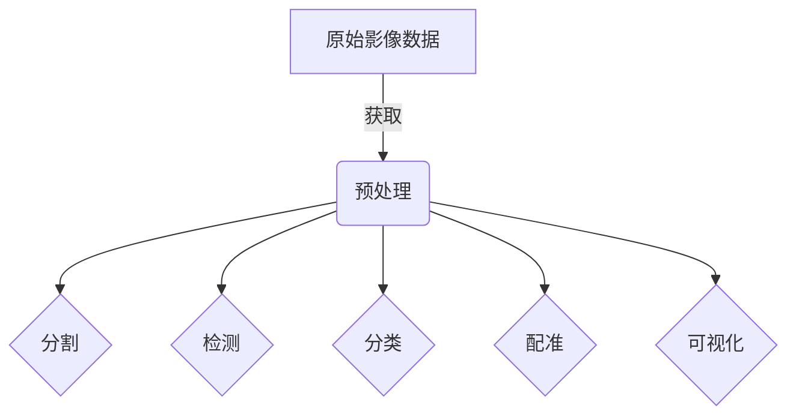

# 医疗影像处理(Medical Imaging)原理与代码实战案例讲解

## 1.背景介绍

### 1.1 医疗影像处理的重要性

医疗影像处理是当今医疗保健领域中不可或缺的一个重要组成部分。它涉及对各种医学成像技术(如X射线、CT、MRI、PET等)所获取的图像数据进行处理、分析和可视化,以协助医生进行疾病诊断、治疗规划和效果评估。

随着医学成像技术的不断发展,获取的影像数据量越来越大,数据维度越来越高,这对传统的人工分析带来了巨大挑战。因此,借助计算机技术对医学影像进行智能化处理和分析已经成为一个迫切的需求。

### 1.2 医疗影像处理的应用领域

医疗影像处理技术在临床医学的多个领域得到了广泛应用,包括但不限于:

- **病理检测**: 如肺结节检测、脑肿瘤分割等
- **治疗规划**: 如放疗计划、手术导航等
- **疾病预测**: 如基因组学分析、生物标记物发现等
- **医学教育**: 如虚拟解剖、手术模拟等

### 1.3 医疗影像处理的挑战

尽管医疗影像处理技术取得了长足进步,但仍面临诸多挑战:

- **数据质量**:影像噪声、artifact、缺失数据等问题
- **数据多样性**:不同设备、参数、扫描模式导致数据差异
- **临床需求**:高精度、高效率、可解释性等严格要求
- **隐私保护**:患者数据隐私保护的合规性问题

## 2.核心概念与联系

### 2.1 图像获取

医学成像技术是医疗影像处理的基础,主要包括:

- **投射成像**:如X射线、CT等利用射线透射原理
- **核磁共振成像**(MRI):利用原子核自旋特性
- **超声成像**:利用声波反射和衰减原理 
- **分子影像**:如PET、SPECT等利用放射性示踪剂

不同成像技术可获取人体不同组织结构和功能信息。

### 2.2 图像预处理

由于各种原因(如噪声、artifact等),原始医学影像常需要进行预处理,主要包括:

- **去噪**:如小波变换、非局部均值滤波等
- **标准化**:校正不同设备、参数的影像差异
- **配准**:将同一患者不同时相影像对准到相同坐标系

预处理可改善影像质量,为后续分析提供更好的输入数据。

### 2.3 图像分析

影像分析是医疗影像处理的核心环节,主要任务包括:

- **分割**:将感兴趣的解剖结构或病灶从影像中分割出来
- **检测**:检测并定位影像中的病理征象(如结节、出血等)
- **分类**:将影像或影像区域分类到特定疾病类型
- **配准**:将不同模态影像对准到同一坐标系统
- **可视化**:将分析结果以易于理解的形式可视化展示

这些任务通常需要利用图像处理、机器学习、模式识别等技术。

### 2.4 临床应用

医疗影像处理技术在临床应用中发挥着重要作用:

- **辅助诊断**:如检测早期病变、发现微小病灶等
- **疗效评估**:如评估肿瘤变化、监测治疗反应等
- **治疗规划**:如设计手术路径、制定放疗计划等
- **疾病预测**:结合其他数据预测疾病发生风险

## 3.核心算法原理具体操作步骤

### 3.1 图像分割算法

图像分割是医疗影像处理中一项关键任务,其目标是从影像中准确分割出感兴趣的解剖结构或病灶区域。常用的分割算法有:

#### 3.1.1 基于阈值的分割

这是最简单的分割方法,根据像素灰度值与预设阈值的大小关系,将像素分为目标和背景两类。适用于对比度较高的情况,但对噪声敏感。

#### 3.1.2 区域生长分割 

从种子点出发,将相邻且满足相似性准则(如灰度、纹理等)的像素合并为同一区域,直至无可并入像素为止。需要合理设置生长准则。

#### 3.1.3 边缘检测分割

首先检测目标物体的边缘,然后将边缘像素连接成封闭曲线即可获得分割结果。常用算子有Sobel、Canny等。

#### 3.1.4 聚类分割

根据像素特征(如灰度、纹理等)的相似性,将影像像素划分为若干簇,每一簇对应一个分割区域。常用算法有K-Means、高斯混合模型等。

#### 3.1.5 主动轮廓模型

通过设置一个可变形的闭合曲线(如参数活动轮廓或水平集级集模型),并定义约束能量函数,使曲线变形趋向最佳位置以逼近目标边界。

#### 3.1.6 基于深度学习的分割

利用卷积神经网络(CNN)等深度学习模型自动从大量标注数据中学习特征,进行端到端的分割。如U-Net、Mask R-CNN等。

上述算法各有优缺点,在实际应用中需要根据具体情况选择合适的算法,或将多种算法相结合以获得更好的分割效果。

### 3.2 图像检测算法

图像检测旨在从影像中自动检测并定位感兴趣的目标物体,如结节、出血等病理征象。常用算法包括:

#### 3.2.1 基于模板匹配

构建感兴趣目标的模板,在影像中滑动模板并计算相似度,高相似度区域即为检测目标。简单但对变形、旋转等不够鲁棒。

#### 3.2.2 基于机器学习的检测

利用传统机器学习方法(如SVM、随机森林等)学习目标与非目标的特征,构建分类器进行检测。需要人工设计特征。

#### 3.2.3 基于深度学习的检测 

使用CNN等深度模型自动学习特征并进行端到端检测,如区域候选网络(RPN)、You Only Look Once(YOLO)、单shot检测器(SSD)等。精度高但需要大量标注数据。

#### 3.2.4 基于模型拟合

构建数学模型拟合目标的几何形状,如用高斯模型拟合结节、用圆柱面模型拟合血管等,并对模型参数进行估计即可检测目标。

上述算法可根据不同场景和需求进行选择和集成,以获得更准确、鲁棒的检测效果。

### 3.3 图像分类算法 

影像分类是将影像或影像区域归类到特定疾病类别的任务,是辅助诊断的重要手段。常用算法有:

#### 3.3.1 基于传统机器学习

从影像数据中人工提取特征(如形状、纹理等),输入机器学习分类器(如支持向量机、决策树等)进行训练和分类。

#### 3.3.2 基于深度学习

利用CNN等深度神经网络自动从大量影像数据中学习特征,进行端到端的分类,如VGGNet、ResNet、DenseNet等。

#### 3.3.3 基于迁移学习

由于医疗影像数据标注困难,可以先在大规模自然图像数据上预训练模型,再迁移到医学影像数据上进行微调,以提高分类性能。

#### 3.3.4 基于多模态融合

将不同模态(如CT、MRI、PET等)的影像特征融合,可以提供更丰富的信息以提高分类精度。融合方式包括特征级和决策级融合等。

在实际应用中,需要根据数据量、任务复杂度等因素选择合适的分类算法,同时注意防止过拟合、解决类别不平衡等问题。

### 3.4 图像配准算法

由于不同时间、设备、扫描模式等因素,同一患者的多个影像可能存在位置、尺度、旋转等差异,因此需要将它们配准到相同的坐标系下。常用的配准算法有:

#### 3.4.1 基于灰度相似性

通过最大化灰度相似性度量(如互信息、相关系数等)作为目标函数,对图像进行刚性或非刚性变换,使重叠区域灰度分布统计量达到最优。

#### 3.4.2 基于特征匹配

在两个待配准影像上提取特征点(如角点、SIFT等),建立特征点对应关系,并基于这些对应关系估计出最优的变换参数。

#### 3.4.3 基于曲面模型匹配

构建参数化几何模型(如仿射模型、薄板模型等)拟合图像中的解剖结构,并估计模型参数使两个结构模型达到最佳重合。

#### 3.4.4 基于深度学习

使用CNN等深度网络直接从影像数据中学习配准变换,可以端到端地完成配准任务,无需人工设计特征。

配准算法的选择需要考虑影像的变形程度、对精度的要求、计算效率等因素。在实际应用中,常将多种算法相结合以获得更好的配准效果。

## 4.数学模型和公式详细讲解举例说明

### 4.1 图像分割数学模型

#### 4.1.1 基于能量函数的主动轮廓模型

主动轮廓模型通过定义一个能量函数,使闭合曲线在内部约束(平滑性)和外部约束(边缘线特征)的作用下,逐渐演化逼近目标边界。

能量函数一般形式为:

$$E(C) = \alpha E_{int}(C) + \beta E_{ext}(C)$$

其中:
- $C$为闭合曲线
- $E_{int}(C)$为内部能量项,控制曲线平滑性
- $E_{ext}(C)$为外部能量项,使曲线靠近目标边界
- $\alpha$和$\beta$为权重系数,控制两项能量的相对重要性

曲线的演化方向是能量函数$E(C)$的负梯度方向,即:

$$\frac{\partial C}{\partial t} = -\frac{\partial E}{\partial C}$$

通过数值方法求解上述方程,可获得目标物体的分割结果。

#### 4.1.2 基于水平集的分割模型

水平集理论提供了一种高效表示和处理任意形状的方法。在分割任务中,常将图像看作一个高度函数:

$$I: \Omega \rightarrow \mathbb{R}^{+}$$

其中$\Omega$为图像域,$I(x)$表示像素$x$处的灰度值。

对于任意灰度阈值$\lambda$,可定义相应的水平集:

$$X_{\lambda}(I) = \{x \in \Omega | I(x) \geq \lambda\}$$

即包含所有灰度不小于$\lambda$的像素点。

利用水平集理论,可以高效地构造分割目标物体的几何表示,并进行形态学操作(如开运算、闭运算等)以获得更好的分割效果。

### 4.2 图像检测数学模型

#### 4.2.1 基于模板匹配的检测模型

设$T$为感兴趣目标的模板图像,$I$为待检测影像,则在位置$(u,v)$处的相似度可用归一化互相关系数(NCC)表示为:

$$r(u,v) = \frac{\sum_{x,y}[T(x,y)-\bar{T}][I(x-u,y-v)-\bar{I}(u,v)]}{\sqrt{\sum_{x,y}[T(x,y)-\bar{T}]^2\sum_{x,y}[I(x-u,y-v)-\bar{I}(u,v)]^2}}$$

其中$\bar{T}$和$\bar{I}(u,v)$分别为模板和影像区域的灰度均值。

对于每个位置$(u,v)$,计算$r(u,v)$,当$r(u,v)$超过预设阈值时,