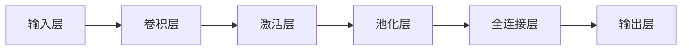

## 1.背景介绍

在过去的十年里，深度学习已经在各种任务中取得了显著的成功，特别是在计算机视觉领域。其中，卷积神经网络(Convolutional Neural Networks, CNN)是一种特殊的深度学习模型，它在图像识别任务上的表现尤其出色。

## 2.核心概念与联系

### 2.1 卷积神经网络的基本构成

CNN由多个层次的神经元组成，这些神经元分布在不同的层上。每一层都包含多个卷积核，这些卷积核用于从输入数据中提取特征。



### 2.2 卷积操作

卷积操作是CNN的核心组成部分。在卷积操作中，卷积核在输入数据上滑动，以提取输入数据的局部特征。

### 2.3 激活函数

激活函数是用于增加神经网络的非线性的重要工具。常见的激活函数包括ReLU、sigmoid和tanh等。

### 2.4 池化操作

池化操作是用于减少特征的维度，从而减少计算量和防止过拟合的重要步骤。

### 2.5 全连接层

全连接层用于将前面提取的特征进行整合，以进行最后的分类或回归任务。

## 3.核心算法原理具体操作步骤

### 3.1 输入数据准备

首先，我们需要准备输入数据。这些数据通常是图像数据，每个图像都有一个对应的标签。

### 3.2 卷积操作

然后，我们在输入数据上进行卷积操作。在卷积操作中，我们使用多个卷积核在输入数据上滑动，以提取输入数据的局部特征。

### 3.3 激活操作

接着，我们对卷积操作的结果应用激活函数，以增加神经网络的非线性。

### 3.4 池化操作

然后，我们对激活操作的结果进行池化操作，以减少特征的维度。

### 3.5 全连接操作

最后，我们将池化操作的结果通过全连接层，以进行最后的分类或回归任务。

## 4.数学模型和公式详细讲解举例说明

### 4.1 卷积操作

卷积操作可以用以下的数学公式来表示：

$$ Y = X * K $$

其中，$*$表示卷积操作，$X$表示输入数据，$K$表示卷积核，$Y$表示卷积操作的结果。

### 4.2 激活操作

激活操作可以用以下的数学公式来表示：

$$ Y = f(X) $$

其中，$f$表示激活函数，$X$表示激活操作的输入，$Y$表示激活操作的结果。

### 4.3 池化操作

池化操作可以用以下的数学公式来表示：

$$ Y = \max(X) $$

其中，$\max$表示最大值操作，$X$表示池化操作的输入，$Y$表示池化操作的结果。

### 4.4 全连接操作

全连接操作可以用以下的数学公式来表示：

$$ Y = WX + b $$

其中，$W$表示权重矩阵，$X$表示全连接操作的输入，$b$表示偏置，$Y$表示全连接操作的结果。

## 5.项目实践：代码实例和详细解释说明

以下是一个使用Python和TensorFlow实现的简单的CNN模型：

```python
import tensorflow as tf

# 定义模型
model = tf.keras.models.Sequential([
    tf.keras.layers.Conv2D(32, (3, 3), activation='relu', input_shape=(32, 32, 3)),
    tf.keras.layers.MaxPooling2D((2, 2)),
    tf.keras.layers.Conv2D(64, (3, 3), activation='relu'),
    tf.keras.layers.MaxPooling2D((2, 2)),
    tf.keras.layers.Flatten(),
    tf.keras.layers.Dense(64, activation='relu'),
    tf.keras.layers.Dense(10)
])

# 编译模型
model.compile(optimizer='adam',
              loss=tf.keras.losses.SparseCategoricalCrossentropy(from_logits=True),
              metrics=['accuracy'])

# 训练模型
model.fit(train_images, train_labels, epochs=10)

# 测试模型
test_loss, test_acc = model.evaluate(test_images,  test_labels, verbose=2)
```

这个模型首先使用两个卷积层和两个池化层来提取特征，然后使用一个全连接层来进行分类。

## 6.实际应用场景

CNN在许多实际应用中都发挥了重要的作用。例如，CNN被广泛用于图像识别、视频分析、自然语言处理、医疗图像分析等任务。

## 7.工具和资源推荐

以下是一些学习和使用CNN的推荐资源：

- TensorFlow：一个强大的深度学习框架，可以用于构建和训练CNN模型。
- Keras：一个基于TensorFlow的高级深度学习框架，提供了更简洁的API，使得构建和训练CNN模型更加容易。
- PyTorch：另一个强大的深度学习框架，也可以用于构建和训练CNN模型。

## 8.总结：未来发展趋势与挑战

虽然CNN已经在图像识别等任务上取得了显著的成功，但是还有许多挑战需要我们去面对。例如，如何提高CNN的解释性，如何处理大规模的数据，如何提高CNN的训练速度等。未来，我们期待看到更多的研究和技术来解决这些挑战。

## 9.附录：常见问题与解答

1. 问题：为什么CNN在图像识别任务上表现出色？

   答：CNN通过卷积操作可以有效地提取图像的局部特征，而这些局部特征对于图像识别任务非常重要。

2. 问题：如何选择合适的卷积核？

   答：卷积核的选择通常取决于任务的需求。在某些任务中，我们可能需要使用小的卷积核来提取细节特征；而在其他任务中，我们可能需要使用大的卷积核来提取全局特征。

3. 问题：如何理解池化操作？

   答：池化操作可以看作是一种降维操作，它通过减少特征的维度来减少计算量和防止过拟合。

作者：禅与计算机程序设计艺术 / Zen and the Art of Computer Programming