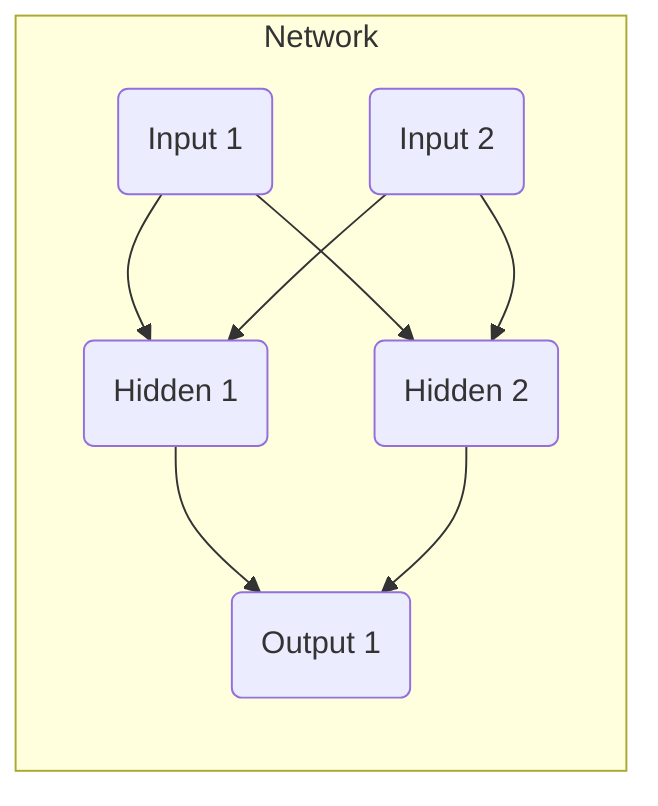

# 反向传播(Backpropagation) - 原理与代码实例讲解

## 1. 背景介绍

### 1.1 神经网络简介

神经网络是一种有效的机器学习模型,广泛应用于计算机视觉、自然语言处理、语音识别等领域。它的灵感来源于生物神经系统,通过构建由节点(神经元)和连接(权重)组成的网络结构,对输入数据进行处理和学习。

神经网络的关键在于通过训练数据来调整网络中的权重参数,使得模型能够学习到输入和输出之间的映射关系。这个过程被称为训练或学习过程。

### 1.2 反向传播算法的重要性

在训练神经网络时,如何有效地调整网络权重是一个核心问题。反向传播(Backpropagation)算法是解决这一问题的有力工具,它提供了一种高效的方法来计算网络中每个权重相对于损失函数的梯度,从而指导权重的调整方向。

反向传播算法的出现极大地推动了深度神经网络的发展,使得训练深层次网络结构成为可能。它在实现端到端的模型训练中发挥着关键作用,是现代深度学习不可或缺的基础算法之一。

## 2. 核心概念与联系

### 2.1 前向传播

在神经网络中,输入数据首先经过前向传播(Forward Propagation)过程,通过一系列的线性变换和非线性激活函数,层层传递直至输出层。这个过程可以用数学表达式表示:

$$
y = f(W^{(L)}f(W^{(L-1)}...f(W^{(1)}x + b^{(1)}) + b^{(L-1)}) + b^{(L)})
$$

其中:
- $x$是输入数据
- $y$是输出结果
- $W^{(l)}$和$b^{(l)}$分别是第$l$层的权重矩阵和偏置向量
- $f$是非线性激活函数,如ReLU、Sigmoid等

前向传播过程是一个固定的计算流程,不涉及权重的更新。

### 2.2 损失函数

为了评估模型的预测结果与真实标签之间的差距,我们需要定义一个损失函数(Loss Function)。常见的损失函数包括均方误差(MSE)、交叉熵损失(Cross-Entropy Loss)等。

损失函数的值越小,表示模型的预测结果与真实标签越接近。因此,训练神经网络的目标就是不断调整网络权重,使得损失函数的值最小化。

### 2.3 反向传播

反向传播算法的核心思想是利用链式法则,计算网络中每个权重相对于损失函数的梯度。根据梯度的方向,我们可以对权重进行调整,从而减小损失函数的值。

这个过程从输出层开始,沿着网络的反方向逐层传播,计算每一层的梯度,直到输入层。通过不断迭代这个过程,网络的权重就会逐渐收敛到一个较优的状态。

反向传播算法提供了一种高效的方式来训练神经网络,使得深度学习模型能够在大规模数据上进行端到端的训练。

## 3. 核心算法原理具体操作步骤

反向传播算法的具体操作步骤可以分为以下几个阶段:

### 3.1 前向传播

1. 输入数据$x$通过网络的前向传播过程,计算出每一层的输出值。
2. 在输出层,计算损失函数的值$L(y, \hat{y})$,其中$y$是真实标签,$\hat{y}$是模型的预测输出。

### 3.2 反向传播

1. 在输出层,计算损失函数相对于输出层输入的梯度:

$$
\frac{\partial L}{\partial z^{(L)}} = \frac{\partial L}{\partial \hat{y}} \odot f'(z^{(L)})
$$

其中$z^{(L)}$是输出层的输入,$f'$是激活函数的导数,符号$\odot$表示元素wise相乘。

2. 计算输出层权重矩阵$W^{(L)}$和偏置向量$b^{(L)}$相对于损失函数的梯度:

$$
\frac{\partial L}{\partial W^{(L)}} = \frac{\partial L}{\partial z^{(L)}} \cdot a^{(L-1)^T} \\
\frac{\partial L}{\partial b^{(L)}} = \frac{\partial L}{\partial z^{(L)}}
$$

其中$a^{(L-1)}$是上一层的输出。

3. 对于隐藏层,计算每一层的梯度:

$$
\frac{\partial L}{\partial z^{(l)}} = (W^{(l+1)^T} \frac{\partial L}{\partial z^{(l+1)}}) \odot f'(z^{(l)}) \\
\frac{\partial L}{\partial W^{(l)}} = \frac{\partial L}{\partial z^{(l)}} \cdot a^{(l-1)^T} \\
\frac{\partial L}{\partial b^{(l)}} = \frac{\partial L}{\partial z^{(l)}}
$$

这个过程从输出层开始,逐层向前传播,直到输入层。

### 3.3 权重更新

根据计算得到的梯度,我们可以使用优化算法(如梯度下降)来更新网络中的权重和偏置:

$$
W^{(l)} \leftarrow W^{(l)} - \eta \frac{\partial L}{\partial W^{(l)}} \\
b^{(l)} \leftarrow b^{(l)} - \eta \frac{\partial L}{\partial b^{(l)}}
$$

其中$\eta$是学习率,控制着权重更新的步长。

重复上述步骤,直到损失函数收敛或达到停止条件。

## 4. 数学模型和公式详细讲解举例说明

为了更好地理解反向传播算法的数学原理,我们将通过一个具体的例子来详细讲解相关公式的推导过程。

### 4.1 示例网络结构

假设我们有一个简单的全连接神经网络,包含一个输入层、一个隐藏层和一个输出层,如下图所示:



为了简化计算,我们假设:
- 输入层有两个节点
- 隐藏层有两个节点,使用ReLU激活函数
- 输出层有一个节点,使用线性激活函数
- 损失函数使用均方误差(MSE)

### 4.2 前向传播

假设输入为$x = [x_1, x_2]$,权重矩阵和偏置向量分别为:

$$
W^{(1)} = \begin{bmatrix}
w_{11}^{(1)} & w_{12}^{(1)} \\
w_{21}^{(1)} & w_{22}^{(1)}
\end{bmatrix}, \quad
b^{(1)} = \begin{bmatrix}
b_1^{(1)} \\
b_2^{(1)}
\end{bmatrix}
$$

$$
W^{(2)} = \begin{bmatrix}
w_{11}^{(2)} & w_{12}^{(2)}
\end{bmatrix}, \quad
b^{(2)} = b^{(2)}
$$

则隐藏层的输出为:

$$
z^{(2)} = \begin{bmatrix}
z_1^{(2)} \\
z_2^{(2)}
\end{bmatrix} = W^{(1)}x + b^{(1)} = \begin{bmatrix}
w_{11}^{(1)}x_1 + w_{12}^{(1)}x_2 + b_1^{(1)} \\
w_{21}^{(1)}x_1 + w_{22}^{(1)}x_2 + b_2^{(1)}
\end{bmatrix}
$$

应用ReLU激活函数:

$$
a^{(2)} = \begin{bmatrix}
a_1^{(2)} \\
a_2^{(2)}
\end{bmatrix} = \begin{bmatrix}
\max(0, z_1^{(2)}) \\
\max(0, z_2^{(2)})
\end{bmatrix}
$$

输出层的输出为:

$$
z^{(3)} = W^{(2)}a^{(2)} + b^{(2)} = w_{11}^{(2)}a_1^{(2)} + w_{12}^{(2)}a_2^{(2)} + b^{(2)}
$$

由于输出层使用线性激活函数,因此$\hat{y} = z^{(3)}$。

### 4.3 反向传播

假设真实标签为$y$,损失函数为均方误差(MSE):

$$
L(y, \hat{y}) = \frac{1}{2}(y - \hat{y})^2
$$

在输出层,我们可以计算损失函数相对于输出层输入$z^{(3)}$的梯度:

$$
\frac{\partial L}{\partial z^{(3)}} = \frac{\partial L}{\partial \hat{y}} \cdot \frac{\partial \hat{y}}{\partial z^{(3)}} = (\hat{y} - y) \cdot 1 = \hat{y} - y
$$

接下来,我们可以计算输出层权重矩阵$W^{(2)}$和偏置$b^{(2)}$相对于损失函数的梯度:

$$
\frac{\partial L}{\partial W^{(2)}} = \frac{\partial L}{\partial z^{(3)}} \cdot \frac{\partial z^{(3)}}{\partial W^{(2)}} = (\hat{y} - y) \cdot \begin{bmatrix}
a_1^{(2)} & a_2^{(2)}
\end{bmatrix}
$$

$$
\frac{\partial L}{\partial b^{(2)}} = \frac{\partial L}{\partial z^{(3)}} \cdot \frac{\partial z^{(3)}}{\partial b^{(2)}} = \hat{y} - y
$$

对于隐藏层,我们需要计算$\frac{\partial L}{\partial z^{(2)}}$:

$$
\frac{\partial L}{\partial z^{(2)}} = \frac{\partial L}{\partial z^{(3)}} \cdot \frac{\partial z^{(3)}}{\partial a^{(2)}} \cdot \frac{\partial a^{(2)}}{\partial z^{(2)}}
$$

其中:

$$
\frac{\partial z^{(3)}}{\partial a^{(2)}} = W^{(2)^T} = \begin{bmatrix}
w_{11}^{(2)} \\
w_{12}^{(2)}
\end{bmatrix}
$$

$$
\frac{\partial a^{(2)}}{\partial z^{(2)}} = \begin{bmatrix}
\frac{\partial a_1^{(2)}}{\partial z_1^{(2)}} & 0 \\
0 & \frac{\partial a_2^{(2)}}{\partial z_2^{(2)}}
\end{bmatrix} = \begin{bmatrix}
1(z_1^{(2)} > 0) & 0 \\
0 & 1(z_2^{(2)} > 0)
\end{bmatrix}
$$

将上述结果代入,我们可以得到:

$$
\frac{\partial L}{\partial z^{(2)}} = (\hat{y} - y) \begin{bmatrix}
w_{11}^{(2)}1(z_1^{(2)} > 0) \\
w_{12}^{(2)}1(z_2^{(2)} > 0)
\end{bmatrix}
$$

最后,我们可以计算隐藏层权重矩阵$W^{(1)}$和偏置$b^{(1)}$相对于损失函数的梯度:

$$
\frac{\partial L}{\partial W^{(1)}} = \frac{\partial L}{\partial z^{(2)}} \cdot \frac{\partial z^{(2)}}{\partial W^{(1)}} = \frac{\partial L}{\partial z^{(2)}} \cdot x^T
$$

$$
\frac{\partial L}{\partial b^{(1)}} = \frac{\partial L}{\partial z^{(2)}}
$$

通过上述推导,我们可以计算出网络中每个权重和偏置相对于损失函数的梯度,从而指导权重的更新方向。

## 5. 项目实践: 代码实例和详细解释说明

为了更好地理解反向传播算法的实现,我们将使用Python和PyTorch框架编写一个简单的示例代码。

### 5.1 定义网络结构

首先,我们定义一个简单的全连接神经网络,包含一个输入层、一个隐藏层和一个输出层。

```python
import torch
import torch.nn as nn

class SimpleNet(nn.Module):
    def __init__(self, input_size, hidden_size, output_size):
        super(SimpleNet, self).__init__