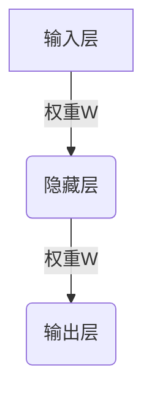

# 反向传播(Backpropagation) - 原理与代码实例讲解

## 1. 背景介绍

### 1.1 神经网络与机器学习

在过去几十年中,机器学习和深度学习技术取得了长足的进步,推动了人工智能的快速发展。神经网络作为深度学习的核心模型,展现出了强大的能力,可以解决诸如计算机视觉、自然语言处理、语音识别等各种复杂的任务。

### 1.2 训练神经网络的挑战

然而,训练一个高质量的神经网络并非一件易事。神经网络中存在大量的参数需要优化,这使得传统的优化算法难以高效地找到最优解。为了解决这一问题,反向传播(Backpropagation)算法应运而生。

### 1.3 反向传播算法的重要性

反向传播算法是训练神经网络中最关键的算法之一,它提供了一种高效的方式来计算神经网络中每个参数的梯度,从而指导参数的更新方向。无论是浅层神经网络还是深度神经网络,反向传播算法都扮演着至关重要的角色。理解反向传播的原理和实现方式,对于掌握深度学习技术至关重要。

## 2. 核心概念与联系

### 2.1 神经网络的基本结构



神经网络通常由多层神经元组成,包括输入层、隐藏层和输出层。每个神经元接收来自上一层的输入,并通过激活函数进行非线性转换,产生新的输出传递给下一层。

### 2.2 损失函数和优化目标

在训练神经网络时,我们需要定义一个损失函数(Loss Function),用于衡量神经网络的输出与期望输出之间的差距。目标是通过调整神经网络中的参数(权重和偏置),最小化损失函数的值。

### 2.3 梯度下降优化

梯度下降(Gradient Descent)是一种常用的优化算法,用于更新神经网络中的参数。它通过计算损失函数相对于每个参数的梯度,然后沿着梯度的反方向更新参数,从而逐步减小损失函数的值。

### 2.4 反向传播的作用

反向传播算法提供了一种高效的方式,用于计算神经网络中每个参数的梯度。它通过从输出层开始,逐层向后传播误差信号,计算每个参数对最终损失函数的贡献,从而获得参数的梯度。有了这些梯度信息,我们就可以应用梯度下降算法更新参数,从而优化神经网络的性能。

## 3. 核心算法原理具体操作步骤

反向传播算法的核心思想是利用链式法则,计算神经网络中每个参数对最终损失函数的梯度。具体步骤如下:

1. **前向传播(Forward Propagation)**: 将输入数据传递给神经网络,计算每一层的输出。
2. **计算输出层误差(Output Layer Error)**: 计算输出层的误差,即输出值与期望值之间的差异。
3. **反向传播误差(Backpropagate Error)**: 从输出层开始,逐层向后传播误差信号,计算每一层的误差。
4. **计算梯度(Gradient Computation)**: 利用链式法则,计算每个参数对应层的误差相对于该参数的梯度。
5. **更新参数(Parameter Update)**: 使用梯度下降算法,根据计算出的梯度更新每个参数的值。

以下是反向传播算法的伪代码:

```
初始化网络权重
对于每个训练样本:
    前向传播计算输出
    计算输出层误差
    反向传播误差
    对于每个权重:
        计算梯度
        更新权重
```

### 3.1 前向传播

前向传播是计算神经网络输出的过程。对于每一层,我们将上一层的输出与当前层的权重相乘,然后加上偏置项,最后通过激活函数进行非线性转换。数学表达式如下:

$$
h_l = \phi(W_l \cdot h_{l-1} + b_l)
$$

其中:
- $h_l$是第$l$层的输出
- $W_l$是第$l$层的权重矩阵
- $b_l$是第$l$层的偏置向量
- $\phi$是激活函数,如ReLU、Sigmoid等

### 3.2 计算输出层误差

在计算输出层误差时,我们需要比较神经网络的输出与期望输出之间的差异。常用的损失函数包括均方误差(Mean Squared Error, MSE)和交叉熵损失(Cross-Entropy Loss)等。

对于回归问题,我们通常使用均方误差损失函数:

$$
L = \frac{1}{2n} \sum_{i=1}^n (y_i - \hat{y}_i)^2
$$

其中:
- $n$是样本数量
- $y_i$是第$i$个样本的期望输出
- $\hat{y}_i$是第$i$个样本的实际输出

对于分类问题,我们通常使用交叉熵损失函数:

$$
L = -\frac{1}{n} \sum_{i=1}^n \sum_{j=1}^m y_{ij} \log(\hat{y}_{ij})
$$

其中:
- $n$是样本数量
- $m$是类别数量
- $y_{ij}$是第$i$个样本属于第$j$类的真实标签(0或1)
- $\hat{y}_{ij}$是第$i$个样本属于第$j$类的预测概率

计算输出层误差的公式为:

$$
\delta^L = \nabla_a L \odot \phi'(z^L)
$$

其中:
- $\delta^L$是输出层的误差
- $\nabla_a L$是损失函数相对于输出层激活值的梯度
- $\phi'(z^L)$是输出层激活函数的导数
- $\odot$表示元素wise乘积

### 3.3 反向传播误差

反向传播误差的过程是从输出层开始,逐层向后计算每一层的误差。对于隐藏层,我们需要计算该层误差相对于上一层权重的梯度。数学表达式如下:

$$
\delta^l = ((W^{l+1})^T \delta^{l+1}) \odot \phi'(z^l)
$$

其中:
- $\delta^l$是第$l$层的误差
- $W^{l+1}$是下一层的权重矩阵
- $\delta^{l+1}$是下一层的误差
- $\phi'(z^l)$是第$l$层激活函数的导数

### 3.4 计算梯度

计算梯度是反向传播算法的关键步骤。我们需要计算每个参数对应层的误差相对于该参数的梯度。

对于权重$W$的梯度,公式如下:

$$
\frac{\partial L}{\partial W^l} = \delta^l (a^{l-1})^T
$$

其中:
- $\frac{\partial L}{\partial W^l}$是损失函数相对于第$l$层权重矩阵的梯度
- $\delta^l$是第$l$层的误差
- $a^{l-1}$是上一层的激活值

对于偏置$b$的梯度,公式如下:

$$
\frac{\partial L}{\partial b^l} = \delta^l
$$

其中:
- $\frac{\partial L}{\partial b^l}$是损失函数相对于第$l$层偏置向量的梯度
- $\delta^l$是第$l$层的误差

### 3.5 更新参数

计算出每个参数的梯度后,我们可以使用梯度下降算法更新参数的值。更新公式如下:

$$
W^l \leftarrow W^l - \eta \frac{\partial L}{\partial W^l}
$$

$$
b^l \leftarrow b^l - \eta \frac{\partial L}{\partial b^l}
$$

其中:
- $\eta$是学习率,控制参数更新的步长
- $\frac{\partial L}{\partial W^l}$是损失函数相对于第$l$层权重矩阵的梯度
- $\frac{\partial L}{\partial b^l}$是损失函数相对于第$l$层偏置向量的梯度

通过不断地迭代上述步骤,我们可以逐步优化神经网络的参数,使得损失函数的值最小化,从而提高神经网络的性能。

## 4. 数学模型和公式详细讲解举例说明

在上一节中,我们介绍了反向传播算法的核心步骤和相关公式。现在,让我们通过一个具体的例子来详细解释这些公式的含义和计算过程。

假设我们有一个简单的神经网络,包含一个输入层、一个隐藏层和一个输出层。输入层有两个神经元,隐藏层有三个神经元,输出层有一个神经元。我们将使用均方误差作为损失函数,并采用Sigmoid作为激活函数。

### 4.1 前向传播

首先,我们需要进行前向传播,计算每一层的输出。假设输入为$x_1$和$x_2$,权重矩阵和偏置向量如下:

$$
W^1 = \begin{bmatrix}
    0.1 & 0.2 \\
    0.3 & 0.4 \\
    0.5 & 0.6
\end{bmatrix}, \quad
b^1 = \begin{bmatrix}
    0.1 \\
    0.2 \\
    0.3
\end{bmatrix}
$$

$$
W^2 = \begin{bmatrix}
    0.7 & 0.8 & 0.9
\end{bmatrix}, \quad
b^2 = 0.4
$$

隐藏层的输出$h^1$可以计算如下:

$$
z^1 = W^1 \begin{bmatrix}
    x_1 \\
    x_2
\end{bmatrix} + b^1 = \begin{bmatrix}
    0.1x_1 + 0.2x_2 + 0.1 \\
    0.3x_1 + 0.4x_2 + 0.2 \\
    0.5x_1 + 0.6x_2 + 0.3
\end{bmatrix}
$$

$$
h^1 = \sigma(z^1) = \begin{bmatrix}
    \sigma(0.1x_1 + 0.2x_2 + 0.1) \\
    \sigma(0.3x_1 + 0.4x_2 + 0.2) \\
    \sigma(0.5x_1 + 0.6x_2 + 0.3)
\end{bmatrix}
$$

其中$\sigma$是Sigmoid激活函数,定义为:

$$
\sigma(x) = \frac{1}{1 + e^{-x}}
$$

输出层的输出$y$可以计算如下:

$$
z^2 = W^2 h^1 + b^2 = 0.7\sigma(0.1x_1 + 0.2x_2 + 0.1) + 0.8\sigma(0.3x_1 + 0.4x_2 + 0.2) + 0.9\sigma(0.5x_1 + 0.6x_2 + 0.3) + 0.4
$$

$$
y = \sigma(z^2)
$$

假设我们的期望输出为$t$,则损失函数为:

$$
L = \frac{1}{2}(t - y)^2
$$

### 4.2 计算输出层误差

现在,我们需要计算输出层的误差$\delta^2$。根据前面给出的公式,我们有:

$$
\delta^2 = \nabla_a L \odot \sigma'(z^2)
$$

其中:

$$
\nabla_a L = \frac{\partial L}{\partial a^2} = -(t - y)
$$

$$
\sigma'(x) = \sigma(x)(1 - \sigma(x))
$$

因此:

$$
\delta^2 = -(t - y)\sigma(z^2)(1 - \sigma(z^2))
$$

### 4.3 反向传播误差

接下来,我们需要计算隐藏层的误差$\delta^1$。根据前面给出的公式,我们有:

$$
\delta^1 = ((W^2)^T \delta^2) \odot \sigma'(z^1)
$$

其中:

$$
(W^2)^T = \begin{bmatrix}
    0.7 \\
    0.8 \\
    0.9
\end{bmatrix}
$$

$$
\sigma'(z^1) = \begin{bmatrix}
    \sigma(z^1_1)(1 - \sigma(z^1_1)) \\
    \sigma(z^1_2)(1 - \sigma(z^1_2)) \\
    \sigma(z^1_3)(1 - \sigma(z^1_3))
\end{bmatrix}
$$

因