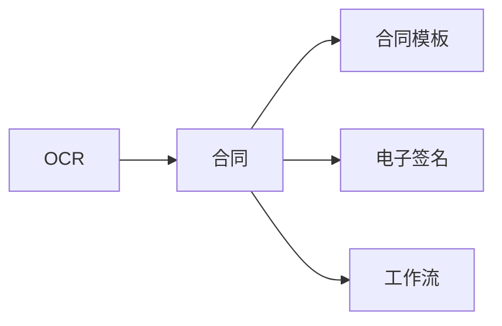
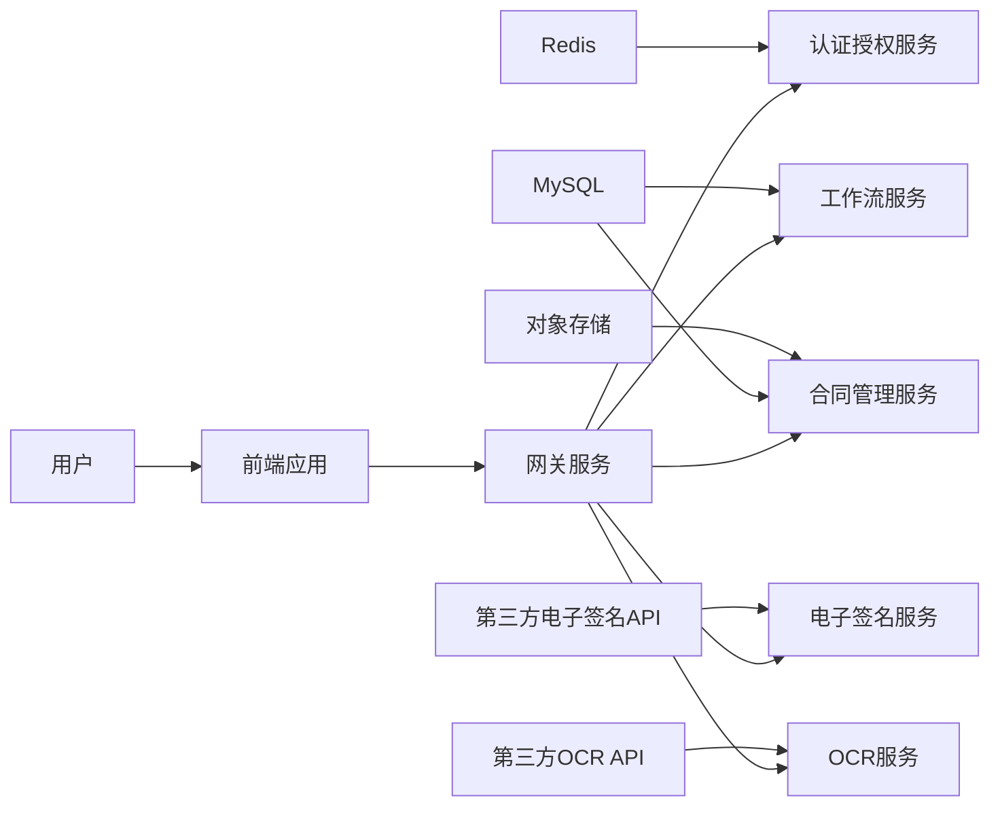

# 合同管理系统详细设计与具体代码实现

## 1. 背景介绍

在现代企业管理中,合同管理是一项非常重要的工作。合同是企业与客户、供应商等相关方之间建立、维护和发展业务关系的法律凭证,涉及到企业运营的方方面面。高效、规范、智能化的合同管理不仅可以提高企业的工作效率,降低运营成本和法律风险,更是企业核心竞争力的重要体现。

然而,传统的人工合同管理方式存在诸多弊端,如工作量大、效率低下、差错率高、安全性差等问题。为了解决这些问题,越来越多的企业开始引入合同管理系统。合同管理系统利用计算机技术和互联网平台,实现合同全生命周期的电子化、自动化和智能化管理,大大提升了合同管理工作的效率和质量。

本文将详细介绍一个基于Java技术栈的合同管理系统的设计与实现。该系统采用微服务架构和前后端分离模式,集成了电子合同签署、OCR识别、工作流引擎等先进技术,实现了合同管理业务的全流程信息化。通过本文的讲解,读者可以全面了解合同管理系统的需求分析、架构设计、数据库设计、核心功能实现等关键内容,并掌握相关的编码实践。

## 2. 核心概念与关联

要设计实现一个合同管理系统,首先需要理解其中涉及的一些核心概念:

- 合同:合同是合同主体之间设立、变更、终止民事权利义务关系的协议。合同管理系统需要对合同的属性、状态等信息进行管理。
- 合同模板:合同模板是事先拟定的、格式化的合同文本,可作为起草合同的参考。系统需要支持自定义合同模板。
- 电子签名:电子签名是电子形式的签名,与手写签名具有同等法律效力。系统需要集成第三方电子签名服务。
- 工作流:工作流是将某个工作过程中的任务按照一定的规则和程序进行拆分和调度。合同的审批、签署等环节可通过工作流来实现自动化。
- OCR:OCR(Optical Character Recognition)技术可以将纸质文档图像转换为可编辑的文本。系统利用OCR可以自动提取纸质合同的关键信息。

以下是这些核心概念之间的关联:



## 3. 系统架构设计

系统整体采用微服务架构,将业务功能拆分为多个独立的微服务,服务之间通过RESTful API进行通信。同时采用前后端分离模式,前端使用 Vue.js 框架,后端使用 Spring Boot 框架。系统架构如下图所示:



各个服务的职责如下:

- 前端应用:提供系统界面,与用户进行交互。
- 网关服务:提供路由、负载均衡、限流、熔断等功能。
- 认证授权服务:负责用户身份认证和访问权限控制。
- 合同管理服务:提供合同的CRUD、查询、统计分析等核心业务功能。
- 工作流服务:负责工作流的定义、执行和管理。
- 电子签名服务:对接第三方电子签名平台,实现合同的在线签署。
- OCR服务:对接第三方OCR平台,实现纸质合同关键信息的自动提取。

## 4. 数据库设计

系统的核心数据存储在MySQL数据库中,主要包括以下几个关键表:

- 合同表(contract):存储合同的基本信息,如合同编号、名称、甲方、乙方、金额、签订日期、生效日期、状态等。
- 合同模板表(contract_template):存储系统预置和用户自定义的合同模板信息。
- 签署流程表(sign_flow):存储合同签署的流程定义和签署状态。
- 签署记录表(sign_record):存储每个签署人的签署信息,如签署时间、签署意见等。
- 附件表(attachment):存储合同附件的元数据信息,附件内容存储在对象存储服务中。

以合同表为例,其结构定义如下:

```sql
CREATE TABLE `contract` (
  `id` bigint(20) NOT NULL AUTO_INCREMENT COMMENT '主键',
  `contract_no` varchar(32) NOT NULL COMMENT '合同编号',
  `contract_name` varchar(64) NOT NULL COMMENT '合同名称',
  `party_a` varchar(64) NOT NULL COMMENT '甲方',
  `party_b` varchar(64) NOT NULL COMMENT '乙方',
  `amount` decimal(20,2) DEFAULT NULL COMMENT '合同金额',
  `sign_date` date DEFAULT NULL COMMENT '签订日期',
  `effective_date` date DEFAULT NULL COMMENT '生效日期',
  `status` tinyint(4) NOT NULL COMMENT '状态,0:草稿 1:签署中 2:生效 3:终止 4:完成 5:作废',
  `create_time` datetime NOT NULL COMMENT '创建时间',
  `update_time` datetime NOT NULL COMMENT '更新时间',
  PRIMARY KEY (`id`),
  UNIQUE KEY `uk_contract_no` (`contract_no`)
) ENGINE=InnoDB DEFAULT CHARSET=utf8mb4 COMMENT='合同表';
```

## 5. 核心功能设计与实现

### 5.1 合同管理

合同管理是系统的核心功能,主要包括合同的创建、修改、删除、查询、统计等。

#### 5.1.1 新建合同

用户在界面上填写合同的基本信息,选择合同模板,上传附件,提交后由后台服务生成合同记录并返回合同编号。

后台服务的核心代码如下:

```java
@Service
public class ContractServiceImpl implements ContractService {

    @Autowired
    private ContractMapper contractMapper;
    
    @Override
    @Transactional
    public String createContract(ContractDTO contractDTO) {
        Contract contract = new Contract();
        BeanUtils.copyProperties(contractDTO, contract);
        contract.setContractNo(generateContractNo());
        contract.setStatus(ContractStatus.DRAFT.getValue());
        contract.setCreateTime(new Date());
        contract.setUpdateTime(new Date());
        contractMapper.insert(contract);
        return contract.getContractNo();
    }
    
    private String generateContractNo() {
        return "HT" + System.currentTimeMillis(); 
    }
}
```

#### 5.1.2 修改合同

用户对草稿状态的合同信息进行修改,提交后系统对合同记录进行更新。

后台服务的核心代码如下:

```java
@Override
@Transactional
public void updateContract(ContractDTO contractDTO) {
    Contract contract = contractMapper.selectByContractNo(contractDTO.getContractNo());
    if (contract == null) {
        throw new BusinessException("合同不存在");
    }
    if (contract.getStatus() != ContractStatus.DRAFT.getValue()) {
        throw new BusinessException("只能修改草稿状态的合同");
    }
    BeanUtils.copyProperties(contractDTO, contract);
    contract.setUpdateTime(new Date());
    contractMapper.updateByPrimaryKey(contract);
}
```

#### 5.1.3 删除合同

用户删除草稿状态的合同,系统执行物理删除。对于已签署或生效的合同,执行逻辑删除。

后台服务的核心代码如下:

```java
@Override
@Transactional
public void deleteContract(String contractNo) {
    Contract contract = contractMapper.selectByContractNo(contractNo);
    if (contract == null) {
        throw new BusinessException("合同不存在");
    }
    if (contract.getStatus() == ContractStatus.DRAFT.getValue()) {
        contractMapper.deleteByPrimaryKey(contract.getId());
    } else {
        contract.setStatus(ContractStatus.INVALID.getValue()); 
        contract.setUpdateTime(new Date());
        contractMapper.updateByPrimaryKey(contract);
    }
}
```

#### 5.1.4 查询合同

系统提供多种维度的合同查询功能,如按合同编号、名称、状态、签订日期等条件进行精确或模糊查询。

后台服务的核心代码如下:

```java
@Override
public PageInfo<ContractVO> queryContracts(ContractQueryDTO queryDTO) {
    PageHelper.startPage(queryDTO.getPageNum(), queryDTO.getPageSize());
    List<Contract> contracts = contractMapper.selectByCondition(queryDTO);
    return new PageInfo<>(contracts.stream().map(this::convert).collect(Collectors.toList()));
}

private ContractVO convert(Contract contract) {
    ContractVO contractVO = new ContractVO();
    BeanUtils.copyProperties(contract, contractVO);
    return contractVO;
}
```

#### 5.1.5 合同统计

系统支持对合同数据进行统计分析,如合同数量、金额的时间趋势,合同状态分布等。

后台服务的核心代码如下:

```java
@Override
public List<ContractStatVO> statContractsByMonth(Date startDate, Date endDate) {
    return contractMapper.selectContractStatsByMonth(startDate, endDate);
}

@Override
public Map<Integer, Long> statContractsByStatus() {
    List<ContractStatusStatDTO> statDTOs = contractMapper.selectContractStatsByStatus();
    return statDTOs.stream().collect(Collectors.toMap(ContractStatusStatDTO::getStatus, ContractStatusStatDTO::getCount));
}
```

### 5.2 合同签署流程

#### 5.2.1 定义签署流程

管理员在后台定义合同的签署流程,包括签署人、签署顺序、是否允许转发、是否需要审批等规则。流程定义后可以复用。

流程定义的核心数据结构如下:

```java
public class SignFlowDefinition implements Serializable {
    
    private Long id;
    private String flowName;
    private List<SignNode> signNodes;
    
    @Data
    public static class SignNode {
        private String nodeName;
        private Integer nodeType; //1:签署人 2:审批人
        private String assignee; 
        private Boolean allowTransfer;
        private Boolean needApprove;
    }
}
```

#### 5.2.2 发起签署

合同创建人选择签署流程,指定每个节点的参与人,提交后系统创建签署流程实例并推送通知给首个签署人。

后台服务的核心代码如下:

```java
@Service
public class SignFlowServiceImpl extends ServiceImpl<SignFlowMapper, SignFlow> implements SignFlowService {

    @Autowired
    private SignRecordService signRecordService;
    
    @Override
    @Transactional
    public void startSignFlow(SignFlowStartDTO startDTO) {
        SignFlow signFlow = new SignFlow();
        BeanUtils.copyProperties(startDTO, signFlow);
        signFlow.setFlowStatus(SignFlowStatus.SIGNING.getValue());
        signFlow.setCurrentNode(1);
        save(signFlow);
        
        SignFlowDefinition definition = getDefinitionById(signFlow.getFlowDefinitionId());
        SignNode firstNode = definition.getSignNodes().get(0);
        SignRecord signRecord = buildSignRecord(signFlow, firstNode, 1);
        signRecordService.save(signRecord);
        
        sendSignNotify(signRecord.getAssignee());
    }
    
    private SignRecord buildSignRecord(SignFlow signFlow, SignNode node, int nodeIndex) {
        SignRecord signRecord = new SignRecord();
        signRecord.setFlowId(signFlow.getId());
        signRecord.setContractId(signFlow.getContractId());
        signRecord.setNodeIndex(nodeIndex);
        signRecord.setNodeName(node.getNodeName());
        signRecord.setNodeType(node.getNodeType());
        signRecord.setAssignee(node.getAssignee());
        signRecord.setAllowTransfer(node.getAllowTransfer());
        signRecord.setNeedApprove(node.getNeedApprove());
        signRecord.setSignStatus(SignStatus.TODO.getValue());
        return signRecord;
    }
    
    private void sendSignNotify(String assignee) {
        //TODO 发送签署通知,如短信、站内信、邮件等
    }
}
```

#### 5.2.3 签署合同

签署人收到签署通知后,登录系统进入签署页面,确认合同内容,提交签名数据。

签署的核心代码如下:

```java
@Service
public class SignRecordServiceImpl extends ServiceImpl<SignRecordMapper, SignRecord> implements SignRecordService {

    @Autowired
    private ContractService contractService;
    @Autowired
    private SignFlowService signFlowService;
    @Autowired
    private ThirdPartySignatureService signatureService;
    
    @Override
    @Transactional
    public void sign(Long recordId, String opinion) {
        SignRecord signRecord = getById(recordId);
        if (signRecord.getSignStatus() != SignStatus.TODO.getValue()) {
            throw new BusinessException("当前签署记录状态异常");
        }
        
        String contractFile = contractService.getContractFile(signRecord.getContractId());
        String signatureData = signatureService.