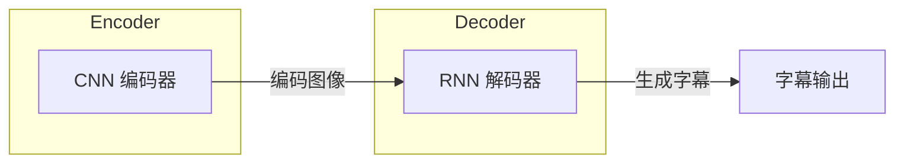
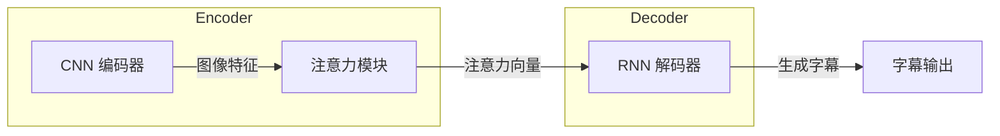
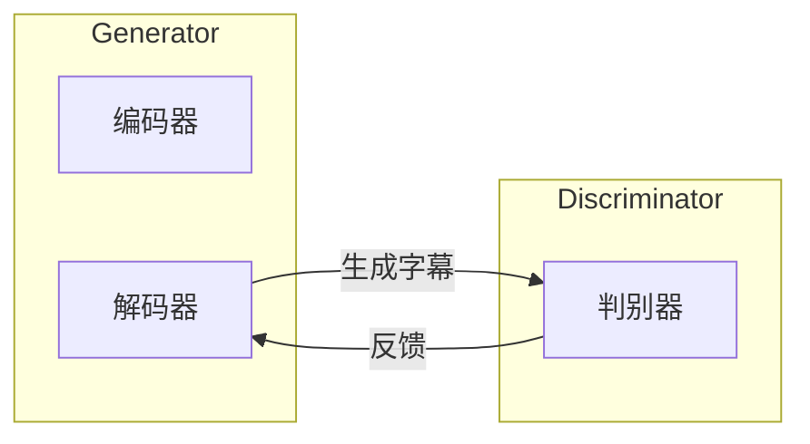

# 图像字幕生成原理与代码实战案例讲解

## 1.背景介绍

### 1.1 什么是图像字幕生成?

图像字幕生成(Image Captioning)是一种将图像内容转化为自然语言描述的任务。给定一张输入图像,模型需要生成一个简洁、准确的文本描述,概括图像中的主要内容和语义信息。这个任务需要模型具备理解和推理图像内容的能力,并将其转化为流畅的自然语言表达。

图像字幕生成广泛应用于辅助视觉障碍人士理解图像内容、图像检索、人机交互等领域。随着深度学习技术的发展,基于神经网络的图像字幕生成模型取得了长足进步,在准确度和自然语言表达能力上都有了显著提升。

### 1.2 图像字幕生成的挑战

尽管取得了长足进步,但图像字幕生成仍然面临着一些挑战:

1. **视觉理解能力**:准确理解图像内容的语义信息,包括识别物体、场景、属性和它们之间的关系。
2. **自然语言生成能力**:生成流畅、准确、相关且信息丰富的自然语言描述。
3. **多模态融合**:有效融合视觉和语义信息,建立图像和文本之间的映射关系。
4. **长期依赖问题**:生成的字幕往往比较长,需要模型具备捕捉长期依赖关系的能力。
5. **多样性**:针对同一张图像,能够生成不同角度、风格的多样化描述。

## 2.核心概念与联系

### 2.1 编码器-解码器架构

编码器-解码器(Encoder-Decoder)架构是图像字幕生成模型的核心框架,广泛应用于序列到序列(Sequence-to-Sequence)任务。该架构由两个主要部分组成:

1. **编码器(Encoder)**: 将输入图像编码为一个固定长度的向量表示,捕捉图像的语义信息。常用的编码器包括卷积神经网络(CNN)和注意力机制等。

2. **解码器(Decoder)**: 基于编码器的输出,生成对应的目标序列(即字幕描述)。解码器通常采用循环神经网络(RNN)或Transformer等序列模型,逐步预测下一个单词。

编码器和解码器通过学习图像和文本之间的映射关系,实现端到端的图像字幕生成。

### 2.2 注意力机制

注意力机制(Attention Mechanism)是编码器-解码器架构中的一个关键组件,它允许模型在生成每个单词时,动态地关注输入图像的不同区域,从而捕捉相关的视觉信息。

注意力机制的工作原理是:在每个时间步,解码器会计算一个注意力分布,表示当前生成单词时,需要关注输入图像不同区域的权重。然后,将注意力分布与图像特征进行加权求和,得到一个注意力向量,作为解码器的额外输入,辅助生成下一个单词。

注意力机制大大提升了模型的性能,因为它允许模型动态地关注与当前生成单词相关的视觉信息,而不是简单地依赖于编码器的固定向量表示。

### 2.3 对抗训练

对抗训练(Adversarial Training)是一种提升图像字幕生成模型性能的技术。它引入了一个判别器(Discriminator),与生成器(Generator,即编码器-解码器模型)进行对抗式训练。

判别器的目标是区分生成的字幕是否为真实的人类描述,而生成器的目标是欺骗判别器,生成更加自然流畅的字幕。通过这种对抗式训练,生成器可以学习到更好的语言模型,生成更加自然流畅的字幕描述。

对抗训练的思想源自生成对抗网络(Generative Adversarial Networks, GANs),在图像字幕生成任务中也取得了不错的效果。

## 3.核心算法原理具体操作步骤

### 3.1 编码器: 图像特征提取

编码器的主要任务是从输入图像中提取语义特征,并将其编码为一个固定长度的向量表示。常用的编码器包括:

1. **卷积神经网络(CNN)**: 利用CNN的强大特征提取能力,从图像中提取丰富的视觉特征。常用的CNN模型包括VGGNet、ResNet、Inception等。

2. **区域特征提取**: 除了全局图像特征,还可以提取图像中不同区域的局部特征,以捕捉更细粒度的视觉信息。常用的方法包括区域提议网络(Region Proposal Network, RPN)和注意力机制。

3. **特征融合**: 将不同层次(如低级、中级和高级)的特征进行融合,以获得更加丰富和多样化的图像表示。

编码器的具体操作步骤如下:

1. 将输入图像送入CNN,经过多层卷积和池化操作,提取不同层次的特征图。
2. 对特征图进行空间维度的降维(如平均池化或全连接层),得到一个固定长度的特征向量。
3. (可选)利用注意力机制或RPN等方法,提取图像中不同区域的局部特征。
4. 将全局特征和局部特征进行融合,得到最终的图像编码向量。

### 3.2 解码器: 自然语言生成

解码器的主要任务是基于编码器的输出,生成对应的自然语言描述(即字幕)。常用的解码器包括:

1. **循环神经网络(RNN)**: 利用RNN的序列建模能力,逐步生成字幕中的单词。常用的RNN变体包括长短期记忆网络(LSTM)和门控循环单元(GRU)。

2. **Transformer**: 基于自注意力机制的序列模型,在机器翻译等任务中表现出色,近年来也被应用于图像字幕生成。

3. **融合注意力**: 在解码器中引入注意力机制,允许模型在生成每个单词时,动态地关注输入图像的不同区域,提高视觉和语义信息的融合能力。

解码器的具体操作步骤如下:

1. 将编码器的输出(图像编码向量)作为初始隐状态,送入解码器。
2. 在每个时间步,根据当前隐状态和上一步生成的单词,预测下一个单词的概率分布。
3. 从概率分布中采样(或选择概率最大)的单词,作为当前时间步的输出。
4. 更新解码器的隐状态,进入下一个时间步的预测。
5. 重复步骤2-4,直到生成结束标记或达到最大长度。

### 3.3 训练策略

图像字幕生成模型的训练通常采用监督学习的方式,目标是最小化生成的字幕与真实字幕之间的损失函数。常用的损失函数包括交叉熵损失和reinforcement learning等。

除了基本的监督学习外,还可以采用一些高级训练策略,如对抗训练、强化学习、注意力正则化等,以进一步提升模型的性能和泛化能力。

1. **对抗训练**: 引入判别器,与生成器进行对抗式训练,促使生成器生成更加自然流畅的字幕描述。

2. **强化学习**: 将字幕生成过程建模为马尔可夫决策过程,采用策略梯度等强化学习算法,直接优化一些非差分的评估指标(如BLEU、METEOR等)。

3. **注意力正则化**: 在训练过程中,引入正则化项,约束注意力分布的熵或其他属性,促使模型学习更加合理的注意力机制。

4. **数据增强**: 通过对图像和文本进行变换(如裁剪、翻转、同义词替换等),生成更多的训练样本,提高模型的泛化能力。

5. **预训练与微调**: 在大规模数据集上预训练编码器和解码器,获得良好的初始化权重,然后在目标数据集上进行微调,进一步提升性能。

## 4.数学模型和公式详细讲解举例说明

### 4.1 编码器: CNN特征提取

卷积神经网络(CNN)是编码器中常用的图像特征提取模块。CNN通过多层卷积、池化和非线性激活函数的组合,逐步提取图像的低级、中级和高级语义特征。

假设输入图像为$I \in \mathbb{R}^{H \times W \times C}$,其中$H$、$W$和$C$分别表示图像的高度、宽度和通道数。在第$l$层卷积层,卷积操作可以表示为:

$$
X^{(l)} = f\left(W^{(l)} * X^{(l-1)} + b^{(l)}\right)
$$

其中,$X^{(l)}$表示第$l$层的特征图,$W^{(l)}$和$b^{(l)}$分别表示该层的卷积核权重和偏置,$*$表示卷积操作,而$f(\cdot)$是非线性激活函数(如ReLU)。

在卷积层之后,通常会使用池化层对特征图进行下采样,减小特征图的空间维度,同时保留主要的语义信息。常用的池化操作包括最大池化和平均池化。

最终,CNN编码器会输出一个固定长度的特征向量$v \in \mathbb{R}^d$,它编码了输入图像的语义信息,将被送入解码器进行字幕生成。

### 4.2 解码器: RNN序列生成

循环神经网络(RNN)是解码器中常用的序列生成模块。RNN能够捕捉序列数据中的长期依赖关系,适合于自然语言生成任务。

假设目标字幕为$Y = \{y_1, y_2, \dots, y_T\}$,其中$y_t$表示第$t$个单词。在每个时间步$t$,RNN的隐状态$h_t$可以通过以下递归公式计算:

$$
h_t = f_{\text{RNN}}\left(h_{t-1}, y_{t-1}, v\right)
$$

其中,$f_{\text{RNN}}$是RNN的递归函数(如LSTM或GRU),$h_{t-1}$是上一时间步的隐状态,$y_{t-1}$是上一步生成的单词,而$v$是编码器输出的图像编码向量。

基于当前隐状态$h_t$,RNN会计算出下一个单词$y_t$的概率分布:

$$
P(y_t | y_{<t}, v) = \text{softmax}\left(W_o h_t + b_o\right)
$$

其中,$W_o$和$b_o$是输出层的权重和偏置,而$\text{softmax}$函数将logits转换为概率分布。

在训练阶段,我们最小化真实字幕$Y$与生成字幕之间的交叉熵损失:

$$
\mathcal{L} = -\sum_{t=1}^T \log P(y_t | y_{<t}, v)
$$

通过反向传播算法,可以更新RNN及其他模块的参数,使模型能够生成更加准确的字幕描述。

### 4.3 注意力机制

注意力机制允许解码器在生成每个单词时,动态地关注输入图像的不同区域,从而获取与当前单词相关的视觉信息。

假设编码器输出的图像特征为$V = \{v_1, v_2, \dots, v_N\}$,其中$v_i \in \mathbb{R}^d$表示第$i$个区域的特征向量,共$N$个区域。在时间步$t$,注意力机制首先计算注意力分数:

$$
e_{