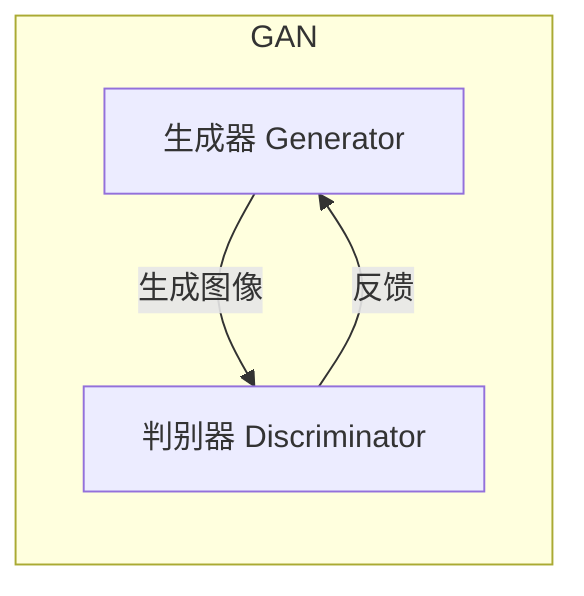
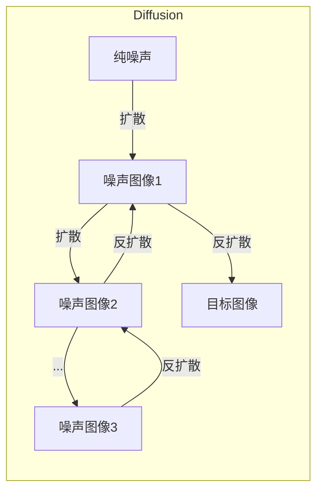
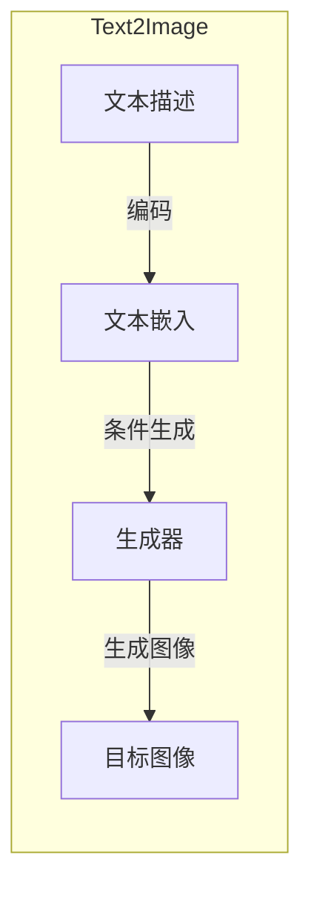

# 图像生成与人工智能伦理：技术与责任同行

## 1.背景介绍

随着人工智能技术的快速发展,图像生成模型已经取得了令人瞩目的进步。通过深度学习算法,这些模型能够基于文本描述或少量示例图像,生成逼真且高质量的图像输出。无论是艺术创作、视觉设计,还是科研可视化等领域,图像生成模型都展现出了巨大的应用潜力。

然而,就像任何新兴技术一样,图像生成模型也面临着一些伦理挑战。由于这些模型是在大量现有数据上训练而来,因此可能会继承并放大数据中存在的偏见和不当内容。此外,生成图像的能力也可能被滥用于制造虚假信息、侵犯隐私等违法行为。因此,在推动图像生成技术发展的同时,我们也必须重视相关的伦理规范和责任意识。

本文将探讨图像生成模型的核心技术原理,分析其在现实应用中可能产生的伦理风险,并提出一些有益的实践建议,以确保这项技术的健康发展和负责任的使用。

## 2.核心概念与联系

### 2.1 生成对抗网络(GAN)

生成对抗网络(Generative Adversarial Networks, GAN)是目前图像生成领域最核心和最成功的技术之一。GAN由两个神经网络组成:生成器(Generator)和判别器(Discriminator)。生成器的目标是生成逼真的图像,而判别器则需要区分生成器输出的图像是真实的还是伪造的。两个网络相互对抗,不断优化,最终达到一种动态平衡,使得生成器能够产生高质量的图像输出。



### 2.2 扩散模型(Diffusion Models)

扩散模型是另一种流行的图像生成方法,其原理是通过一系列扩散(噪声注入)和反扩散(去噪)步骤,从纯噪声中生成所需图像。与GAN相比,扩散模型通常能生成更加逼真和高分辨率的图像,并且训练过程更加稳定。目前,扩散模型已经在多个领域取得了最先进的性能。



### 2.3 文本到图像(Text-to-Image)

文本到图像是图像生成的一个重要应用场景,即根据给定的文本描述生成相应的图像。这种任务需要模型理解文本的语义,并将其映射到视觉表征。目前,结合了GAN、扩散模型、transformer等技术的多模态模型在这一领域取得了突破性进展。



## 3.核心算法原理具体操作步骤

### 3.1 生成对抗网络(GAN)原理

1. **初始化**:生成器G和判别器D都是基于深度神经网络的模型,初始化时权重参数通常是随机初始化的。

2. **生成器生成样本**:生成器G从随机噪声向量z中生成样本图像G(z)。

3. **判别器判别真伪**:判别器D接收真实图像x和生成图像G(z)作为输入,输出每个输入图像是真实图像或生成图像的概率D(x)和D(G(z))。

4. **计算损失函数**:生成器G希望判别器D将其生成的图像G(z)判断为真实图像,因此生成器损失函数为:
   $$\min_G V(G, D) = \mathbb{E}_{z \sim p_z(z)}[\log(1 - D(G(z)))]$$
   判别器D希望能够正确区分真实图像x和生成图像G(z),因此判别器损失函数为:
   $$\min_D V(G, D) = \mathbb{E}_{x \sim p_{data}(x)}[\log D(x)] + \mathbb{E}_{z \sim p_z(z)}[\log(1 - D(G(z)))]$$

5. **反向传播和优化**:通过反向传播计算梯度,并使用优化算法(如Adam)分别更新生成器G和判别器D的参数。

6. **迭代训练**:重复执行步骤2-5,直到模型收敛。生成器G和判别器D在这个过程中相互对抗,最终达到一种动态平衡。

### 3.2 扩散模型(Diffusion Models)原理

1. **前向扩散过程**:从原始图像x开始,通过多个步骤逐渐添加高斯噪声,最终得到纯噪声图像。这个过程可以用马尔可夫链来建模,每一步的转移概率为:
   $$q(\hat{x}_t|x_0) = \mathcal{N}(\hat{x}_t;\sqrt{1-\beta_t}x_0, \beta_tI)$$
   其中$\beta_t$是预定义的方差系数。

2. **学习逆向过程**:训练一个反向模型(通常是条件生成模型),从纯噪声图像出发,逐步去噪并最终重构原始图像x。反向模型的目标是最大化逆向过程的概率:
   $$\max_{\theta} \mathbb{E}_{x_0, \epsilon} \big[p_\theta(x_0|\hat{x}_1, ..., \hat{x}_T)\big]$$
   其中$\theta$是反向模型的参数。

3. **采样生成图像**:在推理阶段,从纯噪声图像出发,使用训练好的反向模型进行逐步去噪采样,最终生成目标图像。

4. **辅助损失函数**:为了提高训练效率和生成质量,通常会引入辅助损失函数,如KLMS损失、VB损失等。

### 3.3 文本到图像(Text-to-Image)原理

1. **文本编码**:使用预训练的语言模型(如BERT、GPT等)对输入文本进行编码,得到文本的语义嵌入向量。

2. **条件生成**:将文本嵌入向量作为条件,输入到生成模型(如条件GAN、条件扩散模型等)中,指导图像生成过程。

3. **注意力机制**:在生成过程中,通过注意力机制捕捉文本和图像之间的对应关系,确保生成的图像与文本描述相符。

4. **损失函数**:除了常规的对抗损失或扩散损失外,还可以引入额外的损失函数,如文本-图像相似度损失、感知损失等,进一步提高生成质量。

5. **多模态融合**:一些先进的模型会将视觉特征编码器、语言编码器、生成器等多个模块融合在一起,形成统一的多模态框架。

## 4.数学模型和公式详细讲解举例说明

### 4.1 生成对抗网络(GAN)损失函数

生成对抗网络(GAN)的目标是找到一个生成分布$p_g$,使其尽可能逼近真实数据分布$p_{data}$。这个目标可以通过最小化生成器G和判别器D之间的JS散度(Jensen-Shannon Divergence)来实现:

$$\min_G \max_D V(D, G) = \mathbb{E}_{x \sim p_{data}(x)}[\log D(x)] + \mathbb{E}_{z \sim p_z(z)}[\log(1 - D(G(z)))]$$

其中,第一项是真实数据在判别器D上的期望对数概率,第二项是生成数据在判别器D上的期望对数概率的相反数。判别器D的目标是最大化这个值,而生成器G的目标是最小化它。

在实际训练中,通常会使用替代目标函数,如最小二乘生成对抗网络(LSGAN)的损失函数:

$$\min_D V(D) = \frac{1}{2}\mathbb{E}_{x \sim p_{data}(x)}[(D(x) - 1)^2] + \frac{1}{2}\mathbb{E}_{z \sim p_z(z)}[D(G(z))^2]$$
$$\min_G V(G) = \frac{1}{2}\mathbb{E}_{z \sim p_z(z)}[(D(G(z)) - 1)^2]$$

这种形式的损失函数可以稳定GAN的训练过程,并提高生成质量。

### 4.2 扩散模型(Diffusion Models)损失函数

扩散模型的训练目标是最大化从噪声图像到原始图像的逆向过程的概率。具体来说,对于每个时间步$t$,我们希望最小化以下损失函数:

$$\mathcal{L}_{t} = \mathbb{E}_{x_0, \epsilon} \big[\|\epsilon - \epsilon_\theta(\hat{x}_t, t, x_0)\|^2\big]$$

其中,$\epsilon_\theta$是反向模型在时间步$t$的输出,它预测了从$\hat{x}_t$到$x_0$所需的噪声。$\epsilon$是真实的从$\hat{x}_t$到$x_0$所需的噪声。通过最小化这个损失函数,我们可以使反向模型学会准确预测噪声,从而能够逐步去噪并重构原始图像。

在实践中,通常会引入一些辅助损失函数,如KLMS损失:

$$\mathcal{L}_{KLMS} = \mathbb{E}_{x_0, \epsilon} \big[\|(\epsilon - \epsilon_\theta(\hat{x}_t, t, x_0))\odot\sigma_\theta(\hat{x}_t, t)\|^2\big]$$

其中,$\sigma_\theta$是一个辅助模型,用于预测每个像素的不确定性。这种损失函数可以帮助模型更好地处理复杂的图像结构。

### 4.3 文本到图像(Text-to-Image)损失函数

对于文本到图像任务,除了常规的对抗损失或扩散损失外,还需要考虑文本和图像之间的相关性。一种常见的做法是引入文本-图像相似度损失:

$$\mathcal{L}_{sim} = -\mathbb{E}_{x_0, t}\big[\text{sim}(f_\text{img}(x_0), f_\text{txt}(t))\big]$$

其中,$f_\text{img}$和$f_\text{txt}$分别是图像编码器和文本编码器,用于提取图像和文本的特征表示。$\text{sim}(\cdot, \cdot)$是一个相似度函数,如余弦相似度或点积。通过最大化这个相似度损失,我们可以确保生成的图像与文本描述相符。

另一种常见的损失函数是感知损失(Perceptual Loss),它通过比较生成图像和真实图像在预训练视觉模型上的特征差异,来提高生成图像的感知质量。

## 5.项目实践:代码实例和详细解释说明

这里我们提供一个基于PyTorch的简单GAN实现,用于生成手写数字图像。虽然代码较为简单,但它展示了GAN的核心思想和训练过程。

```python
import torch
import torch.nn as nn
import torchvision.datasets as datasets
import torchvision.transforms as transforms

# 定义生成器
class Generator(nn.Module):
    def __init__(self, z_dim=64):
        super(Generator, self).__init__()
        self.fc = nn.Linear(z_dim, 1024)
        self.bn1 = nn.BatchNorm1d(1024)
        self.lrelu = nn.LeakyReLU(0.2)
        self.fc2 = nn.Linear(1024, 784)
        self.bn2 = nn.BatchNorm1d(784)

    def forward(self, z):
        out = self.fc(z)
        out = self.bn1(out)
        out = self.lrelu(out)
        out = self.fc2(out)
        out = self.bn2(out)
        out = torch.sigmoid(out)
        return out.view(-1, 1, 28, 28)

# 定义判别器
class Discriminator(nn.Module):
    def __init__(self):
        super(Discriminator, self).__init__()
        self.conv1 = nn.Conv2d(1, 32, kernel_size=5)
        self.bn1 = nn.BatchNorm2