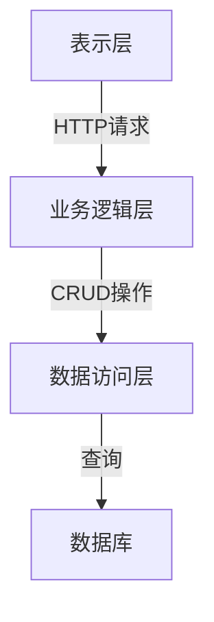
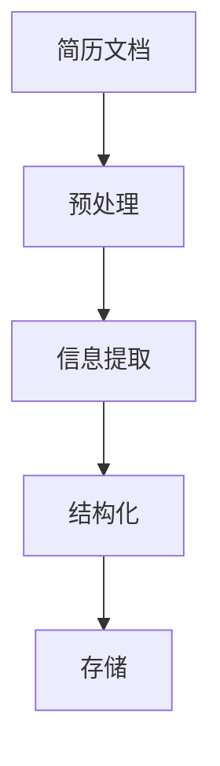
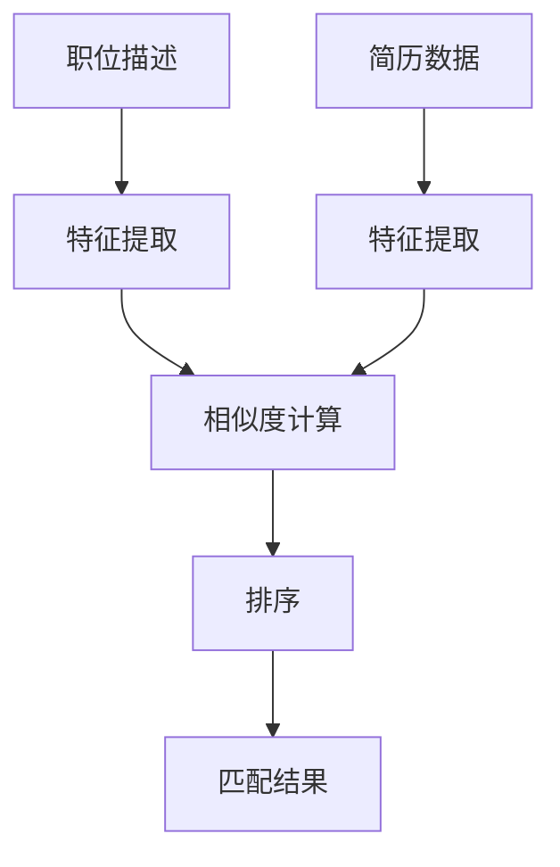

# 基于ASP的人才招聘系统详细设计与具体代码实现

## 1.背景介绍

### 1.1 人力资源管理系统的重要性

在当今快节奏的商业环境中,人力资源管理系统(HRMS)已经成为企业的核心系统之一。有效的人力资源管理对于吸引、培养和留住优秀人才至关重要,这直接影响着企业的竞争力和发展。传统的人力资源管理方式已经无法满足现代企业的需求,因此需要一个高效、灵活的人力资源管理系统来简化和自动化人力资源相关的流程。

### 1.2 人才招聘系统的作用

人才招聘系统作为HRMS的重要组成部分,旨在简化和优化整个招聘流程。通过自动化的方式处理从职位发布到候选人甄选的各个环节,可以大大提高招聘效率,降低人力和财力成本。同时,一个良好设计的招聘系统还能为企业吸引更多优秀人才,提升企业形象。

### 1.3 基于ASP的人才招聘系统优势

ASP.NET是微软推出的一种开发Web应用程序的技术,它建立在公共语言运行库(CLR)之上,支持多种编程语言。与传统的ASP相比,ASP.NET具有更好的可移植性、可扩展性和安全性。基于ASP.NET开发的人才招聘系统不仅可以充分利用微软的技术优势,还能够与企业现有的系统无缝集成,从而提供更加完整和高效的解决方案。

## 2.核心概念与联系

### 2.1 系统架构概览

基于ASP.NET的人才招聘系统通常采用三层架构,包括表示层(Presentation Layer)、业务逻辑层(Business Logic Layer)和数据访问层(Data Access Layer)。



- **表示层**:负责与用户交互,接收用户请求并呈现结果。通常使用ASP.NET Web Forms或ASP.NET MVC等技术实现。
- **业务逻辑层**:处理系统的核心业务逻辑,如招聘流程管理、简历处理等。
- **数据访问层**:负责与数据库进行交互,执行增删改查等操作。

### 2.2 核心功能模块

人才招聘系统的核心功能模块通常包括:

1. **职位管理模块**:用于发布新的职位信息、管理现有职位。
2. **简历管理模块**:接收和处理求职者提交的简历。
3. **面试管理模块**:安排和跟踪面试流程。
4. **员工管理模块**:管理已入职员工的信息。
5. **报告模块**:生成各种统计报告,如招聘进度、员工流失率等。
6. **系统管理模块**:管理用户权限、系统配置等。

### 2.3 关键技术

实现上述功能模块需要涉及以下关键技术:

- **ASP.NET Web Forms/MVC**:用于构建Web应用程序的用户界面。
- **ADO.NET**:用于访问和操作数据库。
- **ASP.NET身份验证和授权**:确保系统安全性。
- **LINQ**:语言集成查询,简化数据访问。
- **Web服务**:实现系统与外部系统的集成。
- **异步编程**:提高系统响应能力。

## 3.核心算法原理具体操作步骤

### 3.1 简历解析算法

简历解析是人才招聘系统的核心功能之一。通过自然语言处理(NLP)技术,系统可以自动提取简历中的关键信息,如教育背景、工作经历等,从而加快简历筛选流程。以下是一种常见的简历解析算法流程:



1. **预处理**:将简历文档转换为纯文本格式,去除无关信息。
2. **信息提取**:使用命名实体识别(NER)等NLP技术从简历文本中提取关键信息。
3. **结构化**:将提取的信息组织成结构化数据,如姓名、教育经历、工作经历等字段。
4. **存储**:将结构化数据存储到数据库中,供后续查询和处理。

在实现过程中,可以使用开源NLP库如Stanford CoreNLP或NLTK等,或者利用商业化的API服务。

### 3.2 智能匹配算法

智能匹配算法旨在根据职位要求和候选人资历,自动匹配最合适的人选。这可以大大提高招聘效率,避免人工筛选的低效和主观性。一种常见的智能匹配算法如下:



1. **特征提取**:从职位描述和简历数据中提取关键特征,如技能、经验年限等。
2. **相似度计算**:使用文本相似度算法(如TF-IDF、Word2Vec等)计算职位描述与每份简历之间的相似度分数。
3. **排序**:根据相似度分数对候选人进行排序。
4. **匹配结果**:输出最匹配的候选人列表。

在实现过程中,可以使用Python的scikit-learn、gensim等机器学习库,或者利用云服务提供的智能匹配API。

## 4.数学模型和公式详细讲解举例说明  

### 4.1 文本相似度计算

文本相似度计算是智能匹配算法的核心部分。常用的文本相似度计算方法包括:

1. **TF-IDF相似度**

TF-IDF(Term Frequency-Inverse Document Frequency)是一种常用的文本相似度计算方法。它考虑了词频(TF)和逆文档频率(IDF)两个因素,公式如下:

$$\mathrm{sim}(d_1, d_2) = \cos(\vec{v_1}, \vec{v_2}) = \frac{\vec{v_1} \cdot \vec{v_2}}{|\vec{v_1}| \times |\vec{v_2}|}$$

其中$\vec{v_1}$和$\vec{v_2}$分别表示文档$d_1$和$d_2$的TF-IDF向量。

2. **Word2Vec相似度**

Word2Vec是一种基于神经网络的词嵌入模型,可以将词语映射到低维的连续向量空间。通过计算两个向量之间的余弦相似度,可以衡量两个词语或短语的语义相似性:

$$\mathrm{sim}(w_1, w_2) = \cos(\vec{v_1}, \vec{v_2}) = \frac{\vec{v_1} \cdot \vec{v_2}}{|\vec{v_1}| \times |\vec{v_2}|}$$

其中$\vec{v_1}$和$\vec{v_2}$分别表示词语$w_1$和$w_2$的词向量。

通过将职位描述和简历表示为词向量的加权平均,可以计算它们之间的相似度。

### 4.2 推荐系统算法

在人才招聘系统中,推荐系统算法可以用于推荐合适的职位给求职者,或者推荐匹配的候选人给招聘者。常见的推荐算法包括:

1. **协同过滤算法(Collaborative Filtering)**

协同过滤算法基于过去用户的行为记录(如浏览历史、申请记录等),发现具有相似行为模式的用户群体,并据此推荐相关内容。

对于职位推荐,可以使用基于用户的协同过滤算法,计算目标用户与其他用户的相似度,并推荐相似用户感兴趣的职位。

对于候选人推荐,可以使用基于项目的协同过滤算法,计算目标职位与其他职位的相似度,并推荐与相似职位匹配的候选人。

2. **基于内容的推荐算法(Content-based Recommendation)**

基于内容的推荐算法利用项目本身的内容特征(如职位描述、简历信息等)进行推荐。通常需要构建一个内容特征空间,并在该空间中计算用户兴趣与项目之间的相似度。

例如,可以将职位描述和求职者简历映射到相同的技能空间,并推荐与求职者技能相匹配的职位。

在实践中,可以将协同过滤和基于内容的方法相结合,以获得更好的推荐效果。

## 5.项目实践:代码实例和详细解释说明

### 5.1 系统架构实现

以下是基于ASP.NET MVC实现人才招聘系统的基本架构代码:

```csharp
// Controllers/JobPostingsController.cs
public class JobPostingsController : Controller
{
    private readonly IJobPostingService _jobPostingService;

    public JobPostingsController(IJobPostingService jobPostingService)
    {
        _jobPostingService = jobPostingService;
    }

    // GET: JobPostings
    public ActionResult Index()
    {
        var jobPostings = _jobPostingService.GetAllJobPostings();
        return View(jobPostings);
    }

    // GET: JobPostings/Create
    public ActionResult Create()
    {
        return View();
    }

    // POST: JobPostings/Create
    [HttpPost]
    public ActionResult Create(JobPostingViewModel model)
    {
        if (ModelState.IsValid)
        {
            _jobPostingService.CreateJobPosting(model);
            return RedirectToAction("Index");
        }

        return View(model);
    }
}

// Services/JobPostingService.cs
public class JobPostingService : IJobPostingService
{
    private readonly IJobPostingRepository _jobPostingRepository;

    public JobPostingService(IJobPostingRepository jobPostingRepository)
    {
        _jobPostingRepository = jobPostingRepository;
    }

    public IEnumerable<JobPosting> GetAllJobPostings()
    {
        return _jobPostingRepository.GetAll();
    }

    public void CreateJobPosting(JobPostingViewModel model)
    {
        var jobPosting = new JobPosting
        {
            Title = model.Title,
            Description = model.Description,
            // ... 映射其他属性
        };

        _jobPostingRepository.Add(jobPosting);
        _jobPostingRepository.SaveChanges();
    }
}

// Repositories/JobPostingRepository.cs
public class JobPostingRepository : IJobPostingRepository
{
    private readonly RecruitmentDbContext _dbContext;

    public JobPostingRepository(RecruitmentDbContext dbContext)
    {
        _dbContext = dbContext;
    }

    public IEnumerable<JobPosting> GetAll()
    {
        return _dbContext.JobPostings.ToList();
    }

    public void Add(JobPosting jobPosting)
    {
        _dbContext.JobPostings.Add(jobPosting);
    }

    public void SaveChanges()
    {
        _dbContext.SaveChanges();
    }
}
```

上述代码展示了基于ASP.NET MVC实现的三层架构:

- `Controllers`文件夹中的`JobPostingsController`负责处理用户请求,调用`JobPostingService`执行业务逻辑。
- `Services`文件夹中的`JobPostingService`封装了与职位发布相关的业务逻辑,如获取所有职位、创建新职位等。它依赖于`JobPostingRepository`与数据库进行交互。
- `Repositories`文件夹中的`JobPostingRepository`负责执行与数据库相关的CRUD操作。

通过依赖注入的方式,控制器、服务和存储库之间实现了松散耦合,便于维护和扩展。

### 5.2 简历解析实现

以下是使用C#和Stanford CoreNLP库实现简历解析的示例代码:

```csharp
using Edu.Stanford.Nlp.Pipeline;

public class ResumeParser
{
    private static readonly StanfordCoreNLP _pipeline = new StanfordCoreNLP(
        PropertiesUtils.GetStanfordCoreNlpProperties(
            useSentenceRegionAnnotations: true,
            useNamedEntityRecognition: true
        )
    );

    public static ResumeInfo ParseResume(string resumeText)
    {
        var annotation = new Annotation(resumeText);
        _pipeline.Annotate(annotation);

        var resumeInfo = new ResumeInfo();

        // 提取姓名
        var names = annotation.Get(typeof(Annotation.NamedEntityMentionAnnotation))
            .Where(m => m.NerTag == "PERSON")
            .Select(m => m.Text)
            .ToList();
        resumeInfo.Name = string.Join(" ", names);

        // 提取教育经历
        var educations = annotation.Get(typeof(Annotation.SentencesAnnotation))
            .SelectMany(s => s.Get(typeof(Annotation.MentionsAnnotation)))
            .Where(m => m.NerTag == "{"msg_type":"generate_answer_finish","data":"","from_module":null,"from_unit":null}