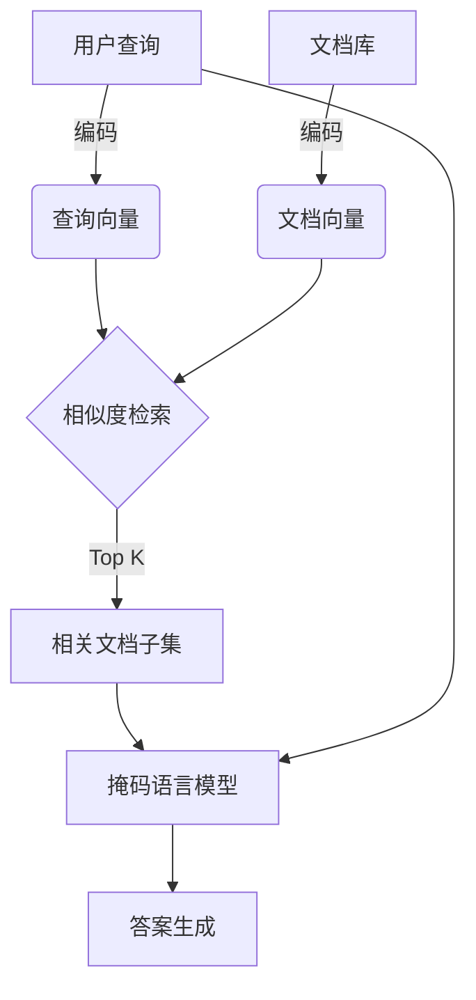

# 基于SimMIM的智能问答系统:高效率信息检索的新范式

## 1. 背景介绍

### 1.1 信息时代的挑战

在当今信息爆炸的时代,海量的数据资源使得高效地获取所需信息成为一个巨大的挑战。传统的信息检索方法,如基于关键词搜索的搜索引擎,往往会返回大量无关或者低质量的结果,导致信息过载和低效率。因此,开发一种能够准确理解用户查询意图并快速返回高质量结果的智能问答系统变得越来越重要。

### 1.2 问答系统的发展历程

问答系统的发展经历了几个主要阶段:

1. **基于规则的系统**: 早期的问答系统主要依赖于人工编写的规则和模板,缺乏灵活性和可扩展性。

2. **基于信息检索的系统**: 这类系统利用关键词匹配和排名算法从海量数据中检索相关信息,但无法深入理解问题的语义。

3. **基于机器学习的系统**: 随着深度学习技术的兴起,问答系统开始利用神经网络模型来理解自然语言并生成答案。

4. **基于大型语言模型的系统**: 最新的问答系统基于大型预训练语言模型(如GPT-3、PaLM等),能够在海量无标注数据上进行训练,展现出强大的自然语言理解和生成能力。

### 1.3 SimMIM介绍

SimMIM(Similarity-guided Masked Language Model)是一种新型的大型语言模型,专门设计用于构建高效率的智能问答系统。它结合了掩码语言模型(Masked Language Model)和相似度检索(Similarity Search)的优势,能够在海量数据中快速检索相关信息,并基于上下文生成高质量的答案。SimMIM的核心创新在于引入了一种新的相似度引导机制,使模型能够更好地关注与查询相关的信息,从而大幅提高了检索效率和答案质量。

## 2. 核心概念与联系

### 2.1 掩码语言模型(Masked Language Model)

掩码语言模型是一种自监督学习任务,旨在预测被掩码(masked)的单词。给定一个句子,模型需要根据上下文推断出被掩码单词的正确标签。这种任务迫使模型学习理解自然语言的语义和上下文信息。

掩码语言模型在BERT等transformer模型中被广泛应用,并取得了显著的成功。它们能够在大规模无标注数据上进行预训练,获得强大的语言理解能力,为下游任务(如问答、文本分类等)提供有力的语义表示。

### 2.2 相似度检索(Similarity Search)

相似度检索是一种基于向量相似度来快速查找相关信息的技术。它将文本映射到一个密集的向量空间中,然后通过计算向量之间的相似度(如余弦相似度)来确定相关性。

相似度检索在信息检索和推荐系统中发挥着关键作用。与传统的基于关键词的搜索相比,它能够更好地捕捉语义相似性,从而提高检索的准确性和召回率。常见的相似度检索技术包括局部敏感哈希(Locality Sensitive Hashing)、近似最近邻搜索(Approximate Nearest Neighbor Search)等。

### 2.3 SimMIM:结合掩码语言模型和相似度检索

SimMIM将掩码语言模型和相似度检索的优势结合起来,形成了一种新颖的问答系统架构。它的核心思想是:

1. 利用掩码语言模型对查询和文档进行编码,生成语义向量表示。
2. 在文档向量空间中进行相似度检索,快速找到与查询最相关的文档子集。
3. 基于检索到的相关文档,结合查询的上下文信息,通过掩码语言模型生成高质量的答案。

这种架构能够充分利用大型语言模型的语义理解能力,同时通过相似度检索大幅提高了检索效率,实现了高效率的智能问答。

## 3. 核心算法原理具体操作步骤

SimMIM的核心算法可以分为以下几个主要步骤:

### 3.1 向量编码

首先,我们需要将查询和文档映射到一个共享的向量空间中。这通常是通过一个预训练的掩码语言模型(如BERT、RoBERTa等)来实现的。

给定一个查询 $q$ 和一个文档 $d$,我们使用掩码语言模型的编码器(Encoder)来生成它们的向量表示 $\vec{q}$ 和 $\vec{d}$:

$$\vec{q} = \text{Encoder}(q)$$
$$\vec{d} = \text{Encoder}(d)$$

这些向量捕捉了查询和文档的语义信息,并且位于同一个向量空间中,因此我们可以计算它们之间的相似度。

### 3.2 相似度检索

接下来,我们在文档向量空间中进行相似度检索,以找到与查询最相关的文档子集。这可以通过多种技术来实现,如局部敏感哈希(Locality Sensitive Hashing)、近似最近邻搜索(Approximate Nearest Neighbor Search)等。

给定查询向量 $\vec{q}$ 和文档向量集合 $\{\vec{d}_1, \vec{d}_2, \dots, \vec{d}_N\}$,我们计算每个文档向量与查询向量之间的相似度分数:

$$s_i = \text{sim}(\vec{q}, \vec{d}_i)$$

其中 $\text{sim}(\cdot, \cdot)$ 可以是余弦相似度或其他相似度度量。

然后,我们选择具有最高相似度分数的 Top K 个文档,作为相关文档子集 $\mathcal{D}_\text{rel}$:

$$\mathcal{D}_\text{rel} = \text{TopK}(\{(\vec{d}_i, s_i)\}_{i=1}^N, K)$$

这种相似度检索过程能够极大地减少需要处理的文档数量,从而提高了检索效率。

### 3.3 答案生成

最后一步是利用检索到的相关文档子集 $\mathcal{D}_\text{rel}$ 和原始查询 $q$,通过掩码语言模型生成高质量的答案。

我们将查询 $q$ 和相关文档 $\mathcal{D}_\text{rel}$ 连接成一个序列,并使用掩码语言模型的解码器(Decoder)来生成答案 $a$:

$$a = \text{Decoder}([q, \mathcal{D}_\text{rel}])$$

解码器能够综合利用查询和相关文档的上下文信息,生成与查询高度相关的自然语言答案。

通过将相似度检索和掩码语言模型相结合,SimMIM实现了高效率的智能问答,既能快速检索相关信息,又能生成高质量的答案。

## 4. 数学模型和公式详细讲解举例说明

在SimMIM中,向量相似度计算和相似度检索是两个关键的数学模型。下面我们将详细讲解它们的原理和公式。

### 4.1 向量相似度

向量相似度用于衡量两个向量之间的相似程度。在SimMIM中,我们主要使用余弦相似度来计算查询向量和文档向量之间的相似度。

给定两个向量 $\vec{a}$ 和 $\vec{b}$,它们的余弦相似度定义为:

$$\text{sim}_\text{cos}(\vec{a}, \vec{b}) = \frac{\vec{a} \cdot \vec{b}}{\|\vec{a}\| \|\vec{b}\|}$$

其中 $\vec{a} \cdot \vec{b}$ 表示两个向量的点积,而 $\|\vec{a}\|$ 和 $\|\vec{b}\|$ 分别表示它们的L2范数(也称为欧几里得长度)。

余弦相似度的值域为 $[-1, 1]$,当两个向量的方向完全一致时,余弦相似度为1;当两个向量完全垂直时,余弦相似度为0;当两个向量方向完全相反时,余弦相似度为-1。

在SimMIM中,我们计算查询向量 $\vec{q}$ 与每个文档向量 $\vec{d}_i$ 的余弦相似度,并根据相似度分数排序,选择最相关的文档子集。

例如,假设我们有一个查询向量 $\vec{q} = [0.2, 0.5, 0.3]$,以及两个文档向量 $\vec{d}_1 = [0.1, 0.6, 0.2]$ 和 $\vec{d}_2 = [0.7, 0.1, -0.1]$,我们可以计算它们的余弦相似度:

$$\begin{aligned}
\text{sim}_\text{cos}(\vec{q}, \vec{d}_1) &= \frac{0.2 \times 0.1 + 0.5 \times 0.6 + 0.3 \times 0.2}{\sqrt{0.2^2 + 0.5^2 + 0.3^2} \sqrt{0.1^2 + 0.6^2 + 0.2^2}} \\
&\approx 0.9487
\end{aligned}$$

$$\begin{aligned}
\text{sim}_\text{cos}(\vec{q}, \vec{d}_2) &= \frac{0.2 \times 0.7 + 0.5 \times 0.1 + 0.3 \times (-0.1)}{\sqrt{0.2^2 + 0.5^2 + 0.3^2} \sqrt{0.7^2 + 0.1^2 + (-0.1)^2}} \\
&\approx 0.2975
\end{aligned}$$

由于 $\vec{d}_1$ 与 $\vec{q}$ 的余弦相似度更高,因此我们会将 $\vec{d}_1$ 视为与查询更相关的文档。

### 4.2 近似最近邻搜索

在SimMIM中,我们需要在海量文档向量中快速找到与查询向量最相似的 Top K 个向量。这个问题可以转化为一个经典的近似最近邻搜索(Approximate Nearest Neighbor Search)问题。

精确的最近邻搜索在高维空间中计算复杂度很高,因此我们通常使用近似算法来加速搜索过程,以牺牲一定的精确度换取更高的效率。

一种常用的近似最近邻搜索算法是局部敏感哈希(Locality Sensitive Hashing, LSH)。LSH的核心思想是将相似的向量映射到相同的哈希桶中,从而将最近邻搜索转化为哈希表查找。

具体来说,LSH使用一组哈希函数族 $\mathcal{H} = \{h: \mathbb{R}^d \rightarrow \mathbb{Z}\}$,其中每个哈希函数 $h$ 都满足局部敏感性:

$$\Pr[h(\vec{x}) = h(\vec{y})] = \text{sim}(\vec{x}, \vec{y})$$

也就是说,相似的向量有更高的概率被映射到相同的哈希值。

我们可以使用多个哈希函数构建多个哈希表,然后在这些哈希表中进行查找,以找到与查询向量最相似的候选向量。具体的算法步骤如下:

1. 对于每个数据向量 $\vec{x}$,计算 $L$ 个哈希值 $g_1(\vec{x}), g_2(\vec{x}), \dots, g_L(\vec{x})$,其中每个 $g_i$ 是由 $k$ 个哈希函数组成的组合哈希函数。
2. 使用这 $L$ 个哈希值将 $\vec{x}$ 插入到 $L$ 个不同的哈希表中。
3. 对于查询向量 $\vec{q}$,同样计算 $L$ 个哈希值,并在对应的哈希表中查找候选向量。
4. 计算查询向量与候选向量之间的真实距离,并返回距离最近的 Top K 个向量。

通过调节哈希函数的数量 $L$ 和每个组合哈希函数中哈希函数的数量 $k$,我们可以在精确度和效率之间进行权衡。

LSH 算法能够在 $O(Dn^{1/(1+\epsilon)})$ 的时间复杂