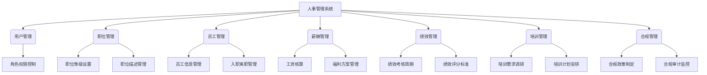
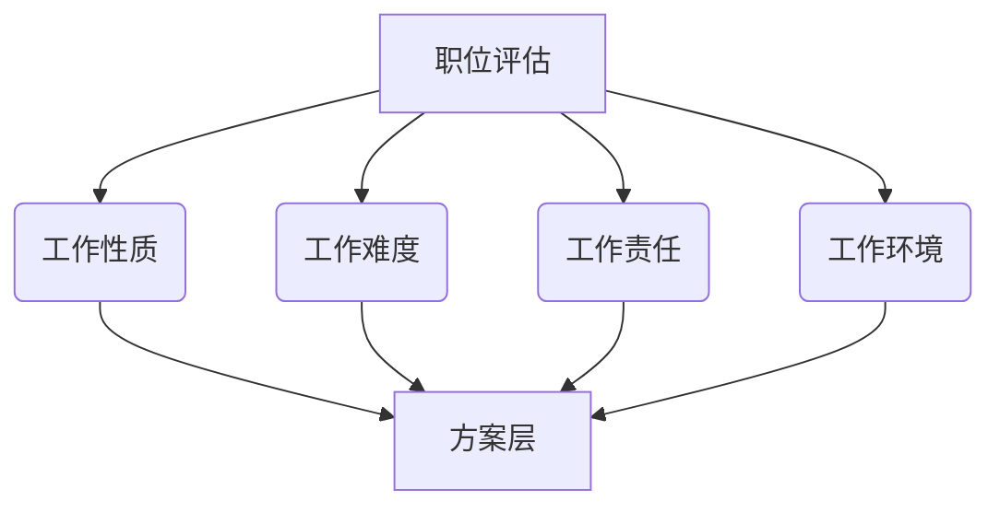

# 基于SSM的人事管理系统

## 1.背景介绍

在当今快节奏的商业环境中,人力资源管理已成为企业发展的关键支柱。有效的人事管理系统不仅能够优化人力资本配置,提高工作效率,更能为企业的长期发展打下坚实基础。随着信息技术的不断进步,传统的人事管理模式已难以满足现代企业的需求,构建一套基于互联网的人事管理信息系统(HRIS)成为了企业的当务之急。

SSM(Spring+SpringMVC+MyBatis)作为一种流行的JavaEE开发模式,凭借其高度解耦、轻量级、易于测试等优势,成为开发人事管理系统的不二之选。本文将全面介绍基于SSM架构的人事管理系统的设计与实现,为读者提供一个完整的解决方案。

### 1.1 人事管理系统的重要性

人事管理系统作为企业信息化建设的重要组成部分,其主要职责包括:

- 人力资源规划与配置
- 员工招聘与入职管理 
- 绩效考核与薪酬管理
- 培训发展与职业规划
- 劳动关系与合规管理

高效的人事管理系统不仅能够提升企业的运营效率,更能促进人力资本的持续优化,为企业注入源源不断的发展动力。

### 1.2 传统人事管理模式的缺陷

在信息化浪潮到来之前,大多数企业采用的是基于纸质文件的人事管理模式,存在以下明显缺陷:

- 信息孤岛,数据难以共享
- 工作效率低下,人力成本高昂
- 数据安全性和可靠性无法保证
- 缺乏实时监控和决策支持能力

这些问题的存在严重制约了企业的发展,因此构建基于互联网的人事管理信息化系统势在必行。

### 1.3 基于SSM架构的人事管理系统优势

相较于传统模式,基于SSM架构的人事管理系统具有以下显著优势:

- 信息集成共享,提高工作效率
- 实现流程自动化,降低人力成本
- 数据安全可靠,满足合规要求
- 实时监控与决策支持能力强

同时,SSM本身所具备的技术优势也为系统的开发和维护带来了诸多便利,例如:

- 高度解耦,有利于代码重用
- 轻量级框架,易于集成和部署
- 大量社区资源支持,学习成本低

综上所述,基于SSM架构的人事管理系统无疑是现代企业信息化建设的不二之选。

## 2.核心概念与联系

在深入探讨系统的设计与实现之前,我们有必要先了解一些核心概念及其相互关系,为后续的讨论奠定基础。

上图展示了人事管理系统的核心功能模块及其内部关系。我们可以看到,系统主要包括以下几个核心概念:

- **用户管理**:负责管理系统的用户账号、角色权限等,是系统安全运行的基础。
- **职位管理**:定义企业内部的职位等级和职位描述,为员工招聘和职业发展提供依据。
- **员工管理**:记录员工的基本信息、入职离职情况等,是人力资源管理的核心。
- **薪酬管理**:负责员工工资的核算和福利方案的制定,关系到员工的切身利益。
- **绩效管理**:设置绩效考核周期和评分标准,为员工职业发展提供参考依据。
- **培训管理**:调研培训需求并安排培训计划,促进员工的持续学习和成长。
- **合规管理**:制定合规政策并开展审计监控,确保企业人力资源管理合法合规。

这些核心概念相互关联、环环相扣,共同构成了一个完整的人事管理体系。只有充分理解它们的内涵及联系,才能真正掌握系统的设计思路和实现细节。

## 3.核心算法原理具体操作步骤

在人事管理系统中,有一些核心算法原理值得我们重点关注,例如用户身份认证、职位评估、薪酬核算和绩效评分等。下面我们将详细介绍其中的一个核心算法——基于AHP的职位评估算法。

### 3.1 AHP层次分析法简介

AHP(Analytic Hierarchy Process,层次分析法)是一种将复杂问题按层次分解,并通过数学模型进行定量分析的决策方法。它主要包括以下几个步骤:

1. 建立层次结构模型
2. 构造判断矩阵
3. 层次单排序及一致性检验
4. 层次总排序及组合权重计算

### 3.2 在职位评估中的应用

在人事管理系统中,我们可以利用AHP方法对企业内部的职位进行科学评估,为职位等级设置和薪酬分配提供依据。具体步骤如下:

#### 步骤1:建立层次结构模型

我们将职位评估问题分解为目标层、准则层和方案层三个层次,如下所示:

其中,准则层包括"工作性质"、"工作难度"、"工作责任"和"工作环境"四个评估指标,方案层则是需要评估的具体职位。

#### 步骤2:构造判断矩阵

接下来,我们需要构造各层次的判断矩阵。以准则层为例,通过专家评审或其他方式,给出各准则之间的相对重要性比较判断,并将其转化为数值,形成如下判断矩阵:

$$
A=\begin{bmatrix}
1 & 3 & 5 & 7\\
1/3 & 1 & 3 & 5\\
1/5 & 1/3 & 1 & 3\\
1/7 & 1/5 & 1/3 & 1
\end{bmatrix}
$$

其中,矩阵元素$a_{ij}$表示准则$i$相对于准则$j$的重要程度。

#### 步骤3:层次单排序及一致性检验

对于每个判断矩阵,我们需要计算其特征值和特征向量,并进行一致性检验。具体做法是:

1. 计算判断矩阵的最大特征值$\lambda_{max}$
2. 计算一致性指标$CI=(\lambda_{max}-n)/(n-1)$,其中$n$为矩阵阶数
3. 查表获取相应的平均随机一致性指标$RI$
4. 计算一致性比率$CR=CI/RI$,若$CR<0.1$,则判断矩阵通过一致性检验

通过上述步骤,我们可以得到各准则的权重向量$W=(w_1,w_2,\cdots,w_n)^T$,即准则层的单排序结果。

#### 步骤4:层次总排序及组合权重计算

最后,我们需要计算出各职位方案的综合权重,作为最终的评估结果。计算公式如下:

$$
W_i=\sum_{j=1}^{n}w_j\cdot w_{ij}
$$

其中,$W_i$表示第$i$个职位方案的综合权重,$w_j$为第$j$个准则的权重,$w_{ij}$为第$i$个职位方案在第$j$个准则下的权重。

通过以上步骤,我们就可以科学、合理地对企业内部的职位进行评估,为后续的职位等级设置和薪酬分配提供重要参考。

## 4.数学模型和公式详细讲解举例说明

在上一节中,我们介绍了AHP层次分析法在职位评估中的应用,其中涉及到了一些数学模型和公式。现在,我们将进一步详细讲解这些数学知识,并结合具体例子加深理解。

### 4.1 判断矩阵的构造

在AHP方法中,我们需要构造各层次的判断矩阵。判断矩阵是一种反映多个评估对象之间相对重要性的矩阵,其元素取值范围通常为1-9及其倒数。具体的取值意义如下:

- 1:两个评估对象同等重要
- 3:一个评估对象比另一个稍微重要
- 5:一个评估对象比另一个明显重要
- 7:一个评估对象比另一个极其重要
- 9:一个评估对象比另一个绝对重要
- 2,4,6,8:介于相邻判断之间的中间值
- 倒数:用于表示相反的重要性判断

例如,在职位评估的准则层,我们可以构造如下判断矩阵:

$$
A=\begin{bmatrix}
1 & 3 & 5 & 7\\
1/3 & 1 & 3 & 5\\
1/5 & 1/3 & 1 & 3\\
1/7 & 1/5 & 1/3 & 1
\end{bmatrix}
$$

该矩阵表示:工作性质比工作难度重要3倍,比工作责任重要5倍,比工作环境重要7倍;工作难度比工作责任重要3倍,比工作环境重要5倍;工作责任比工作环境重要3倍。

### 4.2 一致性检验

由于人的主观判断存在一定的不确定性,因此构造的判断矩阵可能存在一定的不一致性。AHP方法要求对判断矩阵进行一致性检验,以保证评估结果的可靠性。

一致性检验的步骤如下:

1. 计算判断矩阵的最大特征值$\lambda_{max}$
2. 计算一致性指标$CI=(\lambda_{max}-n)/(n-1)$,其中$n$为矩阵阶数
3. 查表获取相应的平均随机一致性指标$RI$
4. 计算一致性比率$CR=CI/RI$,若$CR<0.1$,则判断矩阵通过一致性检验

例如,对于上述判断矩阵$A$,我们可以计算得到$\lambda_{max}=4.1682,CI=0.0561,RI=0.9,CR=0.0623<0.1$,因此该矩阵通过了一致性检验。

### 4.3 层次单排序及权重计算

通过一致性检验后,我们可以计算出各准则的权重向量,即进行层次单排序。具体做法是:

1. 将判断矩阵的每一列元素相加,得到列和
2. 将每个元素除以对应的列和,得到归一化矩阵
3. 计算归一化矩阵每一行元素的平均值,即为对应准则的权重

例如,对于上述判断矩阵$A$,我们可以计算得到权重向量$W=(0.5492,0.2776,0.1294,0.0438)^T$,即工作性质、工作难度、工作责任和工作环境的权重分别为0.5492、0.2776、0.1294和0.0438。

### 4.4 层次总排序及组合权重计算

最后,我们需要计算出各职位方案的综合权重,作为最终的评估结果。计算公式如下:

$$
W_i=\sum_{j=1}^{n}w_j\cdot w_{ij}
$$

其中,$W_i$表示第$i$个职位方案的综合权重,$w_j$为第$j$个准则的权重,$w_{ij}$为第$i$个职位方案在第$j$个准则下的权重。

假设我们有三个职位方案A、B和C,在各准则下的权重分别