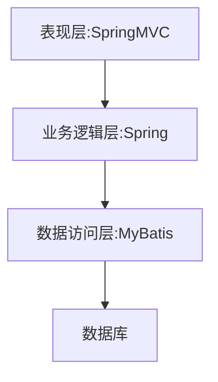
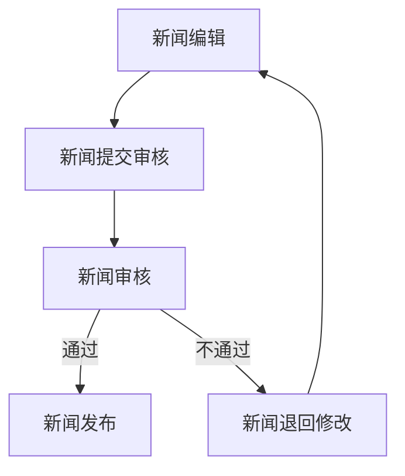

# 基于SSM的新闻发布系统

## 1.背景介绍

### 1.1 新闻发布系统概述

在当今信息时代,新闻媒体发挥着重要的舆论引导和社会监督作用。随着互联网技术的飞速发展,传统的新闻发布方式已经无法满足现代社会对新闻传播的高效性和实时性的需求。因此,构建一个基于Web的新闻发布系统,实现新闻的在线编辑、审核、发布和管理,成为了新闻媒体提高工作效率、扩大受众覆盖面的迫切需求。

### 1.2 SSM框架介绍

SSM框架是指Spring+SpringMVC+MyBatis这种分层架构,它将应用程序划分为表现层、业务逻辑层和数据访问层三个部分。Spring负责业务逻辑层和数据访问层的开发,SpringMVC负责表现层的开发,MyBatis则提供了数据访问层的实现。SSM框架具有开发效率高、可维护性好、易于测试等优点,非常适合用于构建企业级Web应用。

### 1.3 系统目标

本文介绍了一个基于SSM框架的新闻发布系统,旨在实现以下主要功能:

- 新闻的在线编辑和审核
- 新闻的分类管理
- 新闻的发布和展示
- 用户注册、登录和权限管理
- 新闻评论和互动

该系统的设计目标是提供一个安全、高效、易用的新闻发布和管理平台,满足新闻媒体的日常工作需求。

## 2.核心概念与联系

### 2.1 系统架构

基于SSM的新闻发布系统采用了经典的三层架构模式,将系统划分为表现层、业务逻辑层和数据访问层。各层之间通过接口和实现类进行交互,实现了低耦合、高内聚的设计。



- 表现层(View):使用SpringMVC框架,负责接收客户端请求,进行数据校验,调用业务逻辑层处理业务,并将结果响应给客户端。
- 业务逻辑层(Controller):使用Spring框架,负责处理具体的业务逻辑,如新闻发布、审核、查询等,并对数据进行加工处理。
- 数据访问层(Model):使用MyBatis框架,负责与数据库进行交互,执行增删改查等操作。

### 2.2 核心模块

新闻发布系统主要包括以下几个核心模块:

1. **用户模块**: 实现用户注册、登录、权限管理等功能。
2. **新闻模块**: 包括新闻的编辑、审核、发布、查询、分类管理等功能。
3. **评论模块**: 实现新闻评论和互动功能。
4. **系统管理模块**: 提供系统配置、日志管理等功能。

各个模块之间通过接口和实现类进行交互,形成一个完整的新闻发布和管理系统。

## 3.核心算法原理具体操作步骤

### 3.1 新闻发布流程

新闻发布流程是新闻发布系统的核心部分,包括以下几个主要步骤:



1. **新闻编辑**: 新闻编辑人员在系统中创建新闻,编写新闻标题、内容、插入图片等。
2. **新闻提交审核**: 编辑完成后,新闻编辑人员将新闻提交给审核人员进行审核。
3. **新闻审核**: 审核人员对新闻内容进行审核,确保新闻内容符合相关规范和要求。
4. **新闻发布**: 如果新闻通过审核,则将其发布到系统的新闻展示页面,供用户浏览。
5. **新闻退回修改**: 如果新闻未通过审核,则将其退回给编辑人员进行修改,重新进入编辑流程。

该流程通过分工合作和审核机制,确保了新闻内容的质量和准确性。

### 3.2 新闻查询算法

为了提高新闻查询的效率,系统采用了基于关键词的索引查询算法。具体步骤如下:

1. **建立倒排索引**: 在新闻入库时,系统会对新闻标题和内容进行分词,建立倒排索引。倒排索引是一种由词及其出现位置组成的索引结构。
2. **查询解析**: 当用户输入查询关键词时,系统会对关键词进行分词和归一化处理。
3. **索引查找**: 系统根据分词结果在倒排索引中查找匹配的新闻文档。
4. **相关性计算**: 系统根据关键词在新闻中出现的频率、位置等因素,计算新闻与查询的相关性得分。
5. **结果排序**: 将查询结果按照相关性得分从高到低排序,返回给用户。

该算法可以快速从海量新闻数据中找到与查询关键词最相关的新闻,提高了查询效率和用户体验。

## 4.数学模型和公式详细讲解举例说明

### 4.1 新闻相关性计算模型

在新闻查询过程中,系统需要计算每篇新闻与查询关键词的相关性得分,以确定排序结果。常用的相关性计算模型有TF-IDF(Term Frequency-Inverse Document Frequency)模型和BM25(Okapi Best Matching)模型。

#### 4.1.1 TF-IDF模型

TF-IDF模型是一种基于统计学的加权技术,用于评估一个词对于一个文档集或一个语料库中的其他文档的重要程度。TF-IDF由两部分组成:

- **词频(Term Frequency, TF)**: 该词在当前文档中出现的频率。
- **逆向文档频率(Inverse Document Frequency, IDF)**: 该词在整个文档集中的普遍重要程度。

TF-IDF的计算公式如下:

$$
\mathrm{tfidf}(t, d, D) = \mathrm{tf}(t, d) \times \mathrm{idf}(t, D)
$$

其中:

- $\mathrm{tf}(t, d)$ 表示词 $t$ 在文档 $d$ 中的词频
- $\mathrm{idf}(t, D)$ 表示词 $t$ 在文档集 $D$ 中的逆向文档频率

词频 $\mathrm{tf}(t, d)$ 可以使用不同的计算方式,如原始计数、二进制计数、对数计数等。逆向文档频率 $\mathrm{idf}(t, D)$ 的计算公式如下:

$$
\mathrm{idf}(t, D) = \log \frac{N}{|\{d \in D : t \in d\}|}
$$

其中 $N$ 表示文档集 $D$ 中文档的总数,分母表示包含词 $t$ 的文档数量。

在新闻查询中,可以将每篇新闻视为一个文档,查询关键词视为词项,计算每篇新闻与查询关键词的 TF-IDF 得分,作为相关性得分。

#### 4.1.2 BM25模型

BM25模型是一种改进的相关性计算模型,它考虑了文档长度对相关性的影响,可以更好地评估查询与文档之间的相关程度。BM25模型的计算公式如下:

$$
\mathrm{score}(D, Q) = \sum_{q \in Q} \mathrm{idf}(q) \cdot \frac{f(q, D) \cdot (k_1 + 1)}{f(q, D) + k_1 \cdot \left(1 - b + b \cdot \frac{|D|}{avgdl}\right)}
$$

其中:

- $\mathrm{idf}(q)$ 表示查询词 $q$ 的逆向文档频率
- $f(q, D)$ 表示查询词 $q$ 在文档 $D$ 中出现的词频
- $|D|$ 表示文档 $D$ 的长度
- $avgdl$ 表示文档集中所有文档的平均长度
- $k_1$ 和 $b$ 是两个调节参数,用于控制词频和文档长度对相关性的影响程度

BM25模型通过引入文档长度因子,可以更好地处理长文档和短文档之间的偏差,提高相关性计算的准确性。

在新闻查询系统中,可以根据具体需求选择合适的相关性计算模型,以获得更好的查询效果。

### 4.2 新闻分类模型

为了方便用户浏览和查找感兴趣的新闻,新闻发布系统需要对新闻进行分类管理。常见的新闻分类方法包括基于规则的分类和基于机器学习的分类。

#### 4.2.1 基于规则的分类

基于规则的分类是根据预定义的规则将新闻归类到相应的类别。规则可以是基于新闻标题、内容中的关键词、作者、发布时间等因素。例如,可以定义如下规则:

- 如果新闻标题或内容包含"足球"、"世界杯"等关键词,则归类为体育新闻。
- 如果新闻作者属于财经编辑部,则归类为财经新闻。
- 如果新闻发布时间在22:00之后,则归类为晚间新闻。

基于规则的分类具有实现简单、解释性强的优点,但需要人工定义规则,难以适应动态变化的新闻内容。

#### 4.2.2 基于机器学习的分类

基于机器学习的分类方法利用已标注的新闻数据,训练分类模型,然后对新的新闻进行自动分类。常用的机器学习算法包括朴素贝叶斯、支持向量机、决策树等。

以朴素贝叶斯分类器为例,其核心思想是基于贝叶斯定理计算新闻属于每个类别的概率,选择概率最大的类别作为分类结果。

设有 $K$ 个新闻类别 $C_1, C_2, \dots, C_K$,新闻文本 $X = (x_1, x_2, \dots, x_n)$ 由 $n$ 个特征词组成。根据贝叶斯定理,新闻 $X$ 属于类别 $C_k$ 的概率为:

$$
P(C_k | X) = \frac{P(X | C_k) P(C_k)}{P(X)}
$$

由于分母 $P(X)$ 对所有类别是相同的,可以忽略不计。因此,只需要计算 $P(X | C_k) P(C_k)$ 的值,选择最大值对应的类别作为分类结果。

$$
C^* = \arg\max_{C_k} P(X | C_k) P(C_k)
$$

其中,

- $P(C_k)$ 为类别 $C_k$ 的先验概率,可以从训练数据中估计得到。
- $P(X | C_k)$ 为新闻文本 $X$ 在已知类别 $C_k$ 的条件下出现的概率,根据特征词独立性假设,可以进一步分解为:

$$
P(X | C_k) = \prod_{i=1}^n P(x_i | C_k)
$$

- $P(x_i | C_k)$ 为特征词 $x_i$ 在类别 $C_k$ 中出现的概率,可以从训练数据中估计得到。

通过机器学习算法训练分类模型,可以自动发现新闻文本与类别之间的关联模式,实现高效、准确的新闻分类。

## 5.项目实践:代码实例和详细解释说明

### 5.1 系统架构和技术栈

本新闻发布系统采用 SSM (Spring + SpringMVC + MyBatis) 架构,前端使用 Bootstrap 框架进行页面开发,后端使用 Java 语言进行业务逻辑和数据访问层的开发。具体技术栈如下:

- 前端: HTML, CSS, JavaScript, Bootstrap
- 后端: Java, Spring, SpringMVC, MyBatis
- 数据库: MySQL
- 版本控制: Git
- 项目构建: Maven

### 5.2 核心模块代码示例

#### 5.2.1 新闻发布模块

```java
// NewsController.java
@Controller
@RequestMapping("/news")
public class NewsController {

    @Autowired
    private NewsService newsService;

    // 