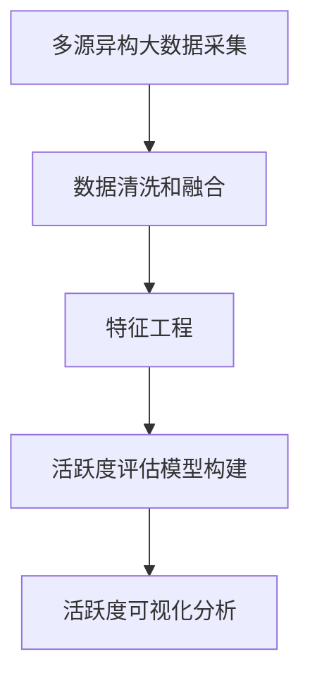

# 基于大数据的城市活跃度研究

## 1.背景介绍

随着城市化进程的不断推进,人口持续向城市集中,城市规模不断扩大。城市作为人类活动的主要载体,其活跃程度直接影响着城市的发展水平和居民的生活质量。因此,对城市活跃度进行科学评估和分析,对于城市规划、资源配置和公共服务提供具有重要意义。

传统的城市活跃度评估方法主要依赖于人口统计数据、经济数据等宏观指标,但这些数据往往滞后、不够精细,难以反映城市活跃度的动态变化。随着大数据技术的发展,通过对多源异构数据的融合分析,我们可以更加精准地刻画城市活跃度的全貌。

## 2.核心概念与联系

### 2.1 城市活跃度

城市活跃度是指城市中各类人类活动的频率和强度,包括经济活动、社会活动、文化活动等,反映了城市的发展活力和城市生活的丰富程度。高活跃度的城市,往往拥有活跃的经济、繁荣的商业、丰富的文化生活和良好的生活环境。

### 2.2 大数据

大数据是指无法使用传统数据库软件工具进行捕获、管理和处理的数据集合,具有海量、多样、高速等特点。大数据主要来源包括:

- 移动互联网数据:手机信令数据、移动APP使用数据等
- 互联网数据:网页浏览数据、搜索引擎数据、社交媒体数据等
- 物联网数据:传感器数据、视频监控数据等
- 政府和企业数据:人口普查数据、交通数据、金融数据等

### 2.3 大数据与城市活跃度分析

大数据为城市活跃度分析提供了丰富的数据源,同时大数据分析技术也为活跃度评估提供了有力工具。通过对多源异构大数据的融合分析,我们可以从多个维度全面刻画城市活跃度,包括:

- 人口流动活跃度:通过手机信令数据分析人口流动规律
- 经济活跃度:通过金融交易数据、电子商务数据分析经济活动水平
- 社会活跃度:通过社交媒体数据分析人际交往和社会活动
- 文化活跃度:通过网络浏览数据分析文化娱乐活动
- ...

## 3.核心算法原理具体操作步骤

基于大数据的城市活跃度分析主要包括以下几个核心步骤:



### 3.1 多源异构大数据采集

第一步是从各种渠道采集与城市活跃度相关的大数据,包括移动互联网数据、互联网数据、物联网数据、政府和企业数据等。这些数据来源异构、格式多样,需要使用分布式大数据采集框架进行高效获取。

### 3.2 数据清洗和融合  

由于原始大数据存在噪声、冗余、不一致等问题,需要进行数据清洗,包括去重、格式转换、缺失值处理等。然后将清洗后的多源数据进行融合,构建统一的城市活跃度数据集。

### 3.3 特征工程

从融合后的数据集中提取与城市活跃度相关的特征,如人口流量、消费水平、社交活跃度等,这些特征将作为活跃度评估模型的输入。特征工程是数据分析的关键环节,需要充分结合领域知识和数据分析经验。

### 3.4 活跃度评估模型构建

基于提取的特征,使用机器学习算法构建城市活跃度评估模型。常用的模型包括回归模型、决策树模型、神经网络模型等。模型训练需要使用标注的活跃度数据集,通过模型选择和调参,获得性能最优的评估模型。

### 3.5 活跃度可视化分析

将模型评估的城市活跃度结果进行数据可视化展示,直观反映不同城市、不同区域的活跃度水平,并结合其他数据分析城市活跃度的时空分布特征、影响因素等,为城市规划和公共决策提供依据。

## 4.数学模型和公式详细讲解举例说明

在城市活跃度评估模型中,常用的数学模型和公式包括:

### 4.1 回归模型

回归模型是将一个或多个自变量与因变量之间的关系用数学方程来描述,常用于活跃度评估。线性回归模型公式:

$$y = \beta_0 + \beta_1x_1 + \beta_2x_2 + ... + \beta_nx_n + \epsilon$$

其中$y$是因变量(活跃度),$x_1, x_2, ..., x_n$是自变量(特征),$\beta_0, \beta_1, ..., \beta_n$是模型参数,$\epsilon$是随机误差项。

例如,我们可以构建如下回归模型评估某城市的活跃度$y$:

$$y = 2.5 + 0.8x_1 + 1.2x_2 - 0.6x_3$$

其中$x_1$是人均消费水平,$x_2$是人口流量,$x_3$是空气质量指数。该模型表明,消费水平和人口流量对活跃度有正向影响,而空气质量对活跃度有负向影响。

### 4.2 决策树模型

决策树是一种常用的监督学习算法,通过不断划分特征空间将实例数据划分到不同的叶子节点,每个叶子节点对应一个活跃度值或区间。决策树模型可以很好地描述特征与活跃度之间的非线性关系,公式如下:

$$f(x) = \sum_{m=1}^M c_m \mathbb{I}(x \in R_m)$$

其中$x$是输入特征向量,$R_1, R_2, ..., R_M$是特征空间的划分区域,$c_m$是第$m$个区域对应的活跃度值,$\mathbb{I}$是示性函数。

例如,对于某个决策树模型,其预测公式为:

$$
f(x) = \begin{cases}
    5, & \text{if } x_1 > 10 \text{ and } x_2 < 20\\
    3, & \text{if } x_1 \leq 10 \text{ and } x_3 > 30\\
    2, & \text{otherwise}
\end{cases}
$$

其中$x_1$是人均收入,$x_2$是人口密度,$x_3$是绿化覆盖率。该模型将特征空间划分为三个区域,对应不同的活跃度值。

### 4.3 神经网络模型

神经网络是一种强大的机器学习模型,通过多层非线性变换拟合复杂的映射关系,常用于活跃度评估。一个典型的前馈神经网络模型公式为:

$$y = f_L(W_L \cdot f_{L-1}(W_{L-1} \cdot ... \cdot f_1(W_1 \cdot x + b_1) + b_{L-1}) + b_L)$$

其中$x$是输入特征向量,$y$是输出活跃度值,$W_i$和$b_i$分别是第$i$层的权重矩阵和偏置向量,$f_i$是第$i$层的非线性激活函数,如ReLU、Sigmoid等。

例如,我们可以构建一个三层神经网络模型评估活跃度:

$$
\begin{aligned}
h_1 &= \text{ReLU}(W_1 \cdot x + b_1)\\
h_2 &= \text{ReLU}(W_2 \cdot h_1 + b_2)\\
y &= \text{Sigmoid}(W_3 \cdot h_2 + b_3)
\end{aligned}
$$

该模型首先通过两层隐藏层提取高阶特征,最后通过Sigmoid函数将特征映射到(0,1)区间作为活跃度值。通过训练调整网络参数,可以学习到复杂的特征与活跃度之间的映射关系。

## 5.项目实践:代码实例和详细解释说明

为了更好地理解基于大数据的城市活跃度分析,我们将通过一个实际项目案例,展示具体的代码实现和运行效果。本项目使用Python编程语言和流行的数据科学库,如Pandas、Scikit-Learn、TensorFlow等。

### 5.1 数据采集和预处理

首先,我们从多个数据源采集与城市活跃度相关的数据,包括人口普查数据、手机信令数据、交通数据等。以手机信令数据为例,代码如下:

```python
import pandas as pd

# 读取手机信令数据
call_data = pd.read_csv('call_records.csv')

# 数据清洗
call_data = call_data.dropna(subset=['lon', 'lat'])  # 删除缺失经纬度的记录
call_data = call_data[call_data['duration'] > 0]  # 删除通话时长为0的记录

# 特征提取
call_data['hour'] = call_data['time'].dt.hour  # 提取通话时间(小时)作为特征
call_data['is_weekend'] = call_data['time'].dt.dayofweek.isin([5, 6])  # 提取是否为周末作为特征

# 保存清洗后的数据
call_data.to_parquet('call_data_cleaned.parquet')
```

上述代码首先读取原始手机信令数据,然后进行数据清洗,包括删除缺失值记录、无效记录。接着提取通话时间和是否为周末作为特征,最后将清洗后的数据保存为Parquet格式,方便后续分析使用。

### 5.2 特征工程

在特征工程阶段,我们将从多源数据集中提取与城市活跃度相关的特征,并进行特征选择和构造。以提取社交活跃度特征为例,代码如下:

```python
import pandas as pd
from sklearn.feature_extraction.text import TfidfVectorizer

# 读取社交媒体数据
social_data = pd.read_parquet('social_data.parquet')

# 提取文本特征
tfidf = TfidfVectorizer(max_features=1000, ngram_range=(1, 2))
social_data['text_features'] = tfidf.fit_transform(social_data['text'])

# 提取用户活跃度特征
social_data['post_count'] = social_data.groupby('user_id')['text'].transform('count')
social_data['friend_count'] = social_data.groupby('user_id')['friends'].transform('nunique')

# 保存特征数据
social_data[['user_id', 'text_features', 'post_count', 'friend_count']].to_parquet('social_features.parquet')
```

上述代码首先读取社交媒体数据,然后使用TF-IDF算法提取文本内容的特征向量。接着,通过分组统计每个用户的发帖数和好友数,作为用户活跃度的特征。最后,将提取的文本特征和活跃度特征保存为Parquet格式,供后续模型训练使用。

### 5.3 模型训练和评估

在特征工程完成后,我们可以使用机器学习算法训练活跃度评估模型。以训练一个随机森林回归模型为例,代码如下:

```python
import pandas as pd
from sklearn.ensemble import RandomForestRegressor
from sklearn.model_selection import train_test_split
from sklearn.metrics import mean_squared_error

# 读取特征数据和标签数据
features = pd.read_parquet('features.parquet')
labels = pd.read_csv('activity_labels.csv')
data = features.merge(labels, on='city_id')

# 划分训练集和测试集
X_train, X_test, y_train, y_test = train_test_split(data.drop('activity_score', axis=1), data['activity_score'], test_size=0.2)

# 训练随机森林回归模型
rf = RandomForestRegressor(n_estimators=100, random_state=42)
rf.fit(X_train, y_train)

# 评估模型性能
y_pred = rf.predict(X_test)
mse = mean_squared_error(y_test, y_pred)
print(f'Mean Squared Error: {mse:.2f}')
```

上述代码首先读取特征数据和活跃度标签数据,并将它们合并为一个数据框。然后使用`train_test_split`函数将数据划分为训练集和测试集。接着,使用scikit-learn库中的`RandomForestRegressor`类训练一个随机森林回归模型,并在测试集上评估模型的均方误差(MSE)性能指标。

通过调整模型超参数、{"msg_type":"generate_answer_finish","data":"","from_module":null,"from_unit":null}