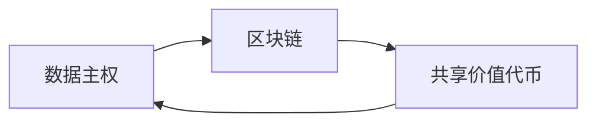

# 基于数据主权区块链的共享价值代币设计与流通方法

## 1. 背景介绍

### 1.1 数据主权与区块链技术的兴起

在数字化时代,数据已经成为一种新的生产要素和战略资源。然而,随着互联网巨头对数据的垄断和滥用,个人数据主权面临严峻挑战。区块链技术以其去中心化、不可篡改、安全透明等特性,为保护个人数据主权、实现数据价值流通提供了新的可能。

### 1.2 共享经济与代币激励模型

共享经济模式通过闲置资源的共享利用,提高了社会资源配置效率。代币激励模型通过发放代币奖励用户的贡献,激发用户参与热情,已在区块链项目中得到广泛应用。将共享经济与代币激励相结合,有望突破数据共享的瓶颈,实现数据价值流通。

### 1.3 研究目标与意义

本文旨在设计一种基于数据主权区块链的共享价值代币,并探讨其流通方法,以期为个人数据主权保护和数据价值流通提供新的思路和方案。这对于发展数字经济,构建信任社会具有重要意义。

## 2. 核心概念与联系

### 2.1 数据主权

数据主权是指个人对其数据的所有权、控制权和收益权。它强调个人数据的自主权,个人有权决定何时、如何以及与谁分享自己的数据,并从数据利用中获得收益。

### 2.2 区块链

区块链是一种去中心化的分布式账本技术,通过密码学原理构建信任,实现数据的不可篡改和可追溯。它为数据主权提供了技术基础,使得个人数据所有权得到保护,数据流通过程安全透明。

### 2.3 共享价值代币

共享价值代币是基于区块链发行的数字代币,用于激励用户共享数据、贡献算力等行为。它将用户的贡献与代币奖励挂钩,形成正向激励循环,促进数据共享和价值流通。

### 2.4 概念关系

数据主权是目标,区块链是手段,共享价值代币是激励机制。三者相互支撑,共同构成了本文的研究框架:



## 3. 核心算法原理与操作步骤

### 3.1 数据加密存储

为保护用户数据隐私,采用对称加密和非对称加密相结合的方式对数据进行加密存储。

1. 生成用户公私钥对
2. 用户用公钥对数据进行加密
3. 加密数据上链存储
4. 用户凭私钥解密访问数据

### 3.2 数据共享与授权

用户可自主决定数据的共享对象和权限,通过数据授权实现灵活的访问控制。

1. 用户发起数据共享请求
2. 指定共享对象和权限
3. 生成授权令牌
4. 共享对象凭令牌解密访问数据

### 3.3 价值量化与分配

根据数据类型、质量、共享频次等因素,对用户贡献的数据价值进行量化评估,并设计代币分配方案。

1. 制定数据定价规则
2. 记录用户数据共享行为
3. 定期统计数据贡献量 
4. 根据贡献量发放代币奖励

## 4. 数学模型与公式讲解

### 4.1 数据价值量化模型

设第 $i$ 个用户共享的第 $j$ 条数据为 $D_{ij}$,其数据类型为 $T_{ij}$,质量评分为 $Q_{ij}$,共享频次为 $F_{ij}$,则该数据的价值量化公式为:

$$V_{ij} = \alpha \cdot T_{ij} + \beta \cdot Q_{ij} + \gamma \cdot F_{ij}$$

其中,$\alpha$,$\beta$,$\gamma$ 为各因素的权重系数。

### 4.2 代币分配模型

设第 $i$ 个用户第 $k$ 个周期内的数据总贡献量为 $C_i^k$,该周期内所有用户的数据总贡献量为 $S^k$,区块链项目方发放的代币总量为 $M^k$,则该用户应获得的代币奖励为:

$$R_i^k = \frac{C_i^k}{S^k} \cdot M^k$$

该公式实现了代币奖励与用户贡献量成正比,体现了"多劳多得"原则。

举例说明:假设第1个用户在第1个周期内贡献了100条数据,第2个用户贡献了200条,总贡献量为300条。项目方发放1000枚代币,则两个用户分别获得:

$$R_1^1 = \frac{100}{300} \times 1000 = 333.33, R_2^1 = \frac{200}{300} \times 1000 = 666.67$$

## 5. 项目实践:代码实例与说明

下面以Solidity语言为例,展示核心智能合约的代码实现:

```solidity
pragma solidity ^0.8.0;

contract DataToken {
    mapping(address => uint256) public contributions;
    mapping(address => uint256) public balances;
    uint256 public totalContribution;
    uint256 public totalSupply;
    
    function contribute(uint256 value) public {
        contributions[msg.sender] += value;
        totalContribution += value;
    }
    
    function distribute(uint256 reward) public {
        for (address user : contributions.keys()) {
            uint256 amount = reward * contributions[user] / totalContribution;
            balances[user] += amount;
        }
        totalSupply += reward;
    }
}
```

- `contributions`映射记录每个用户的数据贡献量
- `balances`映射记录每个用户的代币余额
- `contribute`函数供用户报告数据贡献量
- `distribute`函数根据贡献量比例分配代币奖励

该合约实现了数据贡献量记录和代币奖励分配的基本逻辑,可根据需求进一步扩展和优化。

## 6. 实际应用场景

### 6.1 个人健康数据共享

用户可将自己的健康数据如体检报告、运动数据等进行加密上传,授权给医疗机构、保险公司等使用,获得代币奖励,同时享受个性化的健康服务。

### 6.2 交通出行数据共享

用户可共享自己的出行轨迹、交通方式等数据,供交通管理部门优化路网规划、拥堵预测等,获得代币奖励,同时改善自己的出行体验。

### 6.3 教育培训数据共享

用户可共享学习过程数据如学习时长、习题答题情况等,供在线教育平台进行个性化推荐、教学质量评估等,获得代币奖励,同时获得更优质的教育资源。

## 7. 工具与资源推荐

### 7.1 以太坊开发框架Truffle

Truffle是一个流行的以太坊开发框架,提供了编译、测试、部署等智能合约开发工具。

官网:https://www.trufflesuite.com/

### 7.2 区块链即服务平台 Bluzelle

Bluzelle是一个支持数据主权的区块链即服务平台,提供数据库和文件存储服务,方便用户快速搭建去中心化应用。

官网:https://bluzelle.com/

### 7.3 代币经济模型设计工具 Token Engineering

Token Engineering 是一个代币经济模型设计工具,帮助用户评估代币分配方案对系统的影响,优化激励机制。

官网:https://tokenengineering.net/

## 8. 总结:未来发展趋势与挑战

### 8.1 发展趋势

- 隐私计算技术与区块链的融合,实现数据可用不可见
- 人工智能与区块链的结合,实现数据价值的智能评估
- 跨链技术的发展,实现不同数据主权区块链之间的互操作

### 8.2 挑战

- 数据质量评估与反作弊机制有待完善
- 数据定价与代币发行规模的动态调整存在难度
- 与现有法律法规存在冲突,合规性有待探索

数据主权区块链和共享价值代币仍处于探索阶段,未来需要技术、经济、法律等多方合力,方能构建成熟的数据价值流通生态。

## 9. 附录:常见问题解答

### Q1:如何保证数据质量?

A:可从数据完整性、准确性、时效性等维度建立数据质量评估体系,剔除劣质数据,并对恶意提交虚假数据的行为进行惩罚,如扣除代币、降低信用等级等。

### Q2:代币的总量如何确定?

A:可综合考虑数据规模、用户数量、生态发展需求等因素确定代币总量,并设置一定的通胀率以激励持续贡献。同时,要建立代币回收销毁机制,避免代币过度增发导致贬值。

### Q3:如何与现有法律法规对接? 

A:要积极与监管机构沟通,在合规的前提下开展业务。可探索建立去中心化的分布式身份认证体系,实现用户实名制管理。对于敏感数据,要严格遵守数据隐私保护条例,如GDPR等。

作者:禅与计算机程序设计艺术 / Zen and the Art of Computer Programming