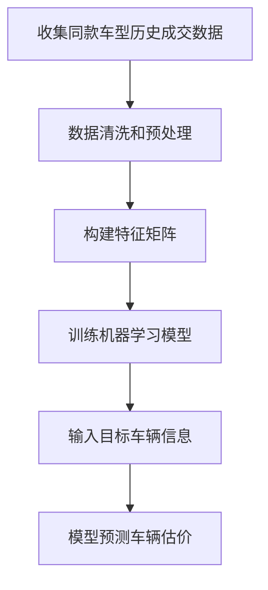
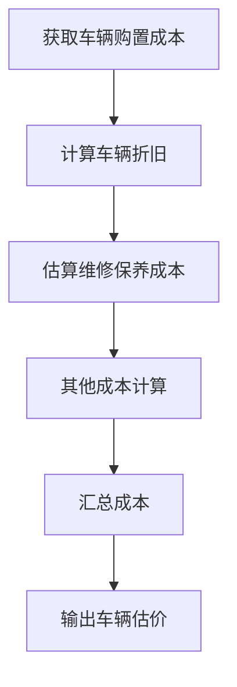
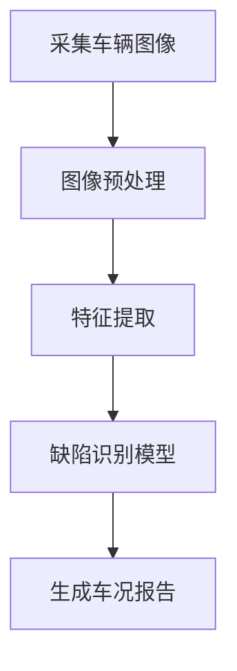
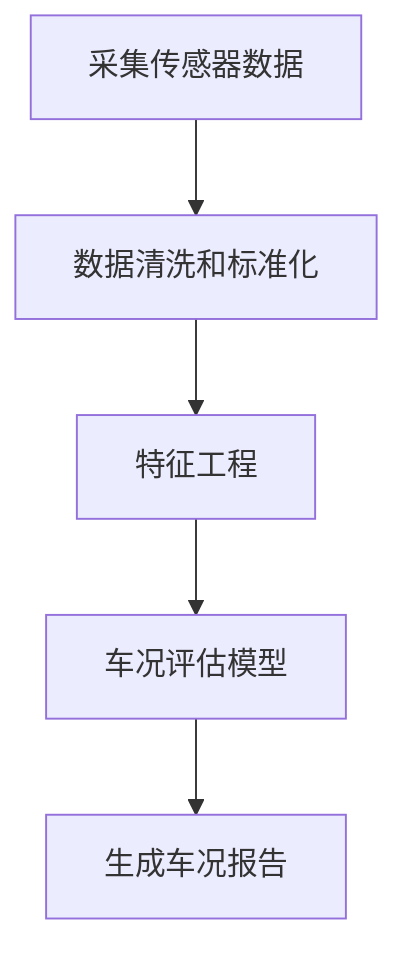

# 基于数据分析的大学生二手车交易系统

## 1.背景介绍

随着汽车保有量的不断增加,二手车交易市场也在不断扩大。大学生作为一个特殊群体,由于经济实力有限,购买二手车成为一种较为经济实惠的出行选择。然而,由于信息不对称和缺乏专业知识,大学生在二手车交易过程中面临诸多风险和挑战。

传统的二手车交易平台存在一些不足,例如信息不透明、缺乏数据支持等,给大学生二手车交易带来诸多不便。因此,构建一个基于数据分析的大学生二手车交易系统,可以更好地满足大学生的需求,提高交易效率和安全性。

## 2.核心概念与联系

### 2.1 数据分析

数据分析是从海量数据中提取有价值信息的过程,包括数据采集、存储、处理、分析和可视化等环节。在二手车交易系统中,数据分析可以为用户提供更准确的车辆估价、更可靠的车况评估等服务。

### 2.2 二手车交易系统

二手车交易系统是一个线上平台,旨在为买家和卖家提供安全、高效的二手车交易服务。该系统通常包括车辆信息展示、在线交易、支付和物流等模块。

### 2.3 大学生群体特征

大学生群体具有一些独特的特征,如经济实力有限、对新技术接受度高、对个性化需求强烈等。因此,针对大学生群体设计的二手车交易系统需要考虑这些特点,提供更加贴合需求的服务。

## 3.核心算法原理具体操作步骤

### 3.1 车辆估价算法

车辆估价是二手车交易系统的核心功能之一。常见的估价算法包括:

1. **基于市场数据的估价算法**

该算法通过分析同款车型在市场上的实际成交价格,结合车龄、里程等因素,计算出目标车辆的估价。具体步骤如下:



2. **基于成本模型的估价算法**

该算法根据车辆购置成本、折旧、维修等因素,计算出车辆的估价。具体步骤如下:



### 3.2 车况评估算法

车况评估对于二手车交易至关重要。常见的车况评估算法包括:

1. **基于图像识别的车况评估算法**

该算法通过对车辆图像进行处理和分析,识别出车身划痕、凹陷等缺陷,并给出车况评分。具体步骤如下:



2. **基于传感器数据的车况评估算法**

该算法利用安装在车辆上的各种传感器(如OBD诊断接口)采集的数据,评估发动机、底盘等部件的工作状态,从而得出车况评分。具体步骤如下:



## 4.数学模型和公式详细讲解举例说明

### 4.1 车辆估价模型

对于基于市场数据的估价算法,我们可以使用线性回归或其他机器学习模型来预测车辆价格。假设我们有 $n$ 个样本,每个样本有 $p$ 个特征,我们可以构建如下线性回归模型:

$$y = X\beta + \epsilon$$

其中:
- $y$ 是 $n \times 1$ 的目标变量(车辆价格)向量
- $X$ 是 $n \times (p+1)$ 的特征矩阵,第一列为常数项
- $\beta$ 是 $(p+1) \times 1$ 的系数向量
- $\epsilon$ 是 $n \times 1$ 的误差项向量

我们的目标是找到最小化残差平方和的 $\beta$ 值:

$$\hat{\beta} = \arg\min_\beta \sum_{i=1}^n (y_i - x_i^T\beta)^2$$

对于线性回归模型,我们可以使用普通最小二乘法(OLS)或梯度下降法等方法求解 $\hat{\beta}$。

### 4.2 车况评估模型

对于基于图像识别的车况评估算法,我们可以使用卷积神经网络(CNN)等深度学习模型。假设我们有一个包含 $C$ 个通道的输入图像 $X \in \mathbb{R}^{H \times W \times C}$,我们希望得到一个标量输出 $y \in \mathbb{R}$,表示车况评分。

我们可以构建一个包含多个卷积层、池化层和全连接层的CNN模型,其中卷积层用于提取图像特征,池化层用于降低特征维度,全连接层用于将特征映射到输出空间。

对于第 $l$ 层卷积层,我们有:

$$X^{(l)} = f(W^{(l)} * X^{(l-1)} + b^{(l)})$$

其中:
- $X^{(l)}$ 是第 $l$ 层的输出特征图
- $W^{(l)}$ 是第 $l$ 层的卷积核权重
- $b^{(l)}$ 是第 $l$ 层的偏置项
- $f$ 是非线性激活函数,如ReLU

通过反向传播算法,我们可以学习模型参数 $W$ 和 $b$,使得模型在训练数据上的损失函数最小化。

## 5.项目实践:代码实例和详细解释说明

### 5.1 车辆估价模型实现

以下是使用Python和scikit-learn库实现线性回归车辆估价模型的示例代码:

```python
import pandas as pd
from sklearn.linear_model import LinearRegression
from sklearn.model_selection import train_test_split

# 加载数据
data = pd.read_csv('car_data.csv')

# 特征工程
X = data[['age', 'mileage', 'brand', ...]]
y = data['price']

# 数据分割
X_train, X_test, y_train, y_test = train_test_split(X, y, test_size=0.2, random_state=42)

# 训练模型
model = LinearRegression()
model.fit(X_train, y_train)

# 评估模型
score = model.score(X_test, y_test)
print(f'Model R-squared: {score}')

# 预测新车辆价格
new_car = [[5, 50000, 'Brand A', ...]]
predicted_price = model.predict(new_car)
print(f'Predicted price: {predicted_price[0]}')
```

在这个示例中,我们首先加载包含车辆特征和价格的数据集。然后,我们进行特征工程,选择相关特征作为模型输入。接下来,我们将数据分为训练集和测试集。

使用`LinearRegression`类训练线性回归模型,并在测试集上评估模型性能。最后,我们可以使用训练好的模型预测新车辆的价格。

### 5.2 车况评估模型实现

以下是使用Python和PyTorch库实现基于CNN的车况评估模型的示例代码:

```python
import torch
import torch.nn as nn
from torch.utils.data import DataLoader
from torchvision import transforms, datasets

# 定义CNN模型
class CarConditionNet(nn.Module):
    def __init__(self):
        super(CarConditionNet, self).__init__()
        self.conv1 = nn.Conv2d(3, 16, kernel_size=3, padding=1)
        self.pool = nn.MaxPool2d(2, 2)
        self.conv2 = nn.Conv2d(16, 32, kernel_size=3, padding=1)
        self.fc1 = nn.Linear(32 * 7 * 7, 128)
        self.fc2 = nn.Linear(128, 1)

    def forward(self, x):
        x = self.pool(nn.functional.relu(self.conv1(x)))
        x = self.pool(nn.functional.relu(self.conv2(x)))
        x = x.view(-1, 32 * 7 * 7)
        x = nn.functional.relu(self.fc1(x))
        x = self.fc2(x)
        return x

# 加载数据
transform = transforms.Compose([transforms.ToTensor()])
dataset = datasets.ImageFolder('car_images', transform=transform)
dataloader = DataLoader(dataset, batch_size=32, shuffle=True)

# 训练模型
model = CarConditionNet()
criterion = nn.MSELoss()
optimizer = torch.optim.Adam(model.parameters(), lr=0.001)

for epoch in range(10):
    for images, labels in dataloader:
        optimizer.zero_grad()
        outputs = model(images)
        loss = criterion(outputs, labels.unsqueeze(1).float())
        loss.backward()
        optimizer.step()

# 评估模型
model.eval()
with torch.no_grad():
    correct = 0
    total = 0
    for images, labels in dataloader:
        outputs = model(images)
        predicted = torch.round(outputs)
        total += labels.size(0)
        correct += (predicted == labels.unsqueeze(1)).sum().item()

    print(f'Accuracy: {100 * correct / total}%')
```

在这个示例中,我们首先定义了一个包含两个卷积层、两个池化层和两个全连接层的CNN模型`CarConditionNet`。然后,我们加载了一个包含车辆图像和标签的数据集,并使用`DataLoader`将其转换为批次数据。

接下来,我们使用均方误差损失函数和Adam优化器训练模型。在训练过程中,我们遍历数据加载器,计算模型输出和真实标签之间的损失,并通过反向传播更新模型参数。

最后,我们在测试集上评估模型的准确率。我们将模型设置为评估模式,并遍历数据加载器,计算模型输出与真实标签之间的差异,从而得到模型的准确率。

## 6.实际应用场景

基于数据分析的大学生二手车交易系统可以在以下场景中发挥作用:

1. **校园二手车交易平台**:该系统可以为大学生提供一个专门的校园二手车交易平台,方便学生买卖二手车。系统可以提供车辆估价、车况评估等服务,帮助学生做出明智的购车决策。

2. **校园代步车管理**:一些大学会为学生提供代步车,如共享单车或电动车。该系统可以用于管理和维护这些代步车,通过数据分析优化车辆调度和维修策略。

3. **学生实习和就业**:该系统可以为学生提供实习和就业机会,如在二手车交易公司或汽车数据分析公司实习。学生可以在实践中学习和应用数据分析技术。

4. **课程教学和科研**:该系统可以用于相关课程的教学和科研,如机器学习、计算机视觉等课程。学生可以使用真实数据进行实验和项目开发,提高实践能力。

## 7.工具和资源推荐

开发基于数据分析的大学生二手车交易系统需要使用多种工具和资源,包括:

1. **编程语言和框架**:Python、Java、C++等编程语言,以及TensorFlow、PyTorch、scikit-learn等机器学习框架。

2. **数据采集和存储**:Web爬虫、API接口、数据库(如MySQL、MongoDB)等工具,用于采集和存储车辆数据。

3. **数据处理和分析**:Pandas、NumPy等数据处理库,以及可视化工具如Matplotlib、Seaborn等。

4. **深度学习模型**:卷积神经网络(CNN)、循环神经网络(RNN)等深度学习模型,用于图像识别和序列数据处理。

5. **云计算平台**:AWS、Google Cloud、Azure等云计算平台,提供计算资源和存储服务。

6. **开源项目和社区**:GitHub、Stack Overflow等开源项目和技术社区,提供代码示例、文档和问题解答。

7. **在线课程和教材**:Coursera、edX等在线课程平台,以及机器学习、深度学习相关教材,用于学习相关理论和技术。