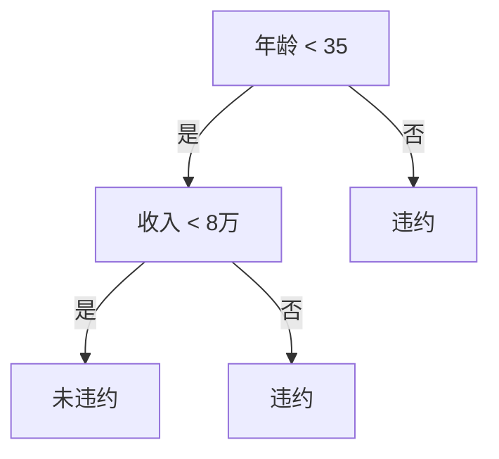

# 基于机器学习的银行信贷评分模型研究

## 1.背景介绍

### 1.1 信贷风险评估的重要性

在金融行业中,信贷风险评估是一个至关重要的环节。银行在审批贷款时,需要准确评估申请人的还款能力和违约风险。传统的评分模型主要依赖人工经验,存在主观性强、效率低下等问题。随着大数据和机器学习技术的发展,基于机器学习的信贷评分模型逐渐受到重视,能够提高评估的准确性和效率。

### 1.2 机器学习在信贷评分中的应用

机器学习算法能够从历史数据中自动学习特征模式,捕捉申请人的风险特征,从而构建出高精度的评分模型。常用的机器学习算法包括逻辑回归、决策树、随机森林、梯度提升树等。这些算法能够处理高维、非线性的数据,并且具有很强的泛化能力。

### 1.3 研究意义

本文将介绍基于机器学习的银行信贷评分模型的研究,包括模型的构建、特征工程、模型评估等关键环节。旨在为金融机构提供一种高效、准确的信贷风险评估工具,降低不良贷款率,提高贷款资产质量。

## 2.核心概念与联系

### 2.1 机器学习概述

机器学习是一门研究如何构建能从数据中自动分析获得规律,并利用规律对未知数据进行预测的算法理论。主要分为监督学习、无监督学习和强化学习三大类。

### 2.2 监督学习

监督学习是机器学习中最常见的一种范式,它利用带有标签的训练数据,学习出一个从输入到输出的映射函数。常见的监督学习任务包括分类和回归。信贷评分属于二分类问题。

### 2.3 特征工程

特征工程是机器学习中一个非常重要的环节,直接影响模型的性能。包括特征选择、特征构造、特征降维等步骤,旨在从原始数据中提取出对预测目标更有意义的特征。

### 2.4 模型评估

模型评估是验证模型性能的关键步骤,常用的评估指标包括准确率、精确率、召回率、F1分数、AUC等。交叉验证等方法可用于评估模型的泛化能力。

### 2.5 概念联系

构建信贷评分模型的过程,实际上是一个典型的监督学习任务。首先需要进行特征工程,从申请人的信息中提取出对预测违约风险有意义的特征;然后使用机器学习算法在带标签的历史数据上训练模型;最后,对模型进行评估,选择性能最优的模型用于实际应用。

## 3.核心算法原理具体操作步骤

本节将介绍几种常用于信贷评分的机器学习算法的原理和具体操作步骤。

### 3.1 逻辑回归

#### 3.1.1 原理

逻辑回归是一种广义线性模型,通过对数几率(logit)函数将输入特征的线性组合映射到(0,1)区间,从而得到事件发生的概率估计。

#### 3.1.2 操作步骤

1. 数据预处理:填充缺失值、编码分类特征、特征标准化等。
2. 构建逻辑回归模型,设定合适的正则化参数。
3. 使用最大似然估计或梯度下降法估计模型参数。
4. 在测试集上评估模型性能,计算评估指标。

### 3.2 决策树

#### 3.2.1 原理  

决策树是一种基于"分而治之"策略的树形结构模型,根据特征对实例进行递归分区,将同一类的实例聚集在一起。常用的决策树算法包括ID3、C4.5、CART等。

#### 3.2.2 操作步骤

1. 数据预处理:填充缺失值、编码分类特征等。
2. 选择合适的决策树算法,设定相关参数,如最大深度、最小样本分割数等。
3. 构建决策树模型,根据信息增益或基尼指数选择最优特征进行分割。
4. 在测试集上评估模型性能,计算评估指标。
5. 可采用剪枝等方法防止过拟合。

### 3.3 随机森林

#### 3.3.1 原理

随机森林是一种基于决策树的集成学习算法,它通过构建多个决策树,对它们的预测结果进行统计以完成最终预测。具有很好的抗过拟合能力。

#### 3.3.2 操作步骤  

1. 数据预处理:填充缺失值、编码分类特征等。
2. 设定随机森林的参数,如树的数量、每棵树的最大深度等。
3. 构建随机森林模型,对每棵树使用有放回的方式从原始数据中随机抽取样本和特征。
4. 在测试集上评估模型性能,计算评估指标。

### 3.4 梯度提升树

#### 3.4.1 原理

梯度提升树(GBDT)是一种迭代式的决策树集成算法。它从一个初始模型开始,通过残差的负梯度方向建立新的决策树,不断减小残差,最终得到一个强大的集成模型。

#### 3.4.2 操作步骤

1. 数据预处理:填充缺失值、编码分类特征等。  
2. 设定GBDT参数,如学习率、树的数量、最大深度等。
3. 初始化一个常数模型,计算其与真实值的残差。
4. 根据残差的负梯度方向,不断建立新的决策树,更新集成模型。
5. 在测试集上评估模型性能,计算评估指标。

## 4.数学模型和公式详细讲解举例说明

本节将介绍信贷评分模型中涉及的一些重要数学模型和公式,并结合实例进行讲解说明。

### 4.1 逻辑回归模型

逻辑回归模型的数学表达式为:

$$\ln\left(\frac{p(y=1|x)}{1-p(y=1|x)}\right)=\beta_0+\beta_1x_1+\beta_2x_2+...+\beta_nx_n$$

其中:
- $p(y=1|x)$表示给定特征向量$x$,事件发生的概率
- $\beta_0$为常数项
- $\beta_i(i=1,2,...,n)$为特征$x_i$的系数

通过对数几率变换,可以将线性方程的输出映射到(0,1)区间,从而得到概率估计值。

假设有以下信用卡申请数据:

| 年龄 | 收入(万元) | 信用分数 | 是否违约(1=是,0=否) |
|------|------------|-----------|----------------------|
| 25   | 6          | 680       | 0                    |
| 42   | 12         | 720       | 0                    |
| 37   | 9          | 610       | 1                    |

我们可以构建如下逻辑回归模型:

$$\ln\left(\frac{p(违约)}{1-p(违约)}\right)=-2.5+0.08\times年龄+0.2\times收入-0.03\times信用分数$$

根据申请人的年龄、收入和信用分数,可以计算出其违约的概率,作为评分的依据。

### 4.2 决策树模型

决策树模型通过不断分割特征空间,将实例分配到不同的叶子节点。分割依据是信息增益或基尼指数。

以年龄、收入作为特征,是否违约作为标签,构建一个简单的决策树模型:



上图展示了一个二叉决策树的结构,根据年龄和收入两个特征对申请人进行分类。

### 4.3 随机森林模型

随机森林是由多棵决策树构成的集成模型,其预测结果是所有决策树预测结果的统计模式,通常是投票或平均的方式。

设有$B$棵决策树,对于第$b$棵树的预测结果为$\hat{f}_b(x)$,则随机森林的预测结果为:

$$\hat{f}_{avg}(x)=\frac{1}{B}\sum_{b=1}^B\hat{f}_b(x)$$

### 4.4 梯度提升树模型

梯度提升树(GBDT)模型是一种加法模型,它由多棵决策树相加构成:

$$\hat{f}(x)=\sum_{m=1}^MT(x;\Theta_m)$$

其中$T(x;\Theta_m)$是第$m$棵决策树,它的参数$\Theta_m$通过优化下面的目标函数得到:

$$\Theta_m=\arg\min_\Theta\sum_{i=1}^NL(y_i,\hat{f}_{m-1}(x_i)+T(x_i;\Theta))$$

$L$是损失函数,通常使用平方损失或负对数似然损失。优化过程采用前向分步算法,每一步只学习一个决策树,以此逐步减小残差,提高模型精度。

## 5.项目实践:代码实例和详细解释说明

本节将通过一个基于Python的实战项目,展示如何使用机器学习算法构建信贷评分模型。我们将使用开源的信贷数据集,并使用scikit-learn库中的机器学习算法进行建模。

### 5.1 数据集介绍

我们使用UCI机器学习库中的"默认信用卡客户数据集"(Default of credit card clients Dataset)。该数据集包含30000个信用卡客户的信息,包括23个特征,标签为是否违约(1=是,0=否)。

### 5.2 数据预处理

```python
import pandas as pd
from sklearn.preprocessing import LabelEncoder, StandardScaler

# 加载数据
data = pd.read_csv('default_credit_card.csv')

# 填充缺失值
data = data.fillna(data.mean())

# 编码分类特征
label_encoder = LabelEncoder()
data['SEX'] = label_encoder.fit_transform(data['SEX'])
data['EDUCATION'] = label_encoder.fit_transform(data['EDUCATION'])

# 标准化数值特征
scaler = StandardScaler()
num_cols = ['LIMIT_BAL', 'AGE', 'BILL_AMT1', 'BILL_AMT2', 'BILL_AMT3', 
            'BILL_AMT4', 'BILL_AMT5', 'BILL_AMT6', 'PAY_AMT1', 'PAY_AMT2', 
            'PAY_AMT3', 'PAY_AMT4', 'PAY_AMT5', 'PAY_AMT6']
data[num_cols] = scaler.fit_transform(data[num_cols])

# 分割特征和标签
X = data.drop('default.payment.next.month', axis=1)
y = data['default.payment.next.month']
```

上述代码完成了数据的加载、缺失值填充、分类特征编码和数值特征标准化等预处理步骤。

### 5.3 模型构建与评估

```python
from sklearn.linear_model import LogisticRegression
from sklearn.tree import DecisionTreeClassifier
from sklearn.ensemble import RandomForestClassifier
from sklearn.ensemble import GradientBoostingClassifier
from sklearn.model_selection import train_test_split
from sklearn.metrics import accuracy_score, precision_score, recall_score, f1_score, roc_auc_score

# 分割训练集和测试集
X_train, X_test, y_train, y_test = train_test_split(X, y, test_size=0.2, random_state=42)

# 逻辑回归
lr = LogisticRegression()
lr.fit(X_train, y_train)
y_pred = lr.predict(X_test)
print('Logistic Regression:')
print('Accuracy:', accuracy_score(y_test, y_pred))
print('Precision:', precision_score(y_test, y_pred))
print('Recall:', recall_score(y_test, y_pred))
print('F1-score:', f1_score(y_test, y_pred))
print('AUC:', roc_auc_score(y_test, lr.predict_proba(X_test)[:, 1]))

# 决策树
dt = DecisionTreeClassifier()
dt.fit(X_train, y_train)
y_pred = dt.predict(X_test)
print('\nDecision Tree:')
print('Accuracy:', accuracy_score(y_test, y_pred))
# ...

# 随机森林
rf = RandomForestClassifier(n_estimators=100)
rf.fit(X_train, y_train)
y_pred = rf.predict(X_test)
print('\nRandom Forest:')
print('Accuracy:', accuracy_score(y_test, y_pred))