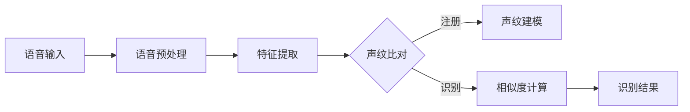

# 基于深度学习的声纹识别

## 1. 背景介绍

声纹识别是一种基于个体声音特征的生物识别技术,通过提取和分析说话人声音中独特的生理和行为特征,实现说话人身份的确认。近年来,随着人工智能尤其是深度学习技术的快速发展,声纹识别技术取得了长足进步,识别准确率不断提高,在智能安防、金融服务、智能家居等领域得到广泛应用。

### 1.1 声纹识别的发展历程

声纹识别技术起源于20世纪60年代,经历了从传统模式匹配到统计建模再到深度学习的发展历程。

#### 1.1.1 传统模式匹配阶段
早期的声纹识别主要采用模式匹配的方法,通过对比待识别语音与已知身份语音模板的相似度来判断说话人身份。代表性方法有动态时间弯折(DTW)等。这一阶段的识别性能较差,抗噪声能力弱。

#### 1.1.2 统计建模阶段  
20世纪80年代开始,声纹识别进入统计建模阶段。高斯混合模型(GMM)、隐马尔可夫模型(HMM)等统计模型被引入声纹识别,通过对语音的统计特性进行建模,大大提高了识别准确率和鲁棒性。GMM-UBM和JFA等算法成为这一时期的代表性方法。

#### 1.1.3 深度学习阶段
2010年以来,深度学习技术在图像、语音等模式识别领域取得突破性进展。CNN、RNN等深度神经网络结构被成功应用于声纹识别,使识别性能再次获得大幅提升。端到端声纹识别、基于注意力机制的声纹识别等新方法不断涌现。

### 1.2 声纹识别的应用场景

声纹识别作为一种安全可靠的生物识别技术,在许多领域有着广泛的应用前景。

#### 1.2.1 智能安防
声纹识别可应用于门禁系统、人证合一等安防场景,通过语音验证说话人身份,提高安全性,同时带来便捷的使用体验。

#### 1.2.2 金融服务
在手机银行、电话银行等场景中,声纹识别可用于用户身份验证,防范电信诈骗,保障交易安全。一些银行已经开始应用声纹识别技术。

#### 1.2.3 智能家居与车载系统
在智能音箱、智能家电、车载语音助手等场景下,声纹识别可实现设备的个性化响应,不同用户可获得定制化的服务内容。

#### 1.2.4 司法取证
声纹识别为案件侦破提供了新的技术手段,可用于案件现场的嫌疑人辨认、电话录音分析等,为犯罪分子的抓捕和定罪提供依据。

## 2. 核心概念与联系

声纹识别涉及声学、语音信号处理、模式识别等多个学科,有许多核心概念需要理解。下面对其中的一些关键概念进行介绍。

### 2.1 语音特征提取
语音特征提取是声纹识别的基础,目的是从语音信号中提取能够反映说话人个体差异的声学特征。常用的语音特征包括：

- MFCC(Mel频率倒谱系数):在Mel频率尺度下,对语音的短时功率谱取对数并进行DCT变换得到。MFCC能够有效地反映语音的感知特性。
  
- LPCC(线性预测倒谱系数):基于语音的线性预测模型,通过线性组合预测当前语音样本,其系数包含了语音的共振峰信息。

- PLP(感知线性预测):结合了听觉系统的特性对线性预测分析进行改进,考虑了人耳的掩蔽效应等因素。

除了以上经典特征,一些表征语音动态变化的特征如差分参数也被广泛使用。此外,一些基于深度学习的特征学习方法如ivector也受到关注。

### 2.2 声纹建模
声纹建模是声纹识别的核心,通过对训练数据中的语音特征进行建模,得到说话人的声纹模型,用于后续的识别比对。主要的建模方法包括：

- GMM(高斯混合模型):使用多个高斯分布的加权混合来描述语音特征的分布。GMM声纹模型通过最大似然估计等方法得到。

- JFA(联合因子分析):在GMM的基础上引入说话人因子和通道因子,将语音特征分解为说话人相关部分和通道相关部分,提高了识别的通道鲁棒性。

- DNN(深度神经网络):利用DNN强大的特征学习和分类能力对语音特征进行建模。常见的DNN声纹模型有d-vector、x-vector等。

### 2.3 模型训练与自适应
声纹模型的训练是声纹识别的关键步骤,模型参数的优化直接影响识别性能。常见的训练方法有:

- 最大似然估计:使用EM算法估计GMM参数,最大化训练数据的似然概率。

- 最小化分类错误:将声纹识别看作一个分类问题,使用交叉熵损失函数等优化DNN模型参数。

- 孪生网络:通过共享参数的两个子网络提取语音特征,优化特征之间的相似度度量。

在实际应用中,为了适应不同的使用场景和设备环境,常需要对声纹模型进行自适应。自适应方法主要有模型补偿和特征归一化等,可以在一定程度上减小领域差异带来的影响。

### 2.4 声纹比对与决策
声纹比对是识别阶段的重要步骤,通过计算待识别语音与已知身份声纹模型的相似度来进行身份判断。常见的相似度度量有:

- 似然比检验:计算待识别语音在目标模型和背景模型上的似然概率比值。

- 余弦相似度:将语音特征向量映射到高维空间,计算向量之间的夹角余弦值。

- 欧氏距离:直接计算语音特征向量之间的欧氏距离。

相似度计算后,需要设定一个阈值对识别结果进行决策。阈值的选取需要平衡误识率和拒识率,可以通过等错误率(EER)、最小化总体错误率等准则确定。

下图展示了声纹识别的基本流程和各个步骤之间的关系:

## 3. 核心算法原理与步骤

本节重点介绍几种常用的声纹识别算法的基本原理和实现步骤,包括GMM-UBM、JFA和基于深度神经网络的端到端声纹识别方法。

### 3.1 GMM-UBM算法

GMM-UBM是一种经典的声纹识别算法,其基本思想是先训练一个通用背景模型(UBM),然后使用最大后验概率(MAP)自适应的方法得到每个说话人的声纹模型。

#### 3.1.1 通用背景模型训练
UBM是一个大规模的GMM模型,使用大量不同说话人的语音数据训练得到,代表了说话人总体的语音特征分布。UBM的训练步骤如下:

1. 提取所有训练语音的MFCC等特征,组成特征集合 $X=\{x_1,x_2,\dots,x_N\}$。

2. 随机初始化UBM的参数,包括每个高斯成分的均值 $\mu_k$、协方差矩阵 $\Sigma_k$ 和权重 $\omega_k$。

3. 使用EM算法迭代优化UBM参数。E步,计算每个特征属于每个高斯成分的后验概率:

$$
\gamma_{nk} = \frac{\omega_k \mathcal{N}(x_n|\mu_k,\Sigma_k)}{\sum_{j=1}^K \omega_j \mathcal{N}(x_n|\mu_j,\Sigma_j)}
$$

M步,根据后验概率更新高斯参数:

$$
\omega_k = \frac{1}{N}\sum_{n=1}^N \gamma_{nk}
$$

$$
\mu_k = \frac{\sum_{n=1}^N \gamma_{nk}x_n}{\sum_{n=1}^N \gamma_{nk}}
$$

$$
\Sigma_k = \frac{\sum_{n=1}^N \gamma_{nk}(x_n-\mu_k)(x_n-\mu_k)^T}{\sum_{n=1}^N \gamma_{nk}}
$$

4. 重复E步和M步直到模型收敛,得到最终的UBM模型。

#### 3.1.2 自适应声纹模型训练
在UBM的基础上,使用每个说话人的注册语音对UBM进行自适应,得到说话人的声纹模型。自适应过程采用MAP准则,步骤如下:

1. 对于说话人 $s$ 的注册语音特征 $X^s=\{x_1^s,x_2^s,\dots,x_{N_s}^s\}$,计算其在UBM每个高斯成分上的后验概率 $\gamma_{nk}^s$。

2. 计算自适应的统计量,包括以下零阶、一阶和二阶统计量:

$$
N_k^s = \sum_{n=1}^{N_s} \gamma_{nk}^s
$$

$$
E_k^s(x) = \frac{1}{N_k^s}\sum_{n=1}^{N_s} \gamma_{nk}^s x_n^s
$$

$$
E_k^s(xx^T) = \frac{1}{N_k^s}\sum_{n=1}^{N_s} \gamma_{nk}^s x_n^s {x_n^s}^T
$$

3. 使用统计量和UBM参数,计算自适应的高斯均值:

$$
\hat{\mu}_k^s = \alpha_k^s E_k^s(x) + (1-\alpha_k^s)\mu_k
$$

其中 $\alpha_k^s = \frac{N_k^s}{N_k^s+r}$ 为自适应系数,$r$ 为相关因子,控制自适应的强度。

4. 更新GMM-UBM的均值参数为 $\hat{\mu}_k^s$,得到说话人 $s$ 的声纹模型。

#### 3.1.3 声纹识别
对于一段待识别的语音,提取其特征后,分别计算其在每个说话人声纹模型和UBM上的似然概率,再计算似然比,与预设阈值比较,判断是否为目标说话人的语音。

设待识别语音特征为 $X=\{x_1,x_2,\dots,x_T\}$,说话人 $s$ 的声纹模型为 $\lambda_s$,UBM为 $\lambda_{ubm}$,似然比计算为:

$$
LLR(X) = \frac{1}{T}\sum_{t=1}^T \log \frac{p(x_t|\lambda_s)}{p(x_t|\lambda_{ubm})}
$$

若 $LLR(X)$ 大于阈值,则接受;否则拒绝。

### 3.2 联合因子分析(JFA)

JFA是在GMM-UBM的基础上进一步考虑了说话人间和通道间的变异性,将语音特征分解为说话人相关成分和通道相关成分,从而提高了识别的鲁棒性。

#### 3.2.1 JFA模型
JFA将一段语音 $X$ 的GMM均值向量 $M$ 表示为:

$$
M = m + Vy + Ux + Dz
$$

其中 $m$ 为UBM的超向量均值,$V$ 为说话人子空间矩阵,$U$ 为通道子空间矩阵,$D$ 为残差矩阵。$y$、$x$ 和 $z$ 分别为说话人因子、通道因子和残差因子。

#### 3.2.2 模型训练
JFA的训练过程需要估计以下参数:

1. 说话人子空间矩阵 $V$ 和说话人因子 $y$:通过在说话人维度上进行因子分析得到。

2. 通道子空间矩阵 $U$ 和通道因子 $x$:在去除说话人相关成分后,在通道维度上进行因子分析得到。

3. 残差矩