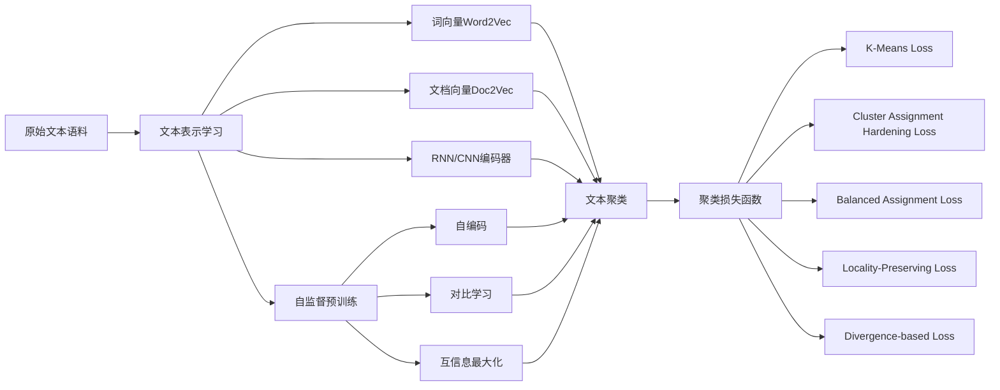

# 基于深度学习的文本聚类

## 1. 背景介绍

在大数据时代,非结构化的文本数据呈现爆炸式增长。如何从海量文本数据中挖掘有价值的信息,成为自然语言处理和数据挖掘领域的重要课题。文本聚类作为一种无监督学习方法,可以自动将文本划分到不同的簇中,发现文本数据内在的分布结构和模式,在主题发现、信息检索、推荐系统等领域有广泛应用。

传统的文本聚类方法主要基于VSM(Vector Space Model)模型,先将文本表示成词频向量,然后用K-Means、层次聚类等算法进行聚类。但这类方法存在维度灾难、语义鸿沟等问题。近年来,随着深度学习的发展,一些研究者尝试用深度神经网络学习文本的低维语义表示,再进行聚类,取得了不错的效果。本文将系统介绍基于深度学习的文本聚类的研究进展。

### 1.1 文本聚类的定义与应用

文本聚类(Text Clustering)是将一组文本划分成多个子集的过程,使得同一子集内的文本在某种意义上彼此相似,而不同子集的文本差异性较大。形式化定义为:给定文本集合$D=\{d_1,d_2,...,d_n\}$,将其划分为$k$个互不相交的子集$C_1,C_2,...,C_k$,满足$\cup_{i=1}^k C_i=D$且当$i \neq j$时$C_i \cap C_j = \emptyset$。其中每个子集$C_i$称为一个簇(cluster)。

文本聚类在很多场景下有重要应用,例如:

1. 主题发现:从大量新闻、博客、社交媒体等文本中自动发现热点话题和事件。
2. 信息检索:将搜索结果按主题聚类,方便用户快速浏览和查找相关内容。  
3. 推荐系统:根据用户浏览、评论的文本内容进行聚类,发现其兴趣偏好,提供个性化推荐。
4. 情感分析:将评论按情感倾向聚类,自动识别正面、负面、中性情感。
5. 作者识别:对未知作者的文章进行写作风格聚类,推断其身份特征。

### 1.2 传统文本聚类方法的局限性

传统的文本聚类方法主要基于VSM模型,将文本表示成词频向量,计算文本间的相似度,然后用K-Means、层次聚类等通用数据聚类算法处理。这类方法存在以下局限性:

1. 维度灾难:文本特征空间维度极高,所有词汇都被当成特征,数据稀疏,聚类性能差。
2. 语义鸿沟:词频统计无法刻画词语和文本的语义信息,语义相似的文本可能被划分到不同簇中。
3. 特征工程复杂:需要进行分词、去停用词、特征选择等复杂的文本预处理。
4. 聚类数难确定:很多算法需要预先设定聚类数,而实际任务中聚类数难以估计。
5. 噪声敏感:对于一些低质量、非主题性的文本噪声数据,聚类质量会显著下降。

### 1.3 深度学习驱动的文本聚类新思路

深度学习以其强大的特征学习和语义建模能力,为克服传统文本聚类方法的局限性提供了新思路:

1. 用深度神经网络自动学习文本的低维语义表示,避免了人工特征工程。
2. 端到端地优化特征表示和聚类过程,特征与聚类目标更加吻合。
3. 引入注意力、记忆等机制,建模长文本、把握全局语义。
4. 利用无监督方法如自编码器重建误差确定聚类数。  
5. 设计对抗训练、噪声自编码器等方法,提高聚类的鲁棒性。

本文将重点介绍几类代表性的基于深度学习的文本聚类模型及其原理。

## 2. 核心概念与联系

在介绍具体模型前,我们先明确一些核心概念:

### 2.1 文本表示学习
文本表示学习(Text Representation Learning)是指用低维、稠密的向量表示文本语义信息的方法。神经网络可以学习到词、句、篇章级别的分布式表示。常见的模型有:

- Word2Vec:学习词语的分布式表示,可以刻画词语间的语义相似性和类比关系。
- Doc2Vec:在Word2Vec基础上,为每篇文档也学习一个向量,文档向量可以捕捉文本主题信息。
- RNN/CNN Encoder:用RNN或CNN网络对词序列编码,学习句子、篇章的分布式表示。

### 2.2 聚类损失函数
为了直接优化聚类性能,需要设计合适的聚类损失函数(Clustering Loss),使得同类样本的特征表示相近,异类样本的特征表示相斥。常见的聚类损失函数有:

- K-Means Loss:最小化样本与其所属簇中心的距离平方和。
- Cluster Assignment Hardening Loss:最大化样本属于某个簇的概率。
- Balanced Assignment Loss:最小化类内距离,最大化类间距离,并平衡各簇的样本数。
- Locality-Preserving Loss:保持原始空间中相近样本在嵌入空间也相近。
- Divergence-based Loss:最小化学习到的簇分布与先验分布的差异度量,如KL散度。

### 2.3 Self-supervised Learning
为了在无标签数据上进行预训练,提取更加泛化的文本特征,可以利用自监督学习(Self-supervised Learning),设计一些辅助任务,如:

- 自编码:随机mask掉一些词,然后预测这些词。
- 对比学习:把同一文本的不同augmentation视作正样本,不同文本视作负样本,拉近正样本、疏远负样本。
- 互信息最大化:最大化局部特征与全局特征的互信息。

### 2.4 概念关系图
下图展示了上述核心概念间的逻辑联系:

## 3. 核心算法原理具体操作步骤

下面介绍几种有代表性的基于深度学习的文本聚类算法的原理和步骤。

### 3.1 DEC:Deep Embedded Clustering

DEC是一种端到端的联合优化文本特征表示和聚类的算法,主要分两个阶段:

**第一阶段:预训练**

1. 将文本输入预训练好的BERT编码器,提取句子级别的特征向量。
2. 在特征向量上通过多层感知机和softmax层,重建原文本的词袋表示。
3. 最小化重建误差,优化BERT和MLP的参数。

**第二阶段:聚类**

4. 初始化聚类中心$\mu_j$为特征向量的K-Means聚类结果。
5. 计算样本$z_i$属于各簇的概率$q_{ij}$:

$$q_{ij}=\frac{(1+\lVert z_i-\mu_j \rVert^2)^{-1}}{\sum_{j'}(1+\lVert z_i-\mu_{j'} \rVert^2)^{-1}}$$

6. 计算辅助目标分布$p_{ij}$,将$q_{ij}$锐化:

$$p_{ij}=\frac{q_{ij}^2/\sum_i q_{ij}}{\sum_{j'}(q_{ij'}^2/\sum_i q_{ij'})}$$

7. 最小化$q_{ij}$和$p_{ij}$的KL散度,微调BERT和MLP参数:

$$L=KL(P\parallel Q)=\sum_i \sum_j p_{ij}\log \frac{p_{ij}}{q_{ij}}$$

8. 根据更新后的$z_i$重新计算聚类中心$\mu_j$。
9. 重复5~8直到收敛。

### 3.2 IDEC:Improved Deep Embedded Clustering

IDEC是对DEC的一些改进,主要有:

1. 联合优化重建损失和聚类损失:

$$L=L_r+\gamma L_c$$

其中$L_r$为重建误差,$L_c$为聚类损失,即$q_{ij}$和$p_{ij}$的KL散度,$\gamma$为平衡因子。DEC只在预训练阶段优化$L_r$,而IDEC在整个过程联合优化。

2. 采用t-SNE可视化聚类结果,发现聚类过程存在簇坍塌现象,即大部分样本都聚到同一个簇。为缓解此问题,在计算辅助分布$p_{ij}$时,为每个样本保留top k个最可能的簇:

$$\tilde{p}_{ij}=\frac{p_{ij}}{\sum_{j'\in \Omega_i} p_{ij'}}$$

其中$\Omega_i$为样本$i$的top k个簇的索引集合。

### 3.3 DCN:Deep Clustering Network

DCN的思路是先用自编码器重建原文本,学习局部特征表示,然后最大化局部特征与全局特征的互信息,同时用K-Means损失优化聚类。主要步骤为:

1. 用词嵌入矩阵将文本转为词向量序列。
2. 词向量序列通过BiGRU学习全局特征$\mathbf{h}^g$。
3. 词向量序列通过多头注意力学习局部特征$\mathbf{h}^l_i$。
4. 局部特征通过一层MLP和softmax重建原文本的词袋表示,计算重建误差$L_{rec}$。
5. 计算局部特征$\mathbf{h}^l_i$与全局特征$\mathbf{h}^g$的互信息,并最大化:

$$I(\mathbf{h}^g;\mathbf{h}^l)=\sum_i I(\mathbf{h}^g;\mathbf{h}_i^l)=\sum_i \int p(\mathbf{h}^g,\mathbf{h}_i^l)\log\frac{p(\mathbf{h}^g,\mathbf{h}_i^l)}{p(\mathbf{h}^g)p(\mathbf{h}_i^l)}$$

$$L_{MI}=\frac{1}{N}\sum_i \log D(\mathbf{h}^g,\mathbf{h}_i^l)-\log(1-D(\mathbf{h}^g,\tilde{\mathbf{h}}_i^l))$$

其中$D$是一个判别器网络,$\tilde{\mathbf{h}}_i^l$是负样本。

6. 将全局特征$\mathbf{h}^g$通过一层MLP得到$\mathbf{z}$,然后进行K-Means聚类,计算聚类损失:

$$L_{KM}=\sum_i \min_j \lVert \mathbf{z}_i-\mathbf{c}_j \rVert^2$$

7. 联合优化重建损失、互信息损失和聚类损失:

$$L=L_{rec}+\alpha L_{MI}+\beta L_{KM}$$

### 3.4 STCC:Self-Taught Convolutional Clustering

STCC利用自监督学习的思想,在大规模无标签文本上预训练出更加泛化的特征表示,然后在特定任务数据上fine-tune并进行聚类。主要步骤为:

**自监督预训练阶段:**

1. 对原始文本进行随机mask和shuffle等augmentation,构造正样本对。
2. 用CNN编码器提取每个样本的特征向量。
3. 对正样本对的特征向量计算余弦相似度,并最大化;对负样本对的相似度最小化。
4. 重复以上步骤,在大规模无标签语料上预训练CNN编码器。

**聚类阶段:**

5. 用预训练的CNN编码器提取目标任务数据的特征向量。
6. 在特征向量上通过一层MLP,然后进行K-Means聚类。
7. 最