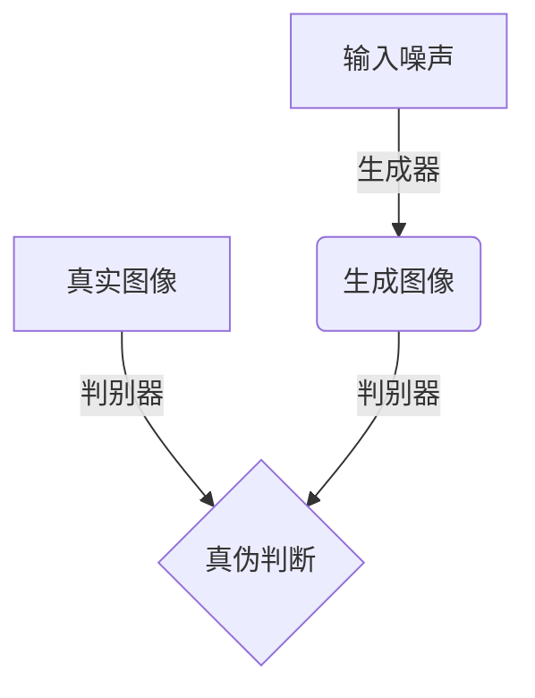
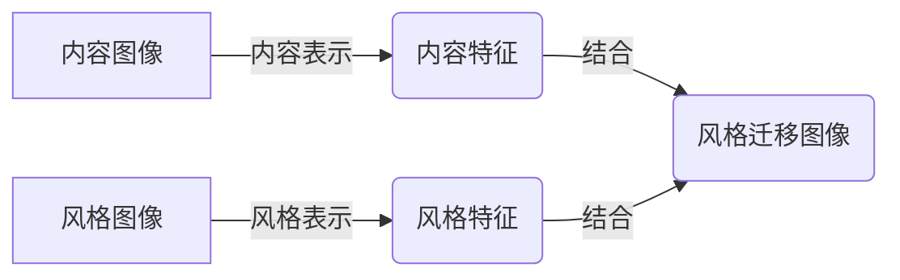
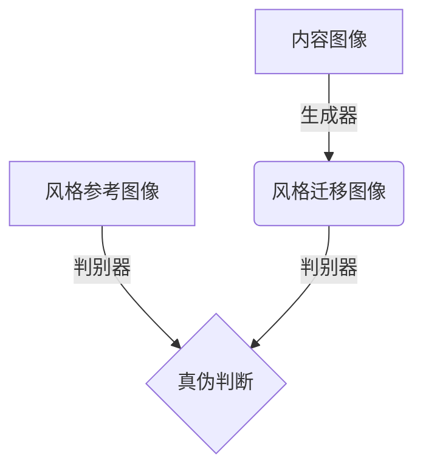

# 基于生成对抗网络的社交媒体图片风格迁移插件

## 1.背景介绍

### 1.1 社交媒体的重要性

在当今时代,社交媒体已经成为人们日常生活中不可或缺的一部分。无论是分享生活点滴、表达情感想法,还是获取信息资讯,社交媒体都扮演着重要的角色。其中,图片作为一种直观生动的信息传递方式,在社交媒体中占据着极其重要的地位。

### 1.2 图片风格迁移的兴起

然而,随着人们对个性化表达的需求不断增长,单一的图片风格已经难以满足用户的需求。于是,图片风格迁移技术应运而生。图片风格迁移是指将一种风格迁移到另一种图片上,从而赋予原图片全新的视觉体验。这项技术的出现,为社交媒体用户提供了个性化图片编辑的新途径。

### 1.3 生成对抗网络在图片风格迁移中的应用

生成对抗网络(Generative Adversarial Networks, GAN)作为一种新兴的深度学习模型,在图像生成、风格迁移等领域展现出了巨大的潜力。GAN通过生成器和判别器两个神经网络相互对抗的方式,可以学习到图像的真实分布,从而生成逼真的图像。基于这一特性,GAN在图片风格迁移领域得到了广泛应用。

## 2.核心概念与联系

### 2.1 生成对抗网络(GAN)

生成对抗网络(GAN)是一种由两个神经网络组成的框架,包括生成器(Generator)和判别器(Discriminator)。生成器的目标是生成逼真的图像,而判别器则需要区分生成的图像和真实图像。在训练过程中,生成器和判别器相互对抗,不断提高自身的能力,最终达到生成器可以生成逼真图像,判别器无法区分真伪的状态。



### 2.2 风格迁移

风格迁移是指将一种艺术风格迁移到另一种图像上,从而赋予原图片全新的视觉体验。这一过程通常包括两个步骤:

1. 内容表示:提取原始图像的内容特征,保留图像的主要结构和语义信息。
2. 风格表示:提取风格参考图像的风格特征,包括颜色、纹理、笔触等风格元素。

通过将内容表示和风格表示相结合,可以生成具有原始图像内容和风格参考图像风格的新图像。



### 2.3 GAN在风格迁移中的应用

GAN可以被用于图片风格迁移任务。生成器的目标是生成具有目标风格的图像,而判别器则需要区分生成的图像和真实的风格参考图像。通过不断训练,生成器可以学习到如何将给定内容图像的内容特征与目标风格特征相结合,从而生成具有所需风格的新图像。



## 3.核心算法原理具体操作步骤

基于GAN的图片风格迁移算法主要分为以下几个步骤:

### 3.1 数据准备

首先需要准备两个数据集:内容图像数据集和风格参考图像数据集。内容图像数据集包含需要进行风格迁移的图像,而风格参考图像数据集则包含具有所需风格的图像。

### 3.2 特征提取

接下来,需要使用预训练的卷积神经网络(CNN)提取内容图像和风格参考图像的特征。通常会使用VGG19或其他经典CNN模型。

对于内容图像,我们提取高层特征图,作为内容特征表示。对于风格参考图像,我们提取多层特征图,并计算格拉姆矩阵(Gram Matrix),作为风格特征表示。

### 3.3 损失函数设计

为了实现风格迁移,我们需要定义一个损失函数,包括内容损失和风格损失两部分:

1. 内容损失:衡量生成图像与原始内容图像的内容特征差异。
2. 风格损失:衡量生成图像与风格参考图像的风格特征差异。

总损失函数为内容损失和风格损失的加权和。

$$L_{total} = \alpha L_{content} + \beta L_{style}$$

其中$\alpha$和$\beta$分别是内容损失和风格损失的权重系数。

### 3.4 生成器和判别器设计

在GAN框架中,我们需要设计生成器和判别器两个神经网络。

生成器的输入是内容图像和噪声向量,输出是风格迁移后的图像。生成器的目标是生成逼真的风格迁移图像,使得判别器无法区分真伪。

判别器的输入是真实的风格参考图像和生成器生成的风格迁移图像,输出是真伪判断结果。判别器的目标是正确区分真实图像和生成图像。

### 3.5 对抗训练

生成器和判别器通过对抗训练的方式相互提高能力。具体步骤如下:

1. 初始化生成器和判别器的权重。
2. 从内容图像数据集和风格参考图像数据集中采样数据。
3. 固定生成器,训练判别器,使其能够较好地区分真实图像和生成图像。
4. 固定判别器,训练生成器,使其能够生成足以欺骗判别器的风格迁移图像。
5. 重复步骤3和4,直到模型收敛。

通过上述对抗训练过程,生成器最终可以生成具有目标风格的逼真图像。

## 4.数学模型和公式详细讲解举例说明

### 4.1 内容损失

内容损失衡量生成图像与原始内容图像的内容特征差异。我们使用预训练的CNN提取内容图像和生成图像的高层特征图,然后计算它们的均方差(Mean Squared Error, MSE)作为内容损失。

设$F^{l}$为CNN的第$l$层特征图,$p$为像素位置索引,则内容损失可以表示为:

$$L_{content}(G) = \frac{1}{2}\sum_{i,j}(F_{ij}^l(G) - P_{ij}^l)^2$$

其中,$G$表示生成图像,$P$表示原始内容图像的特征图。通过最小化内容损失,可以使生成图像保留原始内容图像的内容特征。

### 4.2 风格损失

风格损失衡量生成图像与风格参考图像的风格特征差异。我们使用格拉姆矩阵(Gram Matrix)来表示风格特征。

对于一个特征图$F^l$,其格拉姆矩阵$G^l$定义为:

$$G_{ij}^l = \sum_k F_{ik}^l F_{jk}^l$$

其中,$i$和$j$是特征图的宽度和高度索引,$k$是特征图的通道索引。格拉姆矩阵可以捕获特征图之间的相关性,从而表示图像的风格信息。

风格损失可以定义为生成图像和风格参考图像的格拉姆矩阵之间的均方差:

$$L_{style}(G, S) = \sum_l w_l \frac{1}{N_l^2M_l^2} \sum_{i,j}(G_{ij}^l - A_{ij}^l)^2$$

其中,$G$表示生成图像,$S$表示风格参考图像,$A^l$是风格参考图像在第$l$层的格拉姆矩阵,$w_l$是第$l$层的权重,$N_l$和$M_l$分别是特征图的宽度和高度。通过最小化风格损失,可以使生成图像具有风格参考图像的风格特征。

### 4.3 总损失函数

总损失函数是内容损失和风格损失的加权和:

$$L_{total} = \alpha L_{content} + \beta L_{style}$$

其中,$\alpha$和$\beta$分别是内容损失和风格损失的权重系数,用于平衡两种损失的重要性。

在实际应用中,我们可以根据具体需求调整$\alpha$和$\beta$的值,以获得更好的风格迁移效果。

## 5.项目实践:代码实例和详细解释说明

在本节中,我们将提供一个基于PyTorch实现的GAN风格迁移项目示例,并对关键代码进行详细解释。

### 5.1 导入必要的库

```python
import torch
import torch.nn as nn
import torchvision.transforms as transforms
import torchvision.models as models
from PIL import Image
```

我们导入了PyTorch库、torchvision库和PIL库,用于构建神经网络、加载和预处理图像数据。

### 5.2 定义内容损失和风格损失函数

```python
class ContentLoss(nn.Module):
    def __init__(self, target):
        super(ContentLoss, self).__init__()
        self.target = target.detach()

    def forward(self, input):
        self.loss = nn.functional.mse_loss(input, self.target)
        return input

class StyleLoss(nn.Module):
    def __init__(self, target_feature):
        super(StyleLoss, self).__init__()
        self.target = gram_matrix(target_feature).detach()

    def forward(self, input):
        G = gram_matrix(input)
        self.loss = nn.functional.mse_loss(G, self.target)
        return input

def gram_matrix(input):
    batch_size, h, w, f_map_num = input.size()
    features = input.view(batch_size * h * w, f_map_num)
    G = torch.mm(features, features.t())
    return G.div(batch_size * h * w * f_map_num)
```

我们定义了`ContentLoss`和`StyleLoss`两个PyTorch模块,分别用于计算内容损失和风格损失。`gram_matrix`函数用于计算格拉姆矩阵,表示图像的风格特征。

### 5.3 定义生成器和判别器

```python
class Generator(nn.Module):
    def __init__(self):
        super(Generator, self).__init__()
        # ...
        # 定义生成器网络结构

    def forward(self, x):
        # ...
        # 实现生成器的前向传播

class Discriminator(nn.Module):
    def __init__(self):
        super(Discriminator, self).__init__()
        # ...
        # 定义判别器网络结构

    def forward(self, x):
        # ...
        # 实现判别器的前向传播
```

我们定义了`Generator`和`Discriminator`两个PyTorch模块,分别表示生成器和判别器。具体的网络结构和前向传播实现根据实际需求进行设计。

### 5.4 训练过程

```python
def train(content_img, style_img, epochs=300):
    # 初始化生成器和判别器
    generator = Generator()
    discriminator = Discriminator()

    # 定义优化器和损失函数
    optimizer_G = torch.optim.Adam(generator.parameters(), lr=0.001)
    optimizer_D = torch.optim.Adam(discriminator.parameters(), lr=0.001)
    content_loss = ContentLoss(content_img)
    style_loss = StyleLoss(style_img)

    for epoch in range(epochs):
        # 训练判别器
        optimizer_D.zero_grad()
        # ...
        # 计算判别器损失并反向传播

        # 训练生成器
        optimizer_G.zero_grad()
        # ...
        # 计算生成器损失并反向传播

        # 打印损失和保存生成图像
        if epoch % 50 == 0:
            print(f'Epoch {epoch}: Content Loss={content_loss.loss.item():.4f}, Style Loss={style_loss.loss.item():.4f}')
            save_image(generated_img, f'output_{epoch}.png')
```

在训练过程中,我们初始化生成器和判别器,定义优化器和损失函数。然后,我们进入训练循环,分别训练判别器和生成器。在每个epoch结束时,我们打印当前的内容损失和风格损失,并保存生成的图像。

### 5.5 运行示例

```python
# 加载内容图像和风格参考图像
content_img = load_image('content.jpg')
style_img = load_image('style.jpg')