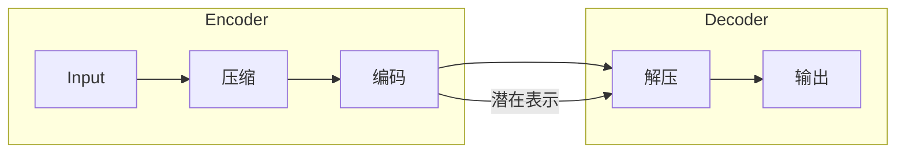

# 基于自动编码器的入侵检测系统研究与实现

## 1.背景介绍

### 1.1 网络安全与入侵检测的重要性

在当今互联网时代,网络安全问题日益突出。随着网络系统的复杂性不断增加,网络攻击手段也在不断升级和演进。入侵检测系统(Intrusion Detection System, IDS)作为网络安全防御的重要一环,能够有效地检测各种已知和未知的网络攻击行为,及时发现并阻止入侵,保护关键系统的安全运行。

### 1.2 传统入侵检测方法的局限性  

传统的入侵检测方法主要包括基于签名(Signature-based)和基于规则(Rule-based)两大类。基于签名的方法通过匹配已知攻击模式来检测入侵,但对未知攻击无能为力。基于规则的方法虽然可检测未知攻击,但需要人工定义大量复杂的规则,存在高漏报率和高误报率等问题。

### 1.3 基于机器学习的入侵检测系统

近年来,机器学习技术在网络安全领域得到了广泛应用,基于机器学习的入侵检测系统逐渐成为研究热点。与传统方法相比,机器学习可以自动从大量网络流量数据中学习攻击模式,检测未知攻击,且无需人工定义复杂规则。其中,自动编码器(Autoencoder)作为一种无监督学习模型,能够高效地从原始网络数据中自动学习出潜在的特征表示,被广泛应用于入侵检测任务。

## 2.核心概念与联系

### 2.1 自动编码器概述

自动编码器是一种无监督学习的人工神经网络,旨在将高维输入数据编码为低维潜在表示,并尽可能重构出原始输入。它由两部分组成:编码器(Encoder)和解码器(Decoder)。

编码器将高维输入数据压缩为低维潜在表示,解码器则尝试从这个低维表示重构出原始输入数据。在训练过程中,自动编码器通过最小化输入和重构输出之间的差异,学习出能够捕获输入数据本质特征的潜在表示。

### 2.2 自动编码器在入侵检测中的应用

在入侵检测任务中,自动编码器可以将高维的网络流量数据压缩为低维潜在表示,并重构出正常网络流量的特征模式。对于与正常模式偏离较大的数据,可以被识别为异常,从而实现对网络攻击行为的检测。

自动编码器的优势在于:

1. 无需人工标注,可从原始网络数据中自动学习特征
2. 能够检测未知攻击,不受已知攻击模式的限制
3. 无需定义复杂规则,降低了误报率

### 2.3 相关工作综述

近年来,研究人员提出了多种基于自动编码器的入侵检测模型,取得了不错的效果。例如利用堆叠自动编码器(Stacked Autoencoder)、变分自动编码器(Variational Autoencoder)、卷积自动编码器(Convolutional Autoencoder)等变体模型,或结合其他机器学习算法,如支持向量机(SVM)、聚类算法等,以提高检测性能。

## 3.核心算法原理具体操作步骤

### 3.1 自动编码器基本原理

自动编码器的目标是学习一个能够近似重构输入数据的映射函数,即:

$$\hat{X} = g(f(X))$$

其中 $X$ 为输入数据, $f$ 为编码器, $g$ 为解码器, $\hat{X}$ 为重构输出。

编码器 $f$ 将输入 $X$ 映射为潜在表示 $h$:

$$h = f(X) = \sigma(WX + b)$$

解码器 $g$ 将潜在表示 $h$ 映射回原始空间:

$$\hat{X} = g(h) = \sigma(W'h + b')$$

其中 $\sigma$ 为激活函数,如 Sigmoid、ReLU 等, $W$、$b$、$W'$、$b'$ 为需要学习的模型参数。

训练过程是一个无监督学习过程,通过最小化输入 $X$ 与重构输出 $\hat{X}$ 之间的重构误差,来学习最优参数:

$$\min \limits_{W,b,W',b'} L(X, \hat{X}) = \min \limits_{W,b,W',b'} L(X, g(f(X)))$$

其中 $L$ 为损失函数,常用的有均方误差(MSE)、交叉熵(Cross Entropy)等。

通过梯度下降法优化参数,当重构误差最小时,自动编码器即学习到了能够捕获输入数据本质特征的最优潜在表示。

### 3.2 异常检测原理

在训练好自动编码器模型后,可以利用其重构误差来检测异常数据(如网络攻击流量)。具体做法是:

1. 将正常网络流量数据输入到训练好的自动编码器中,得到重构输出 $\hat{X}$
2. 计算输入 $X$ 与重构输出 $\hat{X}$ 之间的重构误差 $L(X, \hat{X})$
3. 对于正常数据,其重构误差较小;对于异常数据,重构误差较大
4. 设定一个阈值 $\epsilon$,若 $L(X, \hat{X}) > \epsilon$,则判定为异常,否则为正常

通过这种方式,自动编码器能够学习正常网络流量的模式,并检测出与之偏离较大的异常数据,实现对网络攻击的检测。

### 3.3 算法步骤总结

基于自动编码器的入侵检测系统的核心算法步骤可总结如下:

1. **数据预处理**:对原始网络流量数据进行标准化、归一化等预处理,以满足模型输入要求
2. **模型构建**:根据任务需求,构建合适的自动编码器模型结构,如全连接、卷积等
3. **模型训练**:以正常网络流量数据为训练集,通过梯度下降法等优化算法,最小化重构误差,学习最优模型参数
4. **异常检测**:对新的网络流量数据,输入到训练好的自动编码器,计算其重构误差。若重构误差超过预设阈值,则判定为异常(可能是攻击流量)
5. **模型评估**:在保留的测试集上,评估模型的检测性能,如准确率、精确率、召回率、F1分数等指标
6. **模型优化**:根据评估结果,通过调整模型结构、超参数、训练策略等方式,优化模型性能

以上即为基于自动编码器的入侵检测系统的核心算法原理和操作步骤。在实际应用中,还需要结合具体场景和任务需求,对算法流程进行相应的调整和改进。

## 4.数学模型和公式详细讲解举例说明

在第3节中,我们介绍了自动编码器的基本原理和公式。现在我们来进一步详细讲解并举例说明其中的数学模型。

### 4.1 编码器和解码器

自动编码器由编码器和解码器两部分组成。假设输入数据为 $X \in \mathbb{R}^{n}$,编码器将其映射到潜在表示 $h \in \mathbb{R}^{m}$,解码器则将潜��表示映射回原始空间,得到重构输出 $\hat{X} \in \mathbb{R}^{n}$。

编码器的数学表达式为:

$$h = f(X) = \sigma(W_1X + b_1)$$

其中 $W_1 \in \mathbb{R}^{m \times n}$ 为编码器的权重矩阵, $b_1 \in \mathbb{R}^{m}$ 为偏置向量, $\sigma$ 为非线性激活函数,如 Sigmoid、ReLU 等。

解码器的数学表达式为:

$$\hat{X} = g(h) = \sigma(W_2h + b_2)$$

其中 $W_2 \in \mathbb{R}^{n \times m}$ 为解码器的权重矩阵, $b_2 \in \mathbb{R}^{n}$ 为偏置向量。

通过将编码器和解码器组合,我们得到自动编码器的完整表达式:

$$\hat{X} = g(f(X)) = \sigma(W_2 \sigma(W_1X + b_1) + b_2)$$

### 4.2 重构误差和损失函数

为了使自动编码器能够学习到有效的潜在表示,我们需要最小化输入 $X$ 与重构输出 $\hat{X}$ 之间的重构误差。常用的重构误差度量方式有均方误差(MSE)和交叉熵(Cross Entropy)等。

**均方误差(MSE)**:

$$\text{MSE}(X, \hat{X}) = \frac{1}{n}\sum_{i=1}^{n}(x_i - \hat{x}_i)^2$$

其中 $n$ 为输入数据的维度。

**交叉熵(Cross Entropy)**:

$$\text{CE}(X, \hat{X}) = -\frac{1}{n}\sum_{i=1}^{n}[x_i\log(\hat{x}_i) + (1-x_i)\log(1-\hat{x}_i)]$$

在实际应用中,我们通常将重构误差作为自动编码器的损失函数,并使用梯度下降法等优化算法,最小化损失函数,从而学习到最优的模型参数 $W_1$、$b_1$、$W_2$、$b_2$。

### 4.3 正则化

为了防止自动编码器过拟合,并提高其泛化能力,我们常常在损失函数中引入正则化项。常用的正则化方法有 L1 正则化和 L2 正则化。

**L1 正则化**:

$$\Omega_1(W) = \lambda\sum_{i,j}|w_{ij}|$$

**L2 正则化**:  

$$\Omega_2(W) = \lambda\sum_{i,j}w_{ij}^2$$

其中 $\lambda$ 为正则化系数,用于控制正则化强度。

将正则化项加入损失函数后,自动编码器的优化目标变为:

$$\min \limits_{W_1,b_1,W_2,b_2} L(X, \hat{X}) + \Omega(W_1, W_2)$$

通过 L1 或 L2 正则化,可以避免模型过度复杂,提高其泛化性能。

### 4.4 实例说明

现在,我们用一个简单的例子来说明自动编码器的数学模型。假设输入数据 $X$ 为一个 $3 \times 1$ 的向量,我们希望将其编码为一个 $2 \times 1$ 的潜在表示 $h$,再解码回原始空间。

编码器的权重矩阵 $W_1$ 为 $2 \times 3$ 维,偏置向量 $b_1$ 为 $2 \times 1$ 维。解码器的权重矩阵 $W_2$ 为 $3 \times 2$ 维,偏置向量 $b_2$ 为 $3 \times 1$ 维。假设使用 Sigmoid 作为激活函数。

那么编码器的计算过程为:

$$h = \sigma(W_1X + b_1) = \begin{bmatrix} \sigma(w_{11}x_1 + w_{12}x_2 + w_{13}x_3 + b_{11}) \\ \sigma(w_{21}x_1 + w_{22}x_2 + w_{23}x_3 + b_{12}) \end{bmatrix}$$

解码器的计算过程为:

$$\hat{X} = \sigma(W_2h + b_2) = \begin{bmatrix} \sigma(w'_{11}h_1 + w'_{12}h_2 + b'_1) \\ \sigma(w'_{21}h_1 + w'_{22}h_2 + b'_2) \\ \sigma(w'_{31}h_1 + w'_{32}h_2 + b'_3) \end{bmatrix}$$

在训练过程中,我们可以使用均方误差作为损失函数:

$$\text{MSE}(X, \hat{X}) = \frac{1}{3}\sum_{i=1}^{3}(x_i - \hat{x}_i)^2$$

通过梯度下降法最小化均方误差,就可以