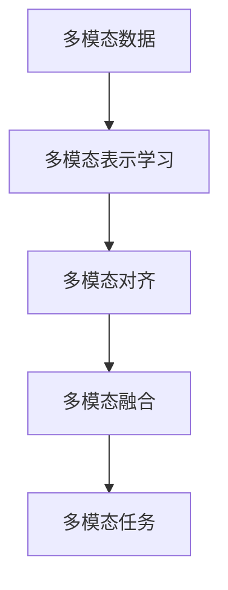

# 多模态大模型：技术原理与实战 单模态学习、多模态学习和跨模态学习的区别

## 1.背景介绍
### 1.1 人工智能的发展历程
#### 1.1.1 第一次人工智能浪潮：符号主义
#### 1.1.2 第二次人工智能浪潮：连接主义
#### 1.1.3 第三次人工智能浪潮：深度学习

### 1.2 模态的定义与分类
#### 1.2.1 模态的定义
#### 1.2.2 常见的模态类型
#### 1.2.3 不同模态的特点与应用场景

### 1.3 多模态学习的兴起
#### 1.3.1 多模态学习的定义
#### 1.3.2 多模态学习的优势
#### 1.3.3 多模态学习的发展历程

## 2.核心概念与联系
### 2.1 单模态学习
#### 2.1.1 单模态学习的定义
#### 2.1.2 单模态学习的特点
#### 2.1.3 单模态学习的局限性

### 2.2 多模态学习
#### 2.2.1 多模态学习的定义
#### 2.2.2 多模态学习的优势
#### 2.2.3 多模态学习的挑战

### 2.3 跨模态学习
#### 2.3.1 跨模态学习的定义 
#### 2.3.2 跨模态学习的特点
#### 2.3.3 跨模态学习的应用场景

### 2.4 三者之间的关系
#### 2.4.1 单模态学习与多模态学习的区别
#### 2.4.2 多模态学习与跨模态学习的区别
#### 2.4.3 三者之间的联系


## 3.核心算法原理具体操作步骤
### 3.1 多模态表示学习
#### 3.1.1 多模态表示学习的定义
#### 3.1.2 多模态表示学习的方法
##### 3.1.2.1 基于连接的多模态表示学习
##### 3.1.2.2 基于对齐的多模态表示学习
##### 3.1.2.3 基于融合的多模态表示学习

### 3.2 多模态对齐
#### 3.2.1 多模态对齐的定义
#### 3.2.2 多模态对齐的方法
##### 3.2.2.1 基于相关性的多模态对齐
##### 3.2.2.2 基于相似性的多模态对齐 
##### 3.2.2.3 基于语义的多模态对齐

### 3.3 多模态融合
#### 3.3.1 多模态融合的定义
#### 3.3.2 多模态融合的方法  
##### 3.3.2.1 早期融合
##### 3.3.2.2 晚期融合
##### 3.3.2.3 中间融合



## 4.数学模型和公式详细讲解举例说明
### 4.1 多模态表示学习的数学模型
#### 4.1.1 基于连接的多模态表示学习模型
$$z_i = f([x_i^1, x_i^2, ..., x_i^m])$$
其中，$z_i$ 表示第 $i$ 个样本的多模态表示，$x_i^j$ 表示第 $i$ 个样本的第 $j$ 种模态的特征，$f$ 表示连接函数。

#### 4.1.2 基于对齐的多模态表示学习模型
$$\min_{\theta} \sum_{i=1}^{n} \sum_{j=1}^{m} \|f_{\theta}(x_i^j) - z_i\|^2$$
其中，$\theta$ 表示模型参数，$f_{\theta}$ 表示映射函数，$z_i$ 表示第 $i$ 个样本的多模态表示。

#### 4.1.3 基于融合的多模态表示学习模型
$$z_i = g(f_1(x_i^1), f_2(x_i^2), ..., f_m(x_i^m))$$ 
其中，$z_i$ 表示第 $i$ 个样本的多模态表示，$x_i^j$ 表示第 $i$ 个样本的第 $j$ 种模态的特征，$f_j$ 表示第 $j$ 种模态的特征提取函数，$g$ 表示融合函数。

### 4.2 多模态对齐的数学模型
#### 4.2.1 基于相关性的多模态对齐模型
$$\max_{\theta} \sum_{i=1}^{n} \sum_{j=1}^{m} \sum_{k=1}^{m} \rho(f_{\theta}(x_i^j), f_{\theta}(x_i^k))$$
其中，$\theta$ 表示模型参数，$f_{\theta}$ 表示映射函数，$\rho$ 表示相关性度量函数。

#### 4.2.2 基于相似性的多模态对齐模型
$$\min_{\theta} \sum_{i=1}^{n} \sum_{j=1}^{m} \sum_{k=1}^{m} \|f_{\theta}(x_i^j) - f_{\theta}(x_i^k)\|^2$$
其中，$\theta$ 表示模型参数，$f_{\theta}$ 表示映射函数。

#### 4.2.3 基于语义的多模态对齐模型
$$\min_{\theta} \sum_{i=1}^{n} \sum_{j=1}^{m} \sum_{k=1}^{m} \|f_{\theta}(x_i^j) - g_{\theta}(x_i^k)\|^2$$
其中，$\theta$ 表示模型参数，$f_{\theta}$ 和 $g_{\theta}$ 分别表示两种模态的映射函数。

### 4.3 多模态融合的数学模型 
#### 4.3.1 早期融合模型
$$z_i = f([x_i^1, x_i^2, ..., x_i^m])$$
其中，$z_i$ 表示第 $i$ 个样本的多模态表示，$x_i^j$ 表示第 $i$ 个样本的第 $j$ 种模态的特征，$f$ 表示融合函数。

#### 4.3.2 晚期融合模型
$$y_i = g(f_1(x_i^1), f_2(x_i^2), ..., f_m(x_i^m))$$
其中，$y_i$ 表示第 $i$ 个样本的预测结果，$x_i^j$ 表示第 $i$ 个样本的第 $j$ 种模态的特征，$f_j$ 表示第 $j$ 种模态的特征提取函数，$g$ 表示融合函数。

#### 4.3.3 中间融合模型
$$z_i^{(l)} = g(f_1^{(l-1)}(z_i^{(l-1)}), f_2^{(l-1)}(z_i^{(l-1)}), ..., f_m^{(l-1)}(z_i^{(l-1)}))$$
其中，$z_i^{(l)}$ 表示第 $i$ 个样本在第 $l$ 层的多模态表示，$f_j^{(l-1)}$ 表示第 $j$ 种模态在第 $l-1$ 层的特征提取函数，$g$ 表示融合函数。

## 5.项目实践：代码实例和详细解释说明
### 5.1 多模态表示学习的代码实例
```python
import torch
import torch.nn as nn

class MultimodalRepresentationLearning(nn.Module):
    def __init__(self, input_dims, hidden_dim, output_dim):
        super(MultimodalRepresentationLearning, self).__init__()
        self.fc1 = nn.Linear(input_dims[0], hidden_dim)
        self.fc2 = nn.Linear(input_dims[1], hidden_dim)
        self.fc3 = nn.Linear(hidden_dim*2, output_dim)
        
    def forward(self, x1, x2):
        h1 = torch.relu(self.fc1(x1))
        h2 = torch.relu(self.fc2(x2))
        h = torch.cat([h1, h2], dim=1)
        z = self.fc3(h)
        return z
```
该代码实现了一个基于连接的多模态表示学习模型，其中 `input_dims` 表示两种模态的输入维度，`hidden_dim` 表示隐藏层维度，`output_dim` 表示输出维度。模型通过两个全连接层分别对两种模态的特征进行编码，然后将编码后的特征拼接起来，再通过一个全连接层得到最终的多模态表示。

### 5.2 多模态对齐的代码实例
```python
import torch
import torch.nn as nn

class MultimodalAlignment(nn.Module):
    def __init__(self, input_dim, hidden_dim):
        super(MultimodalAlignment, self).__init__()
        self.fc1 = nn.Linear(input_dim, hidden_dim)
        self.fc2 = nn.Linear(input_dim, hidden_dim)
        
    def forward(self, x1, x2):
        h1 = torch.relu(self.fc1(x1))
        h2 = torch.relu(self.fc2(x2))
        return h1, h2
    
def alignment_loss(h1, h2):
    return torch.mean((h1 - h2)**2)
```
该代码实现了一个基于相似性的多模态对齐模型，其中 `input_dim` 表示输入维度，`hidden_dim` 表示隐藏层维度。模型通过两个全连接层分别对两种模态的特征进行映射，然后通过 `alignment_loss` 函数计算两种模态映射后的特征之间的相似性损失，最小化该损失即可实现多模态对齐。

### 5.3 多模态融合的代码实例
```python
import torch
import torch.nn as nn

class MultimodalFusion(nn.Module):
    def __init__(self, input_dims, hidden_dims, output_dim):
        super(MultimodalFusion, self).__init__()
        self.fc1 = nn.Linear(input_dims[0], hidden_dims[0])
        self.fc2 = nn.Linear(input_dims[1], hidden_dims[1])
        self.fc3 = nn.Linear(sum(hidden_dims), output_dim)
        
    def forward(self, x1, x2):
        h1 = torch.relu(self.fc1(x1))
        h2 = torch.relu(self.fc2(x2))
        h = torch.cat([h1, h2], dim=1)
        y = self.fc3(h)
        return y
```
该代码实现了一个晚期融合模型，其中 `input_dims` 表示两种模态的输入维度，`hidden_dims` 表示两种模态的隐藏层维度，`output_dim` 表示输出维度。模型通过两个全连接层分别对两种模态的特征进行编码，然后将编码后的特征拼接起来，再通过一个全连接层得到最终的预测结果。

## 6.实际应用场景
### 6.1 图像-文本跨模态检索
图像-文本跨模态检索是指给定一张图像，从文本数据库中检索出与该图像语义相关的文本，或给定一段文本，从图像数据库中检索出与该文本语义相关的图像。多模态学习可以用于学习图像和文本之间的跨模态表示，从而实现图像-文本跨模态检索。

### 6.2 视频描述生成
视频描述生成是指给定一段视频，自动生成描述该视频内容的自然语言文本。多模态学习可以用于学习视频和文本之间的跨模态表示，从而实现视频描述生成。

### 6.3 语音-文本转换
语音-文本转换是指将语音信号转换为相应的文本。多模态学习可以用于学习语音和文本之间的跨模态表示，从而实现语音-文本转换。

### 6.4 情感分析
情感分析是指对文本、图像、视频等数据进行情感倾向性分析。多模态学习可以用于学习不同模态数据之间的情感表示，从而实现多模态情感分析。

## 7.工具和资源推荐
### 7.1 开源工具包
- MMF（Multimodal Framework）：Facebook开源的多模态学习框架，支持多种多模态任务。
- CMU-MultimodalSDK：卡内基梅隆大学开源的多模态学习工具包，支持多种多模态数据处理和特征提取。
- MuMiN（Multimodal Multitask Network）：清华大学开源的多模态多任务学习框架，支持多种多模态任务。

### 7.2 数据集
- MS-COCO（Microsoft Common Objects in Context）：包含图像及其对应的文本描述，常用于图像-文本跨模态检索和图像描述生成任务。
- Flickr30K：包含图像及其对应的文本描述