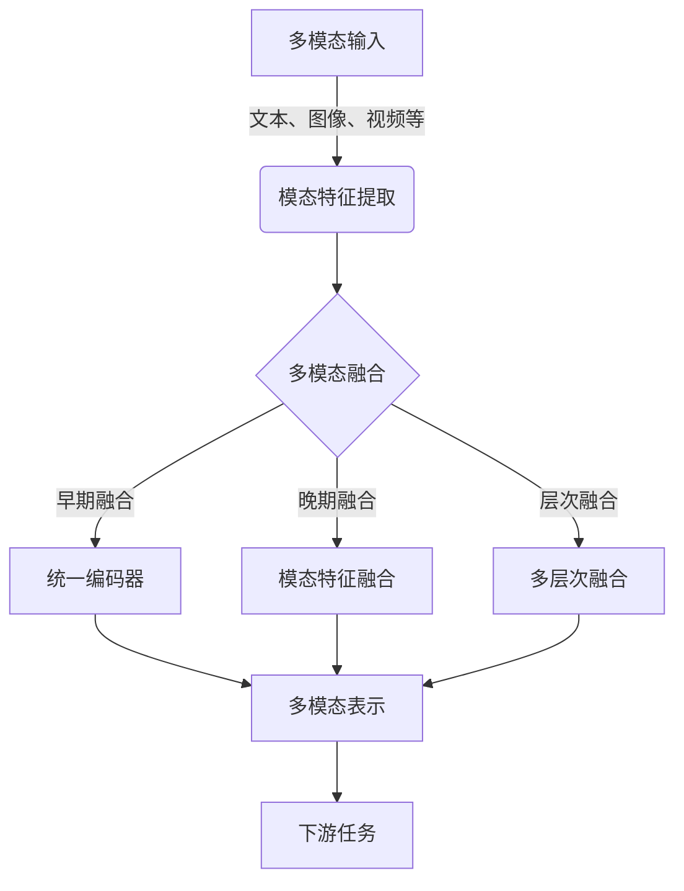

# 多模态大模型：技术原理与实战 多模态大模型的评测标准

## 1.背景介绍

### 1.1 人工智能的发展历程

人工智能(Artificial Intelligence, AI)是当代科技发展的重要领域之一,自20世纪50年代问世以来,已经经历了多个发展阶段。早期的人工智能系统主要采用符号主义方法,通过构建知识库和推理规则来模拟人类的思维过程。随着机器学习和深度学习技术的兴起,人工智能进入了数据驱动的新阶段,能够从海量数据中自动学习模型,在计算机视觉、自然语言处理等领域取得了突破性进展。

### 1.2 大模型的兴起

近年来,随着算力和数据的快速增长,大规模预训练语言模型(Large Pre-trained Language Models, LLMs)成为人工智能发展的新热点。这些巨大的神经网络模型通过在海量无标注文本数据上进行预训练,学习到了丰富的语义和世界知识,可以在下游任务中表现出强大的泛化能力。以GPT-3、PaLM等著名大模型为代表,它们不仅在自然语言处理任务上表现出色,还展现出一定的多模态能力,可以同时处理文本、图像等不同模态的数据。

### 1.3 多模态大模型的兴起

基于大模型在单一模态上的成功,多模态大模型(Multimodal Large Models, MLMs)应运而生。多模态大模型旨在构建统一的框架,融合视觉、语音、文本等多种模态的信息,实现更加通用和智能的人工智能系统。相比于传统的针对单一模态的模型,多模态大模型具有更强的表示能力和泛化性,能够捕捉不同模态之间的相关性,为复杂的多模态任务提供更好的解决方案。

## 2.核心概念与联系

### 2.1 多模态学习

多模态学习(Multimodal Learning)是指从多种模态的数据中学习知识表示和建模的过程。常见的模态包括文本、图像、视频、音频等,不同模态之间存在着复杂的相关性和互补性。多模态学习旨在利用这些模态之间的关联,提高模型的理解和推理能力。

例如,在图像描述任务中,模型需要同时处理图像和文本信息,捕捉两种模态之间的语义对应关系。在视频理解任务中,则需要融合视觉、音频和文本等多种模态的信息,全面理解视频内容。

### 2.2 多模态融合

多模态融合(Multimodal Fusion)是多模态学习的核心环节,旨在将来自不同模态的信息有效地整合起来。常见的融合策略包括早期融合、晚期融合和层次融合等。

- 早期融合(Early Fusion)将不同模态的原始数据拼接在一起,作为统一的输入送入模型进行端到端的学习。
- 晚期融合(Late Fusion)则是先分别对每种模态进行单独编码,然后将编码后的特征进行融合。
- 层次融合(Hierarchical Fusion)则在不同层次上进行融合,捕捉不同粒度的模态交互信息。

不同的融合策略各有优缺点,需要根据具体任务和数据特点进行选择和设计。

### 2.3 多模态表示学习

多模态表示学习(Multimodal Representation Learning)旨在学习能够同时编码多种模态信息的统一表示。相比于单独为每种模态学习表示,多模态表示能够捕捉不同模态之间的相关性,提高模型的泛化能力。

常见的多模态表示学习方法包括:

- 共享编码器(Shared Encoder):使用共享的编码器网络对不同模态的输入进行编码,得到统一的表示。
- 对比学习(Contrastive Learning):通过最大化不同模态之间的相似性,最小化同一模态内部的相似性,学习模态不变的表示。
- 自监督学习(Self-Supervised Learning):利用大量无标注数据,通过设计合理的预测任务,自监督地学习多模态表示。

合理的多模态表示是实现强大多模态模型的关键,能够有效地融合不同模态的信息,提高模型的理解和推理能力。

### 2.4 多模态大模型架构

多模态大模型通常采用统一的架构,将不同模态的输入并行送入模型,经过多层编码和融合后得到最终的多模态表示。常见的多模态大模型架构包括:

- Transformer架构:基于自注意力机制的Transformer编码器被广泛应用于多模态大模型中,能够有效捕捉不同模态之间的长程依赖关系。
- 双流架构(Two-Stream Architecture):将视觉和语言模态分别编码后,通过交互层对两种模态的表示进行融合。
- 统一架构(Unified Architecture):使用完全共享的Transformer编码器对所有模态的输入进行统一编码,得到融合了多模态信息的表示。

不同的架构各有优缺点,需要根据具体任务和数据特点进行选择和设计。合理的架构设计对于充分利用多模态信息、提高模型性能至关重要。

## 3.核心算法原理具体操作步骤

### 3.1 Transformer编码器

Transformer编码器是多模态大模型中常用的基础编码模块,它基于自注意力机制,能够有效捕捉输入序列中的长程依赖关系。Transformer编码器的核心操作步骤如下:

1. **输入embedding**:将不同模态的输入(如文本、图像等)映射到相同的embedding空间,得到对应的embedding向量序列。
2. **位置编码**:为每个embedding向量添加位置信息,使模型能够捕捉输入序列的位置依赖关系。
3. **多头自注意力**:通过计算查询(Query)、键(Key)和值(Value)之间的相似性,捕捉输入序列中不同位置之间的依赖关系,得到注意力加权后的表示。
4. **前馈网络**:对自注意力层的输出进行非线性变换,提取更高级的特征表示。
5. **层归一化和残差连接**:通过层归一化和残差连接,增强模型的稳定性和梯度传播能力。

通过堆叠多个Transformer编码器层,模型可以逐层捕捉输入序列中的长程依赖关系,得到更加丰富和抽象的表示。

### 3.2 多模态融合

多模态融合是多模态大模型的核心环节,旨在将来自不同模态的信息有效地整合起来。常见的融合策略包括:

1. **早期融合**:将不同模态的原始数据拼接在一起,作为统一的输入送入Transformer编码器进行端到端的学习。这种方式简单直接,但可能无法充分捕捉不同模态之间的交互关系。
2. **晚期融合**:先分别对每种模态进行单独编码,得到对应的模态特征表示,然后将这些特征表示进行拼接或加权求和,得到最终的多模态表示。这种方式能够保留每种模态的独特特征,但融合策略较为简单。
3. **层次融合**:在不同层次上进行融合,捕捉不同粒度的模态交互信息。例如,在Transformer编码器的每一层都进行跨模态注意力计算,融合不同模态的表示;或者在编码器的输出上进行融合,得到最终的多模态表示。

不同的融合策略各有优缺点,需要根据具体任务和数据特点进行选择和设计。合理的融合策略对于充分利用多模态信息、提高模型性能至关重要。

### 3.3 多模态对比学习

多模态对比学习(Multimodal Contrastive Learning)是一种自监督的多模态表示学习方法,它通过最大化不同模态之间的相似性,最小化同一模态内部的相似性,学习模态不变的表示。

具体操作步骤如下:

1. **数据增强**:对输入数据进行不同的数据增强操作(如裁剪、旋转、遮挡等),得到同一个样本的多个增强视图。
2. **编码器网络**:将增强后的视图输入到编码器网络(如Transformer编码器)中,得到对应的表示向量。
3. **对比损失计算**:计算不同增强视图之间的相似性(正例对)和不同样本之间的相似性(负例对),构建对比损失函数。
4. **损失优化**:通过优化对比损失函数,使得不同模态的正例对相似性最大化,负例对相似性最小化,从而学习到模态不变的表示。

多模态对比学习能够充分利用大量无标注数据,自监督地学习到融合了多模态信息的统一表示,提高了模型的泛化能力和鲁棒性。

## 4.数学模型和公式详细讲解举例说明

### 4.1 自注意力机制

自注意力机制是Transformer模型的核心,它通过计算查询(Query)、键(Key)和值(Value)之间的相似性,捕捉输入序列中不同位置之间的依赖关系。

给定一个输入序列 $X = (x_1, x_2, \dots, x_n)$,自注意力机制的计算过程如下:

1. 线性投影:将输入序列 $X$ 分别映射到查询 $Q$、键 $K$ 和值 $V$ 的空间中:

$$Q = XW^Q, K = XW^K, V = XW^V$$

其中 $W^Q, W^K, W^V$ 分别是查询、键和值的线性投影矩阵。

2. 相似性计算:计算查询 $Q$ 和键 $K$ 之间的相似性得分矩阵 $S$:

$$S = \frac{QK^T}{\sqrt{d_k}}$$

其中 $d_k$ 是键的维度,用于缩放相似性得分。

3. 软性掩码:对相似性得分矩阵 $S$ 进行软性掩码,以忽略不相关的位置:

$$\widetilde{S} = \text{Mask}(S, \text{mask})$$

其中 $\text{mask}$ 是一个掩码张量,用于指定需要忽略的位置。

4. 注意力加权:使用掩码后的相似性得分 $\widetilde{S}$ 对值 $V$ 进行加权求和,得到注意力输出 $O$:

$$O = \text{Softmax}(\widetilde{S})V$$

自注意力机制能够自适应地捕捉输入序列中不同位置之间的依赖关系,是Transformer模型取得巨大成功的关键所在。

### 4.2 多头注意力

为了进一步提高模型的表示能力,Transformer中引入了多头注意力(Multi-Head Attention)机制。多头注意力将注意力分成多个子空间,每个子空间都独立地执行自注意力操作,最后将所有子空间的结果进行拼接。

给定查询 $Q$、键 $K$ 和值 $V$,多头注意力的计算过程如下:

1. 线性投影:将 $Q$、$K$ 和 $V$ 分别投影到 $h$ 个子空间中:

$$\begin{aligned}
Q_i &= QW_i^Q &K_i &= KW_i^K &V_i &= VW_i^V \\
&\text{for } i = 1, \dots, h
\end{aligned}$$

其中 $W_i^Q, W_i^K, W_i^V$ 分别是第 $i$ 个子空间的查询、键和值的线性投影矩阵。

2. 自注意力计算:在每个子空间中独立执行自注意力操作:

$$\text{head}_i = \text{Attention}(Q_i, K_i, V_i)$$

3. 多头拼接:将所有子空间的注意力输出拼接起来:

$$\text{MultiHead}(Q, K, V) = \text{Concat}(\text{head}_1, \dots, \text{head}_h)W^O$$

其中 $W^O$ 是一个可学习的线性投影矩阵,用于将{"msg_type":"generate_answer_finish","data":"","from_module":null,"from_unit":null}