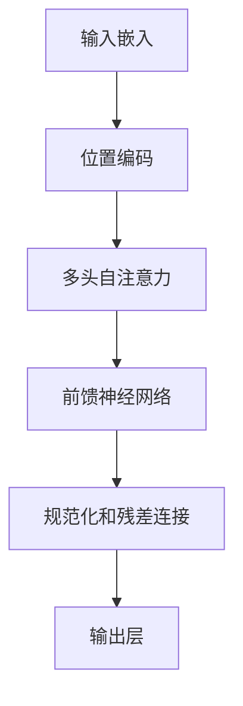
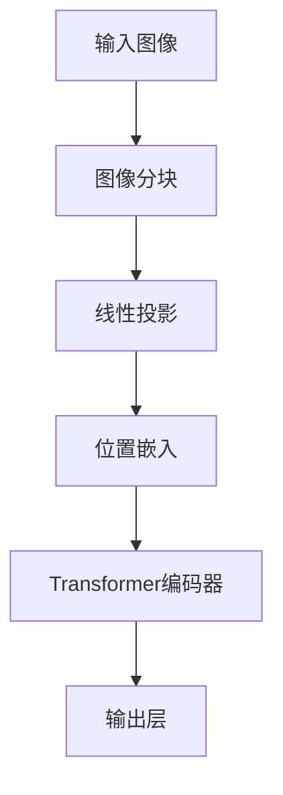
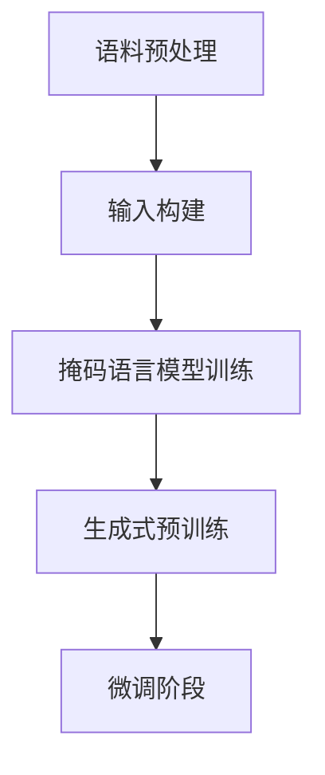
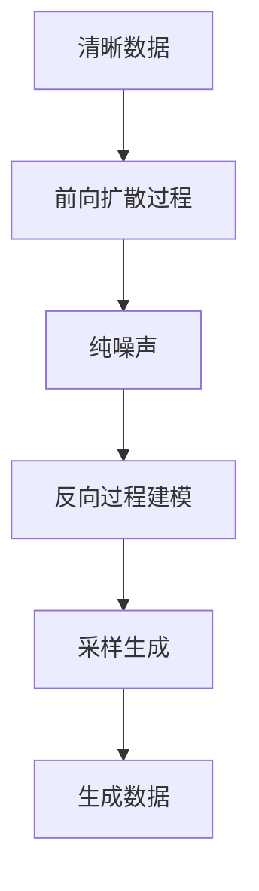

# 多模态大模型：技术原理与实战 看清GPT的进化史和创新点

## 1.背景介绍

### 1.1 人工智能发展历程

人工智能的发展经历了几个重要阶段。最初的人工智能系统主要采用基于规则的方法,需要人工编写大量规则来描述问题域知识。这种方法存在知识获取困难、缺乏通用性等缺陷。

### 1.2 机器学习的兴起

20世纪90年代,机器学习算法开始兴起,主要包括决策树、支持向量机、贝叶斯方法等。这些算法能够从数据中自动学习模型,不再需要人工编写规则,有效解决了知识获取的难题。

### 1.3 深度学习的飞速发展

21世纪初,benefiting from大量数据、强大的计算能力和新的训练技术,深度学习取得了突破性进展,在计算机视觉、自然语言处理、语音识别等领域表现优异。

### 1.4 大模型时代的到来

2018年,Transformer模型的出现为自然语言处理领域带来了革命性变化。随后,大型预训练语言模型如BERT、GPT等相继问世,展现出强大的泛化能力。2022年,OpenAI发布的GPT-3大模型引发了广泛关注,标志着大模型时代的到来。

### 1.5 多模态大模型的崛起

单模态大模型虽然在各自领域取得了卓越成就,但无法充分利用多种模态信息。多模态大模型通过融合文本、图像、视频等多种模态数据,有望在更广泛的领域发挥重要作用,成为人工智能发展的新趋势。

## 2.核心概念与联系

### 2.1 大模型

大模型指的是参数量极大(通常超过10亿个参数)的深度神经网络模型。相比于传统的小型模型,大模型具有更强的表示能力和泛化性能。

典型的大模型包括:

- GPT-3: 拥有1750亿个参数,是目前最大的自然语言处理模型。
- PaLM: 拥有5400亿个参数,是谷歌发布的大型多模态模型。
- Stable Diffusion: 一种用于图像生成的大型扩散模型,参数量超过10亿。

### 2.2 多模态

多模态是指同时处理多种模态数据的能力,如文本、图像、视频、音频等。多模态模型能够融合不同模态的信息,提高认知和理解能力。

多模态技术在以下领域有着广泛应用:

- 视觉问答: 根据图像内容回答相关问题。
- 图像描述生成: 根据图像生成对应的文本描述。
- 多模态对话系统: 融合视觉、语音和文本信息进行人机对话。

### 2.3 预训练与微调

预训练是指在大规模无标注数据上训练模型,学习通用的表示能力。微调则是在特定任务的标注数据上,基于预训练模型进行进一步训练,使模型适应特定任务。

预训练和微调的技术路线在自然语言处理和计算机视觉领域得到了广泛应用,大大提高了模型的性能和泛化能力。

### 2.4 注意力机制

注意力机制是Transformer模型的核心,它允许模型动态地关注输入序列的不同部分,捕捉长距离依赖关系。注意力机制的引入大大提高了序列建模的性能。

多头注意力机制通过并行计算多个注意力向量,进一步增强了模型的表示能力。注意力机制在自然语言处理、计算机视觉等多个领域发挥着关键作用。

### 2.5 模态融合

多模态模型需要将不同模态的信息进行融合,以捕捉跨模态的关系和相互作用。常见的模态融合方法包括:

- 早期融合: 在输入层将不同模态的特征拼接。
- 晚期融合: 在高层将不同模态的特征进行融合。
- 交互融合: 在不同层次上实现模态之间的交互。

模态融合的方式直接影响了模型的性能和泛化能力,是多模态模型的核心挑战之一。

## 3.核心算法原理具体操作步骤

### 3.1 Transformer模型

Transformer是一种基于注意力机制的序列建模架构,它的核心思想是通过自注意力机制捕捉序列中任意两个位置之间的依赖关系。Transformer模型的具体操作步骤如下:

1. **输入嵌入**: 将输入序列(如文本或图像)映射为嵌入向量序列。
2. **位置编码**: 为每个位置添加位置信息,使模型能够捕捉序列的顺序信息。
3. **多头自注意力**: 计算查询(Query)、键(Key)和值(Value)之间的注意力权重,并根据权重对值向量进行加权求和,得到注意力输出。
4. **前馈神经网络**: 对注意力输出进行非线性变换,提取更高层次的特征表示。
5. **规范化和残差连接**: 对每一层的输出进行归一化和残差连接,以提高模型的稳定性和收敛性。
6. **输出层**: 根据任务需求,将Transformer的输出映射为所需的输出形式(如分类、生成等)。

通过堆叠多个Transformer编码器或解码器层,模型可以学习到更深层次的表示,从而提高性能。

### 3.2 BERT模型

BERT(Bidirectional Encoder Representations from Transformers)是一种基于Transformer的双向预训练语言模型,它能够同时捕捉输入序列中的左右上下文信息。BERT的训练过程包括以下两个阶段:

1. **预训练阶段**:
   - **掩码语言模型(Masked Language Modeling, MLM)**: 随机掩码部分输入tokens,模型需要预测被掩码的tokens。
   - **下一句预测(Next Sentence Prediction, NSP)**: 判断两个句子是否相邻,以捕捉句子之间的关系。

2. **微调阶段**: 在特定任务的标注数据上,基于预训练模型进行进一步的微调,使模型适应特定任务。

BERT模型的预训练方式使其能够学习到丰富的语义和上下文信息,在多个自然语言处理任务上取得了卓越的性能。

### 3.3 Vision Transformer

Vision Transformer(ViT)是将Transformer模型应用于计算机视觉任务的一种方法。它将图像划分为多个patches(图像块),并将每个patch投影为一个向量序列,作为Transformer的输入。ViT的操作步骤如下:

1. **图像分块**: 将输入图像划分为多个不重叠的patches。
2. **线性投影**: 将每个patch投影为一个固定维度的向量。
3. **位置嵌入**: 为每个patch添加位置信息,使模型能够捕捉patch的位置关系。
4. **Transformer编码器**: 使用标准的Transformer编码器对patch序列进行建模。
5. **输出层**: 根据任务需求(如分类、检测等),将Transformer的输出映射为所需的输出形式。

ViT通过直接对图像patches进行建模,避免了传统卷积神经网络的手工设计特征提取过程,展现出强大的性能和泛化能力。

### 3.4 GPT模型

GPT(Generative Pre-trained Transformer)是一种基于Transformer的自回归语言模型,它能够根据给定的文本前缀生成连贯的文本序列。GPT模型的训练过程包括以下步骤:

1. **语料预处理**: 将大规模文本语料进行标记化、构建字典等预处理操作。
2. **输入构建**: 将语料按照特定长度划分为多个序列,每个序列作为模型的一个输入样本。
3. **掩码语言模型训练**: 对每个序列,掩码最后一个token,模型需要预测被掩码的token。
4. **生成式预训练**: 在大规模语料上进行自回归式的预训练,使模型学习到生成连贯文本的能力。
5. **微调阶段**: 在特定任务的标注数据上,基于预训练模型进行进一步的微调,使模型适应特定任务。

GPT模型通过生成式预训练,能够学习到丰富的语言知识和上下文信息,在文本生成、摘要、问答等任务上表现出色。

### 3.5 Diffusion模型

Diffusion模型是一种基于扩散过程的生成模型,它通过学习从噪声到数据的反向过程,实现了高质量的图像、音频和视频生成。Diffusion模型的训练过程包括以下步骤:

1. **前向扩散过程**: 将清晰的数据逐步添加高斯噪声,直到完全变为纯噪声。
2. **反向过程建模**: 训练一个神经网络模型,学习从噪声到清晰数据的反向过程。
3. **采样生成**: 从纯噪声开始,通过反复应用反向过程,逐步去噪并生成目标数据。

Diffusion模型的优点在于能够生成高质量和多样性的输出,并且具有很强的理论保证。Stable Diffusion就是一种基于Diffusion模型的大型图像生成模型。

## 4.数学模型和公式详细讲解举例说明

### 4.1 注意力机制

注意力机制是Transformer模型的核心,它允许模型动态地关注输入序列的不同部分,捕捉长距离依赖关系。注意力分数的计算公式如下:

$$
\text{Attention}(Q, K, V) = \text{softmax}\left(\frac{QK^T}{\sqrt{d_k}}\right)V
$$

其中:
- $Q$是查询(Query)向量
- $K$是键(Key)向量
- $V$是值(Value)向量
- $d_k$是缩放因子,用于防止内积过大导致梯度饱和

多头注意力机制通过并行计算多个注意力向量,进一步增强了模型的表示能力:

$$
\text{MultiHead}(Q, K, V) = \text{Concat}(head_1, \dots, head_h)W^O
$$
$$
\text{where } head_i = \text{Attention}(QW_i^Q, KW_i^K, VW_i^V)
$$

其中$W_i^Q$、$W_i^K$、$W_i^V$和$W^O$是可学习的投影矩阵。

### 4.2 掩码语言模型

掩码语言模型(Masked Language Modeling, MLM)是BERT等预训练语言模型的核心训练目标之一。它的基本思想是随机掩码部分输入tokens,模型需要预测被掩码的tokens。

对于输入序列$X = (x_1, x_2, \dots, x_n)$,我们随机选择一些位置进行掩码,得到掩码后的序列$\hat{X} = (\hat{x}_1, \hat{x}_2, \dots, \hat{x}_n)$。模型的目标是最大化掩码位置的条件概率:

$$
\max_\theta \sum_{i=1}^n \log P(x_i | \hat{X}, \theta)
$$

其中$\theta$是模型参数。通过这种方式,模型能够学习到丰富的上下文信息和语义知识。

### 4.3 对比学习

对比学习(Contrastive Learning)是一种无监督表示学习方法,它通过最大化相似样本之间的相似度,最小化不相似样本之间的相似度,来学习数据的高质量表示。

对比学习的损失函数通常采用对比损失(Contrastive Loss):