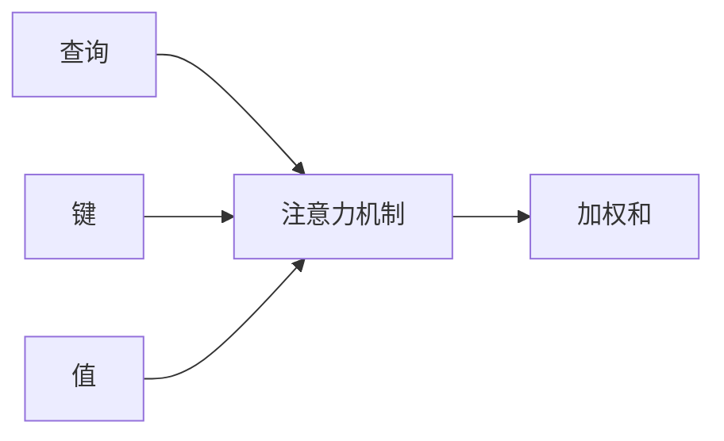
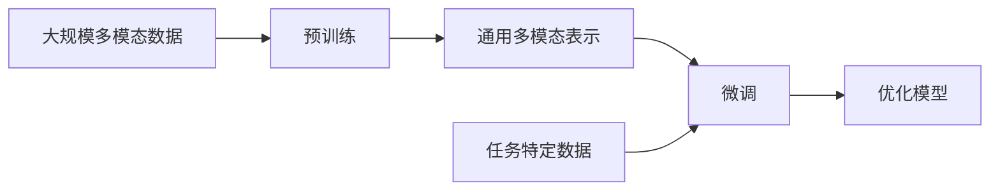
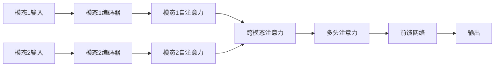
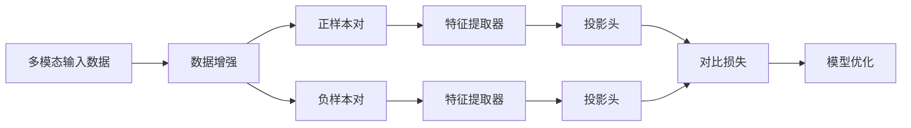
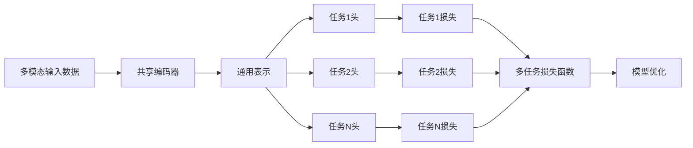

# 多模态大模型：技术原理与实战 语音多模态技术

## 1.背景介绍

### 1.1 多模态人工智能的兴起

人工智能领域正在经历一场革命性的变革。传统的人工智能系统主要关注单一模态数据,如文本或图像。然而,现实世界中的信息通常以多种形式存在,包括文本、图像、语音、视频等。为了更好地理解和处理这种多模态信息,多模态人工智能应运而生。

多模态人工智能旨在将来自不同模态(如视觉、听觉、语言等)的信息进行融合,从而获得更全面、更丰富的数据表示和理解。这种跨模态的信息融合有助于提高人工智能系统的性能,使其能够更好地模拟人类的认知能力。

### 1.2 语音多模态技术的重要性

在多模态人工智能领域,语音多模态技术占据着重要地位。语音不仅是人类最自然的交互方式之一,而且与其他模态(如视觉和文本)密切相关。通过将语音与其他模态相结合,我们可以实现更自然、更智能的人机交互体验。

语音多模态技术在诸多应用领域都有广泛的应用前景,包括智能助手、虚拟现实、机器人技术、多媒体分析等。它能够提高语音识别、语音合成、语音翻译等任务的准确性和自然度,从而增强人机交互的流畅性和用户体验。

### 1.3 大模型在语音多模态技术中的作用

近年来,大模型(Large Models)在自然语言处理、计算机视觉等领域取得了卓越的成就。大模型通过在海量数据上进行预训练,能够学习到丰富的知识表示,并在下游任务中表现出强大的泛化能力。

在语音多模态技术领域,大模型也开始发挥着越来越重要的作用。通过预训练大模型,我们可以在不同模态之间建立更紧密的联系,从而实现更高效的跨模态融合和理解。此外,大模型还能够捕捉语音数据中的细微模式和语义信息,为语音识别、合成和翻译等任务提供更精准的解决方案。

本文将重点探讨多模态大模型在语音多模态技术中的应用,包括核心概念、技术原理、算法实现、实际应用场景等,旨在为读者提供全面的理解和实践指导。

## 2.核心概念与联系

### 2.1 多模态表示学习

多模态表示学习(Multimodal Representation Learning)是多模态人工智能的核心概念之一。它旨在从不同模态的数据中学习出一种统一的表示形式,使得不同模态之间的信息可以进行有效的融合和交互。

在语音多模态技术中,多模态表示学习通常需要将语音信号与其他模态(如文本、图像或视频)进行关联,从而学习出一种能够捕捉跨模态关系的表示形式。这种表示形式不仅能够保留每个模态的独特特征,还能够捕捉不同模态之间的相关性和互补性。

多模态表示学习的关键在于设计合适的神经网络架构和损失函数,以实现有效的跨模态融合。常见的方法包括共享表示、对齐表示、翻译表示等。

### 2.2 注意力机制

注意力机制(Attention Mechanism)是多模态大模型中一种广泛应用的技术。它允许模型在处理序列数据时,动态地关注输入序列的不同部分,从而提高模型的性能和解释能力。

在语音多模态技术中,注意力机制可以帮助模型更好地捕捉语音信号与其他模态之间的关系。例如,在语音识别任务中,注意力机制可以让模型关注语音信号中与文本转录相关的部分,从而提高识别准确率。

注意力机制通常与序列到序列(Seq2Seq)模型、transformer等架构相结合,在机器翻译、语音识别、图像字幕生成等任务中发挥着重要作用。

### 2.3 预训练与微调

预训练(Pre-training)和微调(Fine-tuning)是大模型中常用的训练范式。预训练旨在在大规模无监督数据上学习通用的表示形式,而微调则是在特定任务上对预训练模型进行进一步调整和优化。

在语音多模态技术中,预训练和微调也扮演着重要角色。通过在大规模多模态数据上进行预训练,模型可以学习到丰富的跨模态知识表示,从而为下游任务奠定良好的基础。随后,在特定的语音多模态任务上进行微调,可以进一步提高模型的性能和泛化能力。

常见的预训练方法包括自监督学习、对比学习、自回归等。微调则需要设计合适的优化策略和损失函数,以适应特定任务的需求。

## 3.核心算法原理具体操作步骤

### 3.1 多模态transformer

Transformer是一种广泛应用于自然语言处理和计算机视觉领域的神经网络架构。它基于自注意力机制,能够有效地捕捉序列数据中的长程依赖关系。

在语音多模态技术中,多模态transformer被用于融合来自不同模态的信息。它通过设计跨模态注意力机制,让不同模态之间的表示相互关注和交互,从而实现有效的多模态融合。

多模态transformer的核心操作步骤如下:

1. **输入编码**: 将来自不同模态的输入数据(如语音、文本、图像等)编码为对应的特征表示。

2. **模态特定自注意力**: 对每个模态的特征表示进行自注意力计算,捕捉单个模态内部的依赖关系。

3. **跨模态注意力**: 计算不同模态之间的注意力权重,使模态特征能够相互关注和融合。

4. **多头注意力**: 使用多头注意力机制,从不同子空间捕捉模态间的关系。

5. **前馈网络**: 对融合后的多模态表示进行非线性变换,提取更高级的特征。

6. **输出**: 根据任务需求,对融合后的多模态表示进行进一步处理,输出最终结果。

### 3.2 多模态对比学习

对比学习(Contrastive Learning)是一种自监督学习方法,通过最大化相似样本之间的相似性,最小化不相似样本之间的相似性,来学习数据的有效表示。

在语音多模态技术中,对比学习可以用于从不同模态的数据中学习一种统一的表示形式。具体操作步骤如下:

1. **数据增强**: 对输入数据进行数据增强,生成正样本(相似样本对)和负样本(不相似样本对)。

2. **特征提取**: 使用编码器网络(如CNN、Transformer等)从正负样本中提取特征表示。

3. **投影头**: 将提取的特征表示映射到一个低维的潜在空间,以获得更紧凑的表示。

4. **对比损失计算**: 计算正样本对和负样本对在潜在空间中的相似性,构建对比损失函数。

5. **模型优化**: 通过最小化对比损失函数,使正样本对的相似性最大化,负样本对的相似性最小化,从而学习到一种统一的多模态表示。

对比学习可以在无监督或半监督设置下进行,不需要大量的标注数据。它能够捕捉数据的内在结构和模式,为下游任务提供有效的表示基础。

### 3.3 多任务学习

多任务学习(Multi-task Learning)是一种同时优化多个相关任务的学习范式。它通过共享底层表示和知识,提高了模型的泛化能力和数据利用效率。

在语音多模态技术中,多任务学习可以用于同时优化多个相关的语音任务,如语音识别、语音合成、语音翻译等。具体操作步骤如下:

1. **任务特定头**: 为每个任务设计一个特定的输出头,用于预测该任务的目标输出。

2. **共享编码器**: 使用一个共享的编码器网络(如Transformer、CNN等)从输入数据中提取通用的特征表示。

3. **多任务损失函数**: 构建一个多任务损失函数,将每个任务的损失加权求和。

4. **模型优化**: 通过优化多任务损失函数,同时优化所有任务,使模型能够学习到更加通用和鲁棒的表示。

5. **任务权重调整**: 根据任务的重要性和难易程度,动态调整每个任务在损失函数中的权重。

多任务学习能够提高模型的泛化能力和数据利用效率,同时也增加了模型的复杂性和训练难度。在实际应用中,需要根据具体情况权衡利弊。

## 4.数学模型和公式详细讲解举例说明

### 4.1 自注意力机制

自注意力机制是transformer架构中的核心组件,它能够捕捉序列数据中的长程依赖关系。在语音多模态技术中,自注意力机制被广泛应用于语音特征的建模和融合。

给定一个序列 $X = (x_1, x_2, \dots, x_n)$,其中 $x_i \in \mathbb{R}^{d_x}$ 是第 $i$ 个时间步的特征向量,自注意力机制的计算过程如下:

1. **查询(Query)、键(Key)、值(Value)映射**:

   $$
   Q = XW^Q, K = XW^K, V = XW^V
   $$

   其中 $W^Q, W^K, W^V \in \mathbb{R}^{d_x \times d_k}$ 是可学习的线性映射矩阵,用于将输入特征映射到查询、键和值空间。

2. **计算注意力权重**:

   $$
   \text{Attention}(Q, K, V) = \text{softmax}\left(\frac{QK^T}{\sqrt{d_k}}\right)V
   $$

   其中 $\text{softmax}$ 函数用于归一化注意力权重,确保权重之和为 1。$\sqrt{d_k}$ 是一个缩放因子,用于防止梯度过大或过小。

3. **多头注意力**:

   为了从不同的子空间捕捉不同的注意力模式,多头注意力机制将注意力过程独立运行 $h$ 次,然后将结果拼接:

   $$
   \text{MultiHead}(Q, K, V) = \text{Concat}(\text{head}_1, \dots, \text{head}_h)W^O
   $$

   其中 