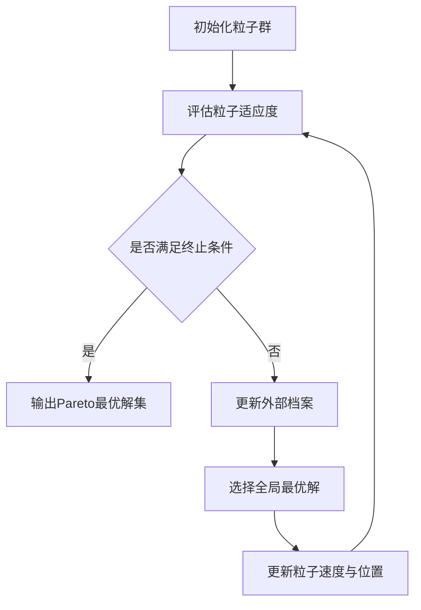

# 多目标优化中的粒子群算法:MOPSO详解

## 1. 背景介绍

多目标优化问题(Multi-objective Optimization Problem, MOP)在现实世界中普遍存在,如工程设计、金融投资、生产调度等领域。与单目标优化不同,MOP需要同时优化多个通常相互冲突的目标函数,因此很难找到一个绝对最优的解,而是要寻求一组折中的Pareto最优解。

粒子群优化算法(Particle Swarm Optimization, PSO)是一种基于群体智能的启发式优化算法,由于其结构简单、易实现、收敛速度快等优点,已广泛应用于求解单目标优化问题。近年来,研究者们将PSO扩展到多目标优化领域,提出了多目标粒子群优化算法(Multi-objective Particle Swarm Optimization, MOPSO)。本文将详细介绍MOPSO的基本原理、算法步骤、数学模型,并通过代码实例和应用案例,帮助读者深入理解和掌握这一强大的优化工具。

### 1.1 多目标优化问题的数学定义
#### 1.1.1 决策变量与目标函数
#### 1.1.2 Pareto最优解的概念
#### 1.1.3 MOP的一般数学模型

### 1.2 经典的多目标优化算法
#### 1.2.1 权重聚合法
#### 1.2.2 约束法 
#### 1.2.3 进化算法

### 1.3 粒子群优化算法
#### 1.3.1 PSO的基本原理
#### 1.3.2 PSO的数学模型
#### 1.3.3 PSO求解单目标优化问题

## 2. MOPSO的核心概念与关联

### 2.1 Pareto支配关系
#### 2.1.1 Pareto支配的定义
#### 2.1.2 非支配解的概念
#### 2.1.3 Pareto前沿面

### 2.2 外部档案(External Archive)
#### 2.2.1 外部档案的作用
#### 2.2.2 外部档案的更新策略
#### 2.2.3 外部档案的大小控制

### 2.3 拥挤度(Crowding Distance)
#### 2.3.1 拥挤度的定义
#### 2.3.2 拥挤度的计算方法 
#### 2.3.3 拥挤度在选择策略中的应用

### 2.4 领导者选择策略
#### 2.4.1 基于Pareto支配的选择
#### 2.4.2 基于拥挤度的选择
#### 2.4.3 Sigma方法

## 3. MOPSO算法原理与操作步骤

### 3.1 MOPSO算法框架
#### 3.1.1 初始化粒子群
#### 3.1.2 更新外部档案
#### 3.1.3 选择全局最优解
#### 3.1.4 更新粒子速度与位置
#### 3.1.5 终止条件判断

### 3.2 粒子速度与位置更新公式
#### 3.2.1 基本PSO的更新公式
#### 3.2.2 MOPSO的速度更新公式
#### 3.2.3 MOPSO的位置更新公式

### 3.3 MOPSO算法的伪代码

## 4. MOPSO的数学模型与公式推导

### 4.1 多目标优化问题的一般模型
$$
\begin{aligned}
\min \quad & F(x)=(f_1(x),f_2(x),\ldots,f_m(x)) \\
\text{s.t.} \quad & g_i(x) \leq 0, \quad i=1,2,\ldots,p \\
& h_j(x) = 0, \quad j=1,2,\ldots,q \\
& x \in \Omega
\end{aligned}
$$

其中,$x=(x_1,x_2,\ldots,x_n)$为$n$维决策变量,$\Omega$为决策空间,$F(x)$为$m$维目标函数,$g_i(x)$和$h_j(x)$分别为不等式和等式约束条件。

### 4.2 Pareto支配关系的数学定义
对于两个决策向量$u,v \in \Omega$,若满足以下条件之一,则称$u$支配$v$(记为$u \prec v$):

1. $\forall i \in \{1,2,\ldots,m\}: f_i(u) \leq f_i(v)$
2. $\exists j \in \{1,2,\ldots,m\}: f_j(u) < f_j(v)$

若不存在任何一个决策向量支配$u$,则称$u$为非支配解或Pareto最优解。

### 4.3 拥挤度的计算公式
对于目标空间中的解$i$,其拥挤度$CD_i$的计算公式为:

$$
CD_i = \sum_{j=1}^m \frac{f_j^{i+1} - f_j^{i-1}}{f_j^{\max} - f_j^{\min}}
$$

其中,$f_j^{i+1}$和$f_j^{i-1}$分别为解$i$在第$j$个目标上的相邻解,$f_j^{\max}$和$f_j^{\min}$为第$j$个目标的最大值和最小值。

### 4.4 MOPSO的速度更新公式
在MOPSO中,粒子$i$在第$t$次迭代时的速度更新公式为:

$$
v_i^{t+1} = w v_i^t + c_1 r_1 (p_i^t - x_i^t) + c_2 r_2 (p_g^t - x_i^t)
$$

其中,$w$为惯性权重,$c_1$和$c_2$为加速常数,$r_1$和$r_2$为$[0,1]$内的随机数,$p_i^t$为粒子$i$在$t$时刻的个体最优解,$p_g^t$为$t$时刻的全局最优解。

### 4.5 MOPSO的位置更新公式
粒子$i$在第$t$次迭代后的位置更新公式为:

$$
x_i^{t+1} = x_i^t + v_i^{t+1}
$$

## 5. MOPSO的代码实现与案例分析

### 5.1 MOPSO算法的Python实现
#### 5.1.1 粒子类的定义
#### 5.1.2 外部档案类的定义
#### 5.1.3 MOPSO主函数的实现

### 5.2 ZDT1测试函数的求解
#### 5.2.1 ZDT1函数的定义
#### 5.2.2 MOPSO求解ZDT1的参数设置
#### 5.2.3 实验结果与分析

### 5.3 DTLZ2测试函数的求解  
#### 5.3.1 DTLZ2函数的定义
#### 5.3.2 MOPSO求解DTLZ2的参数设置
#### 5.3.3 实验结果与分析

## 6. MOPSO的工程应用场景

### 6.1 多目标工程设计优化
#### 6.1.1 机械结构设计
#### 6.1.2 电路系统设计
#### 6.1.3 建筑布局规划

### 6.2 多目标调度优化
#### 6.2.1 生产调度
#### 6.2.2 能源调度
#### 6.2.3 交通调度

### 6.3 多目标金融优化
#### 6.3.1 投资组合优化
#### 6.3.2 风险管理
#### 6.3.3 信用评估

## 7. MOPSO的相关工具与资源

### 7.1 开源MOPSO工具包
#### 7.1.1 jMetal
#### 7.1.2 PlatEMO
#### 7.1.3 MOEA Framework

### 7.2 MOPSO的可视化工具
#### 7.2.1 Matplotlib
#### 7.2.2 Plotly
#### 7.2.3 D3.js

### 7.3 MOPSO的在线学习资源
#### 7.3.1 MOOC课程
#### 7.3.2 YouTube教程
#### 7.3.3 GitHub项目

## 8. MOPSO的发展趋势与挑战

### 8.1 MOPSO的改进方向
#### 8.1.1 自适应参数调整策略
#### 8.1.2 多种群协作机制
#### 8.1.3 混合其他启发式算法

### 8.2 MOPSO的理论研究问题
#### 8.2.1 收敛性分析
#### 8.2.2 复杂度分析
#### 8.2.3 参数敏感性分析

### 8.3 MOPSO的应用拓展
#### 8.3.1 动态多目标优化
#### 8.3.2 不确定多目标优化
#### 8.3.3 多目标组合优化

## 9. 附录:MOPSO的常见问题解答

### 9.1 如何选择MOPSO的参数?
### 9.2 MOPSO的收敛速度如何?
### 9.3 MOPSO能否保证找到真正的Pareto前沿?
### 9.4 MOPSO的时间复杂度如何?
### 9.5 MOPSO如何处理约束条件?

作者：禅与计算机程序设计艺术 / Zen and the Art of Computer Programming