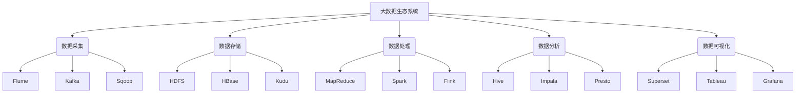

# 大数据 (Big Data)

## 1. 背景介绍

在当今时代，数据已经成为了一种新的战略资源和生产力。随着互联网、物联网、移动通信等技术的快速发展,数据的产生速度和数据量都呈现出爆炸式增长趋势。传统的数据处理和存储方式已经无法满足现代大数据时代的需求。因此,大数据技术应运而生,旨在高效地收集、存储、处理和分析海量的结构化、半结构化和非结构化数据,从中发现隐藏的价值和见解,为企业和组织的决策提供支持。

### 1.1 大数据的定义

大数据(Big Data)指的是需要新的处理模式才能具有更强的决策力、洞见发现能力和流程优化能力的海量、高增长率和多样化的信息资产。大数据具有以下四个特征,被称为4V特征:

- 体量大(Volume)
- 种类多(Variety)
- 获取速度快(Velocity)
- 价值密度低(Value)

### 1.2 大数据的重要性

大数据技术的兴起为企业和组织带来了巨大的机遇和挑战。通过对海量数据进行深入分析和挖掘,可以发现隐藏其中的价值,为企业提供更好的决策支持、优化业务流程、发现新的商业模式和创新机会。同时,大数据技术也给数据存储、管理、分析和可视化带来了新的挑战,需要企业和组织建立相应的技术架构和人才队伍。

## 2. 核心概念与联系

### 2.1 大数据生态系统

大数据生态系统是一个庞大的技术栈,包括数据采集、存储、处理、分析、可视化等多个环节,每个环节都涉及多种技术和工具。以下是大数据生态系统的核心组件:



### 2.2 大数据处理范式

在大数据领域,主要有两种数据处理范式:批处理(Batch Processing)和流处理(Stream Processing)。

- **批处理**: 批处理是指将大量数据作为一个静态文件或数据集进行处理。典型的批处理框架包括MapReduce和Apache Spark。
- **流处理**: 流处理是指对持续不断产生的数据流进行实时或近实时处理。典型的流处理框架包括Apache Spark Streaming、Apache Flink和Apache Kafka Streams。

这两种范式各有优缺点,通常需要根据具体的应用场景和需求进行选择和结合使用。

### 2.3 大数据存储

由于大数据的特征,传统的关系型数据库已经无法满足大数据存储的需求。因此,出现了多种面向大数据的分布式存储系统,如HDFS、HBase、Kudu等。这些系统具有高可扩展性、高容错性和高吞吐量等特点,能够存储和管理海量的结构化、半结构化和非结构化数据。

### 2.4 大数据分析

大数据分析是指对海量数据进行挖掘和分析,发现隐藏其中的价值和见解。常见的大数据分析方法包括:

- **描述性分析**: 总结和描述已经发生的事情,回答"发生了什么"的问题。
- **诊断性分析**: 确定事件发生的原因,回答"为什么发生"的问题。
- **预测性分析**: 预测未来可能发生的事情,回答"将会发生什么"的问题。
- **规范性分析**: 确定最佳行动方案,回答"应该做什么"的问题。

常见的大数据分析工具包括Hive、Impala、Presto等。

## 3. 核心算法原理具体操作步骤

### 3.1 MapReduce算法

MapReduce是一种分布式计算模型,用于处理和生成大型数据集。它由两个主要任务组成:Map任务和Reduce任务。

1. **Map阶段**:
   - 输入数据被拆分成多个数据块,并分发到不同的Map任务中进行处理。
   - 每个Map任务会对分配给它的数据块进行处理,并生成键值对形式的中间结果。

2. **Shuffle阶段**:
   - MapReduce框架会对Map阶段生成的中间结果进行重新分组,将具有相同键的值集中在一起。

3. **Reduce阶段**:
   - Reduce任务会获取Shuffle阶段生成的中间结果,对具有相同键的值进行合并和处理,生成最终的输出结果。

MapReduce算法的核心思想是"分而治之",将大规模数据处理任务拆分成多个小任务,并行执行,最后将结果合并。这种模型具有高度的可扩展性和容错性,适合处理海量数据。

### 3.2 Spark算法

Apache Spark是一种快速、通用的大数据处理引擎,它基于内存计算,能够显著提高大数据处理的性能。Spark的核心概念是RDD(Resilient Distributed Dataset,弹性分布式数据集),它是一种分布式内存抽象,可以让用户在大规模集群上进行内存计算。

Spark算法的主要步骤如下:

1. **创建RDD**:从外部数据源(如HDFS、HBase等)创建初始RDD。

2. **转换(Transformation)**:对RDD执行一系列转换操作(如map、filter、join等),生成新的RDD。转换操作是延迟计算的,不会立即执行。

3. **动作(Action)**:触发实际的计算,将转换操作应用到RDD上,并生成结果。常见的动作操作包括count、collect、saveAsTextFile等。

4. **持久化(Caching/Persistence)**:将中间结果RDD持久化到内存或磁盘中,以供后续重用,提高计算效率。

Spark不仅支持批处理,还支持流处理、机器学习和图计算等多种计算场景,是当前大数据领域使用最广泛的引擎之一。

## 4. 数学模型和公式详细讲解举例说明

在大数据分析中,常常需要使用各种数学模型和公式来描述和解释数据,以发现隐藏其中的规律和见解。以下是一些常见的数学模型和公式:

### 4.1 线性回归模型

线性回归模型是一种常用的监督学习算法,用于建立自变量和因变量之间的线性关系。线性回归模型的数学表达式如下:

$$y = \beta_0 + \beta_1x_1 + \beta_2x_2 + ... + \beta_nx_n + \epsilon$$

其中:
- $y$是因变量
- $x_1, x_2, ..., x_n$是自变量
- $\beta_0, \beta_1, \beta_2, ..., \beta_n$是回归系数
- $\epsilon$是随机误差项

线性回归模型的目标是找到最优的回归系数$\beta$,使得预测值$\hat{y}$与实际值$y$之间的误差平方和最小化。这可以通过最小二乘法来实现。

### 4.2 逻辑回归模型

逻辑回归模型是一种常用的分类算法,用于预测一个事件发生的概率。逻辑回归模型的数学表达式如下:

$$\log\left(\frac{p}{1-p}\right) = \beta_0 + \beta_1x_1 + \beta_2x_2 + ... + \beta_nx_n$$

其中:
- $p$是事件发生的概率
- $x_1, x_2, ..., x_n$是自变量
- $\beta_0, \beta_1, \beta_2, ..., \beta_n$是回归系数

通过对数几率(log odds)的线性组合来估计事件发生的概率$p$。逻辑回归模型常用于二分类问题,如垃圾邮件分类、信用评分等。

### 4.3 K-Means聚类算法

K-Means是一种常用的无监督学习算法,用于对数据进行聚类。K-Means算法的目标是将$n$个数据点划分为$k$个聚类,使得每个数据点都属于离它最近的聚类中心。

K-Means算法的步骤如下:

1. 随机选择$k$个初始聚类中心
2. 对每个数据点,计算它与每个聚类中心的距离,将它分配到最近的聚类中
3. 重新计算每个聚类的中心点,作为新的聚类中心
4. 重复步骤2和3,直到聚类中心不再发生变化

K-Means算法的优点是简单、高效,但也存在一些缺陷,如对初始聚类中心的选择敏感、对噪声和异常值敏感等。

## 5. 项目实践: 代码实例和详细解释说明

在本节中,我们将通过一个实际的大数据项目案例,展示如何使用大数据技术栈来处理和分析海量数据。

### 5.1 项目背景

假设我们是一家电子商务公司,需要分析用户的购买行为,以优化产品推荐和营销策略。我们拥有海量的用户购买记录数据,包括用户ID、商品ID、购买时间、购买数量等信息。我们需要利用大数据技术,对这些数据进行处理和分析,以回答以下问题:

- 哪些商品最受欢迎?
- 不同用户群体的购买偏好有何不同?
- 用户的购买行为是否存在一定的规律性?

### 5.2 技术栈

我们将使用以下技术栈来实现该项目:

- **数据采集**: Kafka
- **数据存储**: HDFS
- **数据处理**: Apache Spark
- **数据分析**: Apache Hive、Apache Zeppelin

### 5.3 代码实例

#### 5.3.1 数据采集

我们使用Kafka作为数据采集工具,将用户购买记录数据实时采集到Kafka主题中。

```scala
// Kafka Producer示例代码
import org.apache.kafka.clients.producer.{KafkaProducer, ProducerRecord}
import java.util.Properties

val props = new Properties()
props.put("bootstrap.servers", "kafka-broker-1:9092,kafka-broker-2:9092")
props.put("key.serializer", "org.apache.kafka.common.serialization.StringSerializer")
props.put("value.serializer", "org.apache.kafka.common.serialization.StringSerializer")

val producer = new KafkaProducer[String, String](props)

// 模拟用户购买记录数据
val purchaseRecords = List(
  "user_1,product_1,2023-06-01 10:00:00,2",
  "user_2,product_2,2023-06-01 11:30:00,1",
  "user_1,product_3,2023-06-02 14:15:00,3"
)

purchaseRecords.foreach { record =>
  val data = new ProducerRecord[String, String]("purchase-records", record)
  producer.send(data)
}

producer.close()
```

#### 5.3.2 数据处理和分析

我们使用Apache Spark进行数据处理,并将处理结果存储到HDFS中。然后,我们使用Apache Hive和Apache Zeppelin进行数据分析和可视化。

```scala
// Spark代码示例
import org.apache.spark.sql.SparkSession

val spark = SparkSession.builder()
  .appName("PurchaseAnalysis")
  .getOrCreate()

// 从Kafka主题读取数据
val purchaseRecords = spark.readStream
  .format("kafka")
  .option("kafka.bootstrap.servers", "kafka-broker-1:9092,kafka-broker-2:9092")
  .option("subscribe", "purchase-records")
  .load()

// 解析数据
val parsedRecords = purchaseRecords.selectExpr("CAST(value AS STRING)")
  .as[String]
  .map(_.split(","))
  .map(arr => (arr(0), arr(1), arr(2), arr(3).toInt))
  .toDF("user_id", "product_id", "purchase_time", "quantity")

// 计算商品销量
val productSales = parsedRecords
  .groupBy("product_id")
  .agg(sum("quantity").alias("total_sales"))
  .orderBy(desc("total_sales"))

// 保存结果到HDFS
productSales
  .writeStream
  .format("parquet")
  .option("path