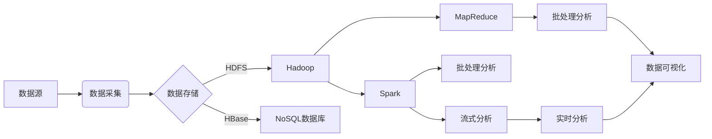
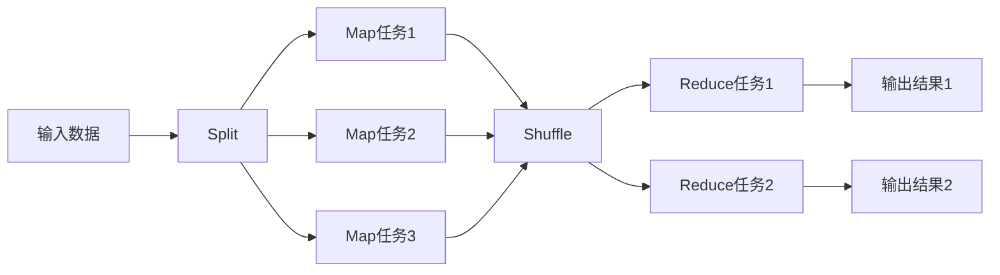
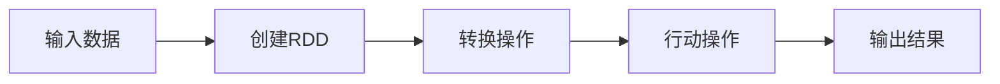

# 大数据分析 原理与代码实例讲解

## 1.背景介绍

在当今时代,数据已经成为了一种新的战略资源。随着互联网、物联网、人工智能等新兴技术的快速发展,海量数据的产生速度正在呈现爆炸式增长。大数据时代的到来,给各行各业带来了巨大的机遇和挑战。如何高效地存储、处理和分析这些大规模的数据,已经成为企业和组织面临的一项重大课题。

### 1.1 大数据的定义

大数据(Big Data)是指无法在合理时间内用常规软件工具进行捕获、管理和处理的数据集合,具有海量的数据规模、多样的数据类型和快速的数据增长等特点。大数据具有4V特征:

- Volume(大量):数据量大,通常为TB、PB级别
- Variety(多样):数据类型多样化,包括结构化数据和非结构化数据
- Velocity(高速):数据产生和处理的速度非常快
- Value(价值):数据中蕴含着巨大的商业价值和潜在价值

### 1.2 大数据分析的重要性

通过对大数据进行深入分析和挖掘,可以发现隐藏其中的有价值的信息和知识,为企业和组织的决策提供有力支持。大数据分析在各个领域都有广泛的应用,例如:

- 电子商务:分析用户行为,进行个性化推荐和营销策略制定
- 金融行业:风险控制、欺诈检测、投资决策等
- 医疗健康:疾病预测、精准医疗等
- 制造业:优化生产流程,提高产品质量
- 政府管理:交通规划、公共安全、环境监测等

## 2.核心概念与联系

### 2.1 大数据处理框架

要有效处理和分析大数据,需要采用分布式计算框架。目前主流的大数据处理框架包括:

1. **Apache Hadoop**:开源的分布式计算框架,具有高可靠性、高扩展性和高容错性。Hadoop由HDFS(分布式文件系统)和MapReduce(分布式计算模型)两部分组成。

2. **Apache Spark**:基于内存计算的分布式计算框架,相比Hadoop MapReduce有更高的计算效率,支持批处理、流处理、机器学习等多种计算模式。

3. **Apache Flink**:流式数据处理框架,支持有状态计算,具有低延迟、高吞吐、高容错等特点。

4. **Apache Storm**:分布式实时计算系统,专注于流式数据的实时处理。

5. **Apache Kafka**:分布式流式处理平台,常用于数据管道和消息队列。

这些框架通常会配合使用,构建完整的大数据处理平台。



### 2.2 大数据分析流程

大数据分析的基本流程包括:

1. **数据采集**:从各种数据源(如网络日志、传感器、社交媒体等)采集原始数据。

2. **数据存储**:将采集到的海量数据存储到分布式文件系统(如HDFS)或NoSQL数据库(如HBase)中。

3. **数据清洗**:对原始数据进行预处理,去除噪声和不一致的数据。

4. **数据集成**:将来自不同源的数据进行规范化和集成。

5. **数据分析**:利用机器学习、统计学等方法对数据进行建模和分析,发现隐藏的模式和规律。

6. **数据可视化**:将分析结果以图表、报告等形式呈现出来,方便理解和决策。

7. **模型部署**:将分析模型应用于实际的业务场景中,提供决策支持。

## 3.核心算法原理具体操作步骤

### 3.1 MapReduce算法

MapReduce是Hadoop的核心计算模型,用于大规模数据的并行处理。它将计算过程分为两个阶段:Map(映射)和Reduce(归约)。

1. **Map阶段**:输入数据被分割为多个数据块,每个数据块由一个Map任务处理。Map任务将输入数据转换为<key,value>键值对形式的中间数据。

2. **Shuffle阶段**:将Map阶段产生的中间数据进行重新分组,按照key的hash值将相同key的数据分发到同一个Reduce任务中。

3. **Reduce阶段**:每个Reduce任务接收一个key及对应的value集合,对这些值进行汇总、过滤或其他操作,最终生成最终结果。



MapReduce算法的核心思想是"分而治之",将大规模数据分散到多个节点上进行并行计算,最后将结果汇总。它适用于批处理场景,但对于迭代计算和流式计算效率较低。

### 3.2 Spark算法

Apache Spark是一种基于内存计算的分布式计算框架,相比Hadoop MapReduce有更高的计算效率。Spark的核心概念是RDD(Resilient Distributed Dataset,弹性分布式数据集),它是一种分布式内存抽象,支持对数据进行并行操作。

Spark提供了两种编程模型:

1. **RDD**:用于批处理计算,支持map、filter、join等转换操作和reduce、collect等行动操作。

2. **DStream**:用于流式计算,是一系列不断更新的RDD序列。

Spark还集成了机器学习、图计算、流式计算等多种库,提供了全栈式的大数据处理解决方案。



Spark的优势在于:

1. **内存计算**:充分利用内存进行计算,避免频繁的磁盘IO操作。
2. **容错性**:基于RDD的容错机制,可以自动恢复丢失的数据分区。
3. **通用性**:支持批处理、流式计算、机器学习等多种计算模式。
4. **易用性**:提供了Python、Scala、Java等多种编程语言接口。

## 4.数学模型和公式详细讲解举例说明

在大数据分析中,常常需要借助数学模型和算法来发现数据中的隐藏规律和模式。以下是一些常见的数学模型和公式:

### 4.1 线性回归模型

线性回归是一种常用的监督学习算法,用于建立自变量和因变量之间的线性关系。线性回归模型的数学表达式为:

$$y = \beta_0 + \beta_1x_1 + \beta_2x_2 + ... + \beta_nx_n + \epsilon$$

其中:
- $y$是因变量
- $x_1, x_2, ..., x_n$是自变量
- $\beta_0, \beta_1, \beta_2, ..., \beta_n$是回归系数
- $\epsilon$是随机误差项

通过最小二乘法估计回归系数,可以得到最佳拟合直线。

例如,在房价预测中,可以将房屋面积、房龄、地理位置等作为自变量,房价作为因变量,建立线性回归模型,预测未知房屋的价格。

### 4.2 逻辑回归模型

逻辑回归是一种用于分类问题的监督学习算法。它通过对自变量的线性组合进行逻辑函数转换,将结果映射到(0,1)区间,从而预测样本属于某个类别的概率。

逻辑回归模型的数学表达式为:

$$P(Y=1|X) = \frac{1}{1 + e^{-(\beta_0 + \beta_1x_1 + \beta_2x_2 + ... + \beta_nx_n)}}$$

其中:
- $P(Y=1|X)$表示样本属于正例的概率
- $x_1, x_2, ..., x_n$是自变量
- $\beta_0, \beta_1, \beta_2, ..., \beta_n$是回归系数

通过极大似然估计或梯度下降法求解回归系数,可以得到最优的分类模型。

例如,在信用卡欺诈检测中,可以将交易金额、时间、地点等作为自变量,是否为欺诈交易作为因变量,建立逻辑回归模型,预测未知交易是否为欺诈。

### 4.3 K-Means聚类算法

K-Means是一种常用的无监督学习算法,用于对数据进行聚类分析。算法的目标是将n个样本划分为k个簇,使得簇内样本之间的距离尽可能小,簇间样本之间的距离尽可能大。

K-Means算法的步骤如下:

1. 随机选择k个初始质心
2. 对每个样本计算到k个质心的距离,将其划分到距离最近的簇
3. 更新每个簇的质心,即计算簇内所有样本的均值作为新的质心
4. 重复步骤2和3,直到质心不再发生变化

K-Means算法的目标函数为:

$$J = \sum_{i=1}^{k}\sum_{x \in C_i}||x - \mu_i||^2$$

其中:
- $k$是簇的个数
- $C_i$是第$i$个簇
- $\mu_i$是第$i$个簇的质心
- $||x - \mu_i||^2$是样本$x$到质心$\mu_i$的欧几里得距离的平方

算法的目标是最小化目标函数$J$,从而找到最优的聚类结果。

例如,在客户细分中,可以将客户的年龄、收入、消费习惯等作为特征,利用K-Means算法对客户进行聚类,发现不同的客户群体,为精准营销提供依据。

## 5.项目实践:代码实例和详细解释说明

为了更好地理解大数据分析的原理和实现,我们将通过一个实际案例来演示如何使用Python和相关库进行数据分析。本案例的目标是对某电商网站的用户行为数据进行分析,发现用户的购买模式,为个性化推荐和营销策略提供支持。

### 5.1 数据准备

我们将使用一个开源的电商数据集,该数据集包含了用户的浏览记录、购买记录、商品信息等数据。首先,我们需要导入所需的Python库:

```python
import pandas as pd
from pyspark.sql import SparkSession
```

然后,创建SparkSession对象,用于后续的Spark操作:

```python
spark = SparkSession.builder \
                    .appName("E-Commerce Data Analysis") \
                    .getOrCreate()
```

接下来,读取数据集并创建Spark DataFrame:

```python
user_logs = spark.read.csv("user_logs.csv", header=True, inferSchema=True)
products = spark.read.csv("products.csv", header=True, inferSchema=True)
```

### 5.2 数据探索和预处理

在进行数据分析之前,我们需要对数据进行探索和预处理。首先,让我们查看一下数据的基本统计信息:

```python
user_logs.printSchema()
user_logs.describe().show()
```

根据输出结果,我们可以了解数据的结构和基本统计信息,如缺失值、异常值等。接下来,我们可以进行一些数据清洗和转换操作,例如填充缺失值、去除重复数据等。

```python
from pyspark.sql.functions import when, count, isnan, isNull, col

# 填充缺失值
user_logs = user_logs.na.fill({"age": user_logs.select("age").dropna().agg({"age": "avg"}).first()[0]})

# 去除重复数据
user_logs = user_logs.dropDuplicates()
```

### 5.3 数据分析

经过数据探索和预处理后,我们就可以开始进行实际的数据分析了。我们将使用Spark SQL和Spark MLlib(机器