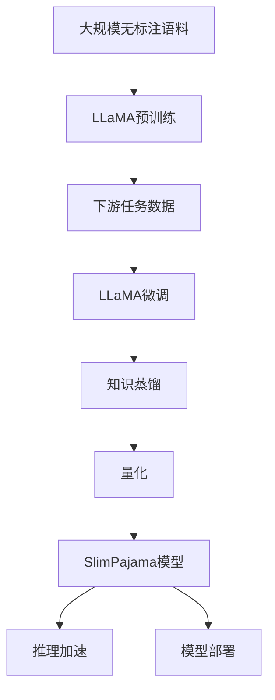

# 大规模语言模型从理论到实践 SlimPajama

## 1. 背景介绍
### 1.1 大规模语言模型的兴起
近年来,随着深度学习技术的飞速发展,大规模语言模型(Large Language Models, LLMs)逐渐成为自然语言处理(NLP)领域的研究热点。从2018年的BERT到2020年的GPT-3,再到最近的ChatGPT和LLaMA,大规模语言模型不断刷新着NLP任务的性能上限,展现出了强大的语言理解和生成能力。

### 1.2 SlimPajama的诞生
在众多大规模语言模型中,Meta AI最新推出的SlimPajama模型脱颖而出。SlimPajama基于LLaMA模型,通过知识蒸馏、量化等一系列模型压缩技术,在保持较高性能的同时大幅降低了模型参数量和推理延迟,使得在消费级硬件上部署大模型成为可能。这无疑为大规模语言模型的实际应用带来了新的曙光。

### 1.3 本文的组织结构
本文将全面探讨SlimPajama模型的技术原理和实践应用。内容安排如下:
- 第2节介绍大规模语言模型的核心概念与联系
- 第3节详细阐述SlimPajama的核心算法原理和具体操作步骤
- 第4节给出SlimPajama所涉及的数学模型和公式推导
- 第5节提供SlimPajama的代码实例和详细解释说明
- 第6节讨论SlimPajama在实际场景中的应用案例
- 第7节推荐SlimPajama相关的工具和学习资源
- 第8节总结SlimPajama的意义、未来发展趋势与面临的挑战
- 第9节列举SlimPajama的常见问题与解答

## 2. 核心概念与联系
### 2.1 Transformer架构
大规模语言模型的核心架构是Transformer[1]。与传统的RNN、CNN等模型不同,Transformer完全基于注意力机制(Attention),通过自注意力(Self-Attention)机制捕捉文本序列内部的长距离依赖关系。Transformer摒弃了循环结构,采用了全连接的前馈神经网络,大大提高了模型的并行计算效率。

### 2.2 预训练与微调
大规模语言模型的训练分为两个阶段:无监督预训练和有监督微调。在预训练阶段,模型在超大规模无标注文本语料上进行自监督学习,掌握语言的基本规律。在微调阶段,模型在特定任务的标注数据上进行监督学习,快速适应下游任务。预训练使得模型具备强大的语言理解能力,微调使得模型能够灵活应用于不同场景。

### 2.3 知识蒸馏
知识蒸馏[2]是模型压缩的重要技术,旨在将大模型(Teacher)的知识迁移到小模型(Student)中。具体而言,就是利用Teacher模型的软目标(Soft Target)作为Student模型的学习目标,引导Student模型模仿Teacher模型的行为。知识蒸馏可以显著减小模型体积,加速推理速度,同时保持较高的性能。

### 2.4 量化
量化[3]是另一种常用的模型压缩技术。传统的深度学习模型使用32位浮点数(FP32)表示参数和激活,量化则将其转换为低比特的定点数,如8位整数(INT8)。量化可以大幅降低模型存储和计算开销,特别适合在移动端、IoT等资源受限环境中部署。

### 2.5 Mermaid流程图
下面使用Mermaid绘制了SlimPajama模型训练和推理的核心流程:



从上图可以清晰看出,SlimPajama模型是在LLaMA的基础上,经过微调、知识蒸馏、量化等一系列优化步骤得到的轻量级模型,在推理速度和部署成本上具有明显优势。

## 3. 核心算法原理具体操作步骤
### 3.1 LLaMA预训练
LLaMA模型采用了自回归语言建模的预训练范式。给定一个文本序列$x=(x_1,\cdots,x_T)$,语言模型的目标是最大化序列的概率:

$$P(x)=\prod_{t=1}^TP(x_t|x_{<t})$$

其中$x_{<t}$表示$x_t$之前的所有token。LLaMA使用Transformer的Decoder结构建模上述条件概率。预训练的损失函数为负对数似然:

$$\mathcal{L}=-\sum_{t=1}^T\log P(x_t|x_{<t})$$

预训练的优化算法为AdamW[4],学习率采用Cosine Annealing Scheduler with Warmup。预训练的数据集为CommonCrawl和Wikipedia,总token数超过1万亿。

### 3.2 有监督微调
在下游任务上微调LLaMA时,需要根据任务的输入输出格式构造Prompt。以情感分类任务为例,可以构造如下Prompt:

```
Input: 这部电影太棒了,我非常喜欢!
Sentiment: Positive

Input: 这次旅行真是糟透了,浪费了我的假期。
Sentiment: Negative

Input: {input_text}
Sentiment:
```

其中`{input_text}`为要预测情感的文本。微调时,将构造好的Prompt输入LLaMA,让模型预测`Sentiment:`后面的标签。微调的损失函数为交叉熵:

$$\mathcal{L}=-\sum_{i=1}^N\sum_{c=1}^Cy_{i,c}\log p_{i,c}$$

其中$N$为样本数,$C$为类别数,$y_{i,c}$为第$i$个样本的第$c$个类别的真实标签,$p_{i,c}$为模型预测的概率。

### 3.3 知识蒸馏
SlimPajama使用了基于软目标的知识蒸馏方法。设Teacher模型LLaMA的输出logits为$z^T$,Student模型SlimPajama的输出logits为$z^S$,蒸馏的损失函数为KL散度:

$$\mathcal{L}_{KD}=\sum_{i=1}^N\mathrm{KL}(\sigma(z_i^T/\tau),\sigma(z_i^S/\tau))$$

其中$\sigma$为Softmax函数,$\tau$为温度超参数。温度越高,软目标越平滑,Student模型越倾向于模仿Teacher模型的行为。除了KL散度,SlimPajama还使用了Cosine相似度作为蒸馏损失:

$$\mathcal{L}_{CS}=-\sum_{i=1}^N\frac{z_i^T\cdot z_i^S}{\|z_i^T\|\|z_i^S\|}$$

最终的蒸馏损失为两者的加权和:

$$\mathcal{L}=\alpha\mathcal{L}_{KD}+(1-\alpha)\mathcal{L}_{CS}$$

其中$\alpha$为权重超参数。

### 3.4 量化
SlimPajama采用了8位整数(INT8)量化方案。模型参数$W$从FP32量化为INT8的公式为:

$$W_{INT8}=\mathrm{round}(\frac{W_{FP32}}{S}+Z)$$

其中$S$为缩放因子,$Z$为零点。$S$和$Z$可以通过以下公式计算:

$$S=\frac{\mathrm{max}(W_{FP32})-\mathrm{min}(W_{FP32})}{2^8-1}$$

$$Z=\mathrm{round}(-\frac{\mathrm{min}(W_{FP32})}{S})$$

反量化时,只需将上述过程反向执行即可:

$$W_{FP32}=(W_{INT8}-Z)\times S$$

SlimPajama在推理时直接使用INT8进行计算,无需反量化为FP32,从而节省了显存和计算开销。

## 4. 数学模型和公式详细讲解举例说明
### 4.1 Transformer的注意力机制
Transformer的核心是注意力机制。对于一个长度为$n$的输入序列$X\in\mathbb{R}^{n\times d}$,注意力机制首先计算Query矩阵$Q$、Key矩阵$K$和Value矩阵$V$:

$$Q=XW_Q,K=XW_K,V=XW_V$$

其中$W_Q,W_K,W_V\in\mathbb{R}^{d\times d_k}$为可学习的参数矩阵。然后计算注意力权重:

$$A=\mathrm{softmax}(\frac{QK^T}{\sqrt{d_k}})$$

其中$A\in\mathbb{R}^{n\times n}$为注意力矩阵,用于衡量序列中不同位置之间的相关性。最后计算注意力输出:

$$\mathrm{Attention}(Q,K,V)=AV$$

直观地说,注意力机制就是一个加权求和的过程,权重由Query和Key的相似度决定,求和的对象为Value。

举个例子,假设有一个句子"我爱吃苹果",长度为5。经过Embedding层后得到矩阵$X\in\mathbb{R}^{5\times d}$。注意力机制会计算句子中每个词与其他词的相关性,得到一个$5\times5$的注意力矩阵$A$。$A$的第$i$行第$j$列的元素$a_{ij}$表示第$i$个词对第$j$个词的注意力权重。最后将$A$与$V$相乘,得到一个新的表示矩阵,融合了全局的上下文信息。

### 4.2 AdamW优化器
AdamW是Adam优化器的一个变体,在Adam的基础上引入了权重衰减(Weight Decay)正则化项。给定参数$\theta$和损失函数$f(\theta)$,AdamW的更新公式为:

$$
\begin{aligned}
g_t &= \nabla_\theta f_t(\theta_{t-1})\\
m_t &= \beta_1 m_{t-1} + (1 - \beta_1) g_t\\
v_t &= \beta_2 v_{t-1} + (1 - \beta_2) g_t^2\\
\hat{m}_t &= \frac{m_t}{1 - \beta_1^t}\\
\hat{v}_t &= \frac{v_t}{1 - \beta_2^t}\\
\theta_t &= \theta_{t-1} - \eta (\frac{\hat{m}_t}{\sqrt{\hat{v}_t} + \epsilon} + \lambda \theta_{t-1})
\end{aligned}
$$

其中$m_t$和$v_t$分别为一阶矩和二阶矩的指数移动平均,$\beta_1$和$\beta_2$为平滑系数,$\eta$为学习率,$\lambda$为权重衰减系数,$\epsilon$为平滑项。与Adam相比,AdamW在更新参数时多了一项$\lambda\theta_{t-1}$,即在梯度方向上添加了权重衰减。

权重衰减可以防止模型过拟合,提高泛化性能。直观地说,权重衰减就是在损失函数中添加L2正则化项:

$$f(\theta)=f(\theta)+\frac{\lambda}{2}\|\theta\|_2^2$$

这会使得优化过程倾向于寻找L2范数较小的参数解,从而避免参数过大导致的过拟合。在实践中,权重衰减系数$\lambda$通常设为1e-2或1e-3。

### 4.3 Cosine Annealing Scheduler with Warmup
Cosine Annealing是一种学习率调度策略,可以在训练过程中动态调整学习率。设训练总步数为$T$,当前步数为$t$,则学习率$\eta_t$的计算公式为:

$$\eta_t=\eta_{\min }+\frac{1}{2}(\eta_{\max }-\eta_{\min })(1+\cos(\frac{t}{T}\pi))$$

其中$\eta_{\max}$和$\eta_{\min}$分别为最大和最小学习率。可以看出,学习率呈现余弦周期性变化,先从$\eta_{\max}$下降到$\eta_{\min}$,再上升回$\eta_{\max}$。

在实践中,Cosine Annealing常与Warmup策略结合使用。Warmup是指在训练初期使用较小的学习率,然后逐渐提高到预设值。这样可以减缓训练初期的不稳定性,加速收敛。假设