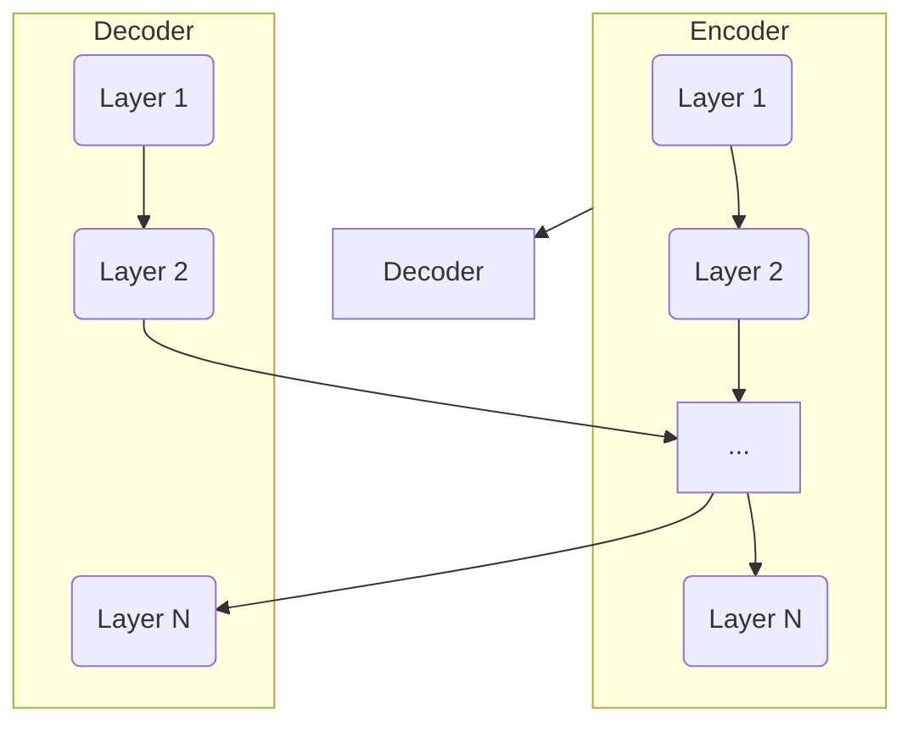

# 大规模语言模型从理论到实践：前馈层

## 1.背景介绍

在自然语言处理(NLP)领域,近年来出现了一种新型的深度学习模型:大规模语言模型(Large Language Model, LLM)。这些模型通过在大量文本数据上进行预训练,学习捕捉语言的统计规律和语义信息,从而具备了强大的语言理解和生成能力。

典型的大规模语言模型包括GPT(Generative Pre-trained Transformer)系列、BERT(Bidirectional Encoder Representations from Transformers)、XLNet、ALBERT等。其中,GPT是第一个成功的大规模语言模型,由OpenAI提出。GPT-3更是达到了惊人的1750亿参数规模,展现了大规模语言模型强大的语言理解和生成能力。

大规模语言模型的核心架构是基于Transformer的序列到序列(Seq2Seq)模型。Transformer由多个编码器(Encoder)层和解码器(Decoder)层组成,层与层之间使用了自注意力(Self-Attention)机制和前馈网络(Feed-Forward Network)。本文将重点探讨前馈层(Feed-Forward Layer)在大规模语言模型中的作用和实现细节。

## 2.核心概念与联系

### 2.1 Transformer架构

Transformer是一种全新的基于注意力机制的序列到序列模型架构,用于解决机器翻译等序列转换问题。它不再使用循环神经网络(RNN)和卷积神经网络(CNN),而是完全依赖注意力机制来捕捉输入和输出之间的全局依赖关系。

Transformer由编码器(Encoder)和解码器(Decoder)两部分组成。编码器将输入序列映射到一个连续的表示空间,解码器则从该表示空间生成输出序列。编码器和解码器都由多个相同的层组成,每一层包含多头自注意力子层和前馈网络子层。



### 2.2 自注意力机制

自注意力机制是Transformer的核心,它能够捕捉输入序列中任意两个位置之间的依赖关系。对于每个位置,自注意力机制会计算其与序列中所有其他位置的关联分数,并据此生成该位置的表示向量。

### 2.3 前馈网络

前馈网络(Feed-Forward Network, FFN)是Transformer中除了自注意力机制之外的另一个重要组成部分。每个编码器/解码器层都包含一个前馈子层,用于对序列的表示进行更深层次的非线性变换。

前馈网络通常由两个线性变换和一个ReLU激活函数组成,可以表示为:

$$FFN(x) = max(0, xW_1 + b_1)W_2 + b_2$$

其中$W_1$、$W_2$、$b_1$、$b_2$分别是两个线性变换的权重矩阵和偏置向量。前馈网络可以看作是对输入进行非线性映射的一种方式,增强了模型的表达能力。

## 3.核心算法原理具体操作步骤

前馈网络的具体计算过程如下:

1. 输入$x$是来自前一子层(自注意力机制或层规范化)的输出,其形状为$(batch_size, seq_len, d_model)$。
2. 对输入$x$进行第一个线性变换:$y = xW_1 + b_1$,其中$W_1 \in \mathbb{R}^{d_{model} \times d_{ff}}$,$b_1 \in \mathbb{R}^{d_{ff}}$。
3. 对线性变换的输出$y$应用ReLU激活函数:$y' = ReLU(y) = max(0, y)$。
4. 对$y'$进行第二个线性变换:$z = y'W_2 + b_2$,其中$W_2 \in \mathbb{R}^{d_{ff} \times d_{model}}$,$b_2 \in \mathbb{R}^{d_{model}}$。
5. 输出$z$的形状为$(batch_size, seq_len, d_model)$,与输入$x$的形状相同。

通常情况下,$d_{ff}$会设置为比$d_{model}$大几倍,例如$d_{ff} = 4 \times d_{model}$。这样可以让前馈网络拥有更大的容量,从而增强其表达能力。

前馈网络的作用是对序列的表示进行非线性映射,提取更高层次的特征。它与自注意力机制互为补充,共同构建了Transformer的强大能力。

## 4.数学模型和公式详细讲解举例说明

前馈网络的数学模型可以用下式表示:

$$FFN(x) = \text{max}(0, xW_1 + b_1)W_2 + b_2$$

其中:

- $x$是输入,形状为$(batch_size, seq_len, d_{model})$
- $W_1 \in \mathbb{R}^{d_{model} \times d_{ff}}$是第一个线性变换的权重矩阵
- $b_1 \in \mathbb{R}^{d_{ff}}$是第一个线性变换的偏置向量
- $W_2 \in \mathbb{R}^{d_{ff} \times d_{model}}$是第二个线性变换的权重矩阵
- $b_2 \in \mathbb{R}^{d_{model}}$是第二个线性变换的偏置向量

让我们用一个具体例子来说明前馈网络的计算过程。假设:

- 输入$x$的形状为$(2, 3, 4)$,即批量大小为2,序列长度为3,embedding维度为4
- $d_{ff} = 8$

第一步,对输入$x$进行第一个线性变换:

$$y = xW_1 + b_1$$

其中$W_1 \in \mathbb{R}^{4 \times 8}$,$b_1 \in \mathbb{R}^{8}$。假设:

$$W_1 = \begin{bmatrix}
0.1 & 0.2 & -0.1 & 0.3 & 0.4 & -0.2 & 0.5 & -0.3\\
-0.2 & 0.3 & 0.4 & -0.1 & -0.3 & 0.5 & 0.2 & -0.4\\
0.3 & -0.4 & 0.2 & 0.5 & -0.1 & -0.3 & 0.4 & 0.2\\
0.4 & 0.1 & -0.3 & -0.2 & 0.5 & 0.3 & -0.4 & 0.1
\end{bmatrix},\ b_1 = \begin{bmatrix}
0.1\\
0.2\\
-0.1\\
0.3\\
-0.2\\
0.4\\
0.5\\
-0.3
\end{bmatrix}$$

$$x = \begin{bmatrix}
\begin{bmatrix}
0.1 & 0.2 & 0.3 & 0.4\\
0.5 & 0.6 & 0.7 & 0.8\\
0.9 & 1.0 & 1.1 & 1.2
\end{bmatrix}\\
\begin{bmatrix}
1.3 & 1.4 & 1.5 & 1.6\\
1.7 & 1.8 & 1.9 & 2.0\\
2.1 & 2.2 & 2.3 & 2.4
\end{bmatrix}
\end{bmatrix}$$

则$y$的计算结果为:

$$y = \begin{bmatrix}
\begin{bmatrix}
1.32 & 1.74 & 1.26 & 2.18\\
2.58 & 2.66 & 2.94 & 2.82\\
3.84 & 3.58 & 4.62 & 3.46
\end{bmatrix}\\
\begin{bmatrix}
4.92 & 5.34 & 4.86 & 5.78\\
6.18 & 6.26 & 6.54 & 6.42\\
7.44 & 7.18 & 8.22 & 7.06  
\end{bmatrix}
\end{bmatrix}$$

第二步,对$y$应用ReLU激活函数:

$$y' = \text{ReLU}(y) = \text{max}(0, y)$$

结果为:

$$y' = \begin{bmatrix}
\begin{bmatrix}
1.32 & 1.74 & 1.26 & 2.18\\
2.58 & 2.66 & 2.94 & 2.82\\
3.84 & 3.58 & 4.62 & 3.46
\end{bmatrix}\\
\begin{bmatrix}
4.92 & 5.34 & 4.86 & 5.78\\
6.18 & 6.26 & 6.54 & 6.42\\
7.44 & 7.18 & 8.22 & 7.06
\end{bmatrix}
\end{bmatrix}$$

第三步,对$y'$进行第二个线性变换:

$$z = y'W_2 + b_2$$

其中$W_2 \in \mathbb{R}^{8 \times 4}$,$b_2 \in \mathbb{R}^{4}$。假设:

$$W_2 = \begin{bmatrix}
-0.1 & 0.2 & 0.3 & -0.4\\
0.5 & -0.6 & 0.1 & 0.2\\
-0.3 & 0.4 & -0.5 & 0.6\\
0.7 & -0.8 & 0.9 & -0.2\\
0.1 & 0.3 & 0.5 & -0.7\\
-0.2 & 0.6 & -0.4 & 0.8\\
0.9 & -0.1 & 0.7 & -0.3\\
-0.6 & 0.5 & -0.8 & 0.4
\end{bmatrix},\ b_2 = \begin{bmatrix}
0.1\\
-0.2\\
0.3\\
-0.4
\end{bmatrix}$$

则输出$z$为:

$$z = \begin{bmatrix}
\begin{bmatrix}
0.94 & 0.66 & 1.35 & -0.51\\
2.49 & 1.51 & 2.89 & -0.47\\
3.62 & 2.79 & 3.65 & 0.27
\end{bmatrix}\\
\begin{bmatrix}
4.69 & 3.77 & 5.11 & 0.19\\
6.24 & 4.62 & 6.65 & 0.15\\
7.37 & 5.95 & 7.41 & 0.89
\end{bmatrix}
\end{bmatrix}$$

通过这个例子,我们可以更好地理解前馈网络的数学原理和计算过程。

## 5.项目实践:代码实例和详细解释说明

下面是使用PyTorch实现前馈网络的代码示例:

```python
import torch
import torch.nn as nn

class FeedForward(nn.Module):
    def __init__(self, d_model, d_ff, dropout=0.1):
        super(FeedForward, self).__init__()
        # 线性变换层
        self.fc1 = nn.Linear(d_model, d_ff)
        self.fc2 = nn.Linear(d_ff, d_model)
        # ReLU激活函数
        self.relu = nn.ReLU()
        # Dropout层
        self.dropout = nn.Dropout(dropout)

    def forward(self, x):
        # 第一个线性变换
        x = self.fc1(x)
        # ReLU激活函数
        x = self.relu(x)
        # Dropout
        x = self.dropout(x)
        # 第二个线性变换
        x = self.fc2(x)
        # 残差连接
        return x
```

代码解释:

1. `FeedForward`类继承自`nn.Module`,是PyTorch中定义神经网络层的基类。
2. `__init__`方法是构造函数,用于初始化前馈网络的参数。
    - `d_model`是输入的embedding维度。
    - `d_ff`是前馈网络中间层的维度,通常设置为`d_model`的4倍左右。
    - `dropout`是Dropout层的dropout率,用于防止过拟合。
3. 在构造函数中,我们定义了两个线性变换层`self.fc1`和`self.fc2`,分别对应前馈网络的两个线性变换。同时定义了ReLU激活函数`self.relu`和Dropout层`self.dropout`。
4. `forward`方法实现了前馈网络的前向传播过程:
    - 输入`x`首先通过第一个线性变换层`self.fc1`。
    - 然后经过ReLU激活函数`self.relu`。
    - 再通过Dropout层`self.dropout`进行regularization。
    - 最后通过第二个线性变换层`self.fc2`得到输出。
5. 前馈网络的输出与输入`x`的形状相同,因此可