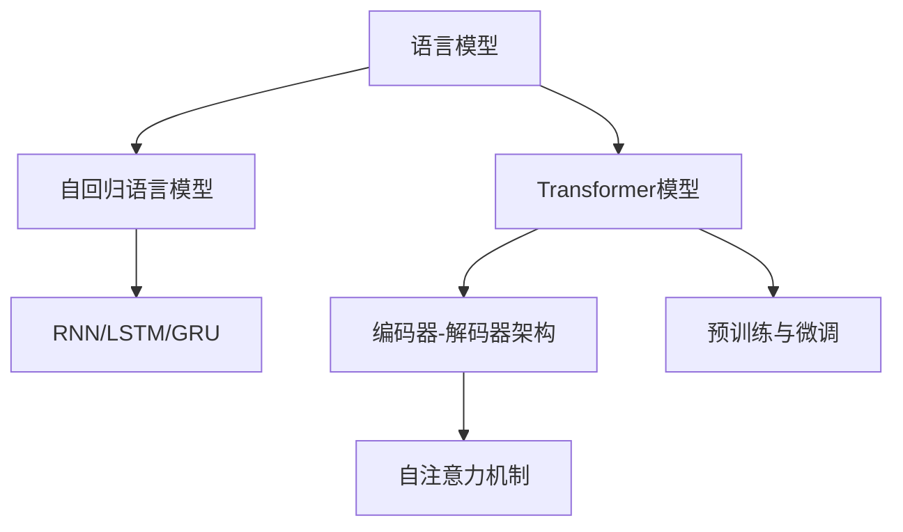

# 大规模语言模型从理论到实践 基础概念

## 1.背景介绍

### 1.1 语言模型的重要性

语言是人类交流和表达思想的重要工具,语言模型则是自然语言处理领域的基础和核心技术。语言模型旨在学习和捕捉语言的统计规律,为自然语言处理任务提供基础支撑。

随着深度学习技术的发展,大规模语言模型(Large Language Model,LLM)已成为自然语言处理领域的主导范式。大规模语言模型能够从海量文本数据中学习语言知识,并在广泛的自然语言处理任务中发挥重要作用,如机器翻译、文本摘要、问答系统、对话系统等。

### 1.2 大规模语言模型的发展历程

早期的统计语言模型主要基于 N-gram 模型,利用有限长度的上文来预测下一个词的概率。随着深度学习技术的兴起,神经网络语言模型(Neural Network Language Model,NNLM)应运而生,能够更好地捕捉长距离依赖关系。

2018年,Transformer 模型的提出标志着大规模语言模型进入了一个新的里程碑。Transformer 完全基于注意力机制,能够有效地建模长距离依赖关系,并在机器翻译等任务中取得了卓越的表现。

此后,以 GPT、BERT、XLNet、RoBERTa 等为代表的大规模预训练语言模型相继问世,在各种自然语言处理任务中展现出了强大的能力。这些模型通过在海量无标注文本数据上进行预训练,学习到了丰富的语言知识,并可以通过微调的方式迁移到下游任务。

### 1.3 大规模语言模型的挑战

尽管大规模语言模型取得了巨大的成功,但它们也面临着一些挑战:

1. **计算资源需求巨大**:训练大规模语言模型需要消耗大量的计算资源,包括GPU、TPU等专用硬件加速器,以及海量的训练数据。
2. **模型可解释性较差**:大规模语言模型通常被视为"黑盒"模型,其内部机理和决策过程难以解释。
3. **偏见和不当内容**:语言模型可能会从训练数据中学习到社会偏见和不当内容,导致生成的文本存在潜在风险。
4. **知识一致性和常识推理**:语言模型难以保证生成的文本与事实知识和常识推理相一致。

## 2.核心概念与联系

### 2.1 语言模型的形式化定义

语言模型的目标是学习一个概率分布 $P(X)$,其中 $X = (x_1, x_2, ..., x_n)$ 表示一个长度为 $n$ 的文本序列。根据链式法则,我们可以将 $P(X)$ 分解为:

$$P(X) = \prod_{t=1}^{n}P(x_t|x_1, x_2, ..., x_{t-1})$$

其中 $P(x_t|x_1, x_2, ..., x_{t-1})$ 表示在给定前 $t-1$ 个词的情况下,预测第 $t$ 个词的概率。语言模型的目标就是学习这个条件概率分布。

### 2.2 自回归语言模型

自回归语言模型(Autoregressive Language Model)是一种常见的语言模型架构,它将文本序列建模为一个标记一标记生成的过程。在每一步,模型会基于之前生成的标记来预测下一个标记。

自回归语言模型的核心思想是利用神经网络来学习条件概率分布 $P(x_t|x_1, x_2, ..., x_{t-1})$。常见的神经网络架构包括循环神经网络(RNN)、长短期记忆网络(LSTM)和门控循环单元(GRU)等。

### 2.3 Transformer 模型

Transformer 是一种全新的基于注意力机制的序列建模架构,它完全摒弃了循环神经网络和卷积神经网络,而是通过自注意力(Self-Attention)机制来捕捉序列中的长距离依赖关系。

Transformer 模型主要由编码器(Encoder)和解码器(Decoder)两部分组成。编码器将输入序列映射为一系列连续的表示,解码器则基于这些表示生成输出序列。Transformer 在机器翻译、语言模型等任务中表现出色,成为大规模语言模型的主导架构。

### 2.4 预训练与微调

预训练(Pre-training)和微调(Fine-tuning)是大规模语言模型的核心思想之一。预训练阶段是在大量无标注文本数据上训练语言模型,使其学习到丰富的语言知识和表示能力。微调阶段则是在特定的下游任务上,基于预训练模型的参数初始化,进行进一步的训练和调整。

预训练和微调的分离,使得语言模型能够从大规模无标注数据中学习通用的语言知识,并将这些知识迁移到不同的下游任务中,从而大大提高了模型的性能和泛化能力。

### 2.5 核心概念关系示意图

以下是大规模语言模型核心概念之间的关系示意图:

## 3.核心算法原理具体操作步骤

### 3.1 Transformer 模型架构

Transformer 模型由编码器(Encoder)和解码器(Decoder)两部分组成,两者都基于多头自注意力(Multi-Head Self-Attention)和前馈神经网络(Feed-Forward Neural Network)构建。

1. **编码器(Encoder)**

编码器的主要作用是将输入序列映射为一系列连续的表示,称为编码器表示。编码器由多个相同的层组成,每一层包括两个子层:

- 多头自注意力子层:捕捉输入序列中的长距离依赖关系。
- 前馈神经网络子层:对每个位置的表示进行非线性变换。

2. **解码器(Decoder)**

解码器的作用是基于编码器的输出表示,生成目标序列。解码器也由多个相同的层组成,每一层包括三个子层:

- 掩码多头自注意力子层:捕捉已生成的输出序列中的依赖关系。
- 编码器-解码器注意力子层:将解码器的表示与编码器的输出表示相关联。
- 前馈神经网络子层:对每个位置的表示进行非线性变换。

3. **注意力机制**

注意力机制是 Transformer 模型的核心,它允许模型在计算目标位置的表示时,关注输入序列中与之相关的部分。

- 自注意力(Self-Attention):计算查询(Query)与所有键(Key)的相关性得分,并根据这些得分对值(Value)进行加权求和。
- 多头注意力(Multi-Head Attention):将注意力机制分成多个并行的"头",每个头捕捉不同的依赖关系模式。

### 3.2 Transformer 模型训练

Transformer 模型的训练过程可以分为预训练和微调两个阶段:

1. **预训练**

预训练阶段的目标是在大量无标注文本数据上训练语言模型,使其学习到丰富的语言知识和表示能力。常见的预训练目标包括:

- 掩码语言模型(Masked Language Model,MLM):随机掩码部分输入标记,模型需要预测这些被掩码的标记。
- 下一句预测(Next Sentence Prediction,NSP):判断两个句子是否是连续的。
- 因果语言模型(Causal Language Model,CLM):给定前缀,模型需要预测下一个标记。

2. **微调**

微调阶段是在特定的下游任务上,基于预训练模型的参数初始化,进行进一步的训练和调整。常见的微调方法包括:

- 添加任务特定的输入表示(如分类标签)和输出层。
- 在预训练模型的基础上进行端到端的微调。
- 仅微调部分层(如最后几层)的参数。

### 3.3 Transformer 模型推理

在推理阶段,Transformer 模型可以用于各种自然语言处理任务,如机器翻译、文本摘要、问答系统等。推理过程通常包括以下步骤:

1. 将输入数据(如文本序列)转换为模型可接受的格式。
2. 将输入数据输入到模型中,获得模型的输出表示。
3. 根据任务目标,对模型的输出表示进行解码或后处理,得到最终的预测结果。

在生成式任务(如机器翻译、文本生成)中,Transformer 模型通常采用自回归(Autoregressive)的方式进行推理,即一次生成一个标记,并将已生成的标记作为输入,继续生成下一个标记。

## 4.数学模型和公式详细讲解举例说明

### 4.1 自注意力机制

自注意力机制是 Transformer 模型的核心,它允许模型在计算目标位置的表示时,关注输入序列中与之相关的部分。

给定一个输入序列 $X = (x_1, x_2, ..., x_n)$,我们将其映射为一系列向量表示 $\mathbf{Q} = (\mathbf{q}_1, \mathbf{q}_2, ..., \mathbf{q}_n)$,称为查询(Query)。同时,我们也将输入序列映射为另外两个向量序列,分别称为键(Key)和值(Value),记为 $\mathbf{K} = (\mathbf{k}_1, \mathbf{k}_2, ..., \mathbf{k}_n)$ 和 $\mathbf{V} = (\mathbf{v}_1, \mathbf{v}_2, ..., \mathbf{v}_n)$。

自注意力机制的计算过程如下:

1. 计算查询与所有键的相关性得分:

$$\text{Attention}(\mathbf{Q}, \mathbf{K}, \mathbf{V}) = \text{softmax}\left(\frac{\mathbf{Q}\mathbf{K}^\top}{\sqrt{d_k}}\right)\mathbf{V}$$

其中 $d_k$ 是键向量的维度,用于缩放点积的值,防止过大或过小的值。

2. 将相关性得分与值向量相乘,得到目标位置的表示:

$$\mathbf{z}_i = \sum_{j=1}^{n}\alpha_{ij}\mathbf{v}_j$$

其中 $\alpha_{ij} = \text{softmax}\left(\frac{\mathbf{q}_i\mathbf{k}_j^\top}{\sqrt{d_k}}\right)$ 是查询 $\mathbf{q}_i$ 与键 $\mathbf{k}_j$ 的相关性得分。

通过自注意力机制,模型可以自适应地为每个目标位置分配不同的注意力权重,捕捉输入序列中与之相关的部分。

### 4.2 多头注意力机制

多头注意力机制是在自注意力的基础上进行扩展,它将注意力机制分成多个并行的"头",每个头捕捉不同的依赖关系模式。

具体来说,给定查询 $\mathbf{Q}$、键 $\mathbf{K}$ 和值 $\mathbf{V}$,我们首先将它们线性映射为 $h$ 个头:

$$\begin{aligned}
\mathbf{Q}^{(i)} &= \mathbf{Q}\mathbf{W}_Q^{(i)} \\
\mathbf{K}^{(i)} &= \mathbf{K}\mathbf{W}_K^{(i)} \\
\mathbf{V}^{(i)} &= \mathbf{V}\mathbf{W}_V^{(i)}
\end{aligned}$$

其中 $\mathbf{W}_Q^{(i)}$、$\mathbf{W}_K^{(i)}$ 和 $\mathbf{W}_V^{(i)}$ 分别是第 $i$ 个头的线性映射矩阵。

然后,对于每个头,我们计算自注意力:

$$\text{head}_i = \text{Attention}(\mathbf{Q}^{(i)}, \mathbf{K}^{(i)}, \mathbf{V}^{(i)})$$

最后,将所有头的输出拼接起来,并进行线性变换:

$$\text{MultiHead}(\mathbf{Q}, \mathbf{K}, \mathbf{V}) = \text{Concat}(\text{head}_1, \text{head}_2