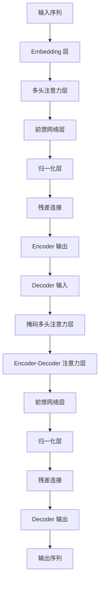

# 大规模语言模型从理论到实践 实践思考

## 1.背景介绍

### 1.1 语言模型的重要性

语言是人类交流和表达思想的重要工具,语言模型作为自然语言处理领域的基础技术,在人工智能领域扮演着至关重要的角色。随着深度学习技术的快速发展,大规模语言模型的性能不断提升,在自然语言理解、机器翻译、问答系统、文本生成等应用领域展现出了强大的能力。

### 1.2 大规模语言模型的兴起

近年来,benefitting from 大规模计算资源、海量语料数据和创新的深度学习算法,大规模语言模型取得了突破性进展。代表性模型包括 GPT(Generative Pre-trained Transformer)、BERT(Bidirectional Encoder Representations from Transformers)、XLNet、T5(Text-to-Text Transfer Transformer)等,这些模型通过预训练的方式在海量无标注语料上学习通用的语言表示,再通过 fine-tuning 的方式将这些通用语言表示应用到下游任务中,取得了非常优异的表现。

### 1.3 大规模语言模型的挑战

尽管大规模语言模型取得了巨大的成功,但也面临着一些挑战:

- 计算资源消耗巨大,需要强大的硬件支持
- 存在偏见和不当内容的风险
- 缺乏对语义和常识的深层理解
- 生成质量和一致性仍有提升空间

因此,探索大规模语言模型的理论基础、训练方法、应用场景、安全性和可解释性等方面,对于推动该领域发展至关重要。

## 2.核心概念与联系

### 2.1 自然语言处理基础

自然语言处理(Natural Language Processing, NLP)是人工智能领域的一个重要分支,旨在使计算机能够理解和生成人类语言。NLP 涉及多个子领域,包括词法分析、句法分析、语义分析、语音识别、机器翻译等。

语言模型是 NLP 的基础技术之一,它通过学习大量语料数据,捕捉语言的统计规律,为语言理解和生成提供支持。传统的语言模型通常基于 N-gram 统计方法,而现代语言模型则主要基于神经网络模型,特别是 Transformer 架构。

### 2.2 Transformer 架构

Transformer 是一种全新的基于注意力机制(Attention Mechanism)的神经网络架构,在 2017 年由 Google 的 Vaswani 等人提出,用于解决序列到序列(Sequence-to-Sequence)的建模问题,如机器翻译、语言生成等。

Transformer 架构的核心思想是完全依赖注意力机制来捕捉输入和输出序列之间的长程依赖关系,摒弃了 RNN(Recurrent Neural Network)和 CNN(Convolutional Neural Network)中的递归和卷积操作,从而有效解决了长期依赖问题,提高了并行计算能力。

Transformer 的编码器(Encoder)将输入序列映射为一系列连续的向量表示,解码器(Decoder)则将这些向量表示转换为目标输出序列。Transformer 架构在机器翻译、语言模型等任务上展现出了卓越的性能。



### 2.3 预训练与微调

大规模语言模型通常采用两阶段策略:预训练(Pre-training)和微调(Fine-tuning)。

预训练阶段旨在在大规模无标注语料上学习通用的语言表示,捕捉语言的本质规律。常见的预训练目标包括 Masked Language Modeling(掩码语言模型)、Next Sentence Prediction(下一句预测)等。

微调阶段则将预训练模型应用到特定的下游任务,通过有监督的方式对模型进行专门的调整和优化,使其适应特定任务的语义和特征。常见的微调方法包括追加任务特定的输出层、对部分层进行训练等。

通过预训练-微调的范式,大规模语言模型能够有效地利用大量无标注数据,并将通用语言知识迁移到下游任务,从而取得优异的性能表现。

## 3.核心算法原理具体操作步骤  

### 3.1 Transformer 编码器(Encoder)

Transformer 编码器的核心是多头自注意力(Multi-Head Self-Attention)机制和前馈神经网络(Feed-Forward Neural Network)。其具体操作步骤如下:

1. **输入嵌入(Input Embeddings)**: 将输入序列的每个 token(单词或子词)映射为一个连续的向量表示。

2. **位置编码(Positional Encoding)**: 由于 Transformer 没有递归和卷积结构,因此需要一些方式来注入序列的位置信息。位置编码将位置信息编码到输入嵌入中。

3. **多头自注意力(Multi-Head Self-Attention)**: 该机制允许每个单词去关注整个输入序列中的其他单词,捕捉它们之间的依赖关系。具体计算过程如下:

   - 将输入映射到查询(Query)、键(Key)和值(Value)向量: $\mathrm{Query} = \mathrm{X}\mathrm{W_Q}$, $\mathrm{Key} = \mathrm{X}\mathrm{W_K}$, $\mathrm{Value} = \mathrm{X}\mathrm{W_V}$
   - 计算注意力权重: $\mathrm{Attention(Q, K, V)} = \mathrm{softmax}(\frac{\mathrm{QK^T}}{\sqrt{d_k}})V$
   - 多头注意力通过将多个注意力头的结果拼接在一起实现: $\mathrm{MultiHead(Q, K, V)} = \mathrm{Concat}(\mathrm{head_1}, \ldots, \mathrm{head_h})\mathrm{W^O}$

4. **残差连接(Residual Connection)和层归一化(Layer Normalization)**: 为了更好地训练,Transformer 使用了残差连接和层归一化。

5. **前馈神经网络(Feed-Forward Neural Network)**: 对每个位置的向量进行全连接的前馈神经网络变换,包含两个线性变换和一个 ReLU 激活函数。

6. **残差连接和层归一化**: 与自注意力子层相同。

以上步骤构成了 Transformer 编码器的一个块,通常会堆叠多个这样的块来构建深层编码器。编码器的输出是一个向量序列,表示输入序列的语义表示。

### 3.2 Transformer 解码器(Decoder)

Transformer 解码器的结构与编码器类似,但有以下几点不同:

1. **掩码多头自注意力(Masked Multi-Head Self-Attention)**: 为了防止关注未来的位置,解码器的自注意力层使用了掩码机制,确保每个单词只能关注之前的单词。

2. **Encoder-Decoder 注意力(Encoder-Decoder Attention)**: 该注意力机制允许解码器关注编码器的输出,捕捉输入序列和输出序列之间的依赖关系。

3. **输出投影(Output Projection)**: 解码器的最终输出通过一个线性层和 softmax 层投影到词汇表,生成每个位置的单词概率分布。

在自回归(Auto-Regressive)生成过程中,解码器会逐个生成单词,并将已生成的单词作为后续的输入,重复执行上述步骤,直到生成终止符号或达到最大长度。

## 4.数学模型和公式详细讲解举例说明

### 4.1 注意力机制(Attention Mechanism)

注意力机制是 Transformer 架构的核心,它允许模型在编码和解码时动态地关注输入序列的不同部分,捕捉长程依赖关系。注意力机制的数学表达式如下:

$$\mathrm{Attention(Q, K, V)} = \mathrm{softmax}(\frac{\mathrm{QK^T}}{\sqrt{d_k}})V$$

其中:

- $\mathrm{Q}$ 是查询(Query)向量,表示当前需要处理的位置
- $\mathrm{K}$ 是键(Key)向量,表示其他位置编码的信息
- $\mathrm{V}$ 是值(Value)向量,表示其他位置的值
- $d_k$ 是缩放因子,用于防止较深层次的值被推入softmax函数的较小梯度区域

计算过程包括:

1. 计算查询向量 $\mathrm{Q}$ 与所有键向量 $\mathrm{K}$ 的点积,得到未缩放的分数张量
2. 对分数张量除以 $\sqrt{d_k}$ 进行缩放
3. 对缩放的分数张量应用 softmax 函数,得到注意力权重张量
4. 将注意力权重与值向量 $\mathrm{V}$ 相乘,得到加权和作为注意力输出

通过注意力机制,模型可以动态地关注输入序列中与当前位置最相关的部分,从而捕捉长程依赖关系。

### 4.2 多头注意力(Multi-Head Attention)

为了捕捉不同的注意力模式,Transformer 引入了多头注意力机制。具体来说,查询、键和值通过不同的线性投影分别得到 $h$ 组不同的表示,对每一组进行缩放点积注意力计算,最后将 $h$ 组注意力输出拼接起来,得到最终的多头注意力输出:

$$\begin{aligned}
\mathrm{MultiHead(Q, K, V)} &= \mathrm{Concat}(\mathrm{head_1}, \ldots, \mathrm{head_h})\mathrm{W^O} \\
\mathrm{where\ head_i} &= \mathrm{Attention}(\mathrm{QW_i^Q}, \mathrm{KW_i^K}, \mathrm{VW_i^V})
\end{aligned}$$

其中 $\mathrm{W_i^Q}$、$\mathrm{W_i^K}$、$\mathrm{W_i^V}$ 和 $\mathrm{W^O}$ 是可学习的线性投影参数。

通过多头注意力机制,模型可以从不同的表示子空间中捕捉不同的注意力模式,提高了模型的表达能力和性能。

### 4.3 位置编码(Positional Encoding)

由于 Transformer 完全依赖注意力机制而没有递归或卷积结构,因此需要一种方式来注入序列的位置信息。Transformer 使用位置编码将位置信息编码到输入嵌入中。

对于序列中的第 $i$ 个位置,其位置编码向量 $\mathrm{PE}_{(pos, 2i)}$ 和 $\mathrm{PE}_{(pos, 2i+1)}$ 由如下公式计算:

$$\begin{aligned}
\mathrm{PE}_{(pos, 2i)} &= \sin\left(pos / 10000^{2i / d_{\mathrm{model}}}\right) \\
\mathrm{PE}_{(pos, 2i+1)} &= \cos\left(pos / 10000^{2i / d_{\mathrm{model}}}\right)
\end{aligned}$$

其中 $pos$ 是位置索引, $i$ 是维度索引, $d_{\mathrm{model}}$ 是模型的维度。

位置编码向量与输入嵌入向量相加,从而将位置信息注入到输入表示中。由于位置编码是基于三角函数计算的,因此对于不同的位置,其位置编码是不同的,从而能够很好地编码位置信息。

## 5.项目实践:代码实例和详细解释说明

为了更好地理解 Transformer 架构,我们提供了一个基于 PyTorch 的简化实现示例。该示例包括 Transformer 编码器和解码器的核心组件,以及一个基于掩码语言模型(Masked Language Modeling)的预训练任务。

### 5.1 导入所需库

```python
import math
import torch
import torch.nn as nn
from torch.nn import functional as F
```

### 5.2 实现多头注意力机制

```python
class MultiHeadAttention(nn.Module):
    def __init__(self, d_model, num_heads):
        super(MultiHeadAttention, self).__init__()
        