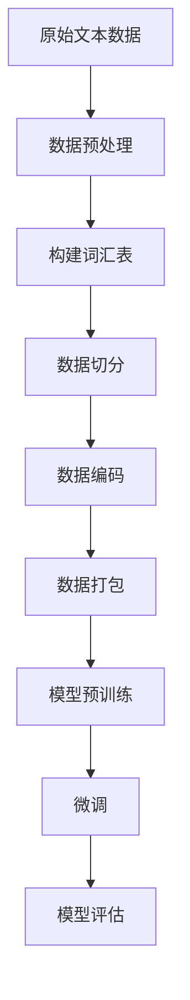

# 大规模语言模型从理论到实践 数据处理

## 1.背景介绍

### 1.1 大规模语言模型的兴起

近年来,随着计算能力的不断提高和海量数据的积累,大规模语言模型(Large Language Model, LLM)在自然语言处理领域取得了令人瞩目的成就。这些模型通过在大量文本数据上进行预训练,学习到了丰富的语言知识和上下文信息,从而在下游任务中展现出了强大的泛化能力。

GPT-3、PanGu-Alpha、BLOOM等一系列大型语言模型的出现,推动了自然语言处理技术的飞速发展,在机器翻译、文本生成、问答系统等多个领域取得了突破性的进展。然而,训练这些庞大的模型需要消耗大量的计算资源和存储空间,对数据的质量和规模也提出了更高的要求。

### 1.2 数据处理的重要性

数据是训练大规模语言模型的基石。高质量、多样化的数据集不仅能够提高模型的泛化能力,还能够减少模型在推理时产生偏差和不当行为的风险。因此,对于大规模语言模型而言,数据处理是一个至关重要的环节,它直接影响着模型的性能和可靠性。

数据处理包括数据采集、数据清洗、数据标注、数据增强等多个步骤,每一个步骤都需要精心设计和实施。合理的数据处理策略不仅能够提高模型的准确性,还能够减少训练时间和计算资源的消耗,从而降低整体的训练成本。

## 2.核心概念与联系

### 2.1 数据采集

数据采集是构建大规模语言模型的第一步,它旨在从各种来源收集足够多样化的文本数据。常见的数据来源包括网页、书籍、论文、新闻报道、社交媒体等。在采集过程中,需要注意数据的版权和隐私问题,并遵守相关的法律法规。

为了确保数据的多样性和覆盖面,通常需要采用多种采集策略,如网络爬虫、API调用、数据共享协议等。同时,还需要对采集到的数据进行初步的清洗和过滤,去除低质量或不相关的数据。

### 2.2 数据清洗

由于原始数据通常存在噪音、错误、重复等问题,因此需要进行数据清洗,以提高数据的质量和一致性。常见的清洗操作包括:

- 去除HTML标签、脚本代码等无关内容
- 规范化文本格式(大小写、标点符号等)
- 去除重复数据
- 处理缺失值或异常值
- 进行语言识别和字符编码转换

数据清洗可以通过编写脚本程序自动完成,也可以借助一些现有的工具和库,如 Apache Spark、Python的NLTK库等。

### 2.3 数据标注

对于一些需要监督学习的任务,如机器阅读理解、实体识别等,需要对数据进行人工标注。标注的内容可以是文本片段的标签、实体类型、关系类型等。

标注工作通常由专业的人工标注团队完成,需要制定统一的标注指南和质量控制机制。标注的质量直接影响模型的性能,因此需要投入大量的人力和时间成本。一些常见的标注工具包括BRAT、doccano等。

### 2.4 数据增强

即使采集到了大量的原始数据,由于存在冗余和偏差的问题,单纯使用这些数据进行训练可能会导致模型的性能受限。因此,需要通过数据增强技术来扩充和丰富训练数据。

常见的数据增强方法包括:

- 随机插入/删除/交换/替换单词
- 同义词/近义词替换
- 语法变换(主动->被动等)
- 背景噪音添加(对于语音数据)
- 数据混合(将不同领域的数据混合)

数据增强不仅能够提高模型的泛化能力,还能够增强模型对噪音和变化的鲁棒性。

### 2.5 数据划分

在模型训练之前,需要将整个数据集划分为训练集、验证集和测试集。训练集用于模型参数的学习,验证集用于模型超参数的调优和防止过拟合,测试集用于评估模型的最终性能。

数据划分的比例通常为:训练集占80%,验证集和测试集各占10%。划分时需要确保三个子集之间的数据分布一致,避免出现数据偏移的情况。常见的划分方法包括随机采样、分层采样等。

## 3.核心算法原理具体操作步骤

大规模语言模型通常采用自注意力机制(Self-Attention)和Transformer架构,能够有效地捕捉长距离依赖关系,并通过预训练的方式学习到丰富的语言知识。以下是训练大规模语言模型的一般步骤:

### 3.1 数据预处理

在正式训练之前,需要对原始文本数据进行预处理,包括文本清洗、标记化(tokenization)、过滤等操作。

文本清洗旨在去除无关内容、规范化文本格式,提高数据质量。标记化则是将文本切分为一系列的词元(token),作为模型的输入单元。常见的标记化方法包括基于词典的Word Piece模型、基于字节对编码(BPE)的子词标记化等。

### 3.2 构建词汇表

基于标记化的结果,需要构建一个词汇表(vocabulary),将每个独特的词元映射到一个唯一的整数ID。词汇表的大小通常在几万到几十万之间,过大或过小的词汇表都会影响模型的性能。

在构建词汇表时,需要考虑词元的频率、覆盖率等因素,同时还需要预留一部分ID用于特殊标记(如填充标记、未知词标记等)。

### 3.3 数据切分

由于模型的计算能力有限,无法一次性处理过长的文本序列。因此,需要将原始文本切分为若干个固定长度的段落或句子,作为模型的输入单元。

切分时需要注意不能破坏语义完整性,通常采用滑动窗口的方式,让相邻的输入单元之间存在一定的重叠,以捕捉跨段落的上下文信息。

### 3.4 数据编码

将切分后的文本单元转换为模型可识别的数值表示,即将每个词元映射为其在词汇表中对应的整数ID。同时,还需要添加特殊标记,如句子起始标记、句子结束标记等。

对于一些特殊任务,如机器翻译,还需要对源语言和目标语言的文本进行分别编码,并添加语言标记,以指示模型输入和输出的语言类型。

### 3.5 数据打包

将编码后的数据按批次(batch)打包,以便并行地送入模型进行训练。每个批次包含多个样本,样本之间通过填充(padding)的方式补齐到相同的长度。

打包时还需要生成掩码(mask)张量,用于指示模型应该预测哪些位置的词元。对于蒸馏(distillation)任务,还需要生成辅助掩码,指示哪些位置的词元应该被忽略。

### 3.6 模型预训练

使用打包后的数据,在大规模的无标注文本语料库上对模型进行预训练。预训练通常采用自监督的方式,即模型需要根据上下文预测被掩码的词元。

常见的预训练目标包括:

- 掩码语言模型(Masked Language Modeling, MLM):预测被掩码的词元
- 下一句预测(Next Sentence Prediction, NSP):判断两个句子是否相邻
- 排列语言模型(Permuted Language Modeling, PLM):预测打乱顺序的词元的原始顺序

预训练过程中,模型会不断调整参数,学习到丰富的语言知识和上下文信息。

### 3.7 微调

在完成预训练后,可以将模型在特定的下游任务上进行微调(fine-tuning),以进一步提高模型在该任务上的性能。

微调时,需要根据任务的特点对模型的输入、输出、损失函数等进行适当的修改。同时,还需要准备相应的标注数据,并对模型进行有监督的训练。

### 3.8 模型评估

在训练结束后,需要在保留的测试集上评估模型的性能,包括准确率、精确率、召回率、F1分数等指标。评估的结果将反映模型的泛化能力,并为后续的模型优化提供依据。

## 4.数学模型和公式详细讲解举例说明

大规模语言模型通常采用自注意力机制(Self-Attention)和Transformer架构,能够有效地捕捉长距离依赖关系。下面我们将详细介绍自注意力机制的数学原理。

### 4.1 注意力机制

注意力机制(Attention Mechanism)是一种赋予模型"注意力"的机制,使其能够专注于输入序列中的关键部分,而忽略无关的部分。这种机制在机器翻译、阅读理解等任务中表现出色。

给定一个查询向量(query) $q$和一系列键值对(key-value pairs) $(k_i, v_i)$,注意力机制的计算过程如下:

1. 计算查询向量和每个键向量之间的相似度分数:

$$\text{score}(q, k_i) = q^\top k_i$$

2. 对相似度分数进行缩放和归一化,得到注意力权重:

$$\alpha_i = \text{softmax}(\frac{\text{score}(q, k_i)}{\sqrt{d_k}})$$

其中,$ \sqrt{d_k} $是一个缩放因子,用于防止较大的点积导致梯度消失或爆炸。

3. 根据注意力权重对值向量进行加权求和,得到注意力输出:

$$\text{attn}(q, K, V) = \sum_{i=1}^n \alpha_i v_i$$

其中,$ K = [k_1, k_2, \dots, k_n] $是键向量的集合,$ V = [v_1, v_2, \dots, v_n] $是值向量的集合。

注意力机制能够自适应地捕捉输入序列中的重要信息,并将其融合到输出中,从而提高了模型的表现能力。

### 4.2 多头注意力

为了进一步提高注意力机制的表现,Transformer引入了多头注意力(Multi-Head Attention)的概念。多头注意力将注意力机制分解为多个独立的"头"(head),每个头都会学习不同的注意力模式,最终将所有头的输出进行拼接。

具体来说,给定查询向量$ q $、键向量集合$ K $和值向量集合$ V $,多头注意力的计算过程如下:

1. 将查询向量、键向量和值向量线性投影到不同的子空间,得到$ h $个头:

$$\begin{aligned}
q_i &= Wq_i^\top q \\
K_i &= WK_i^\top K \\
V_i &= WV_i^\top V
\end{aligned}$$

其中,$ W_q^i $、$ W_K^i $和$ W_V^i $分别是第$ i $个头的查询向量、键向量和值向量的线性投影矩阵。

2. 对每个头分别计算注意力输出:

$$\text{head}_i = \text{attn}(q_i, K_i, V_i)$$

3. 将所有头的输出拼接起来,得到最终的多头注意力输出:

$$\text{MultiHead}(q, K, V) = \text{concat}(\text{head}_1, \text{head}_2, \dots, \text{head}_h) W^O$$

其中,$ W^O $是一个可学习的线性投影矩阵,用于将拼接后的向量映射回原始的向量空间。

多头注意力机制能够从不同的子空间捕捉不同的注意力模式,提高了模型的表现能力和泛化性。

### 4.3 自注意力

在大规模语言模型中,通常采用自注意力(Self-Attention)机制,即将输