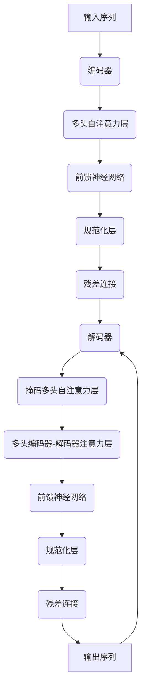

# 大语言模型 原理与代码实例讲解

## 1.背景介绍

随着人工智能和深度学习技术的不断发展,大型语言模型(Large Language Model,LLM)已经成为自然语言处理领域的关键技术之一。这些模型通过在海量文本数据上进行预训练,学习了丰富的语言知识和上下文信息,从而可以生成高质量、连贯、多样化的自然语言内容。

大语言模型的出现,为人机交互、内容生成、机器翻译、问答系统等众多应用领域带来了革命性的变革。著名的大语言模型包括GPT(Generative Pre-trained Transformer)、BERT(Bidirectional Encoder Representations from Transformers)、XLNet、RoBERTa等,它们在各种自然语言处理任务上展现出了令人惊叹的性能。

## 2.核心概念与联系

### 2.1 自注意力机制(Self-Attention Mechanism)

自注意力机制是大语言模型的核心组成部分,它允许模型捕捉输入序列中任意两个位置之间的关系,从而更好地理解上下文信息。与传统的循环神经网络(RNN)和卷积神经网络(CNN)不同,自注意力机制不受序列长度的限制,可以更有效地处理长序列输入。

自注意力机制的工作原理可以用以下公式表示:

$$\text{Attention}(Q, K, V) = \text{softmax}\left(\frac{QK^T}{\sqrt{d_k}}\right)V$$

其中,Q(Query)表示查询向量,K(Key)表示键向量,V(Value)表示值向量,通过计算查询向量与所有键向量的相似性得分,并对其进行软最大值归一化,最终获得注意力权重,将其与值向量相乘得到加权和,作为注意力的输出。

### 2.2 transformer架构

Transformer是一种全新的基于注意力机制的序列到序列模型,它完全舍弃了RNN和CNN,使用多头自注意力机制和位置编码来捕捉输入序列的长程依赖关系。Transformer架构主要由编码器(Encoder)和解码器(Decoder)两部分组成,如下图所示:



编码器的作用是将输入序列映射为一系列连续的向量表示,而解码器则根据这些向量表示生成输出序列。编码器和解码器内部都采用了多头自注意力层、前馈神经网络、层归一化和残差连接等组件,以提高模型的表现力和泛化能力。

### 2.3 预训练与微调(Pre-training and Fine-tuning)

大语言模型通常采用两阶段训练策略:预训练(Pre-training)和微调(Fine-tuning)。在预训练阶段,模型在大规模无标注语料库(如书籍、网页、维基百科等)上进行自监督学习,捕捉通用的语言知识和上下文信息。而在微调阶段,预训练好的模型将在特定的下游任务数据集上进行进一步的监督fine-tuning,使其适应具体的应用场景。

这种预训练与微调的范式大大减少了从头训练大型模型所需的数据量和计算资源,同时也提高了模型在下游任务上的泛化能力。不同的预训练目标(如掩码语言模型、下一句预测等)和微调策略会对模型的性能产生显著影响。

## 3.核心算法原理具体操作步骤

### 3.1 transformer编码器(Encoder)

Transformer编码器的主要作用是将输入序列映射为一系列连续的向量表示,供解码器使用。编码器由多个相同的层组成,每一层都包含两个子层:多头自注意力机制层和前馈神经网络层。

1. **输入embedding和位置编码**

   首先,将输入序列的每个token映射为一个embedding向量,并添加位置编码,以保留序列的位置信息。

2. **多头自注意力层**

   该层的作用是捕捉输入序列中任意两个位置之间的关系。具体步骤如下:
   
   - 将输入分别映射为查询(Query)、键(Key)和值(Value)向量。
   - 对每个查询向量,计算它与所有键向量的相似性得分(点积运算),并对得分进行软最大值归一化,得到注意力权重。
   - 将注意力权重与值向量相乘,得到加权和,作为注意力的输出。
   - 对多个注意力头的输出进行拼接,得到最终的多头自注意力输出。

3. **前馈神经网络层**

   该层包含两个全连接层,对自注意力层的输出进行进一步的非线性变换,以提取更高层次的特征表示。

4. **层归一化和残差连接**

   在每个子层之后,都会进行层归一化和残差连接操作,以提高模型的训练稳定性和表现力。

通过堆叠多个这样的编码器层,模型可以逐步提取输入序列的高层次语义表示。

### 3.2 transformer解码器(Decoder)

Transformer解码器的作用是根据编码器的输出,生成目标序列。解码器的结构与编码器类似,也由多个相同的层组成,每一层包含三个子层:掩码多头自注意力层、多头编码器-解码器注意力层和前馈神经网络层。

1. **输入embedding和位置编码**

   将输入序列(通常是前一个时间步的输出token)映射为embedding向量,并添加位置编码。

2. **掩码多头自注意力层**

   该层的作用是捕捉当前位置之前的上下文信息,忽略之后的信息(以避免曝光)。具体步骤与编码器的自注意力层类似,只是在计算注意力权重时,会对未来的位置进行掩码(设置为负无穷)。

3. **多头编码器-解码器注意力层**

   该层的作用是将解码器的输出与编码器的输出进行关联。具体步骤如下:
   
   - 将解码器的输出映射为查询向量,编码器的输出映射为键和值向量。
   - 对每个查询向量,计算它与所有键向量的相似性得分,并进行软最大值归一化,得到注意力权重。
   - 将注意力权重与值向量相乘,得到加权和,作为注意力的输出。
   - 对多个注意力头的输出进行拼接,得到最终的多头注意力输出。

4. **前馈神经网络层**

   该层的作用与编码器中的前馈层相同,对注意力层的输出进行进一步的非线性变换。

5. **层归一化和残差连接**

   在每个子层之后,都会进行层归一化和残差连接操作。

6. **输出层**

   最后,将解码器的输出通过一个线性层和softmax层,生成下一个token的概率分布。

通过逐步生成token,解码器可以产生完整的目标序列。在每个时间步,解码器都会利用当前生成的token以及编码器的输出,预测下一个token。

## 4.数学模型和公式详细讲解举例说明

在transformer模型中,自注意力机制是核心组件之一,它允许模型捕捉输入序列中任意两个位置之间的关系。自注意力机制的数学模型可以用以下公式表示:

$$\text{Attention}(Q, K, V) = \text{softmax}\left(\frac{QK^T}{\sqrt{d_k}}\right)V$$

其中:

- $Q \in \mathbb{R}^{n \times d_k}$ 表示查询(Query)矩阵,其中$n$是序列长度,$d_k$是查询向量的维度。
- $K \in \mathbb{R}^{n \times d_k}$ 表示键(Key)矩阵,与查询矩阵形状相同。
- $V \in \mathbb{R}^{n \times d_v}$ 表示值(Value)矩阵,其中$d_v$是值向量的维度。

具体计算步骤如下:

1. 计算查询和键之间的相似性得分矩阵:

   $$\text{scores} = \frac{QK^T}{\sqrt{d_k}}$$

   其中,$\sqrt{d_k}$是一个缩放因子,用于防止内积值过大导致softmax函数饱和。

2. 对相似性得分矩阵进行softmax操作,得到注意力权重矩阵:

   $$\text{weights} = \text{softmax}(\text{scores})$$

   其中,softmax函数对每一行进行操作,确保每行的权重之和为1。

3. 将注意力权重矩阵与值矩阵相乘,得到加权和,作为注意力的输出:

   $$\text{output} = \text{weights} \cdot V$$

通过自注意力机制,模型可以自适应地为每个位置分配不同的注意力权重,从而更好地捕捉长程依赖关系和上下文信息。

以一个简单的例子来说明自注意力机制的工作原理。假设我们有一个长度为4的输入序列"思考 编程 人生 的 艺术",我们希望模型能够捕捉到"人生"和"艺术"两个词之间的语义关联。

1. 首先,将每个词映射为一个embedding向量,例如:

   ```python
   import torch
   import torch.nn as nn

   # 词嵌入矩阵,每个词对应一个3维向量
   embeddings = nn.Embedding(5, 3)  # 5个词,embedding维度为3
   input_ids = torch.tensor([0, 1, 2, 3, 4])  # 输入序列的词ID
   input_embeds = embeddings(input_ids)  # 得到输入序列的embedding向量
   ```

2. 将输入序列的embedding向量分别映射为查询、键和值矩阵:

   ```python
   # 线性映射层
   query_proj = nn.Linear(3, 3)
   key_proj = nn.Linear(3, 3)
   value_proj = nn.Linear(3, 3)

   queries = query_proj(input_embeds)  # 查询矩阵
   keys = key_proj(input_embeds)  # 键矩阵
   values = value_proj(input_embeds)  # 值矩阵
   ```

3. 计算注意力权重矩阵:

   ```python
   scores = torch.matmul(queries, keys.transpose(-2, -1)) / math.sqrt(3)  # 相似性得分矩阵
   weights = nn.functional.softmax(scores, dim=-1)  # 注意力权重矩阵
   ```

   在这个例子中,我们可以观察到"人生"和"艺术"两个词之间的注意力权重较高,说明模型成功捕捉到了它们之间的语义关联。

4. 计算注意力输出:

   ```python
   output = torch.matmul(weights, values)  # 注意力输出
   ```

   注意力输出就是输入序列的一种加权表示,其中每个位置的向量是根据与其他位置的关联性进行加权求和得到的。

通过上述步骤,我们可以看到自注意力机制是如何有效地捕捉序列中任意两个位置之间的关系,并生成更富含义的表示。在transformer模型中,自注意力机制被广泛应用于编码器和解码器的各个层,以提取输入序列和输出序列的高层次语义表示。

## 5.项目实践:代码实例和详细解释说明

为了更好地理解transformer模型的原理和实现细节,我们将基于PyTorch框架,构建一个简化版本的transformer模型,并在机器翻译任务上进行训练和测试。

### 5.1 数据准备

我们将使用一个小型的英语-西班牙语平行语料库作为训练数据。这个数据集包含约10万对英西语句对,我们将对数据进行预处理,构建词表、填充序列等操作。

```python
import torch
from torchtext.data import Field, BucketIterator

# 定义英语和西班牙语的Field对象
SRC = Field(tokenize='spacy',
            tokenizer_language='en_core_web_sm',
            init_token='<sos>',
            eos_token='<eos>',
            lower=True)

TRG = Field(tokenize='spacy',
            tokenizer_language='es_core_news{"msg_type":"generate_answer_finish","data":"","from_module":null,"from_unit":null}