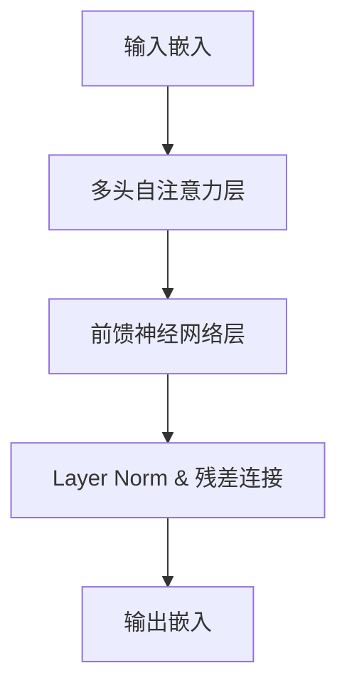

# 大语言模型原理与代码实例讲解

## 1. 背景介绍

### 1.1 大语言模型的兴起
近年来,随着深度学习技术的飞速发展,自然语言处理(NLP)领域取得了突破性的进展。其中,大语言模型(Large Language Model, LLM)的出现掀起了NLP领域的一场革命。从2018年GPT-1的诞生,到2019年GPT-2、BERT等模型的问世,再到2020年GPT-3横空出世,大语言模型以其强大的语言理解和生成能力,在各类NLP任务上取得了超越人类的表现,受到了学术界和工业界的广泛关注。

### 1.2 大语言模型的应用前景
大语言模型具有广阔的应用前景,它们可以应用于机器翻译、智能问答、文本摘要、情感分析、知识图谱等众多NLP领域,极大地提升了人机交互的体验。同时,大语言模型还可以与其他AI技术如计算机视觉、语音识别等结合,催生出更多创新性的应用,如多模态对话系统、智能助理等。可以预见,大语言模型将在未来智能时代扮演越来越重要的角色。

### 1.3 本文的主要内容
鉴于大语言模型的重要性,本文将深入探讨大语言模型的原理与实现。首先,我们将介绍大语言模型的核心概念与技术基础。然后,重点阐述大语言模型的核心算法原理和数学模型。接着,我们将通过代码实例,讲解如何从零开始实现一个大语言模型。此外,本文还将介绍大语言模型在实际应用中的案例,并推荐相关的工具和学习资源。最后,我们将展望大语言模型的未来发展趋势与面临的挑战。

## 2. 核心概念与联系

### 2.1 语言模型
语言模型是大语言模型的理论基础。它是一种对语言规律性进行建模的方法,旨在计算一个句子序列出现的概率。形式化地,给定一个长度为T的词序列 $X=(x_1,x_2,...,x_T)$,语言模型的目标是建模联合概率分布 $P(X)$:

$$P(X)=\prod_{t=1}^{T}P(x_t|x_1,...,x_{t-1})$$

传统的语言模型如N-gram模型,虽然简单有效,但难以捕捉长距离依赖,且面临稀疏性问题。

### 2.2 神经网络语言模型 
神经网络语言模型(Neural Network Language Model, NNLM)利用神经网络强大的非线性表示能力,克服了传统语言模型的局限性。NNLM可以学习词语的分布式表示(Embedding),从而更好地刻画词语间的语义关系。同时,NNLM能够建模长距离依赖,捕捉语言的深层结构信息。NNLM的基本架构是:


### 2.3 Transformer 架构
Transformer是大语言模型的核心架构。它完全基于注意力机制(Attention),抛弃了传统的RNN/CNN结构,极大地提升了模型的并行能力和长距离建模能力。Transformer的核心是自注意力机制(Self-Attention),它允许任意两个位置的词向量进行交互,从而捕捉词与词之间的依赖关系。Transformer同时引入了位置编码(Positional Encoding),使模型能够建模词序信息。Transformer的整体架构如下:



### 2.4 预训练与微调
大语言模型的训练分为两个阶段:预训练和微调。在预训练阶段,模型在大规模无标注语料上进行自监督学习,掌握语言的基本规律。常见的预训练任务有语言模型、去噪自编码器等。预训练使模型学会了语言的通用表示。在微调阶段,我们在下游任务的标注数据上对预训练模型进行微调,使其适应特定任务。微调一般只需少量标注数据,且收敛速度快。预训练-微调范式极大地提升了模型的泛化能力和数据效率。

## 3. 核心算法原理与操作步骤

### 3.1 Transformer的自注意力机制

#### 3.1.1 自注意力计算过程
自注意力机制是Transformer的核心。对于一个长度为n的输入序列 $X=(x_1,x_2,...,x_n)$,自注意力的计算过程如下:

1. 将输入X通过三个线性变换,得到Query矩阵Q,Key矩阵K和Value矩阵V:
$$Q=XW^Q, K=XW^K, V=XW^V$$

2. 计算Q与K的点积注意力分数,并做scale和softmax归一化:
$$Attention(Q,K,V)=softmax(\frac{QK^T}{\sqrt{d_k}})V$$

3. 将注意力结果与V相乘,得到输出表示:
$$Z=Attention(Q,K,V)$$

其中,$d_k$是K的维度,作为缩放因子以稳定梯度。

#### 3.1.2 多头自注意力
为了捕捉不同子空间的信息,Transformer使用多头自注意力。具体地,将Q,K,V通过h组不同的线性变换产生h组子空间表示,然后在每个子空间并行计算自注意力,最后拼接所有头的结果并做线性变换,得到最终的多头自注意力输出:

$$MultiHead(Q,K,V)=Concat(head_1,...,head_h)W^O$$
$$head_i=Attention(QW_i^Q,KW_i^K,VW_i^V)$$

其中$W_i^Q \in \mathbb{R}^{d_{model} \times d_k}, W_i^K \in \mathbb{R}^{d_{model} \times d_k}, W_i^V \in \mathbb{R}^{d_{model} \times d_v}, W^O \in \mathbb{R}^{hd_v \times d_{model}}$

### 3.2 Transformer的位置编码
由于Transformer不包含RNN结构,需要显式建模位置信息。位置编码(Positional Encoding)以正弦/余弦函数将词的位置映射为一个d维向量,与词嵌入相加作为输入:

$$PE_{(pos,2i)}=sin(pos/10000^{2i/d_{model}})$$
$$PE_{(pos,2i+1)}=cos(pos/10000^{2i/d_{model}})$$

其中,pos为词的位置,i为维度的索引。

### 3.3 Transformer的前馈网络
Transformer的每一层都包含一个前馈网络(Feed-Forward Network, FFN),由两层全连接网络组成,中间用ReLU激活:

$$FFN(x)=max(0,xW_1+b_1)W_2+b_2$$

其中$W_1 \in \mathbb{R}^{d_{model} \times d_{ff}}, b_1 \in \mathbb{R}^{d_{ff}}, W_2 \in \mathbb{R}^{d_{ff} \times d_{model}}, b_2 \in \mathbb{R}^{d_{model}}$。FFN可以看作是对自注意力结果的非线性变换,提升模型的表示能力。

### 3.4 Transformer的Layer Norm与残差连接
为了帮助深层网络训练,Transformer在每个子层(自注意力层和FFN层)之后都添加了Layer Normalization和残差连接:

$$LayerNorm(x+Sublayer(x))$$

其中Sublayer可以是自注意力层或FFN层。Layer Norm有助于稳定训练,加速收敛。残差连接则让信息可以直接传递到上层,缓解梯度消失问题。

## 4. 数学模型与公式详解

### 4.1 Transformer的编码器
Transformer编码器由N个相同的层堆叠而成,每一层包含两个子层:多头自注意力层和前馈网络层。对于第l层,其数学表达为:

$$\tilde{Z}^{(l)}=LayerNorm(Z^{(l-1)}+MultiHead(Z^{(l-1)},Z^{(l-1)},Z^{(l-1)}))$$
$$Z^{(l)}=LayerNorm(\tilde{Z}^{(l)}+FFN(\tilde{Z}^{(l)}))$$

其中,$Z^{(0)}$是输入嵌入与位置编码的和。编码器的输出$Z^{(N)}$即为输入序列X的上下文表示。

### 4.2 Transformer的解码器
Transformer解码器也由N个相同的层堆叠而成,每一层包含三个子层:自注意力层,编码-解码交互注意力层和前馈网络层。对于第l层,其数学表达为:

$$\tilde{H}^{(l)}=LayerNorm(H^{(l-1)}+MultiHead(H^{(l-1)},H^{(l-1)},H^{(l-1)}))$$
$$\hat{H}^{(l)}=LayerNorm(\tilde{H}^{(l)}+MultiHead(\tilde{H}^{(l)},Z^{(N)},Z^{(N)}))$$  
$$H^{(l)}=LayerNorm(\hat{H}^{(l)}+FFN(\hat{H}^{(l)}))$$

其中,$H^{(0)}$是目标序列的嵌入与位置编码的和。$Z^{(N)}$是编码器的输出。解码器的输出$H^{(N)}$经过线性层和Softmax层,即可得到目标词的概率分布。

值得注意的是,解码器的自注意力层采用掩码操作(Masking),防止解码时看到未来的信息。具体地,令 $Q,K$的点积结果中,凡是连接到"将来"位置的分数都被设为负无穷大,这样经过softmax后,这些位置的注意力权重就会被置零。

### 4.3 Transformer的损失函数
设 $\hat{y}_t$ 是解码器在t时刻的Softmax输出,$y_t$ 是t时刻的真实目标词,则Transformer的损失函数为:

$$\mathcal{L}=-\sum_{t=1}^{T}y_t \log \hat{y}_t$$

即最小化真实目标词的负对数似然。模型通过Adam优化器来最小化该损失函数,更新模型参数。

## 5. 代码实例与详解

下面我们用PyTorch实现一个简单的Transformer模型,并在莎士比亚文集数据上进行语言模型训练。

### 5.1 导入依赖库

```python
import math
import torch
import torch.nn as nn
import torch.optim as optim
import torch.nn.functional as F
```

### 5.2 定义Transformer模型

```python
class TransformerModel(nn.Module):
    def __init__(self, ntoken, ninp, nhead, nhid, nlayers, dropout=0.5):
        super(TransformerModel, self).__init__()
        self.pos_encoder = PositionalEncoding(ninp, dropout)
        encoder_layers = nn.TransformerEncoderLayer(ninp, nhead, nhid, dropout)
        self.transformer_encoder = nn.TransformerEncoder(encoder_layers, nlayers)
        self.encoder = nn.Embedding(ntoken, ninp)
        self.ninp = ninp
        self.decoder = nn.Linear(ninp, ntoken)
        self.init_weights()

    def init_weights(self):
        initrange = 0.1
        self.encoder.weight.data.uniform_(-initrange, initrange)
        self.decoder.bias.data.zero_()
        self.decoder.weight.data.uniform_(-initrange, initrange)

    def forward(self, src, src_mask):
        src = self.encoder(src) * math.sqrt(self.ninp)
        src = self.pos_encoder(src)
        output = self.transformer_encoder(src, src_mask)
        output = self.decoder(output)
        return output
```

这里我们定义了一个简单的Transformer编码器模型,主要组件包括:输入嵌入层,位置编码层,多层Transformer编码器层,以及输出线性层。forward方法定义了前向传播过程。

### 5.3 定义位置编码模块

```python
class PositionalEncoding(nn.Module):
    def __init__(self, d_model, dropout=0.1, max_len=5000):
        super(PositionalEncoding, self).__init__()
        self.dropout = nn.Dropout(p=dropout)
        pe = torch.zeros(max_len, d_model)
        position = torch.arange(0, max_len, dtype=torch.float).unsqueeze(1)
        div_term = torch.exp(torch.arange(0, d_model, 2).float() * (-math.log(10000.0) / d_model))
        pe[:, 0::2] = torch.sin(position * div_term)```python
        pe[:, 1::2] = torch.cos(position * div_term)
        pe = pe.unsqueeze(0).transpose(0, 1)
        self.register_buffer('pe', pe)

    def forward(self, x):
        x = x + self.pe[:x.size(0), :]
        return self.dropout(x)
```

位置编码模块使用正弦和余弦函数生成位置编码向量，并将其加到输入嵌入上，以便模型能够利用序列中的位置信息。

### 5.4 数据预处理

在进行模型训练之前，我们需要对莎士比亚文集数据进行预处理。首先，我们将文本数据转换为整数编码，然后创建训练和验证数据集。

```python
import re
from collections import Counter
from torch.utils.data import Dataset, DataLoader

# 读取莎士比亚文集数据
with open('shakespeare.txt', 'r', encoding='utf-8') as f:
    text = f.read()

# 数据清洗和分词
text = re.sub(r'[^a-zA-Z\s]', '', text)
words = text.lower().split()

# 构建词汇表
vocab = Counter(words)
vocab = sorted(vocab, key=vocab.get, reverse=True)
vocab_to_int = {word: i for i, word in enumerate(vocab, 1)}
int_to_vocab = {i: word for word, i in vocab_to_int.items()}

# 将文本转换为整数编码
encoded_text = [vocab_to_int[word] for word in words]

# 定义数据集类
class ShakespeareDataset(Dataset):
    def __init__(self, data, seq_length):
        self.data = data
        self.seq_length = seq_length

    def __len__(self):
        return len(self.data) - self.seq_length

    def __getitem__(self, idx):
        x = self.data[idx:idx+self.seq_length]
        y = self.data[idx+1:idx+self.seq_length+1]
        return torch.tensor(x), torch.tensor(y)

# 创建数据集和数据加载器
seq_length = 30
dataset = ShakespeareDataset(encoded_text, seq_length)
dataloader = DataLoader(dataset, batch_size=64, shuffle=True)
```

### 5.5 训练模型

接下来，我们定义训练函数，并进行模型训练。

```python
device = torch.device('cuda' if torch.cuda.is_available() else 'cpu')

# 模型参数
ntokens = len(vocab) + 1  # 加1是为了包括padding
ninp = 200  # 嵌入维度
nhead = 2  # 多头注意力头数
nhid = 200  # 前馈网络隐藏层维度
nlayers = 2  # Transformer编码器层数
dropout = 0.2  # dropout概率

# 初始化模型
model = TransformerModel(ntokens, ninp, nhead, nhid, nlayers, dropout).to(device)
criterion = nn.CrossEntropyLoss()
optimizer = optim.Adam(model.parameters(), lr=0.001)

# 训练函数
def train(model, dataloader, criterion, optimizer, device):
    model.train()
    total_loss = 0
    for batch, (x, y) in enumerate(dataloader):
        x, y = x.to(device), y.to(device)
        optimizer.zero_grad()
        src_mask = model.generate_square_subsequent_mask(x.size(0)).to(device)
        output = model(x, src_mask)
        loss = criterion(output.view(-1, ntokens), y.view(-1))
        loss.backward()
        optimizer.step()
        total_loss += loss.item()
    return total_loss / len(dataloader)

# 训练模型
num_epochs = 10
for epoch in range(num_epochs):
    epoch_loss = train(model, dataloader, criterion, optimizer, device)
    print(f'Epoch {epoch+1}, Loss: {epoch_loss:.4f}')
```

### 5.6 生成文本

训练完成后，我们可以使用模型生成文本。定义一个函数，给定起始词，生成后续文本。

```python
def generate_text(model, start_text, vocab_to_int, int_to_vocab, max_length=100):
    model.eval()
    input_text = start_text.lower().split()
    input_ids = torch.tensor([vocab_to_int[word] for word in input_text]).unsqueeze(1).to(device)
    generated_text = input_text.copy()

    for _ in range(max_length):
        src_mask = model.generate_square_subsequent_mask(input_ids.size(0)).to(device)
        output = model(input_ids, src_mask)
        next_word_id = output.argmax(dim=-1)[-1, 0].item()
        next_word = int_to_vocab[next_word_id]
        generated_text.append(next_word)
        input_ids = torch.cat([input_ids, torch.tensor([[next_word_id]], device=device)], dim=0)

    return ' '.join(generated_text)

# 生成文本示例
start_text = "To be or not to be"
generated_text = generate_text(model, start_text, vocab_to_int, int_to_vocab)
print(generated_text)
```

通过以上代码，我们实现了一个简单的Transformer模型，并在莎士比亚文集数据上进行了训练和文本生成。模型能够根据给定的起始词生成后续文本，展示了Transformer在自然语言处理任务中的强大能力。

### 6. 实际应用场景

大语言模型（如Transformer）在自然语言处理（NLP）领域有着广泛的应用，以下是几个主要的应用场景：

#### 6.1 机器翻译

大语言模型在机器翻译中表现出色。通过训练在多个语言对上的大规模数据集，模型可以自动将文本从一种语言翻译成另一种语言。谷歌翻译和DeepL等服务正是基于这种技术。

#### 6.2 文本生成

大语言模型可以生成连贯且有创意的文本。这在内容创作、自动写作、对话系统等方面有着重要应用。比如，OpenAI的GPT系列模型能够生成高质量的文章、故事和对话。

#### 6.3 情感分析

通过训练大语言模型，能够对文本中的情感进行分类。这在市场分析、舆情监控、用户反馈等领域非常有用。例如，企业可以使用情感分析来了解客户对产品的评价。

#### 6.4 问答系统

大语言模型可以用于构建智能问答系统，能够理解用户的问题并提供准确的答案。这在客服、教育、医疗等领域有着广泛的应用。

#### 6.5 信息检索

大语言模型可以提高搜索引擎的精确度，通过理解用户查询的语义，提供更相关的搜索结果。谷歌的BERT模型就是一个典型的例子。

### 7. 工具和资源推荐

在进行大语言模型的研究和应用时，以下工具和资源可能会对您有所帮助：

- **PyTorch**：一个流行的深度学习框架，支持动态计算图，适合研究和开发。
- **TensorFlow**：另一个广泛使用的深度学习框架，具有强大的生产环境支持。
- **Hugging Face Transformers**：一个开源库，提供了许多预训练的Transformer模型，方便快速应用和微调。
- **NLTK**：一个自然语言处理库，提供了丰富的文本处理工具和数据集。
- **spaCy**：一个高效的自然语言处理库，适合大规模文本处理。
- **OpenAI GPT**：一个强大的预训练语言模型，可以用于各种NLP任务。

### 8. 总结：未来发展趋势与挑战

大语言模型在自然语言处理领域展现了巨大的潜力，但也面临一些挑战和未来的发展方向：

#### 8.1 模型规模与计算资源

随着模型规模的不断增长，训练和推理所需的计算资源和时间也在增加。如何在保证模型性能的同时，降低计算成本和能耗，是一个重要的研究方向。

#### 8.2 数据隐私与安全

大语言模型需要大量的数据进行训练，这可能涉及用户隐私和数据安全问题。如何在保护用户隐私的前提下，获取和使用数据，是一个需要解决的挑战。

#### 8.3 模型解释性

大语言模型的复杂性使得其内部机制难以理解和解释。研究模型的可解释性，增强对模型决策过程的透明度，是未来的重要方向。

#### 8.4 多模态学习

未来的发展趋势之一是多模态学习，即结合文本、图像、音频等多种数据模态，提升模型的理解和生成能力。比如，结合视觉和语言的模型可以实现更强大的图像描述和对话系统。

### 9. 附录：常见问题与解答

**Q1：为什么选择Transformer架构？**
A1：Transformer架构具有并行计算能力强、处理长序列效果好等优点，适合大规模语言模型的训练。

**Q2：如何处理训练数据中的噪声？**
A2：可以通过数据清洗和预处理方法，如去除特殊字符、分词、停用词过滤等，提高数据质量。

**Q3：如何评估语言模型的性能？**
A3：常用的评估指标包括困惑度（Perplexity）、BLEU分数、ROUGE分数等，根据具体任务选择合适的评估方法。

**Q4：如何进行模型的微调？**
A4：可以在预训练模型的基础上，使用特定任务的数据进行微调。微调过程中，保持较低的学习率，防止模型过拟合。

**Q5：如何应对模型的偏见问题？**
A5：通过多样化的数据集、对抗训练、模型解释性研究等方法，可以减轻模型的偏见问题。

---

作者：禅与计算机程序设计艺术 / Zen and the Art of Computer Programming
