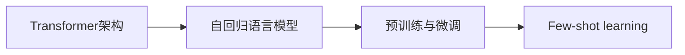

# 大语言模型原理与工程实践：LLaMA 系列

## 1. 背景介绍

### 1.1 大语言模型概述
大语言模型(Large Language Model, LLM)是近年来自然语言处理(NLP)领域最重要的突破之一。它们是在海量文本数据上训练的神经网络模型,能够学习语言的统计规律和语义信息,从而具备强大的语言理解和生成能力。LLM的出现极大地推动了NLP技术的发展,使得诸如机器翻译、对话系统、文本摘要等应用取得了显著进步。

### 1.2 LLaMA模型的诞生
LLaMA(Large Language Model Meta AI)是由Meta AI(前Facebook AI)研究院在2023年开源的一个大规模语言模型。它在GPT-3、PaLM等先进模型的基础上进行了优化改进,在多项NLP任务上取得了state-of-the-art的性能表现。LLaMA模型的开源极大降低了LLM的使用门槛,为更多研究者和开发者提供了便利。

### 1.3 LLaMA模型的特点
与其他LLM相比,LLaMA模型具有以下几个主要特点:

1. 模型规模更大,参数量高达650亿,语言建模能力更强
2. 采用了高效的稀疏注意力机制和分片数据并行训练,训练和推理速度更快
3. 在instruction tuning阶段引入了高质量的人工标注数据,使得模型更加符合人类偏好
4. 模型架构简洁优雅,易于理解和修改,有利于二次开发

## 2. 核心概念与联系

### 2.1 Transformer架构
Transformer是大语言模型的核心架构。它由编码器(Encoder)和解码器(Decoder)两部分组成,通过自注意力机制(Self-Attention)和前馈神经网络(Feed-Forward Network)对输入序列进行编码和解码。相比RNN等传统模型,Transformer能够更好地捕捉长距离依赖关系,且计算高度并行。

### 2.2 自回归语言模型 
自回归语言模型(Autoregressive Language Model)是一种基于概率的生成式模型。它通过最大化下一个token的条件概率来生成文本序列。具体来说,给定前面的token序列,模型预测下一个最可能出现的token,然后将其加入序列并重复该过程,直到生成完整的文本。GPT系列模型都属于自回归语言模型。

### 2.3 预训练与微调
预训练(Pre-training)和微调(Fine-tuning)是训练LLM的两个关键步骤。预训练阶段在大规模无标注语料上进行自监督学习,使模型掌握语言的基本规律。微调阶段在特定任务的标注数据上进行有监督学习,使模型适应具体的应用场景。二者的结合使得LLM能够在多个NLP任务上取得优异表现。

### 2.4 few-shot learning
Few-shot learning指的是模型在只有少量标注样本的情况下就能很好地适应新任务的能力。对于LLM而言,通过设计良好的prompts(输入提示)并在其后提供少量示例,模型就可以理解任务要求并输出满足要求的结果。这种能力使得LLM可以灵活应用于各种场景而无需从头训练。

### 2.5 概念之间的联系
下图展示了以上核心概念之间的联系:

Transformer架构是构建自回归语言模型的基础,而自回归语言模型通过预训练和微调来学习语言知识和适应下游任务。Few-shot learning则是LLM的一个重要能力,使其无需大量标注数据就能解决新问题。

## 3. 核心算法原理与具体步骤

### 3.1 Transformer编码器
Transformer编码器由多个相同的层堆叠而成,每一层包含两个子层:多头自注意力层(Multi-Head Self-Attention)和前馈神经网络层。

#### 3.1.1 多头自注意力
自注意力机制用于计算序列中元素之间的依赖关系。对于序列中的每个位置,通过注意力函数将其与序列中的所有位置进行比较,得到一个注意力分布,然后根据该分布对序列进行加权求和得到该位置的新表示。

多头自注意力将这一过程扩展到多个独立的注意力头上。具体来说,输入序列的嵌入表示首先被线性变换为Q(query)、K(key)、V(value)三个矩阵。然后将它们分别切分为多个头,每个头独立地进行注意力计算,得到一个输出矩阵。最后将所有头的输出拼接起来并经过另一个线性变换得到最终的多头自注意力输出。

多头自注意力的计算过程可以表示为:

$$
\begin{aligned}
\text{MultiHead}(Q, K, V) &= \text{Concat}(\text{head}_1, \dots, \text{head}_h)W^O \\
\text{head}_i &= \text{Attention}(QW_i^Q, KW_i^K, VW_i^V) \\
\text{Attention}(Q, K, V) &= \text{softmax}(\frac{QK^T}{\sqrt{d_k}})V
\end{aligned}
$$

其中$W_i^Q, W_i^K, W_i^V$是第$i$个头的权重矩阵,$W^O$是输出的权重矩阵。$d_k$是每个头的维度,用于缩放点积注意力分数。

#### 3.1.2 前馈神经网络
前馈神经网络层由两个线性变换和一个ReLU激活函数组成,用于对多头自注意力的输出进行非线性变换。其计算公式为:

$$\text{FFN}(x) = \max(0, xW_1 + b_1)W_2 + b_2$$

其中$W_1, b_1, W_2, b_2$是可学习的参数矩阵和偏置向量。

此外,Transformer编码器中还使用了残差连接(Residual Connection)和层归一化(Layer Normalization)来促进训练和提高模型稳定性。

### 3.2 Transformer解码器
Transformer解码器也由多个相同的层堆叠而成,每一层包含三个子层:掩码多头自注意力层、编码-解码多头注意力层和前馈神经网络层。

#### 3.2.1 掩码多头自注意力
在生成每个token时,解码器只能看到该token之前的序列。为此,需要在计算自注意力时对未来的位置进行掩码,即将它们的注意力分数设置为负无穷大,使得softmax输出为0。这一过程称为掩码多头自注意力(Masked Multi-Head Self-Attention),可以防止解码器利用未来信息。

#### 3.2.2 编码-解码多头注意力
编码-解码注意力允许解码器根据编码器的输出计算注意力。具体地,将编码器输出的序列作为key和value,将解码器的多头自注意力输出作为query,然后计算注意力并加权求和得到解码器的表示。这使得解码器可以根据输入序列的信息来生成输出。

#### 3.2.3 生成概率分布
在Transformer解码器的最后,使用一个线性变换和softmax函数将最顶层的隐藏状态转化为下一个token的概率分布:

$$P(x_t|x_{<t}) = \text{softmax}(hW + b)$$

其中$h$是最顶层的隐藏状态,$W$和$b$是可学习的参数矩阵和偏置向量。

### 3.3 预训练算法
LLM的预训练通常采用自监督学习的方式进行,即利用无标注的海量文本数据自动构建监督信号。以下是几种常见的预训练目标:

#### 3.3.1 语言模型
最常见的预训练目标是语言模型,即根据前面的token预测下一个token。给定一个长度为$T$的文本序列$\mathbf{x} = (x_1, \dots, x_T)$,语言模型的目标是最大化如下似然函数:

$$\mathcal{L}_{LM}(\mathbf{x}) = \sum_{t=1}^T \log P(x_t|x_{<t})$$

其中$x_{<t}$表示$x_t$之前的所有token。这可以看作是一个多分类问题,使用交叉熵损失函数进行优化。

#### 3.3.2 去噪自编码
另一种预训练目标是去噪自编码(Denoising Autoencoder),即从被随机遮挡或替换部分token的序列中恢复原始序列。设原始序列为$\mathbf{x}$,被损坏的序列为$\tilde{\mathbf{x}}$,去噪自编码的目标是最大化如下条件概率:

$$\mathcal{L}_{DAE}(\mathbf{x}|\tilde{\mathbf{x}}) = \sum_{t=1}^T \log P(x_t|\tilde{\mathbf{x}})$$

相比语言模型,去噪自编码能够更好地捕捉双向信息。BERT等模型使用这种方式进行预训练。

#### 3.3.3 对比学习
对比学习(Contrastive Learning)通过最大化正样本对的相似度和最小化负样本对的相似度来学习数据的表示。在预训练中,可以将同一个文档的两个片段作为正样本对,将不同文档的片段作为负样本对。设$\mathbf{x}_i$和$\mathbf{x}_j$是一个正样本对,$\{\mathbf{x}_k\}$是负样本集合,对比学习的目标是最小化如下损失函数:

$$\mathcal{L}_{CL}(\mathbf{x}_i, \mathbf{x}_j) = -\log \frac{\exp(\text{sim}(\mathbf{x}_i, \mathbf{x}_j)/\tau)}{\exp(\text{sim}(\mathbf{x}_i, \mathbf{x}_j)/\tau) + \sum_k \exp(\text{sim}(\mathbf{x}_i, \mathbf{x}_k)/\tau)}$$

其中$\text{sim}(\cdot,\cdot)$是相似度函数,$\tau$是温度超参数。SimCLR等模型使用这种方式进行预训练。

### 3.4 微调算法
在下游任务上微调LLM时,常见的做法是在预训练模型的基础上添加一个任务特定的输出层,然后在标注数据上进行有监督学习。以分类任务为例,设$\mathbf{x}$是输入文本序列,$y$是对应的类别标签,微调的目标是最小化如下交叉熵损失函数:

$$\mathcal{L}_{CE}(\mathbf{x}, y) = -\log P(y|\mathbf{x})$$

其中$P(y|\mathbf{x})$是模型输出的类别概率分布。

对于生成任务,可以使用教师强制(Teacher Forcing)的方式进行微调。设$\mathbf{x}$是输入序列,$\mathbf{y} = (y_1, \dots, y_T)$是目标输出序列,微调的目标是最大化如下条件概率:

$$\mathcal{L}_{TF}(\mathbf{y}|\mathbf{x}) = \sum_{t=1}^T \log P(y_t|y_{<t}, \mathbf{x})$$

其中$y_{<t}$表示$y_t$之前的所有token。这可以看作是一个序列标注问题。

在微调过程中,通常使用Adam等优化器以较小的学习率对模型参数进行更新,同时使用一些正则化技术如dropout、weight decay等来防止过拟合。

## 4. 数学模型与公式详解

### 4.1 Transformer的数学表示
Transformer可以用如下数学符号来表示:

- 输入序列$\mathbf{x} = (x_1, \dots, x_n)$,其中$x_i \in \mathbb{R}^d$是第$i$个token的嵌入向量,$d$是嵌入维度。
- 位置编码$\mathbf{p} = (p_1, \dots, p_n)$,其中$p_i \in \mathbb{R}^d$是第$i$个位置的位置向量。位置编码可以是固定的正弦函数,也可以是可学习的参数。
- 多头自注意力的权重矩阵$W_i^Q, W_i^K, W_i^V \in \mathbb{R}^{d \times d_k}, W^O \in \mathbb{R}^{hd_k \times d}$,其中$h$是头数,$d_k$是每个头的维度。
- 前馈神经网络的权重