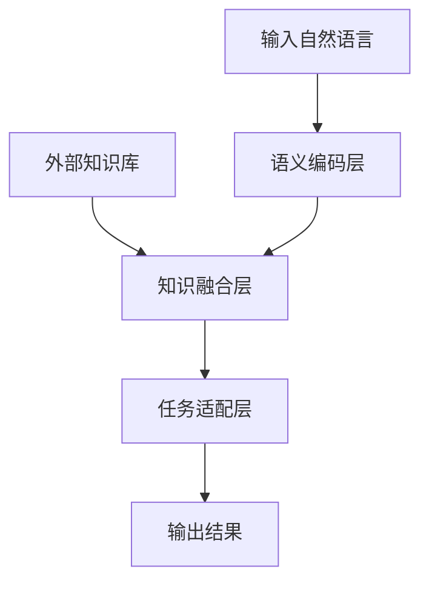

# 大语言模型原理与工程实践：ROOTS

## 1.背景介绍

### 1.1 人工智能的新时代

人工智能(AI)技术正在以前所未有的速度发展,其中大型语言模型(Large Language Model,LLM)的出现标志着人工智能进入了一个新的里程碑。LLM是一种基于深度学习的自然语言处理(NLP)模型,能够从海量文本数据中学习语言模式和语义关系,从而实现对自然语言的理解和生成。

### 1.2 大语言模型的重要性

大语言模型已经广泛应用于多个领域,如机器翻译、问答系统、文本摘要、内容创作等,显示出巨大的潜力。它们能够生成高质量、连贯且语义合理的文本输出,极大地提高了人机交互的自然性和效率。同时,大语言模型也为人工智能系统赋予了更强的理解和推理能力,推动着人工智能向通用人工智能(Artificial General Intelligence,AGI)的目标迈进。

### 1.3 ROOTS:革命性的大语言模型

在这种背景下,ROOTS(Robust,Omnipotent,Open-ended,Transferable and Scalable)大语言模型应运而生。它是一种全新的大语言模型架构,具有鲁棒性、全能性、开放性、可迁移性和可扩展性等独特优势,被誉为"大语言模型的下一代"。本文将深入探讨ROOTS大语言模型的核心原理、关键技术、工程实践和应用前景,为读者提供一个全面的指引。

## 2.核心概念与联系

### 2.1 ROOTS大语言模型的核心理念

ROOTS大语言模型的核心理念是构建一个统一的、通用的语言智能基础架构,它能够在不同的任务和领域之间无缝迁移和扩展。这种理念背后的关键思想是:语言是一种普遍的认知能力,贯穿于人类各种智力活动之中。因此,一个真正强大的语言模型应该能够理解和生成任何形式的自然语言,并将这种语言智能应用于广泛的领域和场景。

ROOTS的核心概念可以概括为五个关键词:

1. **鲁棒性(Robustness)**: 模型具有强大的鲁棒性,能够处理噪声数据、错误输入、缺失信息等各种异常情况,确保输出的可靠性和一致性。

2. **全能性(Omnipotence)**: 模型拥有广泛的语言理解和生成能力,可以胜任各种自然语言处理任务,如机器翻译、问答、摘要、创作等,实现真正的"一统天下"。

3. **开放性(Open-endedness)**: 模型具有持续学习和扩展的能力,可以不断吸收新的知识和经验,动态更新和优化自身,实现开放式的智能增长。

4. **可迁移性(Transferability)**: 模型所学习的语言知识和认知能力可以无缝地迁移到新的领域和任务中,避免重复学习,实现知识的高效复用。

5. **可扩展性(Scalability)**: 模型的架构设计支持大规模并行计算和分布式训练,可以利用更大的数据集和计算资源来持续提升模型的性能和能力。

这五个核心概念相互关联、相辅相成,共同奠定了ROOTS大语言模型的基础理论和技术路线。

### 2.2 ROOTS与其他大语言模型的关系

ROOTS大语言模型并非是一种全新的模型架构,而是在现有的大语言模型基础上进行了创新和改进。它借鉴了多种成熟模型的优点,如Transformer的自注意力机制、GPT的自回归生成策略、BERT的双向编码器等,并在此基础上进行了全面的优化和扩展。

与传统的大语言模型相比,ROOTS最显著的特点是其更强的通用性和可扩展性。它不仅能够胜任单一的自然语言处理任务,还能够灵活地迁移到新的领域,并通过持续学习不断扩展自身的能力边界。这使得ROOTS有望成为一种真正的"万能语言智能"。

同时,ROOTS也吸收了一些新兴模型的创新理念,如Few-Shot学习、元学习(Meta-Learning)、知识增广(Knowledge Augmentation)等,旨在提高模型的数据高效性、泛化能力和知识迁移能力。这些前沿技术的融合,使ROOTS在理论和实践层面都具有创新性。

## 3.核心算法原理具体操作步骤  

### 3.1 ROOTS模型架构

ROOTS大语言模型采用了一种模块化、层次化的架构设计,由多个子模块有机组合而成。这种架构具有很强的灵活性和可扩展性,能够根据不同的任务需求动态组合和配置各个模块。ROOTS的整体架构可以概括为三个核心层次:

1. **语义编码层(Semantic Encoding Layer)**:这一层负责对输入的自然语言进行编码,提取语义特征表示。ROOTS采用了一种新型的混合编码器,融合了BERT的双向编码器和GPT的自回归编码器,实现了对上下文语义的全面捕获。

2. **知识融合层(Knowledge Fusion Layer)**:这一层的作用是将外部知识库中的结构化知识与语义编码层的语义表示进行融合,从而为模型注入先验知识。ROOTS采用了一种新颖的知识注入机制,能够在训练和推理阶段动态地整合不同来源的知识。

3. **任务适配层(Task Adaptation Layer)**:这一层负责将融合后的语义知识表示映射到特定的自然语言处理任务上,并生成最终的输出。ROOTS采用了一种新型的模块化架构,可以根据不同任务动态组合和配置不同的神经网络模块,实现"即插即用"。

这三个层次的有机结合,赋予了ROOTS强大的语言理解、知识融合和任务适配能力,构建了一个真正通用的语言智能基础架构。

### 3.2 语义编码层

ROOTS语义编码层的核心是一种新型的混合编码器,它融合了BERT双向编码器和GPT自回归编码器的优点。具体来说,它由以下几个关键模块组成:

1. **子词嵌入(Subword Embedding)**:将输入文本按字符或子词级别嵌入到向量空间,作为模型的初始输入表示。

2. **位置编码(Positional Encoding)**:为每个词元编码其在序列中的位置信息,捕获词序的重要语义信息。

3. **多头自注意力(Multi-Head Self-Attention)**:通过自注意力机制,捕获输入序列中任意两个词元之间的语义关联,建模长距离依赖关系。

4. **前馈神经网络(Feed-Forward Neural Network)**:对自注意力的输出进行非线性变换,提取更高层次的语义特征表示。

5. **双向&自回归融合(Bidirectional & Autoregressive Fusion)**:将BERT的双向编码器和GPT的自回归编码器进行融合,实现对上下文语义的全面捕获。

通过上述模块的层层计算和特征提取,语义编码层能够从原始文本中学习出丰富的语义表示,为后续的知识融合和任务适配奠定基础。

### 3.3 知识融合层

知识融合层的作用是将外部知识库中的结构化知识与语义编码层的语义表示进行融合,从而为模型注入先验知识。ROOTS采用了一种新颖的知识注入机制,具体步骤如下:

1. **知识表示学习(Knowledge Representation Learning)**:将结构化知识(如知识图谱、本体论等)编码为低维向量表示,作为知识注入的载体。

2. **交互注意力机制(Interactive Attention Mechanism)**:通过注意力机制,捕获语义表示与知识表示之间的相关性,实现双向的语义-知识交互。

3. **知识门控融合(Knowledge Gated Fusion)**:采用门控机制,根据当前的语义上下文动态调节知识的融合强度,实现自适应的知识注入。

4. **知识增广(Knowledge Augmentation)**:在训练阶段,通过对抗生成等技术,动态构造新的"虚拟"知识,增强模型的泛化能力。

通过上述步骤,ROOTS能够灵活地融合不同来源的结构化知识,提高模型的语义理解能力和推理能力。同时,知识增广机制也赋予了模型持续学习和开放式增长的能力。

### 3.4 任务适配层

任务适配层的作用是将融合后的语义知识表示映射到特定的自然语言处理任务上,并生成最终的输出。ROOTS采用了一种新型的模块化架构,可以根据不同任务动态组合和配置不同的神经网络模块,实现"即插即用"。主要步骤包括:

1. **任务表示(Task Representation)**:为每个自然语言处理任务定义一个独特的向量表示,作为任务的"元数据"输入。

2. **任务适配模块(Task Adaptation Module)**:根据任务表示,动态组合和配置一系列专门的神经网络模块,如序列标注模块、序列生成模块、序列分类模块等。

3. **元学习(Meta-Learning)**:在训练阶段,通过元学习算法,学习任务适配模块在不同任务上的最优配置,提高任务迁移和泛化能力。

4. **Few-Shot适配(Few-Shot Adaptation)**:在推理阶段,利用少量的任务示例,通过Few-Shot学习快速适配任务适配模块的参数。

通过上述机制,ROOTS能够灵活地将通用的语义知识表示转化为特定任务的输出,实现一次训练、多任务推理。同时,元学习和Few-Shot学习等技术也赋予了模型强大的任务迁移和快速适配能力。

## 4.数学模型和公式详细讲解举例说明

在ROOTS大语言模型中,数学模型和公式扮演着核心的理论支撑作用。下面将详细介绍几个关键模块的数学原理。

### 4.1 自注意力机制(Self-Attention Mechanism)

自注意力机制是Transformer模型的核心,也是ROOTS语义编码层的基础。它能够有效捕获输入序列中任意两个词元之间的关联关系,建模长距离依赖。

在自注意力计算中,对于输入序列$X = (x_1, x_2, \ldots, x_n)$,我们首先计算查询(Query)、键(Key)和值(Value)向量:

$$
\begin{aligned}
Q &= X \cdot W^Q \\
K &= X \cdot W^K \\
V &= X \cdot W^V
\end{aligned}
$$

其中$W^Q, W^K, W^V$分别是可学习的查询、键和值的投影矩阵。

然后,我们计算查询向量与所有键向量的点积,得到注意力分数矩阵:

$$
\text{Attention}(Q, K, V) = \text{softmax}\left(\frac{QK^T}{\sqrt{d_k}}\right)V
$$

其中$d_k$是缩放因子,用于防止点积值过大导致梯度饱和。

最后,我们对注意力分数矩阵进行列求和,得到每个输出向量:

$$
y_i = \sum_{j=1}^n \text{Attention}(q_i, k_j, v_j)
$$

通过多头注意力(Multi-Head Attention)机制,我们可以从不同的子空间捕获不同的关系,进一步提高模型的表示能力。

### 4.2 知识表示学习(Knowledge Representation Learning)

在知识融合层中,我们需要将结构化知识(如知识图谱)编码为低维向量表示。常用的方法是TransE模型,它将实体和关系映射到低维向量空间中,使得对于三元组$(h, r, t)$,有:

$$
\mathbf{h} + \mathbf{r} \approx \mathbf{t}
$$

其中$\mathbf{h}, \mathbf{r}, \mathbf{t}$分别是头实体、关系和尾实体的向量表示。

在训练过程中,我们最小化如下目标函数:

$$
\mathcal{L} = \sum_{(h, r, t) \in \mathcal{S}} \sum_{(h', r', t') \in \math