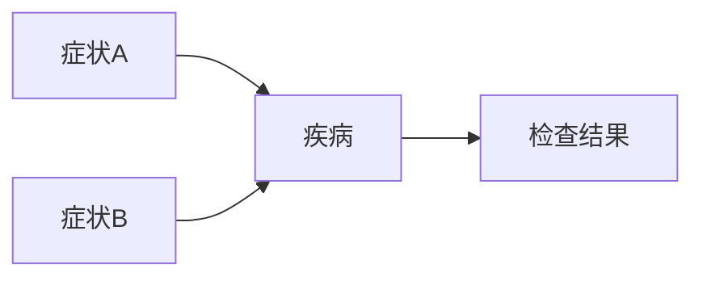

# 大语言模型原理与工程实践：基于思维链的推理策略

## 1.背景介绍

### 1.1 大语言模型的兴起

近年来,大型语言模型(Large Language Models, LLMs)在自然语言处理领域取得了令人瞩目的成就。这些模型通过在海量文本数据上进行预训练,学习到丰富的语言知识和上下文信息,从而在下游任务中展现出强大的泛化能力。

代表性的大语言模型包括GPT(Generative Pre-trained Transformer)系列、BERT(Bidirectional Encoder Representations from Transformers)、XLNet、RoBERTa等。这些模型的出现,不仅推动了自然语言处理技术的飞速发展,也为人工智能系统赋予了更强大的语言理解和生成能力。

### 1.2 思维链推理的重要性

尽管大语言模型在许多任务上取得了卓越表现,但它们仍然存在一些局限性。其中,缺乏系统化的推理能力是一个突出问题。大语言模型虽然能够生成看似合理的文本,但往往缺乏深层次的推理和思考过程,难以解决需要多步骤推理的复杂问题。

为了克服这一挑战,研究人员提出了"思维链"(Thought Chain)的概念,旨在赋予语言模型更强的推理能力。思维链是一种显式的推理过程,将复杂问题分解为一系列相互关联的子步骤,通过逐步推导和组合,最终得出问题的解答。这种推理策略不仅有助于提高语言模型的推理能力,也能增强模型输出的可解释性和可信度。

### 1.3 本文概述

本文将深入探讨大语言模型原理与工程实践,重点关注基于思维链的推理策略。我们将介绍思维链推理的核心概念、算法原理和实现细节,并通过实际案例和代码示例,帮助读者全面掌握这一前沿技术。同时,我们也将分析思维链推理在实际应用场景中的作用,并展望其未来发展趋势和挑战。

## 2.核心概念与联系

### 2.1 大语言模型的基本原理

大语言模型的核心思想是通过在海量文本数据上进行自监督预训练,学习到丰富的语言知识和上下文信息。这种预训练过程通常采用自编码器(Auto-Encoder)或生成式模型(Generative Model)的形式,旨在最大化模型对训练数据的概率。

以Transformer模型为例,它是一种基于注意力机制(Attention Mechanism)的序列到序列(Seq2Seq)模型。Transformer的编码器(Encoder)将输入序列映射为上下文表示,解码器(Decoder)则根据上下文表示生成目标序列。通过预训练,Transformer能够学习到丰富的语言知识,包括词汇、语法、语义等多个层面的信息。

预训练完成后,大语言模型可以通过微调(Fine-tuning)或提示学习(Prompt Learning)等方式,将预训练得到的知识迁移到下游任务中,从而显著提高任务性能。

### 2.2 思维链推理的核心思想

思维链推理的核心思想是将复杂问题分解为一系列相互关联的子步骤,通过逐步推导和组合,最终得出问题的解答。这种推理过程类似于人类解决复杂问题的思维方式,即将问题分解为多个子问题,依次解决每个子问题,并将结果组合起来得到最终答案。

在思维链推理中,每个子步骤都是一个独立的推理单元,包含一个具体的子问题和对应的解答。这些子步骤按照一定的逻辑顺序连接起来,形成一条完整的推理链路。通过这种分步骤的推理方式,语言模型能够更好地理解和解决复杂问题,同时也增强了模型输出的可解释性和可信度。

### 2.3 思维链推理与大语言模型的结合

将思维链推理与大语言模型相结合,可以充分发挥两者的优势。一方面,大语言模型具有丰富的语言知识和上下文理解能力,为思维链推理提供了坚实的基础。另一方面,思维链推理则赋予了大语言模型更强的推理能力,使其能够更好地解决复杂问题。

在实际应用中,我们可以将思维链推理作为一种辅助策略,引导大语言模型进行分步骤的推理。具体来说,我们可以设计一种提示模板,将原始问题分解为多个子问题,并要求语言模型逐步回答每个子问题。通过这种方式,语言模型不仅能够生成最终答案,还能输出完整的推理过程,增强了模型输出的可解释性和可信度。

## 3.核心算法原理具体操作步骤

### 3.1 思维链推理算法概述

思维链推理算法的核心思想是将复杂问题分解为一系列相互关联的子步骤,通过逐步推导和组合,最终得出问题的解答。算法的具体步骤如下:

1. **问题分解**: 将原始问题分解为多个相关的子问题,形成一条初始的思维链。
2. **子问题解答**: 对于每个子问题,利用大语言模型生成对应的解答。
3. **解答组合**: 将各个子问题的解答按照一定的逻辑顺序组合起来,形成对原始问题的最终解答。
4. **解答评估**: 评估最终解答的质量,如果不满足要求,则返回步骤1,对思维链进行调整和优化。
5. **迭代优化**: 重复步骤2-4,不断优化思维链和解答,直到达到满意的结果。

在实际实现中,我们还需要设计合适的提示模板,将原始问题和子问题转换为语言模型可以理解的形式。同时,我们也需要设计一些启发式策略,来指导思维链的构建和优化过程。

### 3.2 问题分解策略

问题分解是思维链推理算法的关键环节。一个好的问题分解策略,能够有效地将复杂问题拆解为易于处理的子问题,从而提高推理的效率和准确性。常见的问题分解策略包括:

1. **基于语义分解**: 根据问题的语义信息,将其拆解为多个相关的子问题。例如,对于一个需要推理和计算的问题,可以将其分解为"理解问题"、"建立数学模型"和"求解模型"三个子问题。

2. **基于知识图谱分解**: 利用知识图谱中的实体、关系和属性信息,将问题分解为多个相关的子问题。这种策略通常应用于需要外部知识支持的问题推理场景。

3. **基于模板分解**: 根据预定义的问题模板,将问题拆解为多个固定的子问题。这种策略适用于一些特定领域的问题推理场景,但缺乏通用性。

4. **基于启发式规则分解**: 设计一些启发式规则,根据问题的特征和复杂程度,动态地将其分解为多个子问题。这种策略需要人工设计合理的规则,但具有一定的灵活性和通用性。

在实际应用中,我们可以根据具体场景和任务需求,选择合适的问题分解策略,或者组合多种策略,以获得更好的推理效果。

### 3.3 子问题解答与组合

在问题分解之后,我们需要利用大语言模型逐步解答每个子问题。这个过程可以通过设计合适的提示模板来实现。

例如,对于一个需要推理和计算的问题,我们可以设计如下提示模板:

```
问题: [原始问题描述]
思维链:
1) [子问题1描述]
解答: [子问题1解答]

2) [子问题2描述]
解答: [子问题2解答]

3) [子问题3描述]
解答: [子问题3解答]

最终解答: [根据子问题解答组合得到的最终解答]
```

在这个提示模板中,我们将原始问题分解为三个子问题,并要求语言模型逐步回答每个子问题。最后,语言模型需要根据子问题的解答,组合出对原始问题的最终解答。

通过这种方式,语言模型不仅能够生成最终答案,还能输出完整的推理过程,增强了模型输出的可解释性和可信度。同时,这种分步骤的推理方式也有助于提高推理的准确性和鲁棒性。

### 3.4 解答评估与迭代优化

在得到最终解答之后,我们需要评估其质量,以确定是否需要进一步优化思维链和推理过程。评估指标可以包括:

1. **答案准确性**: 最终解答是否正确。
2. **推理合理性**: 推理过程是否合理、符合逻辑。
3. **解释清晰性**: 解释是否清晰、易于理解。
4. **知识覆盖度**: 是否涵盖了解决问题所需的关键知识点。

如果评估结果不理想,我们可以根据评估反馈,调整问题分解策略、优化子问题描述、完善知识补充等,并重新执行思维链推理算法,直到得到满意的结果。

这个迭代优化过程可以借助人工干预,也可以设计自动化的策略。例如,我们可以利用强化学习等技术,根据解答质量的反馈信号,自动优化思维链的构建和推理过程。

## 4.数学模型和公式详细讲解举例说明

在思维链推理中,我们往往需要利用数学模型和公式来支持推理过程。本节将介绍一些常见的数学模型和公式,并通过具体示例说明它们在思维链推理中的应用。

### 4.1 概率模型

概率模型是思维链推理中一种重要的数学工具。它可以用于表示不确定性,并基于已知信息进行推理和决策。

常见的概率模型包括贝叶斯网络(Bayesian Network)、马尔可夫模型(Markov Model)和隐马尔可夫模型(Hidden Markov Model)等。这些模型可以用于表示复杂的概率分布,并支持基于证据的推理。

以贝叶斯网络为例,它是一种基于有向无环图的概率模型,用于表示随机变量之间的条件独立性关系。在思维链推理中,我们可以利用贝叶斯网络来建模问题中的不确定性,并基于观测到的证据进行推理和决策。

假设我们需要推理一个人是否患有某种疾病,可以建立如下贝叶斯网络模型:



在这个模型中,疾病的发生与症状A、症状B有关,同时疾病也会影响检查结果。给定观测到的症状和检查结果,我们可以利用贝叶斯公式计算患病的概率:

$$
P(疾病|症状A,症状B,检查结果) = \frac{P(症状A,症状B,检查结果|疾病)P(疾病)}{P(症状A,症状B,检查结果)}
$$

通过这种方式,我们可以将不确定性建模为概率分布,并在思维链推理中利用概率推理的方法得出合理的结论。

### 4.2 优化模型

在一些需要寻找最优解的推理问题中,我们可以利用优化模型来支持推理过程。优化模型通常包括目标函数、决策变量和约束条件,旨在找到使目标函数最小(或最大)的最优解。

常见的优化模型包括线性规划(Linear Programming)、整数规划(Integer Programming)、非线性规划(Non-linear Programming)等。这些模型可以用于解决资源分配、路径规划、组合优化等各种优化问题。

以线性规划为例,它可以用于求解以下形式的优化问题:

$$
\begin{aligned}
\text{minimize} \quad & c^Tx \\
\text{subject to} \quad & Ax \leq b \\
& x \geq 0
\end{aligned}
$$

其中,$c$是代价向量,$A$是约束矩阵,$b$是资源向量,$x$是决策变量向量。

在思维链推理中,我们可以将问题建模为线性规划模型,并利用简单型算法(Simplex Algorithm)或内点法(Interior Point Method)等求