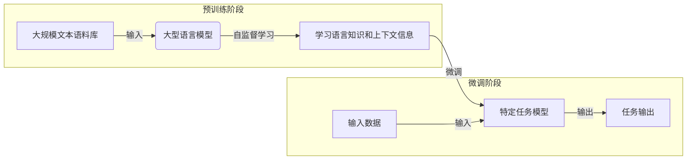

# 大语言模型原理与工程实践：数据瓶颈

## 1. 背景介绍

随着人工智能和深度学习技术的不断发展,大型语言模型(Large Language Models, LLMs)已经成为自然语言处理领域的关键技术之一。这些模型通过在海量文本数据上进行预训练,学习到了丰富的语言知识和上下文信息,从而可以生成高质量、连贯、多样的文本输出。

典型的大型语言模型包括 GPT-3、PaLM、Chinchilla、LLaMA 等,它们展现出了令人惊叹的语言生成能力,在机器翻译、文本摘要、问答系统、内容创作等多个领域发挥着重要作用。然而,训练这些庞大的模型需要消耗大量的计算资源和存储空间,而且需要海量高质量的训练数据作为支撑,这就引出了"数据瓶颈"的挑战。

### 1.1 数据瓶颈的定义

数据瓶颈指的是,大型语言模型训练所需的高质量数据资源难以获取,成为了模型性能提升的主要瓶颈。具体来说,数据瓶颈主要体现在以下几个方面:

- **数据量不足**: 尽管互联网上存在大量文本数据,但真正可用于训练高质量语言模型的"净化"数据却很有限。
- **数据质量参差不齐**: 现有数据往往存在噪音、偏差、不一致等质量问题,需要进行复杂的清洗和处理。
- **数据隐私和版权**: 很多高质量数据受到隐私和版权的限制,不能直接用于模型训练。
- **领域数据匮乏**: 对于一些专业领域(如医疗、法律等),高质量的领域数据往往很少。

### 1.2 数据瓶颈的影响

数据瓶颈严重制约了大型语言模型的性能提升,主要体现在以下几个方面:

- **模型质量受限**: 由于训练数据的不足和质量问题,模型的生成质量和泛化能力受到限制。
- **领域适用性差**: 缺乏足够的领域数据支持,模型在特定领域的应用效果往往不佳。
- **知识覆盖范围有限**: 由于训练数据的局限性,模型掌握的知识范围和深度存在局限。
- **算力资源浪费**: 由于训练数据质量不高,需要消耗更多的算力资源来达到相同的模型质量。

## 2. 核心概念与联系

### 2.1 大型语言模型

大型语言模型(LLMs)是一种基于transformer架构的深度神经网络模型,通过在大规模文本语料库上进行自监督预训练,学习到丰富的语言知识和上下文信息。这些模型具有庞大的参数量(通常超过10亿个参数),能够生成高质量、连贯、多样的文本输出。

LLMs 的核心思想是利用自注意力(Self-Attention)机制来捕捉输入序列中元素之间的长程依赖关系,从而更好地理解和生成自然语言。通过预训练,模型可以从海量数据中学习到语言的统计规律、语义和语境信息,从而具备出色的生成和理解能力。

### 2.2 自监督预训练

自监督预训练(Self-Supervised Pretraining)是训练大型语言模型的关键技术。它不需要人工标注的监督数据,而是通过设计智能的自监督任务,让模型从原始文本数据中自主学习语言知识和上下文信息。

常见的自监督预训练任务包括:

- **Masked Language Modeling (MLM)**: 随机掩蔽输入序列中的部分单词,让模型根据上下文预测被掩蔽的单词。
- **Next Sentence Prediction (NSP)**: 判断两个句子是否为连续的句子对。
- **Permutation Language Modeling (PLM)**: 打乱输入序列的单词顺序,让模型预测正确的单词顺序。
- **Span Corruption**: 随机删除或替换输入序列中的短语,让模型重建原始序列。

通过这些自监督任务,模型可以从大量未标注数据中学习到丰富的语言知识,为后续的微调和下游任务奠定基础。

### 2.3 数据质量

数据质量对于训练高质量的大型语言模型至关重要。高质量的数据应当具备以下特征:

- **多样性**: 数据应当覆盖广泛的主题、领域和风格,以确保模型的泛化能力。
- **无偏差**: 数据应当尽量避免偏向某些特定的观点、人群或话题,以减少模型的偏差。
- **准确性**: 数据应当尽量减少错误、噪音和不一致性,以提高模型的准确性。
- **相关性**: 数据应当与模型的预期应用场景和任务相关,以提高模型的效用。
- **可解释性**: 数据的来源、处理过程和元数据应当具有透明度,以增强模型的可解释性。

## 3. 核心算法原理具体操作步骤

为了克服数据瓶颈的挑战,研究人员提出了多种创新的算法和技术,主要包括以下几个方面:

### 3.1 数据增广

数据增广(Data Augmentation)是一种通过对现有数据进行变换和扩充,从而产生新的训练数据的技术。常见的数据增广方法包括:

1. **文本替换**: 随机替换文本中的单词或短语,保持语义不变。
2. **插入噪音**: 在文本中插入特殊标记或随机字符,增加噪音。
3. **改变顺序**: 打乱文本中单词或句子的顺序。
4. **数据混合**: 将多个文本片段混合在一起,产生新的文本。
5. **机器翻译**: 将文本翻译成其他语言,再翻译回原语言。
6. **上采样**: 对于稀有的数据样本,进行多次采样和复制。

通过数据增广,我们可以从有限的数据中产生更多的训练样本,提高模型的泛化能力和鲁棒性。

### 3.2 迁移学习

迁移学习(Transfer Learning)是一种利用在源领域学习到的知识,来帮助目标领域的模型训练的技术。对于大型语言模型而言,迁移学习可以分为以下几个步骤:

1. **预训练**: 在大规模通用语料库上进行自监督预训练,获得通用语言模型。
2. **微调**: 在目标领域的数据上对预训练模型进行微调,使其适应特定任务。
3. **领域自适应**: 通过对抗训练、数据选择等技术,进一步减小源领域和目标领域的分布差异。

通过迁移学习,我们可以充分利用通用语料库中的知识,缓解目标领域数据匮乏的问题,提高模型的性能和泛化能力。

### 3.3 元学习

元学习(Meta Learning)是一种通过学习任务之间的共性,从而快速适应新任务的技术。对于大型语言模型而言,元学习可以分为以下几个步骤:

1. **元训练**: 在多个不同的任务上进行训练,学习任务之间的共性知识。
2. **元测试**: 在新的任务上测试模型的适应能力,评估元学习的效果。
3. **元更新**: 根据元测试的结果,更新模型参数,提高快速适应新任务的能力。

通过元学习,我们可以训练出一个通用的语言模型,它能够快速适应新的任务和领域,减少对大量标注数据的依赖。

### 3.4 主动学习

主动学习(Active Learning)是一种通过智能地选择最有价值的数据进行标注和训练,从而提高模型性能的技术。对于大型语言模型而言,主动学习可以分为以下几个步骤:

1. **初始训练**: 在有限的标注数据上进行初始训练,获得初始模型。
2. **数据评估**: 使用初始模型对未标注数据进行评估,计算每个样本的不确定性或代表性。
3. **样本选择**: 根据评估结果,选择最有价值的样本进行人工标注。
4. **模型更新**: 将新标注的数据加入训练集,重新训练模型。
5. **迭代**: 重复上述步骤,直到达到预期的模型性能或资源限制。

通过主动学习,我们可以有效地利用有限的标注资源,聚焦于最有价值的数据,从而提高模型的性能和数据利用效率。

### 3.5 弱监督学习

弱监督学习(Weakly Supervised Learning)是一种利用低成本、低质量的标注数据进行训练的技术。对于大型语言模型而言,弱监督学习可以分为以下几个步骤:

1. **数据标注**: 通过规则、模板或远程监督等方式,为大量数据进行自动标注,获得低质量的标注数据。
2. **噪音处理**: 使用噪音过滤、标签平滑或噪音鲁棒损失函数等技术,减小标注噪音对模型的影响。
3. **模型训练**: 在低质量标注数据上训练模型,利用大量数据的优势来提高性能。
4. **知识蒸馏**: 将训练好的模型作为教师模型,将知识传递给更小的学生模型。

通过弱监督学习,我们可以利用大量低成本的标注数据,克服高质量标注数据匮乏的问题,提高模型的性能和泛化能力。

## 4. 数学模型和公式详细讲解举例说明

在大型语言模型中,常常使用一些数学模型和公式来描述和优化模型的各个组件。下面我们将详细介绍其中的几个核心公式。

### 4.1 自注意力机制

自注意力(Self-Attention)机制是transformer架构的核心,它能够捕捉输入序列中元素之间的长程依赖关系。自注意力的计算过程可以用以下公式表示:

$$
\begin{aligned}
\text{Attention}(Q, K, V) &= \text{softmax}\left(\frac{QK^T}{\sqrt{d_k}}\right)V \\
\text{MultiHead}(Q, K, V) &= \text{Concat}(head_1, \dots, head_h)W^O\\
\text{where } head_i &= \text{Attention}(QW_i^Q, KW_i^K, VW_i^V)
\end{aligned}
$$

其中:

- $Q$、$K$、$V$ 分别表示查询(Query)、键(Key)和值(Value)矩阵。
- $d_k$ 是缩放因子,用于防止点积的值过大导致梯度饱和。
- $W_i^Q$、$W_i^K$、$W_i^V$、$W^O$ 是可学习的线性投影参数。
- $\text{MultiHead}$ 表示多头自注意力,通过并行计算多个注意力头,捕捉不同的依赖关系。

自注意力机制能够自适应地为每个输出元素分配不同的注意力权重,从而更好地建模长程依赖关系。

### 4.2 掩码语言模型

掩码语言模型(Masked Language Modeling, MLM)是一种常用的自监督预训练任务,它的目标是根据上下文预测被掩蔽的单词。MLM 的损失函数可以用以下公式表示:

$$
\mathcal{L}_{\text{MLM}} = -\frac{1}{N}\sum_{i=1}^{N}\log P(x_i|\mathbf{x}_{\backslash i})
$$

其中:

- $\mathbf{x}$ 表示输入序列。
- $x_i$ 表示被掩蔽的单词。
- $\mathbf{x}_{\backslash i}$ 表示除去 $x_i$ 的其他单词。
- $P(x_i|\mathbf{x}_{\backslash i})$ 表示根据上下文预测 $x_i$ 的概率分布。
- $N$ 表示掩蔽单词的总数。

通过最小