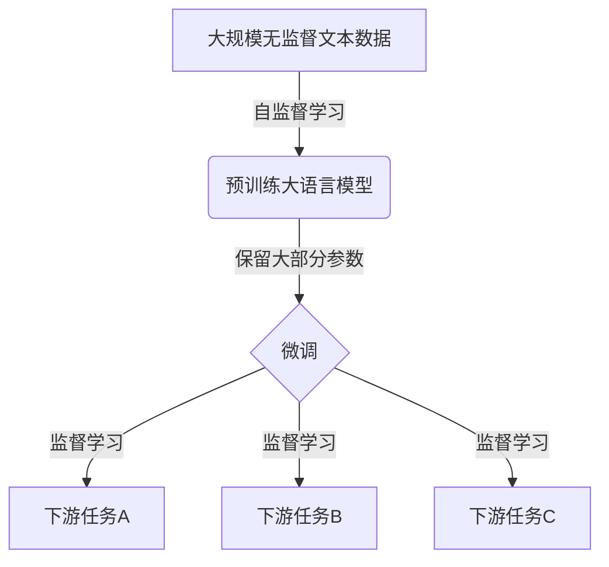
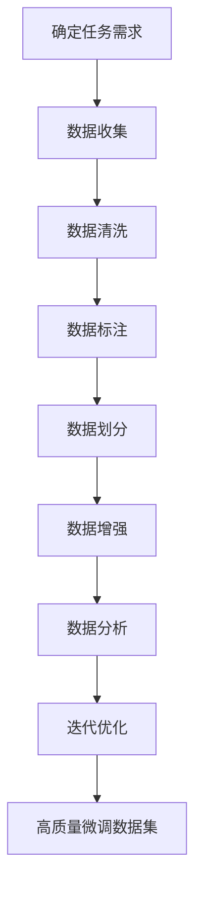

# 大语言模型原理与工程实践：有监督微调数据的选择

## 1.背景介绍

### 1.1 大语言模型的兴起

近年来,大型语言模型(Large Language Models, LLMs)在自然语言处理领域掀起了一场革命。这些模型通过在海量文本数据上进行预训练,展现出了令人惊叹的泛化能力,能够应对各种自然语言处理任务。代表性的大语言模型有GPT-3、BERT、XLNet等。

大语言模型的出现,主要得益于三个关键因素:

1. **算力提升**:近年来,GPU和TPU等硬件加速器的算力持续增长,为训练大型神经网络模型提供了强有力的计算支持。

2. **数据量激增**:互联网时代的到来,使得可用于训练的文本数据呈指数级增长,为训练大型语言模型提供了充足的数据基础。

3. **模型优化**:transformer等新型注意力机制的提出,以及自监督学习等预训练技术的发展,极大地提高了语言模型的性能表现。

### 1.2 微调在大语言模型中的重要性

尽管大语言模型在预训练阶段已经学习到了丰富的语言知识,但要将其应用于特定的下游任务(如文本分类、机器翻译等),通常还需要进行针对性的微调(fine-tuning)。微调的目的是在保留预训练模型中通用语言知识的同时,使模型针对特定任务进行专门化学习,从而获得更好的性能表现。

在微调过程中,选择合适的数据集是一个关键环节。数据集的质量和特征直接影响了微调的效果,进而影响了模型在下游任务上的表现。因此,如何选择合适的微调数据集,成为了大语言模型工程实践中一个重要的问题。

## 2.核心概念与联系

### 2.1 大语言模型的预训练与微调

大语言模型的训练通常分为两个阶段:预训练(pre-training)和微调(fine-tuning)。

**预训练阶段**:在这个阶段,模型在大规模的无监督文本数据(如网页、书籍等)上进行自监督学习,目标是捕捉通用的语言知识和模式。常见的预训练目标包括掩码语言模型(Masked Language Modeling)和下一句预测(Next Sentence Prediction)等。经过预训练,模型获得了丰富的语言表示能力,能够理解和生成自然语言。

**微调阶段**:在这个阶段,预训练好的模型会在特定的下游任务数据集上进行进一步的监督学习,以使模型适应具体的任务需求。微调过程通常只需要对模型的输出层进行调整,而保留大部分预训练得到的参数,这样可以在保留通用语言知识的同时,快速地获得针对特定任务的专门化能力。

上图展示了大语言模型的预训练和微调过程。预训练阶段在大规模无监督数据上进行自监督学习,获得通用的语言表示能力;而微调阶段则在特定的下游任务数据集上进行监督学习,使模型适应具体的任务需求。

### 2.2 微调数据集的重要性

微调数据集的选择对模型在下游任务上的表现有着重大影响。合适的微调数据集应当具备以下特征:

1. **与下游任务相关**:微调数据集应当与目标下游任务具有足够的相关性,包括语料领域、语言风格、数据分布等方面,这样才能使模型更好地适应目标任务。

2. **数据质量良好**:微调数据集应当具有较高的数据质量,包括标注准确性、无噪声等,以避免模型学习到错误的知识。

3. **数据量适中**:微调数据集的数据量不宜过少或过多。过少的数据可能无法充分利用大语言模型的能力;而过多的数据则可能导致过拟合,并增加计算开销。

4. **多样性和覆盖面**:理想的微调数据集应当包含足够多样化的样本,以覆盖下游任务中可能出现的各种情况,从而提高模型的泛化能力。

选择合适的微调数据集,可以充分发挥大语言模型的潜力,提高模型在特定下游任务上的性能表现。反之,不当的数据集选择则可能导致模型性能下降或出现意外行为。因此,微调数据集的选择是大语言模型工程实践中一个关键的环节。

## 3.核心算法原理具体操作步骤

### 3.1 微调数据集构建的一般流程

构建高质量的微调数据集是一个循序渐进的过程,通常包括以下几个关键步骤:

1. **确定任务需求**:首先需要明确微调的目标下游任务,并对任务的输入、输出、评估指标等进行定义。

2. **数据收集**:根据任务需求,从各种渠道(如网络爬虫、人工标注等)收集与目标任务相关的原始数据。

3. **数据清洗**:对收集到的原始数据进行清洗,去除噪声、错误数据等,以提高数据质量。

4. **数据标注**:对清洗后的数据进行人工或自动标注,生成与任务相关的标签。

5. **数据划分**:将标注好的数据划分为训练集、验证集和测试集,用于模型训练、调参和评估。

6. **数据增强**:根据需要,可以对现有数据进行增强(如数据扩充、噪声注入等),以增加数据多样性。

7. **数据分析**:分析数据集的统计特征、分布情况等,以评估数据质量和与任务的相关性。

8. **迭代优化**:根据模型在验证集上的表现,对数据集进行迭代优化,如补充样本、修正标注错误等。

上图展示了构建高质量微调数据集的一般流程。通过不断迭代优化,最终可以获得与目标任务相关、数据质量良好、覆盖面广的微调数据集。

### 3.2 常见的微调数据集构建方法

根据任务需求和数据来源的不同,常见的微调数据集构建方法包括:

1. **人工标注**:由专业人员手动标注原始数据,生成高质量的标注数据集。这种方法能够保证数据质量,但成本较高,且标注效率有限。

2. **自动标注**:利用已有的规则系统或模型对原始数据进行自动标注。这种方法效率较高,但标注质量往往不如人工标注。

3. **远程众包**:通过众包平台发布任务,利用大量在线人力对数据进行标注。这种方法成本适中,但标注质量参差不齐。

4. **数据扩充**:基于已有的少量高质量数据,通过各种扩充技术(如数据增强、生成式数据扩充等)产生更多样本。

5. **知识蒸馏**:利用大型语料库训练一个教师模型,再将教师模型的知识蒸馏到学生模型,从而生成高质量的标注数据。

6. **多任务学习**:同时利用多个相关任务的数据集进行联合训练,以提高模型的泛化能力和数据利用效率。

不同的数据集构建方法各有优缺点,在实际应用中需要根据具体情况进行权衡选择。通常情况下,可以采用多种方法的组合,以平衡数据质量、数据量和构建成本。

## 4.数学模型和公式详细讲解举例说明

在大语言模型的微调过程中,常常需要利用一些数学模型和公式来量化和优化模型的性能。下面将介绍几个常见的数学模型和公式。

### 4.1 交叉熵损失函数

交叉熵损失函数(Cross Entropy Loss)是监督学习中常用的损失函数,用于衡量模型预测与真实标签之间的差异。对于一个样本 $x$ 和其真实标签 $y$,交叉熵损失函数可以表示为:

$$\mathcal{L}(x, y) = -\sum_{i=1}^{C} y_i \log p_i(x)$$

其中 $C$ 是类别数, $y_i$ 是真实标签的one-hot编码, $p_i(x)$ 是模型对于样本 $x$ 属于第 $i$ 类的预测概率。

在微调过程中,我们希望最小化整个训练集上的平均损失,从而使模型的预测结果尽可能接近真实标签。因此,优化目标可以表示为:

$$\min_\theta \frac{1}{N} \sum_{i=1}^{N} \mathcal{L}(x_i, y_i)$$

其中 $N$ 是训练集样本数, $\theta$ 表示模型参数。通过梯度下降等优化算法,可以不断调整模型参数 $\theta$,从而最小化损失函数的值。

### 4.2 F1分数

F1分数是一种常用的评估指标,综合考虑了精确率(Precision)和召回率(Recall)两个方面。对于一个二分类问题,精确率和召回率可以定义为:

$$\text{Precision} = \frac{TP}{TP + FP}$$
$$\text{Recall} = \frac{TP}{TP + FN}$$

其中 $TP$ 表示真正例(True Positive), $FP$ 表示假正例(False Positive), $FN$ 表示假负例(False Negative)。

F1分数则是精确率和召回率的调和平均数:

$$F1 = 2 \cdot \frac{\text{Precision} \cdot \text{Recall}}{\text{Precision} + \text{Recall}}$$

F1分数的取值范围为 $[0, 1]$,值越高表示模型的性能越好。在微调过程中,我们通常会在验证集上评估F1分数,并将其作为模型选择和超参数调优的依据。

### 4.3 标签平滑

标签平滑(Label Smoothing)是一种正则化技术,可以用于缓解过拟合问题。在原始的交叉熵损失函数中,真实标签是一个one-hot向量,即只有一个位置为1,其余位置为0。标签平滑的思想是将这个one-hot向量"平滑"为一个分布,使得正确类别的概率略小于1,错误类别的概率略大于0。

具体来说,对于一个样本 $x$ 和其真实标签 $y$,标签平滑后的目标分布可以表示为:

$$q_i = \begin{cases}
1 - \epsilon + \frac{\epsilon}{C}, & \text{if } i = y\\
\frac{\epsilon}{C}, & \text{otherwise}
\end{cases}$$

其中 $C$ 是类别数, $\epsilon$ 是一个小的平滑系数(通常取 $0.1$)。然后,我们使用这个平滑后的目标分布 $q$ 代替原始的one-hot标签,计算交叉熵损失:

$$\mathcal{L}(x, q) = -\sum_{i=1}^{C} q_i \log p_i(x)$$

标签平滑的作用在于,它为模型预测错误的类别也留出了一些概率空间,从而缓解了模型对于训练数据的过度自信,有助于提高模型的泛化能力。

以上是一些在大语言模型微调中常用的数学模型和公式。根据具体任务的需求,我们还可以引入其他损失函数、正则化方法和评估指标,以优化模型的性能表现。

## 5.项目实践:代码实例和详细解释说明

为了更好地理解大语言模型微调过程中的数据选择问题,我们以文本分类任务为例,展示一个基于Hugging Face Transformers库的代码实例。

### 5.1 准备工作

首先,我们需要导入所需