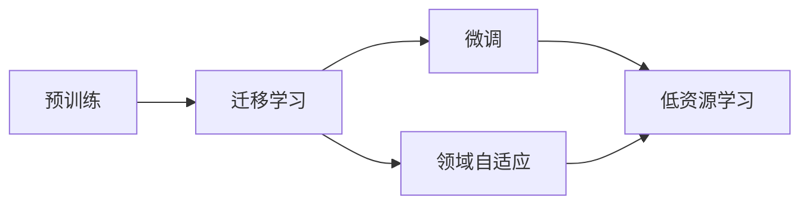

# 大语言模型原理与工程实践：有监督微调的作用与意义

## 1. 背景介绍

### 1.1 大语言模型的发展历程
近年来,自然语言处理(NLP)领域取得了巨大的进步,其中最引人注目的成就之一就是大语言模型(Large Language Model,LLM)的出现与应用。从2018年GPT-1的问世,到2019年GPT-2、BERT等模型的诞生,再到2020年GPT-3的横空出世,大语言模型以其强大的语言理解与生成能力,在各种NLP任务上取得了令人瞩目的表现,引领了NLP技术的新潮流。

### 1.2 大语言模型面临的挑战
尽管大语言模型展现出了巨大的潜力,但它们在实际应用中仍然面临着一些挑战:
- 领域适应性:预训练的大语言模型虽然具备广泛的语言知识,但对于特定领域的任务,其表现往往不尽如人意,需要进一步的领域适应。
- 资源消耗:训练大语言模型需要海量的数据和算力,对计算资源提出了很高的要求,这限制了其在一些场景下的应用。
- 可解释性:大语言模型的决策过程通常是黑盒的,缺乏可解释性,这在某些对可解释性有要求的应用中是个问题。

### 1.3 有监督微调的意义
为了应对上述挑战,有监督微调(Supervised Fine-tuning)成为了大语言模型实际应用的重要手段。通过在特定任务上使用少量标注数据对预训练模型进行微调,可以显著提升模型在目标任务上的表现,同时节省大量训练资源。这使得大语言模型能够更好地适应不同的应用场景,为NLP技术的落地提供了新的思路。

## 2. 核心概念与联系

### 2.1 预训练(Pre-training)
预训练是指在大规模无标注语料上,以自监督学习的方式训练语言模型的过程。预训练阶段旨在让模型习得语言的一般性知识和规律,为下游任务做好准备。常见的预训练任务包括语言模型、掩码语言模型等。预训练得到的模型可以作为各种NLP任务的基础模型,通过迁移学习应用到不同场景中。

### 2.2 微调(Fine-tuning) 
微调是指在预训练模型的基础上,使用下游任务的标注数据对模型进行进一步训练的过程。与从头训练相比,微调可以显著减少所需的数据量和训练时间,同时能够充分利用预训练模型中蕴含的语言知识,在目标任务上取得更好的效果。微调一般只需要调整模型的部分参数,因此也被称为参数高效学习。

### 2.3 迁移学习(Transfer Learning)
迁移学习是指将一个领域学习到的知识迁移并应用到另一个相关领域的过程。在NLP中,预训练-微调范式可以看作是迁移学习的典型应用:先在大规模语料上学习通用语言知识,再将其迁移到具体的下游任务中。得益于语言的一般性规律,这种知识迁移使得我们能够在资源有限的情况下,仍然构建出强大的NLP模型。

### 2.4 领域自适应(Domain Adaptation)
领域自适应是指将一个模型从源领域迁移并应用到目标领域的过程,其中源领域和目标领域的数据分布可能存在差异。在大语言模型的应用中,预训练语料和目标任务的数据往往来自不同领域,因此需要进行领域自适应。微调就是实现领域自适应的有效手段,通过在目标领域数据上调整模型参数,可以缓解领域差异带来的影响。

### 2.5 低资源学习(Low-resource Learning)
低资源学习是指在标注数据稀缺的情况下进行机器学习的问题。在很多NLP任务中,构建大规模标注数据集非常昂贵,因此低资源学习显得尤为重要。有监督微调为低资源学习提供了新的思路:利用预训练模型中的语言知识,在少量标注数据的支持下就能够取得不错的效果,大大降低了对标注数据规模的要求。

以下是这些概念之间关系的示意图:



## 3. 核心算法原理与具体操作步骤

有监督微调的核心思想是在预训练模型的基础上,利用目标任务的标注数据对模型进行进一步的训练,使其适应特定的任务需求。下面我们以微调BERT模型为例,详细介绍有监督微调的算法原理和操作步骤。

### 3.1 BERT模型简介
BERT(Bidirectional Encoder Representations from Transformers)是一种基于Transformer结构的预训练语言模型,通过掩码语言模型和相邻句子预测任务在大规模无标注语料上进行预训练。BERT的特点是采用了双向Transformer编码器,可以同时考虑目标词汇的左右上下文信息,从而获得更加丰富的语义表示。

### 3.2 微调BERT的具体步骤

#### 3.2.1 准备数据集
首先需要准备目标任务的标注数据集,并将其划分为训练集、验证集和测试集。对于不同的任务,数据集的格式和标注方式可能有所不同,需要根据任务的特点进行设计。

#### 3.2.2 加载预训练模型
从官方发布的BERT模型中选择合适的版本(如BERT-Base、BERT-Large等),并加载其预训练参数。这一步可以使用现有的深度学习框架如PyTorch、TensorFlow等来完成。

#### 3.2.3 构建任务特定的输出层
在BERT模型之上添加任务特定的输出层,以适应目标任务的需求。例如,对于文本分类任务,可以在BERT的输出之上添加一个全连接层和Softmax层,对于序列标注任务,可以在每个位置上添加一个分类器。输出层的参数一般是随机初始化的。

#### 3.2.4 冻结/解冻BERT参数
根据任务的特点和数据规模,决定是否冻结BERT的部分参数。冻结参数意味着在微调过程中不更新这些参数,只更新任务特定的输出层参数。当标注数据较少时,冻结BERT参数可以防止过拟合;当标注数据充足时,可以解冻BERT参数,让模型有更大的调整空间。

#### 3.2.5 设置优化策略
选择合适的优化算法(如Adam、AdamW等)和学习率策略(如warmup、decay等)。一般来说,微调时使用较小的学习率(如2e-5),以避免破坏预训练模型已经学到的知识。同时,适当的warmup和decay策略有助于模型的收敛。

#### 3.2.6 开始训练
将准备好的数据集输入到构建好的模型中,开始训练过程。在训练过程中,根据验证集的表现调整超参数,并通过早停等策略防止过拟合。

#### 3.2.7 评估与部署
在测试集上评估微调后的模型性能,选择表现最佳的模型进行部署。在部署时,可以根据需求对模型进行量化、剪枝等优化,以提高推理速度和降低资源消耗。

## 4. 数学模型和公式详细讲解举例说明

### 4.1 BERT的数学模型
BERT模型的核心是基于Transformer结构的编码器。Transformer编码器由多个相同的层堆叠而成,每一层包括两个子层:多头自注意力机制(Multi-head Self-attention)和前馈神经网络(Feed-forward Neural Network)。

对于一个输入序列 $X=(x_1,x_2,...,x_n)$,其中 $x_i$ 表示第 $i$ 个词的嵌入向量,BERT的编码过程可以表示为:

$$
\begin{aligned}
H_0 &= X \\
H_l &= \text{Transformer}(H_{l-1}), l=1,2,...,L \\
\text{BERT}(X) &= H_L
\end{aligned}
$$

其中 $H_l$ 表示第 $l$ 层Transformer编码器的输出,L是编码器的层数。

在自注意力机制中,首先计算查询矩阵 $Q$、键矩阵 $K$ 和值矩阵 $V$:

$$
Q = H_{l-1}W_Q, K = H_{l-1}W_K, V = H_{l-1}W_V
$$

然后计算自注意力权重矩阵 $A$:

$$
A = \text{softmax}(\frac{QK^T}{\sqrt{d_k}})
$$

其中 $d_k$ 是查询/键向量的维度。最后,自注意力输出为:

$$
\text{Attention}(H_{l-1}) = AV
$$

多头自注意力机制是将上述过程独立执行 $h$ 次,然后将结果拼接起来:

$$
\text{MultiHead}(H_{l-1}) = \text{Concat}(\text{head}_1, ..., \text{head}_h)W_O
$$

其中 $\text{head}_i = \text{Attention}(H_{l-1})$。

前馈神经网络包括两个线性变换和一个ReLU激活函数:

$$
\text{FFN}(x) = \max(0, xW_1 + b_1)W_2 + b_2
$$

最终,Transformer编码器的输出为:

$$
\text{Transformer}(H_{l-1}) = \text{LayerNorm}(H_{l-1} + \text{FFN}(\text{LayerNorm}(H_{l-1} + \text{MultiHead}(H_{l-1}))))
$$

其中LayerNorm表示层归一化操作。

### 4.2 微调的损失函数
在微调阶段,我们需要根据任务的类型设计合适的损失函数。以文本分类任务为例,假设有 $C$ 个类别,模型的输出为 $\hat{y} \in \mathbb{R}^C$,真实标签为 $y \in \{1,2,...,C\}$,则交叉熵损失可以表示为:

$$
\mathcal{L} = -\sum_{i=1}^C y_i \log(\text{softmax}(\hat{y})_i)
$$

其中 $y_i$ 是one-hot形式的标签向量。

在序列标注任务中,假设序列长度为 $T$,每个位置有 $C$ 个标签,模型在位置 $t$ 的输出为 $\hat{y}_t \in \mathbb{R}^C$,真实标签为 $y_t \in \{1,2,...,C\}$,则损失函数为:

$$
\mathcal{L} = -\sum_{t=1}^T \sum_{i=1}^C y_{t,i} \log(\text{softmax}(\hat{y}_t)_i)
$$

其中 $y_{t,i}$ 表示在位置 $t$ 的标签是否为第 $i$ 类。

在训练过程中,我们通过最小化损失函数来更新模型参数 $\theta$:

$$
\theta^* = \arg\min_\theta \mathcal{L}(\theta)
$$

常用的优化算法如Adam、AdamW等,都是基于随机梯度下降的变种,通过计算损失函数对参数的梯度来更新参数:

$$
\theta \leftarrow \theta - \eta \nabla_\theta \mathcal{L}(\theta)
$$

其中 $\eta$ 是学习率。

## 5. 项目实践：代码实例与详细解释说明
下面我们通过一个文本分类任务的代码实例,来说明如何使用PyTorch对BERT模型进行微调。

### 5.1 准备数据集
首先,我们需要将数据集处理成BERT可以接受的格式。这里我们使用huggingface的datasets库来加载和预处理数据集。

```python
from datasets import load_dataset

# 加载IMDb数据集
imdb_dataset = load_dataset("imdb")

# 将数据集划分为训练集和测试集
imdb_dataset = imdb_dataset["train"].train_test_split(test_size=0.2)

# 对数据进行预处理,将文本转换为BERT的输入格式
from transformers import BertTokenizer

tokenizer = BertTokenizer.from_pretrained("bert-base-uncased")

def preprocess_function(examples):
    return tokenizer(examples["text"], truncation=True, padding="max_length", max_length=512)

tokenized_imdb = imdb_dataset.map(preprocess_function, batched=True)
```