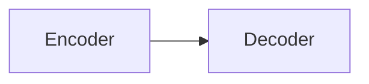
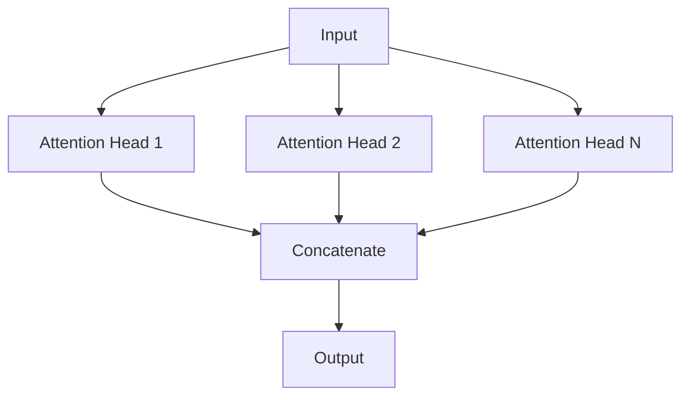
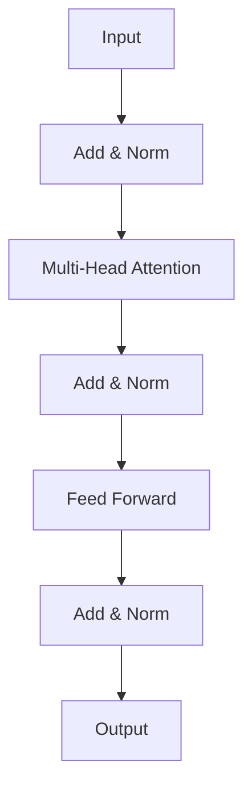
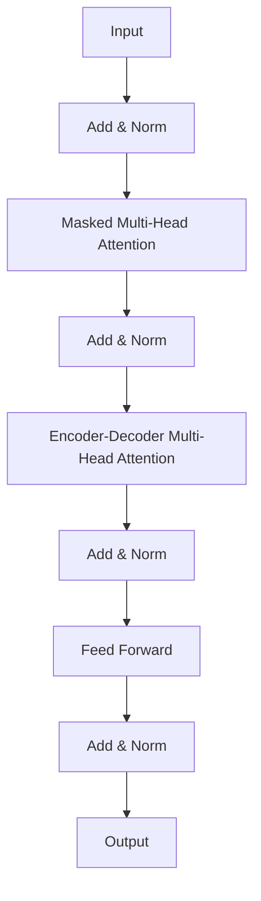

# 大语言模型原理与工程实践：经典结构 Transformer

## 1. 背景介绍

### 1.1 大语言模型的兴起
近年来,随着深度学习技术的快速发展,大语言模型(Large Language Model,LLM)在自然语言处理(NLP)领域引起了广泛关注。大语言模型通过在海量文本数据上进行预训练,能够学习到丰富的语言知识和语义表示,在各类NLP任务上取得了显著的性能提升。

### 1.2 Transformer的诞生
2017年,Google提出了Transformer模型[1],开创了NLP领域的新时代。Transformer抛弃了此前主流的RNN结构,完全基于注意力机制(Attention Mechanism)来学习文本的上下文信息。相比RNN,Transformer能够更高效地并行训练,且在长距离依赖建模上更加出色。Transformer的成功为后续的BERT、GPT等大语言模型奠定了基础。

### 1.3 Transformer的影响力
Transformer不仅在机器翻译任务上取得了SOTA成绩,其思想还被广泛应用于其他NLP任务如文本分类、问答系统、对话生成等。此外,Transformer的思想也被引入到计算机视觉、语音识别等领域,催生出Vision Transformer[2]、Speech Transformer[3]等变体模型。可以说,Transformer是近年来人工智能领域最具革命性和影响力的模型结构之一。

## 2. 核心概念与联系

### 2.1 Seq2Seq模型
Transformer是一种Sequence-to-Sequence(Seq2Seq)模型,即输入一个序列,输出另一个序列。传统的Seq2Seq模型通常基于RNN编码器-解码器结构,如下图所示:

编码器逐个读取输入序列的token,将其编码为隐向量。解码器根据编码器的输出和之前的解码结果,逐个生成输出序列的token。这种结构存在两个问题:
1. 编码器最后一个隐状态成为解码器的唯一输入,成为信息瓶颈
2. RNN难以并行化,训练和推理速度慢

### 2.2 自注意力机制
Transformer用自注意力机制取代了RNN。自注意力机制允许序列中的任意两个位置计算相关性,直接学习长距离依赖。具体来说,自注意力分三步:
1. 根据序列的每个token计算Query/Key/Value向量
2. 计算每对token的注意力权重:$Attention(Q,K,V) = softmax(\frac{QK^T}{\sqrt{d_k}})V$ 
3. 将Value向量按注意力权重加权求和,得到该位置的新表示

相比RNN,自注意力机制的优势在于:
1. 每个位置都能直接获取整个序列的信息,不存在信息瓶颈
2. 计算高度并行化,显著提升训练和推理速度

### 2.3 多头注意力
多头注意力是自注意力的扩展,引入多组Query/Key/Value矩阵,独立进行注意力计算,最后拼接各头的输出。多头注意力允许模型在不同的子空间学习到不同的注意力模式,增强模型的表达能力。

### 2.4 位置编码
由于Transformer不含RNN,需要引入位置编码(Positional Encoding)来表示序列中元素的顺序信息。Transformer采用三角函数形式的位置编码,公式如下:

$$
PE_{(pos,2i)} = sin(pos/10000^{2i/d_{model}})
$$
$$
PE_{(pos,2i+1)} = cos(pos/10000^{2i/d_{model}})
$$

其中,$pos$为位置索引,$i$为维度索引,$d_{model}$为隐向量维度。位置编码与token的词嵌入相加,作为模型的输入。

## 3. 核心算法原理具体操作步骤

Transformer由编码器和解码器组成,两者都是由多个相同的Layer堆叠而成。下面详细介绍编码器和解码器的结构与计算过程。

### 3.1 编码器

编码器包含N个相同的Layer,每个Layer包含两个子层:多头自注意力层和前馈神经网络层。两个子层之间通过残差连接和Layer Normalization连接。

编码器的计算过程如下:
1. 输入序列 $X \in \mathbb{R}^{n \times d_{model}}$ 通过词嵌入和位置编码相加得到输入表示 $H^0 \in \mathbb{R}^{n \times d_{model}}$
2. 第$l$层的多头自注意力子层:
$$
MultiHead(H^{l-1}) = Concat(head_1,...,head_h)W^O
$$
$$
head_i = Attention(H^{l-1}W_i^Q, H^{l-1}W_i^K, H^{l-1}W_i^V)
$$
$$
Attention(Q,K,V) = softmax(\frac{QK^T}{\sqrt{d_k}})V
$$
3. 残差连接和Layer Normalization:
$$
\tilde{H}^l = LayerNorm(H^{l-1} + MultiHead(H^{l-1}))
$$
4. 前馈神经网络子层:
$$
FFN(\tilde{H}^l) = max(0, \tilde{H}^lW_1 + b_1)W_2 + b_2
$$
5. 残差连接和Layer Normalization:
$$
H^l = LayerNorm(\tilde{H}^l + FFN(\tilde{H}^l))
$$
6. 重复步骤2~5,共N层,得到最终的编码器输出 $H^N \in \mathbb{R}^{n \times d_{model}}$

### 3.2 解码器

解码器也包含N个相同的Layer,每个Layer包含三个子层:带Mask的多头自注意力层、编码-解码多头注意力层和前馈神经网络层。

解码器的计算过程如下:
1. 目标序列 $Y \in \mathbb{R}^{m \times d_{model}}$ 通过词嵌入和位置编码相加得到输入表示 $S^0 \in \mathbb{R}^{m \times d_{model}}$
2. 第$l$层的Masked多头自注意力子层:
$$
MaskedMultiHead(S^{l-1}) = Concat(head_1,...,head_h)W^O
$$
$$
head_i = Attention(S^{l-1}W_i^Q, S^{l-1}W_i^K, S^{l-1}W_i^V)
$$
$$
Attention(Q,K,V) = softmax(\frac{QK^T+Mask}{\sqrt{d_k}})V
$$
Mask是一个上三角矩阵,对角线及以下位置为0,其余位置为$-\infty$。这样做是为了避免解码器能获取到未来的信息。
3. 残差连接和Layer Normalization:
$$
\tilde{S}^l = LayerNorm(S^{l-1} + MaskedMultiHead(S^{l-1}))
$$
4. 编码-解码注意力子层:
$$
EncDecMultiHead(\tilde{S}^l, H^N) = Concat(head_1,...,head_h)W^O
$$
$$
head_i = Attention(\tilde{S}^lW_i^Q, H^NW_i^K, H^NW_i^V)
$$
$$
Attention(Q,K,V) = softmax(\frac{QK^T}{\sqrt{d_k}})V
$$
5. 残差连接和Layer Normalization:
$$
\hat{S}^l = LayerNorm(\tilde{S}^l + EncDecMultiHead(\tilde{S}^l, H^N))
$$
6. 前馈神经网络子层:
$$
FFN(\hat{S}^l) = max(0, \hat{S}^lW_1 + b_1)W_2 + b_2
$$
7. 残差连接和Layer Normalization:
$$
S^l = LayerNorm(\hat{S}^l + FFN(\hat{S}^l))
$$
8. 重复步骤2~7,共N层,得到最终的解码器输出 $S^N \in \mathbb{R}^{m \times d_{model}}$
9. 将 $S^N$ 通过线性层和softmax层,得到最终的预测概率分布 $P \in \mathbb{R}^{m \times V}$,其中$V$为目标词表大小。

## 4. 数学模型和公式详细讲解举例说明

本节我们详细解释Transformer中涉及的几个关键公式。

### 4.1 Scaled Dot-Product Attention

Transformer的核心是Scaled Dot-Product Attention,公式为:

$$
Attention(Q,K,V) = softmax(\frac{QK^T}{\sqrt{d_k}})V
$$

其中,$Q \in \mathbb{R}^{n \times d_k}, K \in \mathbb{R}^{n \times d_k}, V \in \mathbb{R}^{n \times d_v}$分别是Query矩阵、Key矩阵和Value矩阵,$n$为序列长度,$d_k$为Query/Key的维度,$d_v$为Value的维度。

这个公式可以分为三步理解:
1. 计算Query和Key的点积相似度 $QK^T \in \mathbb{R}^{n \times n}$,得到的矩阵中$(i,j)$元素表示第$i$个Query和第$j$个Key的相似度。
2. 除以 $\sqrt{d_k}$ 进行缩放。这是为了缓解点积结果过大导致softmax函数梯度消失的问题。
3. 对缩放后的点积结果应用softmax函数,得到注意力权重矩阵。将权重矩阵与Value矩阵相乘,得到加权求和的结果。

举例说明,假设有一个长度为4的序列,Query/Key的维度为3,Value的维度为5,则:

$$
Q = \begin{bmatrix} 
1 & 0 & 1\\ 
0 & 1 & 1\\
0 & 0 & 1\\
1 & 1 & 0
\end{bmatrix},
K = \begin{bmatrix}
0 & 1 & 0\\
1 & 1 & 0\\  
0 & 1 & 1\\
1 & 0 & 1
\end{bmatrix},
V = \begin{bmatrix}
1 & 2 & 0 & 1 & 0\\
0 & 1 & 2 & 0 & 1\\
1 & 0 & 0 & 2 & 1\\  
0 & 1 & 1 & 0 & 2
\end{bmatrix}
$$

计算过程如下:

$$
QK^T = \begin{bmatrix}
0 & 1 & 1 & 1\\
1 & 2 & 1 & 1\\
0 & 1 & 1 & 1\\
1 & 1 & 0 & 2
\end{bmatrix}
$$
$$
\frac{QK^T}{\sqrt{3}} = \begin{bmatrix}
0 & 0.58 & 0.58 & 0.58\\
0.58 & 1.15 & 0.58 & 0.58\\
0 & 0.58 & 0.58 & 0.58\\
0.58 & 0.58 & 0 & 1.15  
\end{bmatrix}
$$
$$
softmax(\frac{QK^T}{\sqrt{3}}) = \begin{bmatrix}
0.12 & 0.21 & 0.21 & 0.21\\  
0.18 & 0.25 & 0.18 & 0.18\\
0.12 & 0.21 & 0.21 & 0.21\\
0.18 & 0.18 & 0.12 & 0.25
\end{bmatrix}
$$
$$
Attention(Q,K,V) = \begin{bmatrix}
0.33 & 0.79 & 0.87 & 0.54 & 1.08\\
0.42 & 0.96 & 0.96 & 0.66 & 1.20\\
0.33 & 0.79 & 0.87 & 0.54 & 1.08\\
0.42 & 0.84 & 