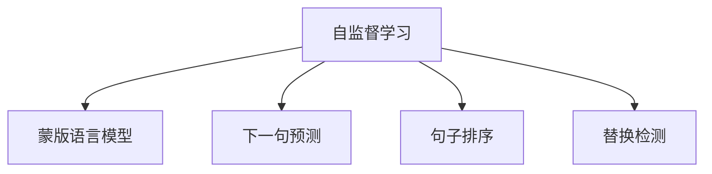
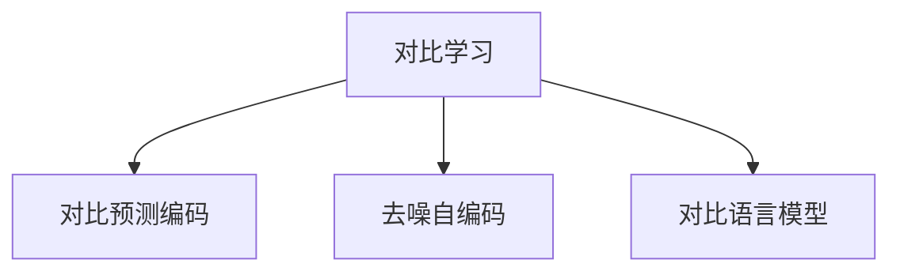
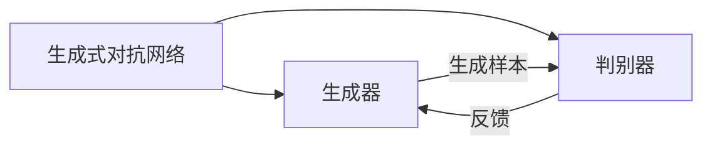
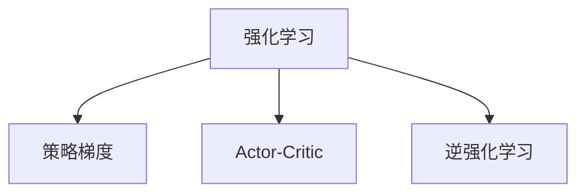

# 大语言模型原理与工程实践：训练目标

## 1. 背景介绍

### 1.1 大语言模型的兴起

近年来,大型语言模型(Large Language Models, LLMs)在自然语言处理(NLP)领域掀起了一股热潮。这些模型通过在大规模文本数据上进行预训练,学习了丰富的语言知识和上下文信息,展现出令人惊叹的语言生成和理解能力。

LLMs的核心思想是利用自注意力(Self-Attention)机制和transformer架构,在海量无标注文本数据上进行自监督学习,捕捉语言的内在规律和语义关联。这种预训练方式使得模型能够从数据中自主学习,而无需人工标注,从而极大降低了数据标注的成本。

### 1.2 训练目标的重要性

训练目标(Training Objective)是指模型在预训练阶段所优化的目标函数,它决定了模型学习到的语言知识和能力。合理设计训练目标对于提高模型性能至关重要。传统的语言模型通常采用基于概率的训练目标,如最大化下一个词的条件概率。然而,这种训练目标存在一些局限性,难以充分捕捉语言的丰富语义信息。

近年来,研究人员提出了多种创新的训练目标,旨在使模型学习更加全面和准确的语言表示。这些训练目标不仅关注单词预测,还融入了句子级别、段落级别乃至整个文档级别的语义信息,帮助模型更好地理解上下文语义。本文将深入探讨大语言模型中常用的训练目标,剖析它们的原理、优缺点和工程实践细节。

## 2. 核心概念与联系

### 2.1 自监督学习

自监督学习(Self-Supervised Learning)是大语言模型训练的核心思想。与传统的监督学习不同,自监督学习不需要人工标注的数据,而是利用原始数据本身的结构和统计特性,自动构建出监督信号。

在NLP领域,自监督学习通常利用文本的内在结构,如单词序列、句子结构等,构建出预测任务。模型通过学习预测这些任务,从而捕捉语言的内在规律和语义信息。常见的自监督学习任务包括:

- 蒙版语言模型(Masked Language Modeling, MLM)
- 下一句预测(Next Sentence Prediction, NSP)
- 句子排序(Sentence Order Prediction, SOP)
- 替换检测(Replaced Token Detection, RTD)

这些任务旨在使模型学习理解和生成自然语言,为下游的NLP任务奠定基础。

### 2.2 对比学习

对比学习(Contrastive Learning)是一种新兴的自监督学习范式,它通过最大化相似样本之间的相似度,最小化不相似样本之间的相似度,来学习数据的有效表示。在NLP领域,对比学习被应用于学习更加丰富和健壮的语义表示。

常见的对比学习方法包括:

- 对比预测编码(Contrastive Predictive Coding, CPC)
- 去噪自编码(Denoising Auto-Encoding, DAE)
- 对比语言模型(Contrastive Language Modeling, CLM)

对比学习的核心思想是通过构建正样本(相似样本)和负样本(不相似样本)对,最大化正样本之间的相似度,最小化正负样本之间的相似度,从而学习出更加鲁棒和区分性强的语义表示。

### 2.3 生成式对抗网络

生成式对抗网络(Generative Adversarial Networks, GANs)是一种利用对抗训练的生成模型,它由一个生成器(Generator)和一个判别器(Discriminator)组成。生成器旨在生成逼真的样本,而判别器则判断样本是真实数据还是生成数据。通过生成器和判别器的对抗训练,模型可以学习到数据的真实分布,从而生成高质量的样本。

在NLP领域,GANs被应用于文本生成、机器翻译等任务。常见的GAN变体包括:

- SeqGAN
- LeakGAN
- MaskGAN

这些模型通过对抗训练,旨在生成更加流畅、自然的文本,提高语言生成的质量。

### 2.4 强化学习

强化学习(Reinforcement Learning, RL)是一种基于奖励信号的学习范式,它通过与环境交互,根据获得的奖励调整策略,最终达到最优化目标。在NLP领域,强化学习被应用于序列生成任务,如机器翻译、对话系统等。

常见的强化学习方法包括:

- 策略梯度(Policy Gradient)
- Actor-Critic
- 逆强化学习(Inverse Reinforcement Learning, IRL)

这些方法通过设计合理的奖励函数,引导模型生成高质量的序列,提高生成的准确性和流畅性。

上述概念相互关联,共同构建了大语言模型训练的理论基础。自监督学习提供了无需人工标注的数据,对比学习和生成式对抗网络则引入了新颖的训练目标和范式,而强化学习则为序列生成任务提供了有效的优化方法。这些概念的融合和创新,推动了大语言模型的快速发展。

## 3. 核心算法原理具体操作步骤

在本节,我们将详细介绍几种核心的大语言模型训练目标,剖析它们的原理和具体操作步骤。

### 3.1 蒙版语言模型(Masked Language Modeling, MLM)

MLM是BERT等transformer模型中广泛采用的预训练目标。它的核心思想是在输入序列中随机掩蔽部分词元(token),然后让模型基于上下文预测被掩蔽的词元。通过这种方式,模型可以学习到双向的语言表示,捕捉上下文语义信息。

MLM的具体操作步骤如下:

1. 随机选择输入序列中的一部分词元,并用特殊的[MASK]标记替换。
2. 将带有[MASK]标记的序列输入transformer编码器,得到每个位置的上下文表示。
3. 对于被掩蔽的位置,将其上下文表示输入到一个分类器(classifier),预测该位置的原始词元。
4. 使用交叉熵损失函数计算预测值与真实值之间的差异,并反向传播更新模型参数。

MLM的优点是可以有效捕捉双向上下文信息,并且通过掩蔽机制,可以避免模型过度依赖于局部信号。然而,MLM也存在一些缺陷,如掩蔽策略的选择会影响模型性能,并且预测被掩蔽词元的任务与真实的语言生成任务存在一定差距。

### 3.2 对比语言模型(Contrastive Language Modeling, CLM)

CLM是一种基于对比学习的新颖训练目标,它旨在学习更加鲁棒和区分性强的语言表示。CLM的核心思想是通过构建正样本和负样本对,最大化正样本之间的相似度,最小化正负样本之间的相似度,从而学习出更加区分性强的语义表示。

CLM的具体操作步骤如下:

1. 从语料库中采样一个序列作为锚点(anchor)序列。
2. 通过数据增强(如删除、插入、替换等操作)生成锚点序列的正样本(positive sample)。
3. 从语料库中随机采样负样本(negative sample)。
4. 将锚点序列、正样本和负样本输入transformer编码器,得到它们的语义表示。
5. 计算正样本与锚点序列的相似度,以及负样本与锚点序列的相似度。
6. 使用对比损失函数(如InfoNCE损失)最大化正样本与锚点序列的相似度,最小化负样本与锚点序列的相似度,并反向传播更新模型参数。

CLM的优点是可以学习出更加鲁棒和区分性强的语义表示,提高模型的泛化能力。然而,CLM也面临一些挑战,如负样本的选择策略、对比损失函数的设计等,这些因素都会影响模型的性能。

### 3.3 生成式对抗网络(Generative Adversarial Networks, GANs)

GANs是一种基于对抗训练的生成模型,它由一个生成器(Generator)和一个判别器(Discriminator)组成。在NLP领域,GANs被应用于文本生成、机器翻译等任务,旨在生成更加流畅、自然的语言序列。

GANs的具体操作步骤如下:

1. 生成器(Generator)从噪声分布(如高斯分布)中采样一个噪声向量,并将其输入到一个transformer解码器中,生成一个候选序列。
2. 判别器(Discriminator)接收真实数据和生成器生成的候选序列,并判断它们是真实数据还是生成数据。
3. 生成器的目标是生成足以欺骗判别器的序列,而判别器的目标是正确区分真实数据和生成数据。
4. 生成器和判别器通过最小化各自的损失函数进行对抗训练,直到达到纳什均衡(Nash Equilibrium)。

GANs的优点是可以生成高质量的语言序列,提高生成的流畅性和自然性。然而,GANs也存在训练不稳定、模式崩溃(mode collapse)等问题,需要谨慎设计架构和超参数。

上述三种训练目标各有优缺点,在不同的场景下表现也不尽相同。实际应用中,研究人员通常会根据具体任务和数据特点,选择合适的训练目标或者组合多种目标,以获得最佳的模型性能。

## 4. 数学模型和公式详细讲解举例说明

在本节,我们将详细介绍几种常见的大语言模型训练目标的数学模型和公式,并通过具体例子进行说明。

### 4.1 蒙版语言模型(Masked Language Modeling, MLM)

MLM的目标是最大化被掩蔽词元的条件概率,即:

$$\mathcal{L}_\text{MLM} = -\mathbb{E}_{x, m} \left[ \sum_{t \in m} \log P(x_t | x_{\backslash m}) \right]$$

其中:

- $x$ 是输入序列
- $m$ 是被掩蔽的词元位置集合
- $x_{\backslash m}$ 表示除去被掩蔽位置的剩余序列
- $P(x_t | x_{\backslash m})$ 是在给定剩余序列的条件下,预测被掩蔽位置 $t$ 的词元概率

例如,对于输入序列 "今天天气很好",如果我们掩蔽第二个词元"天",模型需要根据上下文 "今天_气很好" 预测被掩蔽的词元是 "天"。通过最大化这个条件概率,模型可以学习到捕捉上下文语义的能力。

### 4.2 对比语言模型(Contrastive Language Modeling, CLM)

CLM的目标是最大化正样本与锚点序列的相似度,最小化负样本与锚点序列的相似度。常用的对比损失函数是InfoNCE损失:

$$\mathcal{L}_\text{CLM} = -\mathbb{E}_{x, x^+, x^-} \left[ \log \frac{\exp(\text{sim}(f(x), f(x^+)) / \tau)}{\exp(\text{sim}(f(x), f(x^+)) / \tau) + \sum_{x^- \in X^-} \exp(\text{sim}(f(x), f(x^-)) / \tau)} \right]$$

其中:

- $x$ 是锚点序列
- $x^+$ 是正样本序列
- $X^-$ 是负样本序列集合
- $f(\cdot)$ 是编码器函数,将序列映射到语义空间
- $\text