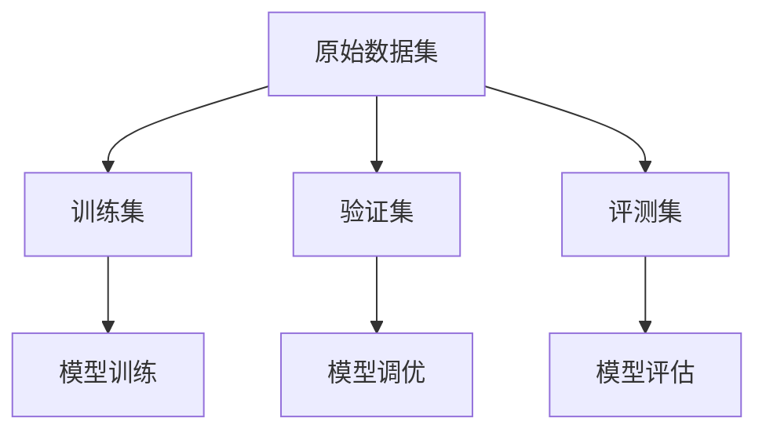

# 大语言模型原理与工程实践：评测集的构建标准

## 1.背景介绍

在当今的人工智能时代,大型语言模型(Large Language Models, LLMs)已经成为自然语言处理领域中最具革命性的技术之一。这些模型通过在海量文本数据上进行预训练,能够捕捉到语言的深层次模式和语义关联,从而在各种下游任务中表现出惊人的泛化能力。

评测集(Test Set)作为衡量模型性能的关键工具,在大型语言模型的研究和应用中扮演着至关重要的角色。一个高质量的评测集不仅能够全面考察模型的各个方面,还能够推动模型性能的持续进步,为未来的研究提供指导和启发。

然而,构建一个合理且具有挑战性的评测集绝非一蹴而就。它需要综合考虑多个因素,包括数据来源、数据分布、任务难度、评估指标等,以确保评测集能够真实反映模型在实际应用场景中的表现。

### 1.1 评测集的重要性

评测集在大型语言模型的研究和应用中扮演着多重角色:

1. **模型评估**: 评测集是衡量模型性能的客观标准,能够量化模型在特定任务上的表现,为模型选择和部署提供依据。

2. **模型对比**: 通过在相同的评测集上对比不同模型的表现,可以公正地评估各个模型的优劣,推动模型性能的持续进步。

3. **发现模型缺陷**: 一个高质量的评测集能够揭示模型在某些特定情况下的缺陷和失败案例,为模型改进提供方向。

4. **促进研究创新**: 评测集的构建过程本身就是一个富有挑战性的研究课题,需要综合考虑多个因素,推动相关理论和方法的发展。

5. **应用场景模拟**: 通过仔细设计,评测集可以模拟实际应用场景,帮助研究人员更好地理解模型在现实世界中的表现。

### 1.2 评测集构建的挑战

构建一个高质量的评测集面临着诸多挑战,主要包括:

1. **数据质量**: 评测集的数据质量直接影响到评估结果的可信度和有效性。如何获取高质量、多样化的数据是一个巨大的挑战。

2. **任务难度**: 评测集需要具有一定的难度,才能真实反映模型的能力极限。如何平衡任务难度和评估公平性是一个需要权衡的问题。

3. **注释一致性**: 对于需要人工注释的任务,如何确保注释的一致性和准确性是一个巨大的挑战。

4. **评估指标**: 选择合适的评估指标对于公正地评估模型性能至关重要,但不同任务可能需要不同的指标。

5. **数据隐私**: 评测集中可能包含敏感信息或个人数据,如何在保护隐私的同时构建高质量的评测集需要格外小心。

6. **成本和效率**: 构建大规模、高质量的评测集通常需要大量的人力和计算资源,如何在有限的资源下提高效率是一个值得关注的问题。

为了应对这些挑战,研究人员需要不断探索新的理论和方法,以构建更加合理、更具挑战性的评测集,推动大型语言模型的发展和应用。

## 2.核心概念与联系

在探讨评测集的构建标准之前,我们需要先了解一些核心概念及它们之间的联系。

### 2.1 大型语言模型(LLMs)

大型语言模型(Large Language Models, LLMs)是一种基于深度学习的自然语言处理模型,通过在海量文本数据上进行预训练,能够捕捉语言的深层次模式和语义关联。这些模型具有极强的泛化能力,可以应用于各种下游任务,如机器翻译、问答系统、文本生成等。

常见的大型语言模型包括:

- **GPT(Generative Pre-trained Transformer)**: 由OpenAI开发的基于Transformer的语言模型,具有强大的文本生成能力。

- **BERT(Bidirectional Encoder Representations from Transformers)**: 由Google开发的双向Transformer编码器,在各种自然语言理解任务上表现出色。

- **T5(Text-to-Text Transfer Transformer)**: 由Google开发的统一的文本到文本的转换模型,可以处理多种自然语言处理任务。

- **GPT-3**: 由OpenAI开发的超大型语言模型,具有惊人的文本生成和理解能力,被视为大型语言模型的里程碑。

这些大型语言模型在各种自然语言处理任务上表现出色,但它们的性能如何,需要通过评测集来进行客观评估。

### 2.2 评测集(Test Set)

评测集是用于评估模型性能的一组数据样本。在自然语言处理领域,评测集通常包含一系列输入样本(如文本、问题等)及其对应的期望输出(如翻译结果、答案等)。

评测集的构建需要考虑以下几个关键因素:

1. **数据来源**: 评测集的数据来源应该与模型的实际应用场景相匹配,以确保评估结果的可靠性和可迁移性。

2. **数据分布**: 评测集中的数据应该具有一定的多样性,覆盖不同的语言现象、主题领域和难度级别,以全面考察模型的能力。

3. **注释质量**: 对于需要人工注释的任务,注释的质量直接影响到评估结果的准确性。因此,需要确保注释的一致性和准确性。

4. **评估指标**: 选择合适的评估指标对于公正地评估模型性能至关重要。不同的任务可能需要不同的评估指标,如BLEU分数(机器翻译)、F1分数(实体识别)等。

5. **数据隐私**: 评测集中可能包含敏感信息或个人数据,因此需要采取适当的措施来保护数据隐私。

通过合理构建评测集,我们可以全面、客观地评估大型语言模型的性能,推动模型的持续改进和创新。

### 2.3 评测集与训练集、验证集的关系

在机器学习中,通常将数据集划分为三个部分:训练集(Training Set)、验证集(Validation Set)和评测集(Test Set)。

- **训练集**: 用于模型的训练和优化,模型通过在训练集上进行反复迭代,学习到数据中的模式和规律。

- **验证集**: 用于模型超参数的调整和模型选择,通过在验证集上评估模型的性能,可以避免过拟合,选择最优的模型和超参数。

- **评测集**: 用于评估模型在未见数据上的泛化能力,评测集中的数据与训练集和验证集完全独立,因此可以反映模型在实际应用场景中的表现。

这三个数据集之间的关系如下所示:

在大型语言模型的研究和应用中,评测集扮演着至关重要的角色。一个高质量的评测集不仅能够全面考察模型的各个方面,还能够推动模型性能的持续进步,为未来的研究提供指导和启发。

## 3.核心算法原理具体操作步骤

构建一个高质量的评测集是一个复杂的过程,需要综合考虑多个因素。下面我们将介绍评测集构建的核心算法原理和具体操作步骤。

### 3.1 数据采集

高质量的评测集需要来自可靠的数据源,并且数据应该具有一定的多样性和代表性。常见的数据采集方式包括:

1. **网络爬虫**: 从互联网上采集数据,如新闻文章、社交媒体内容等。需要注意数据的版权和隐私问题。

2. **现有数据集**: 利用已有的公开数据集,如语料库、问答数据集等。需要注意数据集的许可协议和使用限制。

3. **人工创作**: 由专家或众包工人手动创作数据,如问题、对话等。这种方式可以确保数据质量,但成本较高。

4. **混合方式**: 综合利用上述多种方式采集数据,以获取更加多样化的数据源。

无论采用何种方式,都需要对原始数据进行预处理和清洗,如去除噪声、标准化格式等,以确保数据的质量和一致性。

### 3.2 数据标注

对于需要人工标注的任务,如机器阅读理解、实体识别等,需要对采集到的数据进行标注。标注的质量直接影响到评测集的可靠性和有效性。常见的标注方式包括:

1. **专家标注**: 由领域专家进行标注,可以确保标注的准确性和一致性,但成本较高。

2. **众包标注**: 通过众包平台招募工人进行标注,成本相对较低,但需要控制标注质量。

3. **自动标注**: 利用现有的模型或规则进行自动标注,效率较高,但准确性有限。

4. **混合标注**: 综合利用上述多种方式进行标注,以平衡成本和质量。

无论采用何种标注方式,都需要制定明确的标注指南,并对标注结果进行审核和校对,以确保标注的一致性和准确性。

### 3.3 数据划分

将采集和标注后的数据划分为训练集、验证集和评测集是构建评测集的关键步骤。常见的划分方式包括:

1. **随机划分**: 随机将数据划分为训练集、验证集和评测集,确保各个子集的数据分布相似。

2. **分层抽样**: 根据数据的某些特征(如主题、难度等)进行分层,然后在每个分层中随机抽样,以确保各个子集的数据分布均衡。

3. **时间序列划分**: 对于具有时间序列特征的数据(如新闻文章),可以按照时间顺序将数据划分为训练集、验证集和评测集,以模拟实际应用场景。

4. **留出法**: 将一部分数据直接留作评测集,剩余数据再划分为训练集和验证集。这种方式可以确保评测集的独立性,但可能导致数据分布不均衡。

无论采用何种划分方式,都需要确保训练集、验证集和评测集之间的数据独立性,以避免数据泄露和过拟合。同时,还需要考虑各个子集的数据分布是否均衡,以确保评估结果的可靠性和公平性。

### 3.4 评测集构建

经过上述步骤,我们已经获得了训练集、验证集和初步的评测集。接下来,需要对评测集进行进一步的优化和完善,以确保其质量和难度。常见的优化方式包括:

1. **难度分析**: 分析评测集中数据的难度分布,确保包含了不同难度级别的样本,以全面考察模型的能力。

2. **异常值检测**: 检测并移除评测集中的异常值或噪声数据,以提高评估结果的可靠性。

3. **人工审核**: 由专家对评测集进行人工审核,确保数据的质量和一致性,并根据需要进行修正或补充。

4. **对抗性数据增强**: 通过对抗性攻击或人工构造,生成一些具有挑战性的数据,以检测模型的鲁棒性和泛化能力。

5. **迭代优化**: 根据初步评估结果,对评测集进行多轮迭代优化,直至满足预期的质量和难度要求。

在构建评测集的过程中,还需要注意一些其他因素,如数据隐私、版权问题、评估指标的选择等,以确保评测集的合法性和公平性。

### 3.5 评测集发布和维护

经过上述步骤,我们已经构建出了一个高质量的评测集。接下来,需要将评测集发布并进行持续维护,以确保其长期有效性和影响力。常见的发布和维护方式包括:

1. **开源发布**: 将评测集以开源的形式发布,供研究人员和从业者自由使用和改进。这种方式可以促进知识