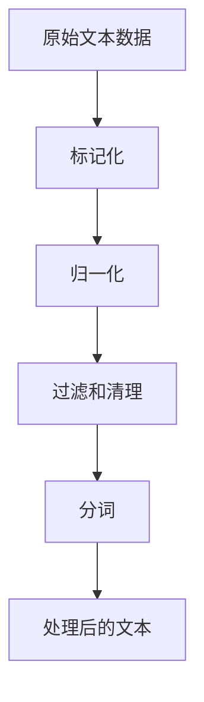
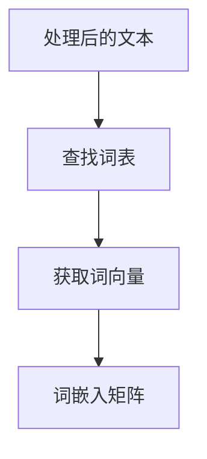
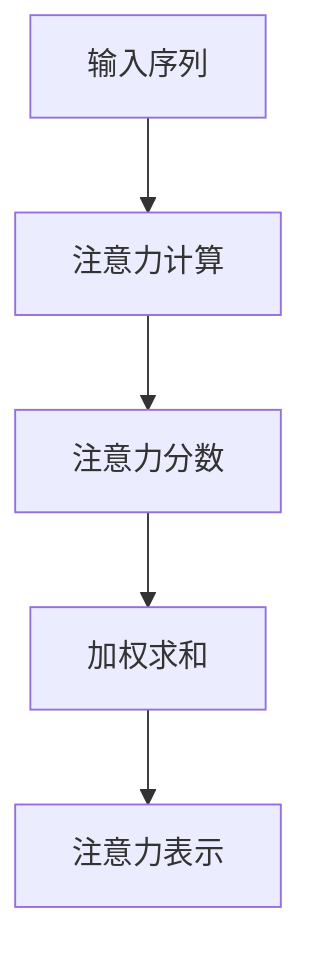

# 大语言模型原理与工程实践：输入模块

## 1. 背景介绍

### 1.1 大语言模型的重要性

在当前的人工智能领域,大语言模型(Large Language Models, LLMs)已经成为了最具影响力和价值的技术之一。作为一种基于海量文本数据训练的深度神经网络模型,大语言模型展现出了令人惊叹的自然语言理解和生成能力,在自然语言处理(NLP)的各种任务中取得了突破性的进展。

大语言模型的核心优势在于其强大的上下文理解和关联推理能力,能够捕捉语言中丰富的语义和逻辑信息。这使得大语言模型不仅可以用于传统的NLP任务,如机器翻译、文本摘要、问答系统等,还可以拓展到更加复杂和开放的场景,如内容创作、代码生成、智能对话等,为人工智能的发展开辟了全新的可能性。

### 1.2 输入模块的重要性

对于大语言模型而言,输入模块是整个系统的基石,负责将原始的文本数据转化为模型可以理解和处理的表示形式。输入模块的设计和实现直接影响着模型的性能和效率,是确保大语言模型能够高质量地学习和推理的关键所在。

本文将重点探讨大语言模型的输入模块,阐述其核心原理、算法实现和工程实践,旨在为读者提供一个全面的理解和掌握输入模块的机会。我们将涵盖文本预处理、词嵌入、注意力机制等核心概念,并通过实例和案例分析,帮助读者深入理解输入模块在大语言模型中的作用和重要性。

## 2. 核心概念与联系

### 2.1 文本预处理

文本预处理是大语言模型输入模块的第一步,旨在将原始的文本数据转化为可以被模型有效处理的形式。主要包括以下步骤:

1. **标记化(Tokenization)**: 将原始文本拆分为最小的标记单元,如单词、字符或子词等。
2. **归一化(Normalization)**: 将标记进行规范化处理,如大小写转换、去除标点符号等。
3. **过滤和清理(Filtering and Cleaning)**: 去除无用的标记,如停用词、HTML标签等。
4. **分词(Word Segmentation)**: 对于某些语言(如中文),需要进行分词操作将文本拆分为词语序列。

经过预处理后的文本数据将更加规范和结构化,为后续的词嵌入和模型输入奠定基础。

### 2.2 词嵌入

词嵌入(Word Embedding)是将离散的文本标记映射到连续的向量空间中的过程。通过训练,每个词都会被赋予一个固定长度的密集向量表示,这些向量能够捕捉词与词之间的语义和语法关系。

常见的词嵌入方法包括:

1. **Word2Vec**: 利用浅层神经网络模型,通过上下文预测目标词或反之,学习词向量表示。
2. **GloVe**: 基于全局词共现矩阵,利用矩阵分解技术获得词向量。
3. **FastText**: 在Word2Vec的基础上,引入了子词信息,提高了对未见词的处理能力。

词嵌入是大语言模型的基础表示,对于模型的性能和泛化能力至关重要。高质量的词嵌入能够帮助模型更好地理解语言的语义和结构信息。

### 2.3 注意力机制

注意力机制(Attention Mechanism)是大语言模型中一种关键的结构,它允许模型在处理序列数据时,动态地关注输入序列中的不同部分,并据此计算出一个加权的表示向量。

注意力机制的核心思想是通过计算查询向量(Query)与键向量(Key)之间的相似性,得到一个注意力分数(Attention Score),然后使用该分数对值向量(Value)进行加权求和,从而获得注意力表示。

注意力机制在大语言模型中的应用主要体现在两个方面:

1. **Self-Attention**: 允许模型捕捉输入序列内部的长程依赖关系,是Transformer模型的核心组件。
2. **Cross-Attention**: 在序列到序列(Seq2Seq)任务中,允许解码器关注编码器的输出,实现有效的信息传递。

通过注意力机制,大语言模型能够更好地建模长期依赖关系,提高了对复杂语言结构的理解能力。

## 3. 核心算法原理具体操作步骤

### 3.1 文本预处理算法

#### 3.1.1 标记化算法

标记化算法的目标是将原始文本拆分为最小的标记单元。常见的标记化算法包括:

1. **基于规则的标记化**: 根据预定义的规则(如空格、标点符号等)对文本进行拆分。
2. **基于统计的标记化**: 利用机器学习模型(如最大熵模型、条件随机场等)对文本进行标记化。
3. **基于子词的标记化**: 将词语拆分为更小的子词单元,如Byte-Pair Encoding(BPE)和WordPiece等算法。

标记化算法的具体步骤如下:

1. 加载预定义的词表或规则集合。
2. 遍历原始文本,根据规则或模型进行标记切分。
3. 将切分后的标记序列输出或存储。

#### 3.1.2 归一化算法

归一化算法的目标是将标记进行规范化处理,以消除不同表示形式带来的歧义。常见的归一化操作包括:

1. 大小写转换
2. 去除标点符号
3. 数字规范化
4. 缩写展开

归一化算法的具体步骤如下:

1. 定义归一化规则集合。
2. 遍历标记序列,对每个标记应用相应的归一化规则。
3. 输出或存储归一化后的标记序列。

#### 3.1.3 过滤和清理算法

过滤和清理算法的目标是去除无用的标记,如停用词、HTML标签等。常见的过滤和清理操作包括:

1. 停用词过滤
2. HTML标签去除
3. 特殊字符过滤
4. 低频词过滤

过滤和清理算法的具体步骤如下:

1. 加载停用词表、HTML标签集合等过滤规则。
2. 遍历标记序列,对每个标记进行过滤和清理。
3. 输出或存储过滤和清理后的标记序列。

#### 3.1.4 分词算法

对于某些语言(如中文),需要进行分词操作将文本拆分为词语序列。常见的分词算法包括:

1. **基于规则的分词**: 根据预定义的词典和规则进行分词。
2. **基于统计的分词**: 利用机器学习模型(如隐马尔可夫模型、条件随机场等)对文本进行分词。
3. **基于神经网络的分词**: 使用神经网络模型(如双向LSTM、BERT等)进行序列标注式分词。

分词算法的具体步骤如下:

1. 加载预定义的词典或训练好的模型。
2. 遍历原始文本,根据规则或模型进行分词。
3. 输出或存储分词后的词语序列。

### 3.2 词嵌入算法

#### 3.2.1 Word2Vec算法

Word2Vec是一种基于浅层神经网络的词嵌入算法,包含两种模型:连续词袋模型(CBOW)和Skip-Gram模型。

**CBOW模型**的具体步骤如下:

1. 对于给定的目标词$w_t$,从其上下文窗口中采样获取上下文词$\{w_{t-c},...,w_{t-1},w_{t+1},...,w_{t+c}\}$。
2. 将上下文词的词向量$\{v_{w_{t-c}},...,v_{w_{t-1}},v_{w_{t+1}},...,v_{w_{t+c}}\}$相加,得到上下文向量$v_c$。
3. 将上下文向量$v_c$输入到softmax层,计算目标词$w_t$的概率分布$y=\text{softmax}(v_c^TW+b)$。
4. 使用交叉熵损失函数优化模型参数$W$和$b$,使得目标词$w_t$的概率最大化。

**Skip-Gram模型**的具体步骤如下:

1. 对于给定的目标词$w_t$,从其上下文窗口中采样获取上下文词$\{w_{t-c},...,w_{t-1},w_{t+1},...,w_{t+c}\}$。
2. 将目标词$w_t$的词向量$v_{w_t}$输入到softmax层,分别计算每个上下文词$w_i$的概率分布$y_i=\text{softmax}(v_{w_t}^TW_i+b_i)$。
3. 使用交叉熵损失函数优化模型参数$W_i$和$b_i$,使得每个上下文词$w_i$的概率最大化。

通过优化上述目标函数,Word2Vec模型可以学习到能够捕捉词与词之间语义和语法关系的词向量表示。

#### 3.2.2 GloVe算法

GloVe(Global Vectors for Word Representation)是一种基于全局词共现矩阵的词嵌入算法,利用矩阵分解技术获得词向量。

GloVe算法的具体步骤如下:

1. 构建词共现矩阵$X$,其中$X_{ij}$表示词$i$和词$j$在语料库中的共现次数。
2. 定义一个对数平滑函数$f(X_{ij})=\begin{cases}\alpha\log(X_{ij}) & \text{if }X_{ij}<X_{\max}\\\alpha & \text{otherwise}\end{cases}$,用于平滑共现矩阵中的值。
3. 为每个词$i$定义一个词向量$w_i$和一个辅助向量$\tilde{w}_i$,目标是使$w_i^T\tilde{w}_j\approx f(X_{ij})$。
4. 定义损失函数$J=\sum_{i,j}f(X_{ij})(w_i^T\tilde{w}_j-\log(X_{ij}))^2$,并使用梯度下降法优化词向量$w_i$和辅助向量$\tilde{w}_i$。

通过优化上述损失函数,GloVe算法可以学习到能够捕捉词与词之间语义和语法关系的词向量表示。

#### 3.2.3 FastText算法

FastText是一种基于Word2Vec的词嵌入算法,引入了子词信息,提高了对未见词的处理能力。

FastText算法的具体步骤如下:

1. 对于每个词$w$,将其拆分为一系列的字符$n$-gram,如$\langle$w$\rangle$、$\langle$w$_1\rangle$、$\langle$w$_2\rangle$等。
2. 为每个字符$n$-gram分配一个向量表示$v_g$,词$w$的向量表示$v_w$由所有字符$n$-gram向量的求和得到,即$v_w=\sum_{g\in G_w}v_g$。
3. 使用与Word2Vec相同的目标函数和优化方法,学习字符$n$-gram向量$v_g$。

通过将词拆分为字符$n$-gram,FastText算法可以为未见词构建词向量表示,从而提高了对未见词的处理能力。

### 3.3 注意力机制算法

#### 3.3.1 Scaled Dot-Product Attention

Scaled Dot-Product Attention是Transformer模型中使用的注意力机制,它通过计算查询向量(Query)与键向量(Key)之间的点积,得到注意力分数,然后使用softmax函数进行归一化,最后与值向量(Value)相乘得到注意力表示。

具体步骤如下:

1. 给定查询向量$