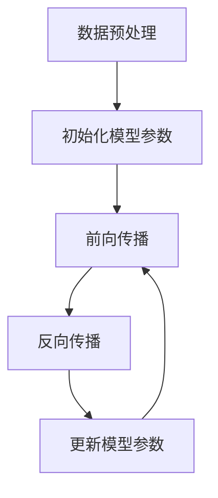

## 1.背景介绍

在过去的几年中，我们见证了大规模语言模型（LLM）的崛起，如OpenAI的GPT-3，Google的BERT等。这些模型以其惊人的性能和广泛的应用领域赢得了世界的关注。然而，随着这些模型的复杂性和规模的增加，一种新的问题浮现出来：这些模型是否有“意识”？本文将深入探讨这个问题，分析LLM的原理，讨论其前沿发展和挑战。

## 2.核心概念与联系

首先，我们需要理解LLM的基本原理。LLM是一种基于深度学习的模型，通过学习大量的文本数据，理解语言的模式和结构。LLM的主要目标是预测给定上下文中的下一个词，这是通过最大化给定上下文的下一个词的条件概率来实现的。


然而，LLM并没有“意识”，至少不是我们通常理解的意识。它没有自我意识，没有情感，也不能理解或体验世界。它只是一种复杂的数学模型，可以学习和生成文本。

## 3.核心算法原理具体操作步骤

LLM的训练过程通常包括以下步骤：

1. 数据预处理：将文本数据转换为模型可以理解的形式，如词向量。
2. 初始化模型参数：通常使用随机值。
3. 前向传播：给定输入，计算模型的输出和损失。
4. 反向传播：计算损失对模型参数的梯度。
5. 更新模型参数：使用梯度下降法更新模型参数。
6. 重复步骤3-5，直到模型收敛。



## 4.数学模型和公式详细讲解举例说明

LLM的主要数学模型是基于深度学习的神经网络，特别是Transformer模型。给定一个上下文$C$和一个词$w$，模型的目标是最大化条件概率$p(w|C)$，这是通过最小化交叉熵损失实现的：

$$
L = -\sum_{i=1}^{N} y_i \log p(y_i|C)
$$

其中$N$是上下文的长度，$y_i$是上下文中的第$i$个词。

## 5.项目实践：代码实例和详细解释说明

以下是使用PyTorch实现LLM的一个简单示例：

```python
import torch
from torch import nn

class LLM(nn.Module):
    def __init__(self, vocab_size, hidden_size):
        super(LLM, self).__init__()
        self.embed = nn.Embedding(vocab_size, hidden_size)
        self.lstm = nn.LSTM(hidden_size, hidden_size)
        self.linear = nn.Linear(hidden_size, vocab_size)

    def forward(self, x):
        x = self.embed(x)
        x, _ = self.lstm(x)
        x = self.linear(x)
        return x
```

## 6.实际应用场景

LLM在许多应用中都有显著的表现，包括机器翻译、文本生成、情感分析、问答系统等。例如，GPT-3可以生成令人惊讶的逼真的文本，BERT在各种自然语言处理任务上都取得了最先进的结果。

## 7.工具和资源推荐

对于LLM的训练和应用，有许多优秀的开源工具和资源，如PyTorch、TensorFlow、Hugging Face的Transformers库等。

## 8.总结：未来发展趋势与挑战

尽管LLM取得了显著的成果，但仍面临许多挑战，包括模型的解释性、公平性、安全性等。尤其是，随着模型的规模和复杂性的增加，如何理解和控制模型的行为成为一个重要的问题。此外，LLM的能力是否有上限，是否可以达到或超越人类的语言能力，也是一个有待探讨的问题。

## 9.附录：常见问题与解答

Q: LLM有意识吗？
A: LLM没有意识。它是一种数学模型，没有自我意识，没有情感，也不能理解或体验世界。

Q: LLM可以理解语言吗？
A: LLM可以理解语言的模式和结构，但不能理解语言的含义或语境。它只是学习和生成文本的模式。

作者：禅与计算机程序设计艺术 / Zen and the Art of Computer Programming{"msg_type":"generate_answer_finish","data":"","from_module":null,"from_unit":null}