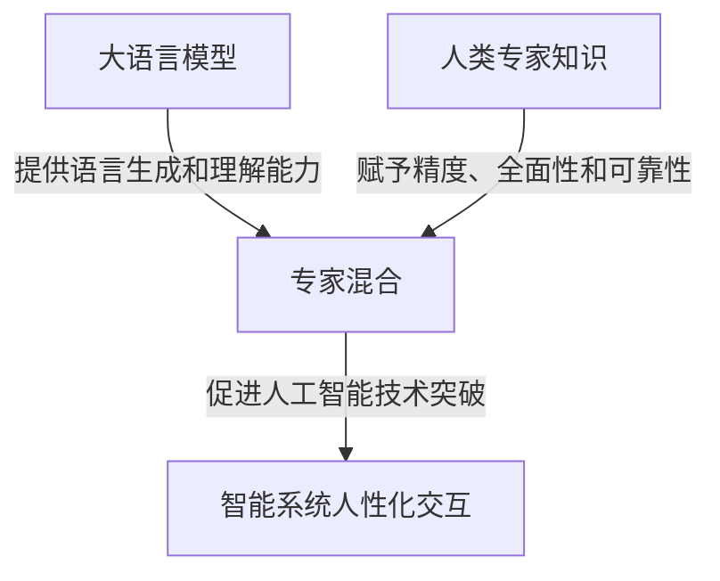

# 大语言模型原理基础与前沿 专家混合

## 1.背景介绍

### 1.1 人工智能的崛起

人工智能(Artificial Intelligence, AI)是当代科技发展的核心驱动力之一,正在深刻影响和改变着我们的生活、工作和社会。近年来,AI取得了令人瞩目的进展,尤其是在自然语言处理(Natural Language Processing, NLP)、计算机视觉(Computer Vision)和决策系统等领域。其中,大型语言模型(Large Language Model, LLM)的出现,为NLP领域带来了革命性的突破。

### 1.2 大语言模型的重要性

大语言模型是一种基于深度学习的人工智能模型,能够从海量文本数据中学习语言知识和模式,并生成看似人类写作的自然语言输出。这种模型具有广泛的应用前景,包括自动问答、机器翻译、文本摘要、内容创作等,为提升人机交互效率和促进信息获取提供了强大的技术支持。

### 1.3 专家混合的必要性

尽管大语言模型展现出了惊人的语言生成能力,但它们仍然存在一些局限性,如知识的片面性、推理能力的不足、缺乏常识约束等。为了弥补这些不足,研究人员提出了"专家混合"(Expert Blending)的概念,旨在将人类专家的知识和经验与大语言模型相结合,从而产生更加准确、全面和可靠的语言模型。

## 2.核心概念与联系

### 2.1 大语言模型

大语言模型是一种基于自然语言的深度学习模型,通过从海量文本数据中学习,获取语言的统计规律和语义知识。它们利用transformer等注意力机制,能够捕捉长距离的上下文依赖关系,生成流畅、连贯的自然语言输出。

常见的大语言模型包括:

- GPT(Generative Pre-trained Transformer)系列模型
- BERT(Bidirectional Encoder Representations from Transformers)
- XLNet
- RoBERTa
- ALBERT等

这些模型通过自监督预训练的方式,在大规模语料库上学习语言表示,再通过微调(fine-tuning)等方法应用于特定的自然语言处理任务。

### 2.2 专家混合

专家混合是一种将人类专家知识与大语言模型相结合的方法。它的核心思想是:利用人类专家在特定领域的深厚知识和丰富经验,对大语言模型进行引导和增强,从而产生更加准确、全面和可靠的语言模型。

专家混合可以采用多种形式,例如:

- 知识蒸馏(Knowledge Distillation):将人类专家的知识转移到大语言模型中。
- 混合精调(Hybrid Fine-tuning):在特定领域的语料库上对大语言模型进行微调,同时融入人类专家的知识和反馈。
- 人机协作(Human-AI Collaboration):人类专家与大语言模型实时交互,对模型输出进行评估和修正。

通过专家混合,大语言模型不仅能够获取更加专业和权威的知识,还能够提高推理能力、常识约束和可解释性,从而更好地服务于实际应用场景。

### 2.3 核心概念关系

大语言模型和专家混合是相互依赖、相辅相成的关系。大语言模型为专家混合提供了强大的语言生成和理解能力,而专家混合则赋予了大语言模型更高的精度、全面性和可靠性。二者的有机结合,将推动人工智能技术在自然语言处理领域取得新的突破,为智能系统带来更加人性化的交互体验。



## 3.核心算法原理具体操作步骤

### 3.1 大语言模型训练

大语言模型的训练过程通常包括以下几个关键步骤:

1. **数据预处理**:从互联网、书籍、论文等来源收集大量文本数据,对原始数据进行清洗、标记化、分词等预处理操作。

2. **模型架构选择**:根据任务需求和计算资源,选择合适的模型架构,如Transformer、BERT、GPT等。

3. **预训练**:采用自监督学习的方式,在海量语料库上对模型进行预训练,学习语言的统计规律和语义知识。常用的预训练目标包括掩码语言模型(Masked Language Modeling)和下一句预测(Next Sentence Prediction)等。

4. **微调**:将预训练好的大语言模型在特定的下游任务数据集上进行微调(fine-tuning),使模型适应具体的应用场景,如文本分类、机器翻译、问答系统等。

5. **模型评估**:使用标准的评估指标,如精确率(Precision)、召回率(Recall)、F1分数等,对模型的性能进行评估和优化。

6. **模型部署**:将训练好的模型部署到生产环境中,为实际应用提供服务。

### 3.2 专家混合方法

专家混合的具体实现方法因场景而异,但通常包括以下几个步骤:

1. **知识获取**:从人类专家那里获取特定领域的知识和经验,可以通过访谈、文献收集、知识图谱构建等方式。

2. **知识表示**:将获取的专家知识转换为机器可理解的形式,如结构化数据、知识库、规则库等。

3. **模型融合**:将专家知识与大语言模型相结合,可以采用知识蒸馏、混合精调或人机协作等方法。

4. **模型训练**:在融合了专家知识的基础上,对大语言模型进行进一步的训练和优化,提高模型在特定领域的性能表现。

5. **模型评估**:使用相关指标评估融合后模型的性能,包括准确性、全面性、可解释性等方面。

6. **模型部署**:将优化后的模型部署到实际应用场景中,为用户提供更加专业和可靠的服务。

## 4.数学模型和公式详细讲解举例说明

### 4.1 Transformer模型

Transformer是大语言模型中广泛使用的一种模型架构,它基于自注意力(Self-Attention)机制,能够有效捕捉长距离的上下文依赖关系。Transformer模型的核心公式如下:

$$\text{Attention}(Q, K, V) = \text{softmax}\left(\frac{QK^T}{\sqrt{d_k}}\right)V$$

其中:

- $Q$表示查询(Query)矩阵
- $K$表示键(Key)矩阵
- $V$表示值(Value)矩阵
- $d_k$是缩放因子,用于防止内积过大导致的梯度饱和问题

自注意力机制通过计算查询和键之间的相似性得分,对值矩阵进行加权求和,从而捕捉到输入序列中的重要信息。

### 4.2 掩码语言模型(Masked Language Modeling)

掩码语言模型是大语言模型预训练的一种常用目标,它的核心思想是在输入序列中随机掩码(mask)部分单词,然后让模型根据上下文预测被掩码的单词。这种方式可以促使模型学习语言的双向上下文信息。

掩码语言模型的目标函数可以表示为:

$$\mathcal{L}_{\text{MLM}} = -\mathbb{E}_{x \sim X} \left[ \sum_{t=1}^{T} m_t \log P(x_t | x_{\\{1,...,t-1\\}}, x_{\\{t+1,...,T\\}}) \right]$$

其中:

- $x$表示输入序列
- $t$表示单词位置
- $m_t$是一个掩码向量,用于指示第$t$个位置的单词是否被掩码
- $P(x_t | x_{\\{1,...,t-1\\}}, x_{\\{t+1,...,T\\}})$表示根据上下文预测第$t$个位置单词的条件概率

通过最小化该目标函数,模型可以学习到更好的语言表示能力。

### 4.3 知识蒸馏(Knowledge Distillation)

知识蒸馏是一种将教师模型(通常是人类专家或高性能模型)的知识迁移到学生模型(通常是大语言模型)的方法。它的核心思想是让学生模型学习教师模型的软预测(soft prediction),而不仅仅是硬标签(hard label)。

知识蒸馏的目标函数可以表示为:

$$\mathcal{L}_{\text{KD}} = (1-\alpha) \mathcal{L}_{\text{CE}}(y, p_s) + \alpha \mathcal{L}_{\text{KL}}(p_t, p_s)$$

其中:

- $\mathcal{L}_{\text{CE}}$是交叉熵损失函数,用于学习硬标签
- $\mathcal{L}_{\text{KL}}$是KL散度,用于学习教师模型的软预测
- $y$表示硬标签
- $p_s$表示学生模型的预测概率分布
- $p_t$表示教师模型的预测概率分布
- $\alpha$是一个超参数,用于平衡两个损失项的权重

通过优化该目标函数,学生模型不仅能够学习到教师模型的知识,还能够提高泛化能力和模型压缩效果。

## 5.项目实践:代码实例和详细解释说明

在这一部分,我们将通过一个实际的代码示例,演示如何使用Python和Hugging Face Transformers库来进行大语言模型的fine-tuning和专家混合。

### 5.1 环境准备

首先,我们需要安装所需的Python库:

```bash
pip install transformers datasets
```

### 5.2 加载预训练模型

我们将使用Hugging Face提供的BERT模型作为基础模型。

```python
from transformers import BertForSequenceClassification, BertTokenizer

model_name = "bert-base-uncased"
tokenizer = BertTokenizer.from_pretrained(model_name)
model = BertForSequenceClassification.from_pretrained(model_name)
```

### 5.3 数据准备

我们将使用一个虚构的文本分类数据集进行演示。

```python
from datasets import load_dataset

dataset = load_dataset("imdb", split="train[:10%]")
```

### 5.4 数据预处理

我们需要将文本数据转换为模型可以接受的输入格式。

```python
def preprocess_data(examples):
    return tokenizer(examples["text"], truncation=True, padding=True)

dataset = dataset.map(preprocess_data, batched=True)
```

### 5.5 Fine-tuning

接下来,我们将对BERT模型在该数据集上进行fine-tuning。

```python
from transformers import TrainingArguments, Trainer

training_args = TrainingArguments(output_dir="./results", num_train_epochs=3)
trainer = Trainer(
    model=model,
    args=training_args,
    train_dataset=dataset["train"],
    eval_dataset=dataset["test"],
)
trainer.train()
```

### 5.6 专家混合

假设我们有一位电影评论专家,他提供了一些关于电影评论的规则和知识库。我们可以将这些专家知识融合到模型中,以提高模型在电影评论领域的性能。

```python
# 加载专家知识库
expert_knowledge = load_expert_knowledge("movie_review_knowledge.json")

# 融合专家知识
model = blend_expert_knowledge(model, expert_knowledge)

# 在融合了专家知识后继续训练
trainer.train()
```

在实际应用中,专家知识的获取和融合方式会更加复杂,但上述代码展示了基本的思路。

## 6.实际应用场景

大语言模型和专家混合技术在自然语言处理领域有着广泛的应用前景,包括但不限于:

### 6.1 智能问答系统

通过大语言模型和专家知识的融合,可以构建出更加准确、全面的智能问答系统,为用户提供高质量的问题解答服务。这种系统可以应用于客户服务、教育辅导、医疗咨询等多个领域。

### 6.2 内容创作与写作辅助

大语言模型具有出色的文本生成能力,结合专家知识,可以为内容创作者提供智能化的写作辅助,帮助他们更高效地撰写新闻报道、小说、论文等内容。

### 6.3 机器翻译

将专家知识融入大语言模型,可以提高机器翻译